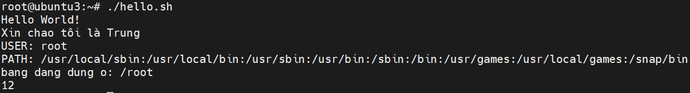
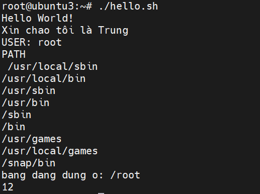

# Hello World script
### 1. Tạo file script
```bash
sudo nano hello.sh
```
### 2. Thêm nội dung file (viết hàm)
```bash
#!/bin/bash

name=Trung
CURRENT_DIR=$(pwd)

greeting () { 
    echo "Hello $1!"
}

greeting World
echo "Xin chao tôi là $name"
echo "USER: $USER"
echo "$PATH" | tr ':' '\n'
echo "bang dang dung o: $CURRENT_DIR"

tinhtoan() {
    x=$(( $1 + $2 ))
    echo "$x"
}

tinhtoan 5 7
```

### 3. Cấp quyền và thực thi file
```bash
sudo chmod +x hello.sh
```
```bash
./hello.sh
# hoặc 
bash hello.sh
# hoặc 
/bin/bash
```
### 4. Kết quả



| Bổ sung          | Chỉnh sửa      |
| ---------------- | --------------- |
| Tính toán        | Dùng `$(( ))`   |
| Hàm có tham số   | Dùng `$1`, `$2` |
| Current dir      | `$PWD`          |
| PATH quá dài     | `tr ':' '\n'`   |
| Nhập từ bàn phím | `read`          |

