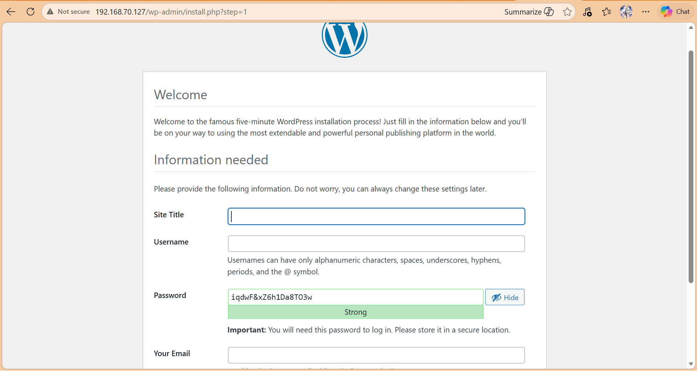

# Viết BashScript BashShell cài đặt WordPress
### 1. Tạo file `install_WordPress.sh` và chèn nội dung:
```bash
#!/bin/bash
set -e

DB_NAME="wordpress"
DB_USER="wp_user"
DB_PASS="wp_password"
WB_DIR="/var/www/html"

if [ "$EUID" -ne 0 ]; then
    echo "Dang yeu cau quyen root..."
    sudo "$0" "$@"
    exit
fi

echo "updating system..."
sudo apt update
echo "Installing Apache..."
apt install apache2 -y
systemctl enable apache2
systemctl start apache2

echo "Install PhP"
sudo apt install php libapache2-mod-php php-mysql php-curl php-gd php-mbstring php-xml php-xmlrpc php-soap php-intl php-zip -y

echo "Check list PhP"
ls /usr/sbin | grep php-fpm
php -v

echo "Installing MariaDB..."
apt install mariadb-server -y
systemctl enable mariadb
systemctl start mariadb

echo "Securing MariaDB installation..."
sudo mysql -e "DELETE FROM mysql.user WHERE User='';"
sudo mysql -e "DROP DATABASE IF EXISTS test;"
sudo mysql -e "DELETE FROM mysql.db WHERE Db='test' OR Db='test\\_%';"
sudo mysql -e "FLUSH PRIVILEGES;"

echo "Creating MySQL database and user..."
sudo mysql -e "CREATE DATABASE IF NOT EXISTS $DB_NAME CHARACTER SET utf8mb4 COLLATE utf8mb4_unicode_ci;"
sudo mysql -e "CREATE USER IF NOT EXISTS '$DB_USER'@'localhost' IDENTIFIED BY '$DB_PASS';"
sudo mysql -e "GRANT ALL PRIVILEGES ON $DB_NAME.* TO '$DB_USER'@'localhost';"
sudo mysql -e "FLUSH PRIVILEGES;"

# Install wordpress
echo "downloading wordpress..."
cd /tmp
sudo wget https://wordpress.org/latest.tar.gz
sudo tar -xzvf latest.tar.gz
sudo cp -r wordpress/* /var/www/html/
sudo chown -R www-data:www-data /var/www/html/
sudo chmod -R 755 /var/www/html/

echo "Configuring wp-config.php..."
cd /var/www/html/
cp wp-config-sample.php wp-config.php
sed -i "s/database_name_here/$DB_NAME/" wp-config.php
sed -i "s/username_here/$DB_USER/" wp-config.php
sed -i "s/password_here/$DB_PASS/" wp-config.php

echo "Enabling .htaccess support..."
# Modify Apache configuration to support .htaccess...
echo "Configuring Apache..."

sed -i '/<Directory \/var\/www\/>/,/<\/Directory>/c\
<Directory /var/www/>\
    AllowOverride All\
    Require all granted\
</Directory>' /etc/apache2/apache2.conf

a2enmod rewrite
a2enmod proxy_fcgi setenvif
a2enconf php8.1-fpm
systemctl restart apache2

echo "WordPress installed successfully."
echo "Database: $DB_NAME, User: $DB_USER, Password: $DB_PASS"
echo "Visit: http://localhost or http://$(hostname -I | awk '{print $1}')"

```
- Xóa các tài khoản không có User Name (Anonymous user)
- Xóa database mặc định tên `test` nếu nó tồn tại.
- Xóa các quyền liên quan đến Database
```SQL
DELETE FROM mysql.user WHERE User='';
DROP DATABASE IF EXISTS test;
DELETE FROM mysql.db WHERE Db='test' OR Db='test\_%';
```
- Cho phép chạy một câu lệnh SQL trực tiếp mà không cần vào giao diện MySQL interactive.
```bash
sudo mysql -e "SHOW DATABASE
```
- Chỉnh sửa trực tiếp trong file, không in ra màn hình.
```bash
sed -i "s/old/new/" file.txt
```
- Nếu chỉ thế này là chỉ in ra màn hình và file gốc không thay đổi
```bash
sed "s/old/new/" file.txt
```
- Nếu: `sed -i.bak "s/old/new/" file.txt` nó sẽ tạo file backup `file.txt.bak`
- Nếu Khi cài package mà nó hiện màn hình cấu hình (ví dụ timezone, database password…), dùng cấu hình mặc định
```bash
sudo DEBIAN_FRONTEND=noninteractive apt install -y package_name
```


### 2. Phân quyền và chạy file
```bash
chmod +x install_WordPress.sh
sudo ./install_WordPress.sh
```

