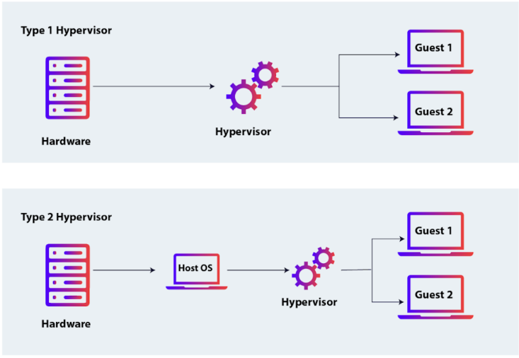
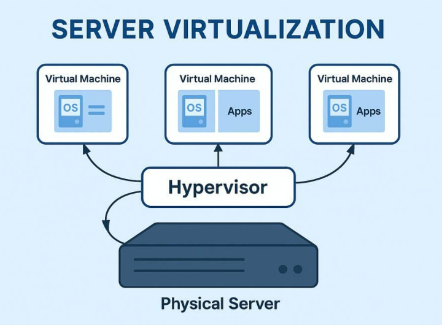
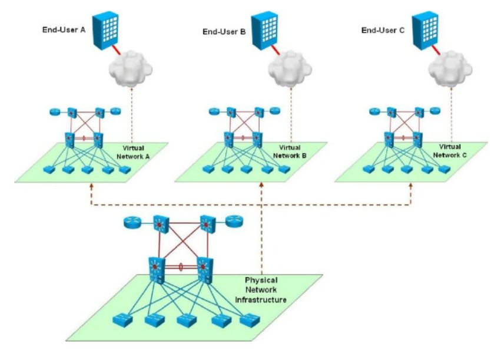
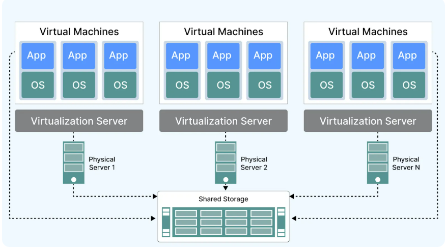
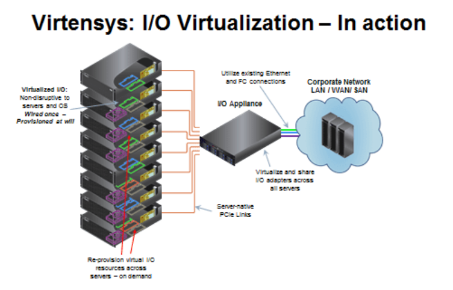

# Tìm hiểu về ảo hóa

### 1. Khái niệm

Ảo hóa (**Tách rời thực thể logic khỏi hạ tầng vật lý**) là công nghệ tạo ra phiên bản ảo của các tài nguyên phần cứng như máy chủ, ổ cứng, mạng,... cho phép nhiều máy ảo cùng hoạt động trên một máy tính vật lý. 

Một máy tính vật lý duy nhất có thể chạy nhiều hệ điều hành và ứng dụng khác nhau cùng một lúc trong các môi trường tách biệt (gọi là các Máy ảo - Virtual Machines).

### 2. Mục đích sử dụng
- **Tối ưu hóa tài nguyên**: Sử dụng hiệu quả phần cứng, giảm số lượng máy vật lý, tiết kiệm chi phí điện, không gian, làm mát.
- **Tiết kiệm chi phí**: Ít máy vật lý hơn đồng nghĩa với việc ít tiền điện, ít tiền bảo trì và ít không gian đặt máy chủ hơn.
- **Tính linh hoạt và tốc độ**:  Chạy nhiều hệ điều hành/máy ảo trên một máy, dễ dàng chuyển đổi, triển khai ứng dụng.
- **Khả năng phục hồi**: Dễ dàng sao lưu toàn bộ máy ảo và di chuyển sang phần cứng khác nếu máy chủ vật lý gặp sự cố.
- **Hỗ trợ đám mây**: Cung cấp nền tảng cho điện toán đám mây, tăng khả năng mở rộng và quản lý cơ sở hạ tầng.
- **Kiểm thử và phát triển**: Tạo môi trường ảo để thử nghiệm phần mềm, hệ điều hành mà không ảnh hưởng hệ thống chính.

### 3. Cách hoạt động của Ảo hóa
Ảo hóa hoạt động bằng cách sử dụng phần mềm, chủ yếu là Hypervisor, để tách tài nguyên phần cứng vật lý(CPU, RAM, ổ cứng) thành nhiều môi trường ảo độc lập(Máy ảo - VM).

Hypervisor cài đặt trực tiếp lên phần cứng( Type1) hoặc hệ điều hành (Type 2), điều phối và cấp phát tài nguyên tự động cho các VM, cho phép chúng chạy hệ điều hành và ứng dụng riêng biệt mà không can thiệp nhau

Chi tiết cách hoạt động của ảo hóa:
  - **Lớp ảo hóa(Hypervisor)**: Hypervisor được cài đặt trên máy chủ vật lý(host).
  - Hypervisor tạo các VM, mỗi VM hoạt động như một máy tính độc lập với HĐH riêng.
  - **Phân chia tài nguyên**: Hypervisor chia nhỏ phần cứng vật lý và cấp phát cho các VM dựa trên nhu cầu, giúp tối ưu hóa công suất sử dụng.
  - **Quản lý và giao tiếp**: Hypervisor giám sát, quản lý hiệu suất, và cung cấp giao diện để cấu hình, tạo, xóa máy ảo. Máy ảo giao tiếp với phần cứng qua hypervisor.
  - Mỗi máy ảo hoạt động độc lập, lỗi ở một VM không ảnh hưởng đến máy chủ vật lý hay các VM khác.

### 4. Hypervisor

#### 4.1 Khái niệm
Hypervisor(còn gọi là Virtual Machine Monitor - VMM) là bộ não của hệ thống ảo hóa, phần mềm hoặc phần cứng trung gian. Nó quản lý vòng đời của máy ảo: khởi tạo, vận hành và giải phóng tài nguyên.

Có hai loại Hypervisor chính:

- Hypervisor loại 1 (Bare-metal): Chạy trực tiếp trên phần cứng của máy chủ vật lý mà không cần hệ điều hành trung gian. Các hypervisor loại này thường được sử dụng trong môi trường doanh nghiệp lớn, vì chúng cung cấp hiệu suất cao và khả năng quản lý tài nguyên mạnh mẽ. Ví dụ: VMware ESXi, Microsoft Hyper-V, KVM.
- Hypervisor loại 2 (Hosted): Chạy trên hệ điều hành hiện có. Loại này phổ biến trong các môi trường nhỏ hoặc cho người dùng cá nhân vì dễ triển khai và ít tốn tài nguyên. Ví dụ: VMware Workstation, Oracle VirtualBox.

### 5. Các loại ảo hóa

#### 5.1 Ảo hóa máy chủ (Server Virtualization)

Chia một máy chủ vật lý thành nhiều máy chủ ảo. Đây là loại phổ biến nhất. Mỗi máy chủ ảo hoạt động độc lập, chạy hệ điều hành và ứng dụng riêng, sử dụng tài nguyên phần cứng được phân bổ (CPU, RAM, lưu trữ, mạng).
#### 5.2 Ảo hóa mạng (Network Virtualization)

Ảo hóa mạng là công nghệ tạo ra các mạng ảo độc lập trên cùng một cơ sở hạ tầng mạng vật lý. Nó tách biệt các dịch vụ mạng khỏi phần cứng( như Router, Switch vật lý) để tạo ra các mạng ảo độc lập, cho phép mỗi mạng ảo hoạt động riêng biệt với cấu hình, chính sách và dịch vụ riêng.

Ví dụ: Virtual Switch, Virtual Router, Virtual Firewall, Virtual Private Cloud(VPC).
#### 5.3 Ảo hóa ứng dụng( Application Virtualization)

Cho phép chạy ứng dụng trên máy tính mà không cần cài đặt trực tiếp vào hệ điều hành của máy. Ứng dụng không ghi trực tiếp vào OS mà chỉ ghi vào filesystem ảo và registry ảo.

**Đặc điểm**:
  - Môi trường ảo: Ứng dụng được đóng gói với các thành phần cần thiết( thư viện, cấu hình) và chạy trong một container ảo.
  - Tách biệt: Không cài đặt trực tiếp lên hệ điều hành, tránh xung đột với các ứng dụng khác.
  - Ví dụ khi chạy Python phiên bản khác nhau nếu cài trực tiếp -> xung đột, Có thể chạy mỗi phiên bản là một environment.
#### 5.4 Ảo hóa lưu trữ( Storage Virtualization)

Ảo hóa lưu trữ (Storage Virtualization) là công nghệ tổng hợp nhiều thiết bị lưu trữ vật lý thành một hệ thống lưu trữ ảo thống nhất, được quản lý thông qua phần mềm.

Gộp nhiều ổ địa (Disk1, Disk2, Disk3) thành **storage pool**

Ví dụ: SAN, distributed storage, S3, Google Cloud Storage
#### 5.5 Ảo hóa hệ điều hành( Operating System Virtualization)

Cho phép chạy nhiều hệ điều hành trên cùng một nhân(kernel) duy nhất. Các hệ điều hành này được gọi là Containers. Không chia OS riêng mà chia kernel chung.

Ví dụ: Docker, Kubernetes.
#### 5.6 Ảo hóa máy tính(Desktop Virtualization)

- Ảo hóa máy tính là công nghệ cung cấp môi trường máy tính để bàn ảo, chạy trên máy chủ từ xa thay vì thiết bị vật lý của người dùng. 
  - Desktop chạy trên Server
  - User remote vào

Mỗi máy tính đề bàn ảo hoạt động độc lập, mô phỏng hệ điều hành và ứng dụng, được truy cập qua mạng từ các thiết bị như PC, laptop, hoặc thiết bị mỏng(thin client)

Ví dụ: VDI( Virtual Desktop Infrastructure)
  - Công ty dùng: 
    - Nhân viên login từ xa
    - không cần PC mạnh

#### 5.7 Ảo hóa dữ liệu( Data Virtualization)

Ảo hóa dữ liệu(Data Virtualization) là công nghệ tích hợp và cung cấp dữ liệu từ nhiều nguồn khác nhau(cơ sở dữ liệu, API, tệp, đám mấy) dưới dạng một giao diện ảo thống nhất mà không cần sao chép hoặc di chuyển dữ liệu vật lý.

Đặc điểm:
  - Lớp ảo hóa: Phần mềm tạo ra một lớp trừu tượng, tổng hợp dữ liệu từ các nguồn dị biệt.
  - Truy cập thời gian thực: Cung cấp dữ liệu tức thì mà không cần lưu trữ vật lý trung gian.
  - Kết nối các hệ thống khác nhau (SQL, NoSQL, API) thành một nguồn dữ liệu logic.

#### 5.8 Ảo hóa thiết bị I/O

Ảo hóa thiết bị I/O (I/O Virtualization) là công nghệ cho phép nhiều máy ảo chia sẻ và sử dụng các thiết bị đầu vào/ đầu ra (I/O) vật lý( bàn phím, chuột, ổ cứng, card mạng) trên một máy chủ vật lý thông qua lớp ảo hóa.

- **Emulation**: Hypervisor sẽ tạo ra một thiết bị phần cứng "giả" hoàn toàn bằng phần mềm. Khi máy ảo (VM) gửi một lệnh I/O, Hypervisor sẽ chặn lệnh đó lại, dịch nó sang ngôn ngữ mà phần cứng thật hiểu, rồi mới thực hiện.
- **Para-virtualization - VirtIO**: Máy ảo sẽ cài một trình điều khiển (Driver) đặc biệt (gọi là Front-end driver). Trình điều khiển này nói chuyện trực tiếp với Back-end driver ở Hypervisor thông qua một hàng đợi dữ liệu chung (Shared memory).
- **Direct I/O Assignment / Passthrough**: Máy ảo sẽ điều khiển trực tiếp phần cứng mà không cần thông qua Hypervisor.
- **SR-IOV (Single Root I/O Virtualization)**: Bản thân thiết bị phần cứng (như Card mạng xịn của Intel/Mellanox) được thiết kế để tự nhân bản mình thành hàng trăm "phiên bản ảo" (gọi là Virtual Functions - VF).

### 6. Các mức độ ảo hóa
#### 6.1 Ảo hóa toàn phần(Full Virtualization)
Hypervisor mô phỏng toàn bộ phần cứng.

Guest OS không biết nó đang chạy trong VM.
#### 6.2 Bán ảo hóa (Para-virtualization)
Guest OS được chỉnh sửa kernel để biết nó đang chạy trong VM.

Là công nghệ ảo hóa trong đó máy ảo sử dụng hệ điều hành được chỉnh sửa để tương tác trực tiếp với hypervisor, thay vì mô phỏng toàn bộ phần cứng.
#### 6.3 Hardware-assisted Virtualization
CPU có extension hỗ trợ virtualization.

Ảo hóa hỗ trợ phần cứng là công nghệ ảo hóa sử dụng các tính năng tích hợp trong phần cứng (như Intel VT-x, AMD-V) để hỗ trợ máy ảo truy cập trực tiếp tài nguyên phần cứng, thay vì mô phỏng hoàn toàn.
#### 6.4 Ảo hóa song song (Hybrid Virtualization)
Ảo hóa song song (Hybrid Virtualization) là sự kết hợp giữa ảo hóa toàn phần (Full Virtualization) và ảo hóa hỗ trợ phần cứng (Hardware-Assisted Virtualization) hoặc ảo hóa bán phần (Para-Virtualization) để tối ưu hiệu suất và tính tương thích.