# Cài đặt KVM
**KVM** : một hypervisor rất nổi tiếng và được sử dụng rộng rãi trong các mô hình Cloud thực tế.   

Với KVM một thiết bị vật lý có thể được chia nhỏ thành các thiết bị ảo độc lập với nhau, và được dùng để phân phối tới người sử dụng theo mô hình cơ sở hạ tầng như một dịch vụ(IaaS)
## 1. Kiểm tra tính tương thích với KVM
- KVM yêu cầu:
  - CPU phải hỗ trợ ảo hóa phần cứng
  - Virtualization phải bật trong BIOS/UEFI
  - CPU hỗ trợ Second Level Address Translation
  - RAM đủ lớn

Lệnh để kiểm tra xem máy có hỗ trợ cài KVM không Ubuntu:
```bash
egrep -c '(vmx|svm)' /proc/cpuinfo
```
Nếu kết quả trả về là 0 thì mấy không hỗ trợ cài KVM, nếu kết quả khác là máy có hỗ trợ cài KVM.

## 2. Cài KVM
```bash
sudo apt update
sudo apt -y install bridge-utils cpu-checker libvirt-clients virtinst virt-manager libvirt-daemon-system qemu-system-x86 qemu-utils qemu-kvm
```

|Tên gói|Chức năng chính|
|-------|----------------|
|qemu-kvm|Thành phần cốt lõi. Cung cấp sự giao tiếp giữa QEMU và KVM (Kernel-based Virtual Machine) để tận dụng tăng tốc phần cứng từ CPU.|
| libvirt-daemon-system| "Chạy dưới dạng dịch vụ hệ thống (daemon). Nó quản lý các tệp cấu hình, khởi động/dừng máy ảo và quản lý mạng ảo."|
| libvirt-clients| "Các công cụ dòng lệnh để tương tác với libvirt, nổi bật nhất là lệnh virsh thần thánh."|
| virt-manager| Giao diện đồ họa (GUI) cực kỳ tiện lợi để tạo và quản lý máy ảo nếu bạn không muốn gõ lệnh.|
| virtinst| "Cung cấp lệnh virt-install, giúp tạo máy ảo nhanh chóng thông qua terminal."|
| bridge-utils| "Giúp tạo Bridge Networking, cho phép máy ảo có IP cùng lớp mạng với máy vật lý."|
| cpu-checker| Cung cấp lệnh kvm-ok để kiểm tra xem CPU của bạn có hỗ trợ và đã bật ảo hóa (VT-x hoặc AMD-V) trong BIOS chưa.|
| qemu-system-x86| Trình giả lập kiến trúc x86 đầy đủ.|
|qemu-utils| "Các tiện ích xử lý ổ đĩa ảo (như qemu-img để chuyển đổi định dạng đĩa .qcow2, .raw, .vmdk)."|

**Kiểm tra KVM**:
```bash
kvm-ok
```
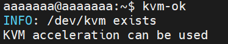

**Khởi động chạy KVM**
```bash
systemctl start libvirtd
systemctl enable libvirtd
```
## 3. Cấp quyền sử dụng KVM cho tài khoản USER đang sử dụng trên máy tính
```bash
sudo adduser $USER libvirt
sudo adduser $USER kvm
```
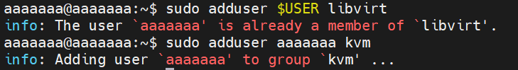

## 4. Kiểm tra xem quá trình cài đặt KVM đã thành công chưa
```bash
virsh or sudo systemctl status libvirtd
```
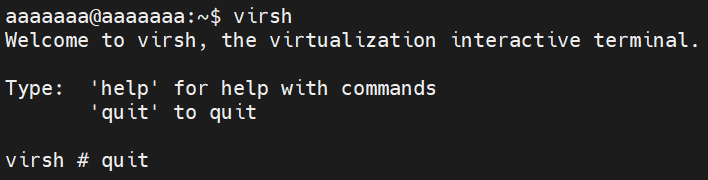

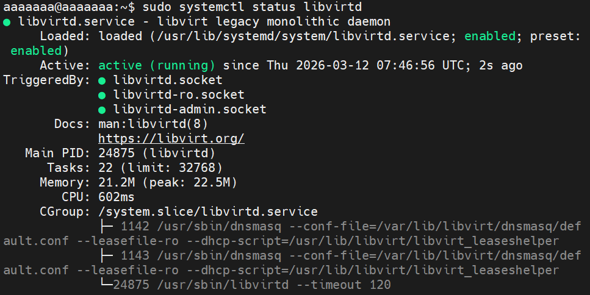

Nếu kết quả trả về trạng thái active(running) thì quá trình cài đặt đã thành công.

# Tạo máy ảo VM
Sau khi KVM đã được cài đặt thành công trên thiết bị, ta bắt đầu sử dụng nó để tạo/cung cấp ra các máy ảo (Virtual Machine/ VM) tùy theo nhu cầu sử dụng mô phỏng theo mô hình IaaS

## 1. Khởi tạo ổ cứng ảo(Virtual Storage) cho VM
```bash 
sudo qemu-img create -f qcow2 /var/lib/libvirt/images/tribbie.qcow2 15G
```
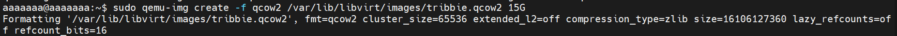

Giải thích câu lệnh trên:
|Name | Định nghĩa |
|-----|------------|
| qemu-img | Sử dụng công cụ qemu-img |
| create | Sử dụng lệnh "khởi tạo" |
| -f qcow2 | Ám chỉ kiểu đĩa ảo là qcow2|
| tribbie.qcow2 | Tên ổ đĩa ảo |
| 15G | Dung lượng yêu cầu của ổ đĩa ảo, ở đây là 15GB|

Tải file ISO :
```bash
cd /var/lib/libvirt
sudo mkdir file-iso
sudo wget -c https://releases.ubuntu.com/24.04/ubuntu-24.04.4-live-server-amd64.iso
```
## 2. Cấu hình cho máy ảo
```bash
virt-install \
--name tribbie \
--ram 2048 \
--vcpus 2 \
--disk path=/var/lib/libvirt/images/tribbie.qcow2,format=qcow2 \
--cdrom /var/lib/libvirt/file-iso/ubuntu-24.04.4-live-server-amd64.iso \
--network network=default \
--graphics vnc
```

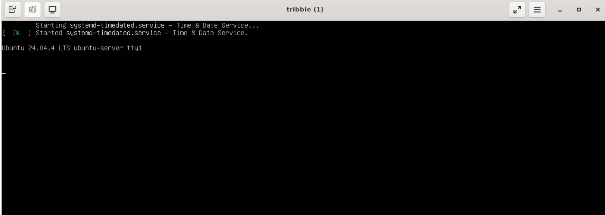

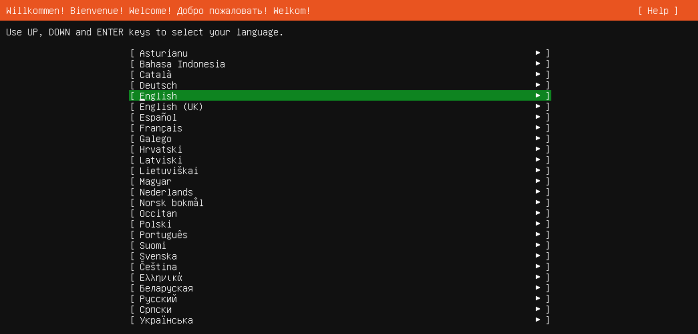

| Name | Định nghĩa |
|------|------------|
|virt-install | Sử dụng công cụ virt-install để tạo máy ảo |
| name | Đặt tên cho máy ảo này, ở đây là Tribbie |
| disk | Ổ cứng ảo của VM, ở đây chúng ta gói đến ổ mà chúng ta tự tạo ở trên |
| graphics | Giao diện cho VM, ở đây chúng ta dùng giao diện mặc định vnc |
| vcpu | Số nhân CPU cho VM |
| ram | Cấp RAM cho VM |
| cdrom | Ổ đĩa mềm cdrom ảo, chúng ta trỏ nó đến file cài đặt hề điều hành ISO đã chuẩn bị trước |
| network | Lựa chọn loại mạng ảo cho VM, ảo ở đây mặc định là NAT| 

## 3. Một số lệnh làm việc giao diện CLI với VM
- **Hiển thị danh sách máy ảo**:
```bash
virsh list --all
```
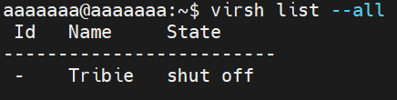
- **Tắt VM**
```bash
virsh shutdown <tên_máy_ảo>
```
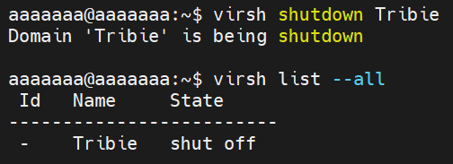
- **Bật VM**
```bash
virsh start <tên_máy_ảo>
```
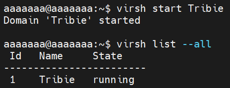

- **Reboot VM**
```bash
virsh reboot <tên_máy_ảo>
```
- **Xóa máy ảo**
```bash
virsh undefine <tên_máy_ảo>
```
- **Tạo snapshot**
```bash
virsh snapshot-create-as --domain tên_máy --name tên_bản_snapshot --description "mô tả bản snapshot"
```
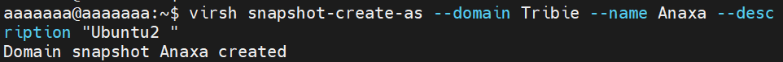
**NOTE**: snapshot chỉ tạo được khi định dạng disk ảo của ta sử dụng là `qcow2` chính vì vậy nếu bạn đang sử dụng định dạng `raw` mà muốn tạo snapshot thì cần phải chuyển sang định dạng `qcow2`.
- **Xem danh sách các bản snapshot trên 1 VM**
```bash
virsh snapshot-list <tên_máy_ảo>
```
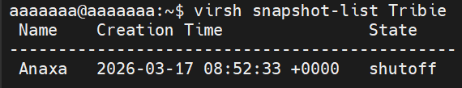
- **Xem thông tin chi tiết của bản snapshot**
```bash
virsh snapshot-info --domain <tên_máy_ảo> --snapshotname <tên_bản_snapshot>
```

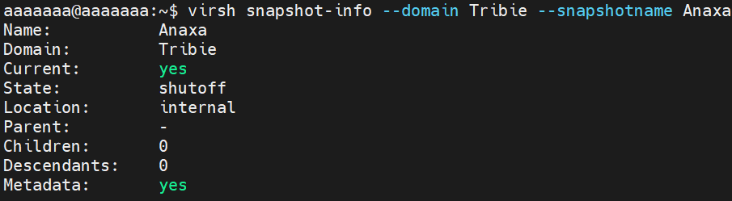

- **Revert để chạy lại một bản snapshot đã tạo**
```bash
virsh snapshot-revert <tên_máy_ảo> <tên-bản-snapshot>
```
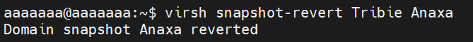
- **Xóa 1 bản snapshot**
```bash
virsh snapshot-delete --domain <tên_máy_ảo> --snapshotname <tên_bản_snapshot>
```
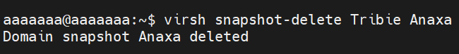
- **Sửa thông tin CPU hoặc memory**
```bash
virsh edit <tên_VM>
```
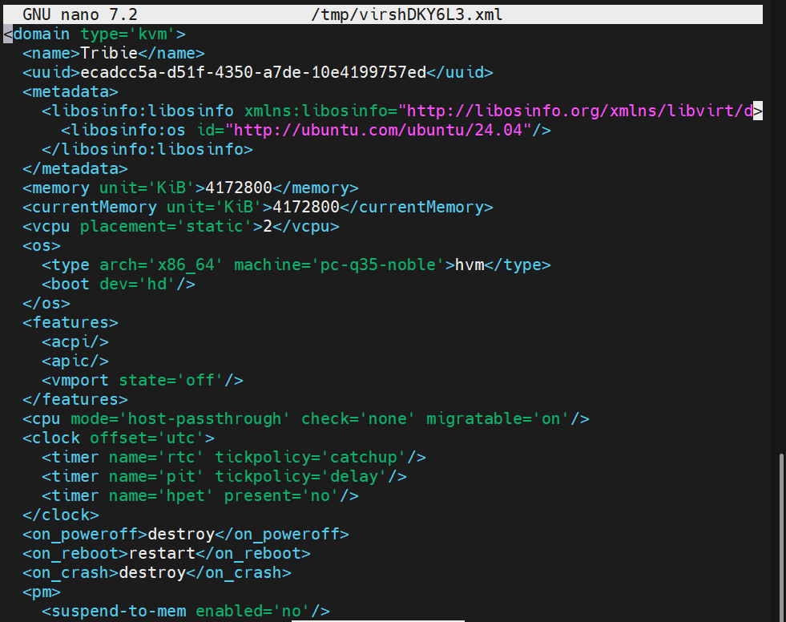
- **Xem thông tin chi tiết về file disk của VM**
```bash
qemu-img info <đường_dẫn_file-disk>
```

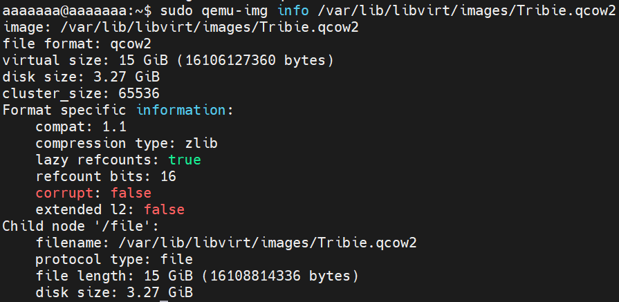

- **Xem thông tin cơ bản của 1 VM**
```bash
virsh dominfo <tên_VM>
```
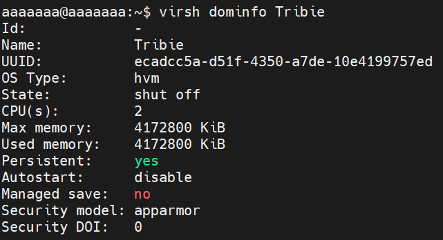

## 4. Tạo máy ảo bằng giao diện GUI
Vào virt-manager để cấu hình VM
```bash
virt-manager
```
Chọn `file` -> `New Virtual Machine`

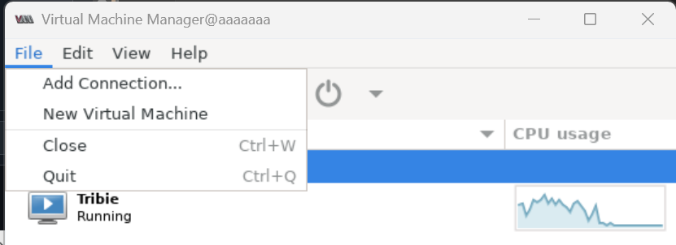

Làm tương tự như tạo máy ảo trên VM 

## 5. Tiến hành setup và cài đặt nốt

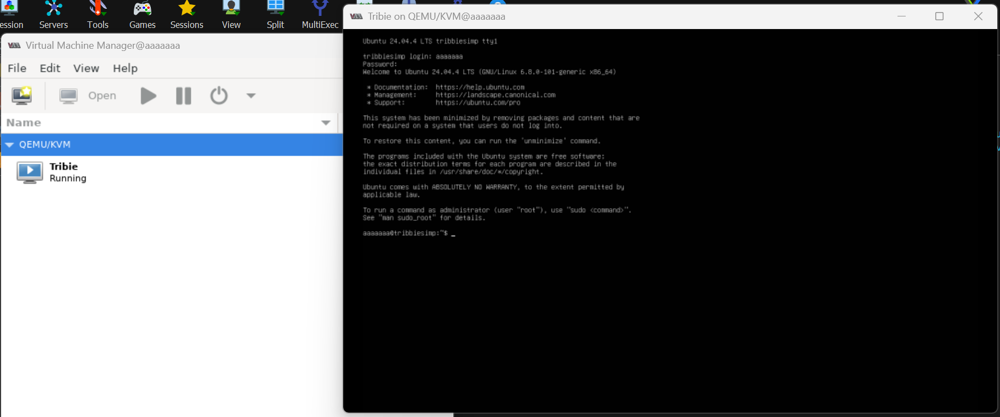