# Tìm hiểu về các chế độ card mạng trong KVM
KVM là cơ sở hạ tầng ảo hóa cho nhân Linux. KVM cung cấp mô hình mạng trong việc ảo hóa Network. Các mô hình bao gồm:
- NAT
- Bridge
- Macvtap
- OVS
- Isolated Network

## I. NAT(Network Address Translation)

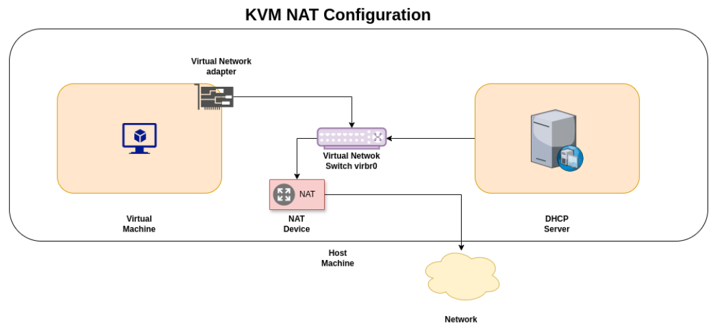

NAT là kiểu mặc định khi dùng libvirt

Máy ảo dùng IP riêng và truy cập internet qua địa chỉ IP của máy chủ thông qua NAT.

Đặc điểm:
- Cấu hình đơn giản
- VM ra Internet được ngay
- Không ảnh hưởng mạng LAN thật
- Máy ảo không thể được truy cập từ máy khác trong mạng LAN (trừ khi cấu hình port forwarding).
### 1. Open
`open` thực chất là một dạng NAT network nhưng không có firewall filtering của libvirt.

libvirt sẽ:
- tạo network
- forward ra interface host
- không áp rule iptables
## II. Bridge

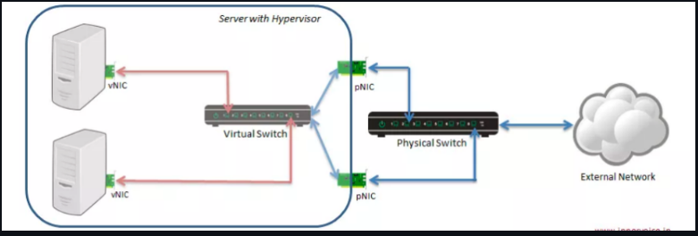

**Các thành phần trong sơ đồ bridged**:
- **Server with Hypervisor:** Đây là máy chủ vật lý đang chạy một Hypervisor (như KVM).
- **Hai máy chủ ảo (Virtual Machines):** Đây là các máy ảo (VMs) được tạo và chạy trên Hypervisor.
- **vNIC (Virtual Network Interface Card):** Mỗi máy ảo có một card mạng ảo (vNIC).
- **Virtual Switch (Switch ảo):** là một thành phần phần mềm được tạo và quản lý bởi Hypervisor trên Server. Trong KVM, đây chính là Linux Bridge (ví dụ: `br0`).
- **pNIC (Physical Network Interface Card):** card mạng vật lý trên Server, kết nối với mạng vật lý bên ngoài.
- **Physical Switch (Switch vật lý):** Switch vật lý nằm ngoài Server, kết nối Server với mạng bên ngoài.
- **External Network:** Đại diện cho mạng bên ngoài (mạng LAN của bạn, Internet, v.v.).

Máy ảo được kết nối vào cùng mạng với máy host thông qua một cầu nối mạng(bridge), thường là br0, br1, ...

Đặc điểm:
  - Máy ảo có IP cùng lớp với mạng LAN(do DHCP server ngoài cấp phát hoặc tĩnh).
  - Máy ảo có thể truy cập Internet, host, và các máy khác trong mạng LAN.

## III. Isolated

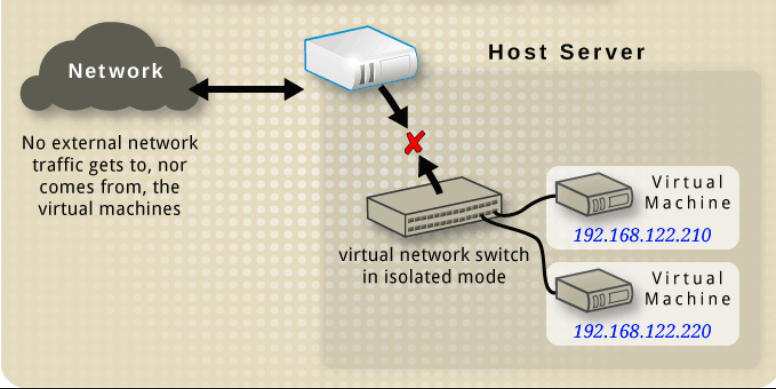

Tạo một mạng riêng giữa máy ảo và máy host; không kết nối được ra ngoài (internet hay LAN).

Bridge nội bộ chỉ dành cho VM

**Đặc điểm**:
  - VM có thể ping nhau
  - không ra Internet
  - không kết nối LAN

## IV. Routed Network
Trong môi trường ảo hóa sử dụng Kernel-based Virtual Machine và hệ thống quản lý mạng của libvirt, Routed Network là một kiểu cấu hình mạng trong đó các máy ảo (VM) được đặt trong một subnet riêng biệt so với mạng LAN vật lý, và máy chủ vật lý (host) đóng vai trò như một router trung gian để chuyển tiếp gói tin giữa subnet của VM và mạng bên ngoài. Trong chế độ này, các máy ảo có địa chỉ IP riêng của chúng và các gói tin được chuyển tiếp giữa VM và mạng vật lý mà không sử dụng cơ chế NAT. Thay vì dịch địa chỉ như trong NAT mode, host chỉ đơn thuần thực hiện chức năng routing, nghĩa là nhận các gói tin đến từ mạng vật lý rồi chuyển tiếp chúng tới đúng VM trong subnet ảo, đồng thời chuyển tiếp các gói tin từ VM ra ngoài mạng LAN hoặc internet.

Trong cấu trúc Routed Network, các VM thường nằm trong một mạng riêng, ví dụ như 10.10.10.0/24, trong khi host lại nằm trong mạng LAN vật lý, ví dụ 192.168.1.0/24. Vì hai mạng này là hai subnet khác nhau, router trong mạng vật lý sẽ không tự động biết cách gửi gói tin đến subnet của VM. Do đó, để Routed Network hoạt động đúng, quản trị viên phải cấu hình một static route trên router của mạng vật lý để thông báo rằng subnet VM được truy cập thông qua địa chỉ IP của host KVM. Ví dụ, router có thể được cấu hình rằng mọi gói tin gửi tới mạng 10.10.10.0/24 phải được chuyển tới host có địa chỉ 192.168.1.20. Khi đó, khi một thiết bị trong mạng LAN hoặc internet muốn giao tiếp với VM, gói tin sẽ đi từ router tới host KVM, sau đó host sẽ tiếp tục chuyển tiếp gói tin đó vào mạng ảo và đến đúng máy ảo tương ứng.

Khác với Bridge Network, nơi VM xuất hiện trực tiếp như một thiết bị trong mạng LAN vật lý và nhận địa chỉ IP từ cùng subnet với các thiết bị thật, Routed Network đặt các VM phía sau host và yêu cầu router phải biết đường đi tới subnet của VM. Đồng thời, nó cũng khác với NAT Network ở chỗ NAT sẽ ẩn địa chỉ IP của VM và thay thế bằng IP của host khi truy cập ra ngoài, còn Routed Network giữ nguyên địa chỉ IP của VM trong toàn bộ quá trình truyền gói tin. Vì vậy, Routed Network thường được sử dụng trong các trường hợp mà Bridge Network không thể triển khai, chẳng hạn khi máy chủ KVM kết nối mạng bằng WiFi (vì bridge thường không hoạt động tốt với wireless adapter) hoặc khi nhà cung cấp hạ tầng không cho phép bridge trực tiếp vào mạng vật lý. Trong các hệ thống máy chủ hoặc hạ tầng ảo hóa lớn, Routed Network cũng giúp quản lý nhiều subnet VM khác nhau một cách rõ ràng, vì host đóng vai trò router và kiểm soát luồng giao tiếp giữa các mạng ảo và mạng vật lý.

  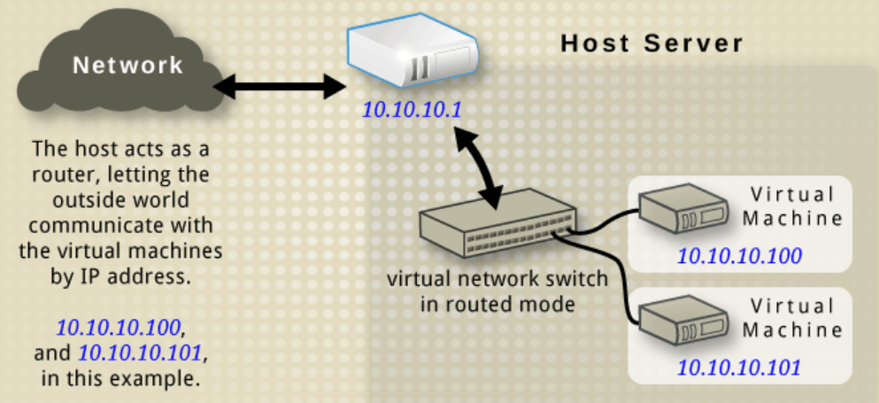
## V. OVS (Open vSwitch)

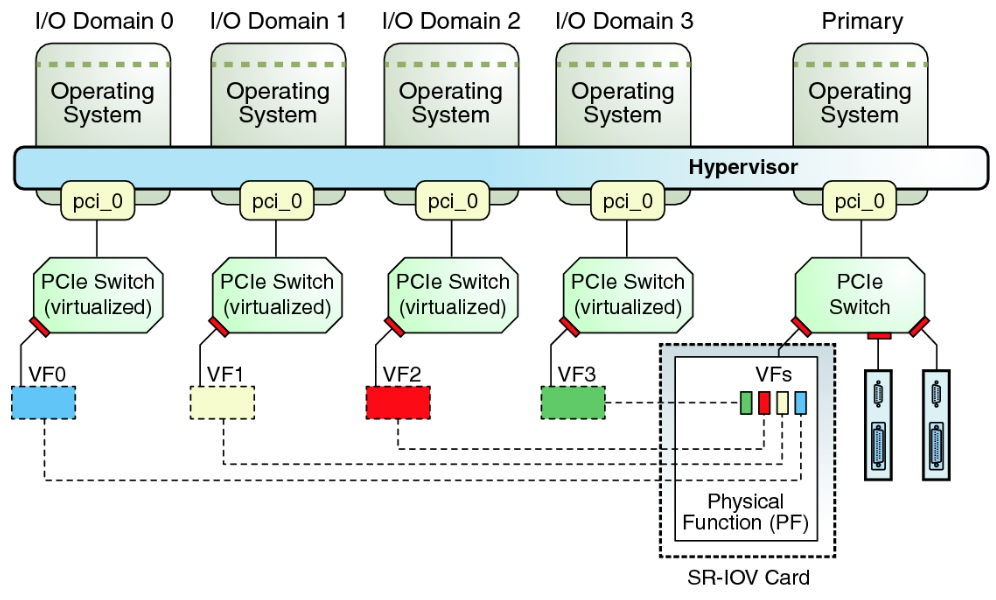

Trong hệ thống ảo hóa sử dụng **Kernel-based Virtual Machine** và công cụ quản lý **libvirt**, **SR-IOV pool** là một cơ chế cấp phát tài nguyên mạng cho máy ảo dựa trên công nghệ **Single Root I/O Virtualization**. Công nghệ này cho phép một thiết bị mạng vật lý duy nhất (NIC) được chia thành nhiều thiết bị mạng ảo nhỏ hơn để nhiều máy ảo có thể sử dụng trực tiếp. Thay vì tất cả lưu lượng mạng của máy ảo phải đi qua kernel networking stack của host, bridge ảo hoặc virtual switch, SR-IOV cho phép các máy ảo truy cập gần như trực tiếp vào phần cứng của card mạng. Điều này giúp giảm đáng kể độ trễ và tăng hiệu năng truyền dữ liệu, vì quá trình xử lý gói tin không còn phải đi qua nhiều lớp phần mềm trung gian.

Trong kiến trúc SR-IOV, card mạng vật lý sẽ có một thành phần gọi là **Physical Function (PF)**, đây là chức năng chính của thiết bị và thường được hệ điều hành host sử dụng để quản lý toàn bộ card mạng. Từ PF, phần cứng có thể tạo ra nhiều **Virtual Function (VF)**, mỗi VF hoạt động giống như một card mạng PCIe độc lập. Các VF này sau đó có thể được gán trực tiếp cho từng máy ảo thông qua cơ chế PCI passthrough. Khi một máy ảo được gán một VF, nó sẽ nhìn thấy VF đó như một card mạng vật lý riêng và có thể sử dụng driver mạng trong hệ điều hành của VM để giao tiếp trực tiếp với phần cứng. Lúc này, lưu lượng mạng của VM sẽ đi thẳng từ VM tới card mạng vật lý rồi ra mạng LAN hoặc internet mà gần như không cần đi qua hệ thống xử lý mạng của host.

Khái niệm **SR-IOV pool** trong libvirt xuất hiện vì mỗi card mạng có thể tạo ra nhiều VF và hệ thống cần một cách quản lý các VF này như một nhóm tài nguyên. Một pool SR-IOV là tập hợp các Virtual Function được tạo ra từ một hoặc nhiều card mạng vật lý. Khi tạo hoặc cấu hình một máy ảo, libvirt có thể tự động lấy một VF còn trống từ pool này và gán cho VM. Khi VM tắt hoặc giải phóng tài nguyên, VF đó sẽ được trả lại pool để sử dụng cho máy ảo khác. Cách quản lý theo pool giúp hệ thống tự động hóa việc phân bổ tài nguyên mạng hiệu năng cao trong môi trường có nhiều máy ảo.

Vì SR-IOV cho phép VM truy cập trực tiếp vào phần cứng mạng, hiệu năng đạt được thường gần với máy vật lý thật, đặc biệt trong các hệ thống yêu cầu băng thông lớn hoặc độ trễ thấp như hệ thống xử lý dữ liệu lớn, hệ thống mạng ảo hóa trong datacenter hoặc hạ tầng cloud. Tuy nhiên, để sử dụng SR-IOV, phần cứng phải hỗ trợ đầy đủ các công nghệ ảo hóa I/O như **Intel VT-d** hoặc **AMD-Vi**, và card mạng vật lý cũng phải hỗ trợ SR-IOV. Ngoài ra, vì VM giao tiếp trực tiếp với phần cứng, một số tính năng quản lý mạng của host như filtering, firewall hoặc live migration có thể bị hạn chế. Vì vậy SR-IOV thường được sử dụng trong các hệ thống cần hiệu năng mạng rất cao, nơi việc giảm overhead của virtualization networking quan trọng hơn sự linh hoạt của hệ thống mạng ảo truyền thống.


# Cấu hình Network trong KVM
- Mặc định khi cài xong KVM, ta sẽ có một mạng ảo NAT mang tên `default`. Check mạng hiện có bằng lệnh sau:

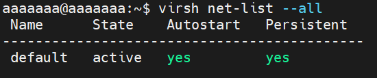
- Ta có thể add một mạng ảo với mô hình NAT khác. Chạy lệnh
```bash
virt-manager
```

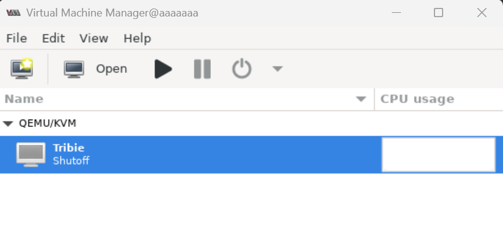

Chọn *Edit* -> *Connection Details*. Chọn tab Virtual Network, ta thấy danh sách các mạng ở bên trái. Để thêm mạng, ta click biểu tượng + ;

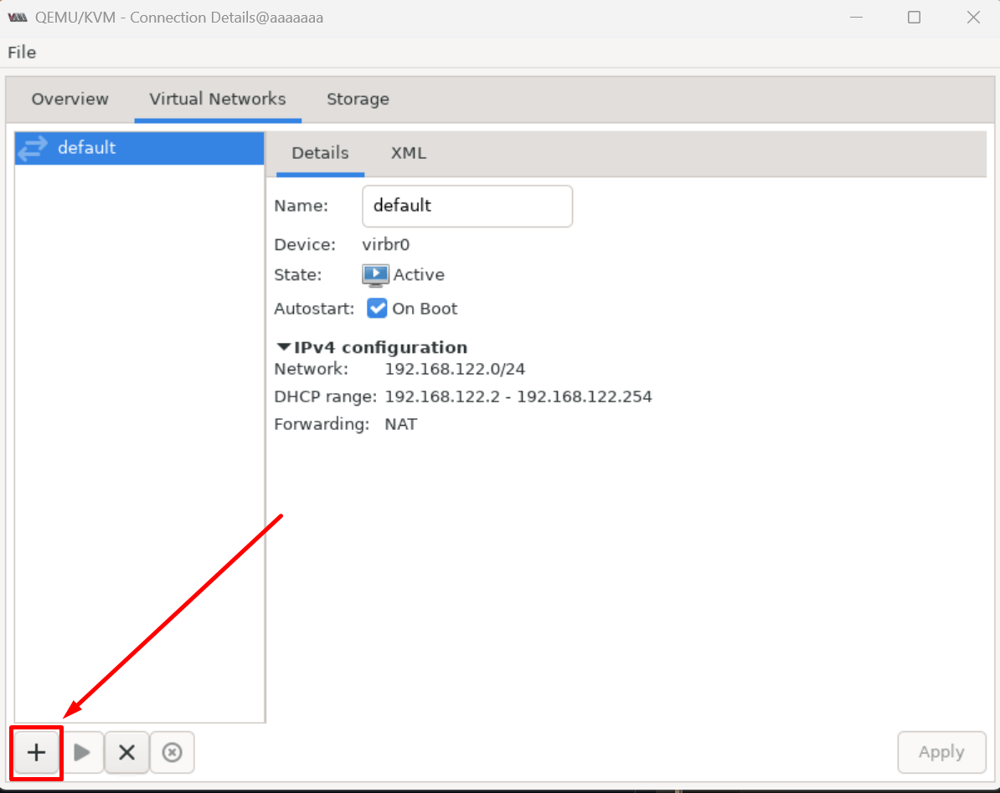

- Nhập tên cho mạng 
- Chọn dải mạng định tạo. Sau đó, chọn dải cấp cho máy ảo, hoặc có thể chọn đặt IP tĩnh
- Ở đây chúng ta không dùng IP tĩnh
- Chọn Mô hình mạng theo các mô hình dưới đây

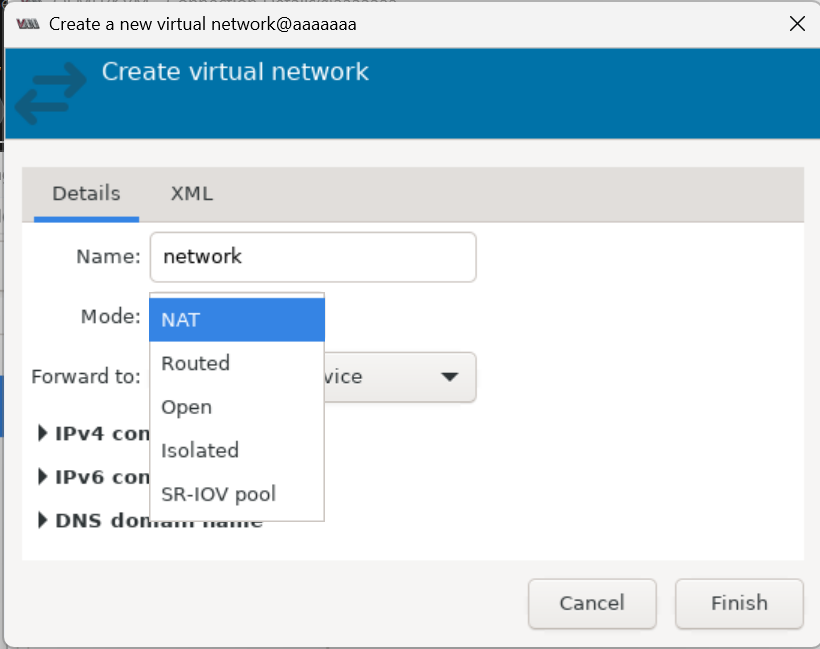


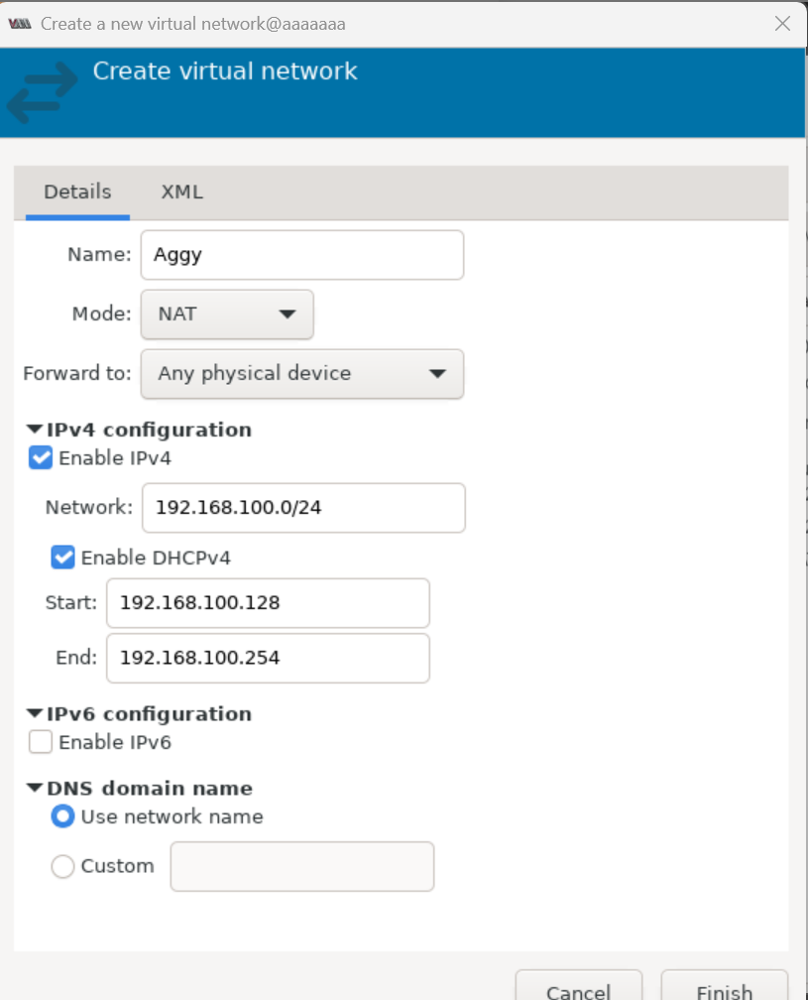

## Tạo Network với giao diện CLI
### 1. Kiểm tra mạng hiện có
```bash
virsh net-list --all
```
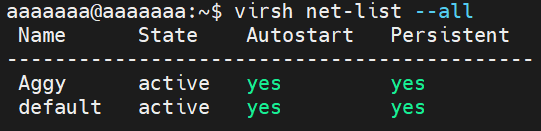

### 2. Tạo một mạng

Tạo file xml: `sudo nano isolated.xml`, ở đây là `isolated.xml` với nội dung
```bash
<network>
  <name>isolated</name>
  <bridge name='virbr100' stp='on' delay='0'/>
  <domain name='lab.local'/>
  <ip address='192.168.100.1' netmask='255.255.255.0'>
    <dhcp>
      <range start='192.168.100.50' end='192.168.100.200'/>
    </dhcp>
  </ip>
</network>
```
- `name`: tên network đặt.
- `bridge name`: interface ảo mà libvirt tạo( ở đây là `virbr10`).
- `ip`: IP của bridge trên máy Ubuntu (host). Máy ảo sẽ nhận IP trong subnet này.
- `stp`: ON để tránh loop
- Vậy Network này sẽ tạo:
```script
VM network: 192.168.100.0/24
Gateway:    192.168.100.1
DHCP range: 192.168.100.50-200
Bridge:     virbr100
```
#### 2.1 NAT
- Thêm dòng forward
```bash
<network>
  <name>lab-net</name>
  <forward mode='nat'/>
  <bridge name='virbr100' stp='on' delay='0'/>
  <domain name='lab.local1'/>

  <ip address='192.168.100.1' netmask='255.255.255.0'>
    <dhcp>
      <range start='192.168.100.50' end='192.168.100.200'/>
    </dhcp>
  </ip>
</network>
```
#### 2.2 Bridge
- Chỉnh sửa forward
```bash
<network>
  <name>lab-net</name>
  <forward mode='bridge'/>
  <bridge name='br0' stp='on' delay='0'/>
  <domain name='lab.local1'/>

  <ip address='192.168.100.1' netmask='255.255.255.0'>
    <dhcp>
      <range start='192.168.100.50' end='192.168.100.200'/>
    </dhcp>
  </ip>
</network>
```

### 3. Định nghĩa và bật mạng
```bash
virsh net-define isolated.xml
virsh net-autostart isolated
virsh net-start isolated
```

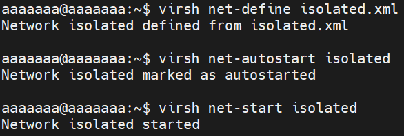

### 4. Gán máy ảo Tribbie sang mạng vừa tạo
``` bash
virsh edit Tribie
```
Trong phần <interface>, sửa từ:
```bash
<interface type='network'>
  <source network='default'/>
```
Thành:
```bash
<interface type='network'>
  <source network='isolated'/>
```

### 5. Detach NIC cũ (default)
```bash
virsh detach-interface --domain Tribie --type network --mac 52:54:00:4e:49:b8 --persistent
```
### 6. Attach NIC mới (Isolated)
```bash
virsh attach-interface --domain Tribie --type network --source isolated --model virtio --persistent
```
### 7. Kiểm tra lại
```bash
virsh domiflist Tribie
```

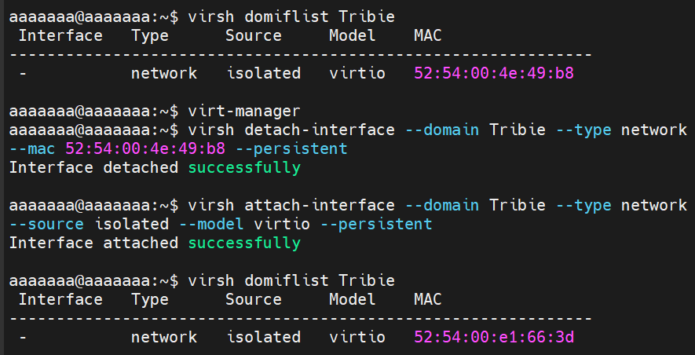

### 8. Khởi động lại VM
```bash
virsh reboot Tribie
```