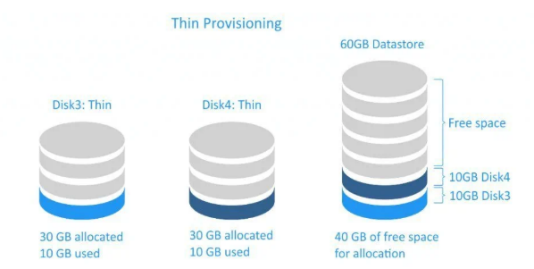
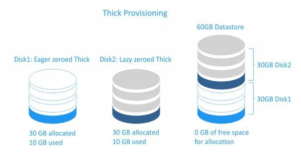

# Cơ chế lưu trữ Thin-Thick
### 1. Thin Provisioning
Thin Provisioning là cơ chế cấp phát dung lượng lưu trữ theo kiểu "cấp phát động", nghĩa là dung lượng ổ đĩa ảo của mấy ảo được khai báo với kích thước lớn ngay từ đầu nhưng trên thưc tế hệ thống chỉ sử dụng và chiếm dụng dung lượng vật lý khi dữ liệu thật sự được ghi vào. Điều này giúp tối ưu hóa việc sử dụng tài nguyên lưu trữ, đặc biệt trong môi trường có nhiều máy ảo, vì không cần phải cấp phát toàn bộ dung lượng ổ đĩa ngay từ lúc tạo.

Khi một ổ đĩa ảo được tạo theo cơ chế Thin, ví dụ một file đĩa dạng QCOW2 được khai báo dung lượng 40GB, hệ thống sẽ không tạo ra ngay một file 40GB trên ổ đĩa vật lý. Thay vào đó, file ban đầu chỉ chiếm một lượng dung lượng rất nhỏ, có thể chỉ vài megabyte để lưu metadata. Khi hệ điều hành bên trong máy ảo bắt đầu ghi dữ liệu, hypervisor sẽ cấp phát thêm các block lưu trữ tương ứng trên ổ đĩa vật lý. Quá trình này diễn ra dần dần theo nhu cầu sử dụng, vì vậy dung lượng file đĩa sẽ tăng lên theo thời gian, nhưng luôn nhỏ hơn hoặc bằng dung lượng tối đa đã khai báo.

Cơ chế này hoạt động dựa trên việc theo dõi các block dữ liệu đã được sử dụng và chỉ cấp phát block mới khi cần thiết. Khi VM ghi dữ liệu mới vào một vùng chưa từng được sử dụng, hypervisor sẽ ánh xạ vùng đó tới một block thật trên ổ đĩa vật lý. Nếu VM chưa sử dụng tới phần dung lượng nào đó của ổ đĩa ảo thì phần đó vẫn chưa chiếm dung lượng thực trên hệ thống lưu trữ. Vì vậy nhiều máy ảo có thể được tạo với dung lượng ổ đĩa lớn hơn tổng dung lượng ổ đĩa vật lý của host, miễn là tổng dữ liệu thực tế được ghi vào vẫn nằm trong giới hạn dung lượng vật lý.

Ưu điểm lớn nhất của Thin Provisioning là giúp tiết kiệm không gian lưu trữ và tăng tính linh hoạt khi triển khai hệ thống ảo hóa, vì quản trị viên có thể cấp phát dung lượng logic lớn cho nhiều máy ảo mà không cần phải có ngay toàn bộ dung lượng vật lý tương ứng. Tuy nhiên cơ chế này cũng có rủi ro nếu tổng dữ liệu của các máy ảo tăng lên vượt quá dung lượng lưu trữ thật của hệ thống, vì khi đó host có thể hết dung lượng đĩa và gây lỗi cho các máy ảo đang hoạt động. Do đó trong môi trường thực tế, hệ thống thường cần các cơ chế giám sát dung lượng và cảnh báo để tránh tình trạng overcommit quá mức. Thin Provisioning vì vậy thường được sử dụng rộng rãi trong các nền tảng ảo hóa và hạ tầng cloud để tối ưu tài nguyên lưu trữ, đặc biệt khi kết hợp với các định dạng đĩa ảo hỗ trợ cấp phát động như QCOW2.

### 2. Thick Provisioning
Thick Provisioning là cơ chế cấp phát dung lượng lưu trữ theo kiểu “cấp phát đầy đủ ngay từ đầu”. Điều này có nghĩa là khi quản trị viên tạo một ổ đĩa ảo cho máy ảo với dung lượng xác định, toàn bộ dung lượng đó sẽ được cấp phát ngay lập tức trên ổ đĩa vật lý của máy chủ, bất kể máy ảo đã sử dụng hết dung lượng đó hay chưa.

Ví dụ, nếu tạo một ổ đĩa ảo có dung lượng 40GB cho máy ảo, hệ thống sẽ tạo ngay một file đĩa có kích thước gần 40GB trên hệ thống lưu trữ vật lý. Không giống cơ chế Thin Provisioning, dung lượng này đã được “đặt chỗ” hoàn toàn cho máy ảo đó và không thể được sử dụng bởi máy ảo khác. Điều này đảm bảo rằng máy ảo luôn có sẵn toàn bộ dung lượng lưu trữ mà nó được cấp phát và sẽ không xảy ra tình trạng thiếu dung lượng khi máy ảo bắt đầu ghi dữ liệu.

Trong thực tế, ổ đĩa ảo Thick thường được tạo dưới dạng file image được cấp phát sẵn toàn bộ block lưu trữ hoặc dưới dạng logical volume trong hệ thống lưu trữ. Khi máy ảo ghi dữ liệu, hypervisor chỉ cần ghi trực tiếp vào các block đã được cấp phát trước đó, không cần phải thực hiện thêm bước cấp phát block mới như trong Thin Provisioning. Nhờ vậy, cơ chế Thick Provisioning thường có hiệu năng ổn định hơn và ít xảy ra hiện tượng phân mảnh dữ liệu trên hệ thống lưu trữ.

Ưu điểm chính của Thick Provisioning là đảm bảo hiệu năng ổn định và tránh được rủi ro hết dung lượng lưu trữ vật lý, vì toàn bộ dung lượng đã được cấp phát ngay từ đầu. Tuy nhiên nhược điểm là mức sử dụng tài nguyên lưu trữ kém linh hoạt hơn, bởi vì dung lượng đã được dành riêng cho máy ảo dù máy ảo có sử dụng hay không. Trong các hệ thống có nhiều máy ảo với dung lượng lớn nhưng mức sử dụng thực tế thấp, cơ chế này có thể gây lãng phí tài nguyên lưu trữ. Vì vậy Thick Provisioning thường được sử dụng trong các hệ thống yêu cầu hiệu năng cao hoặc cần đảm bảo chắc chắn về dung lượng lưu trữ cho từng máy ảo.

Thick có 2 loại :

1. Thick lazy : khi tạo một disk cho VM nó sẽ ánh xạ đến một phân vùng trên disk thật. Nó nhận đủ dung lượng disk mà ta tạo cho VM và nó sẽ không xóa dữ liệu cũ trên disk (nếu có) khi chúng ta ghi cái ghì lên đó thì nó mới xóa dữ liệu đó đi. Chính vì vậy nên việc tạo đĩa ảo sẽ rất nhanh nhưng sẽ mất nhiều thời gian cho lần ghi đầu tiên do phải xóa dữ liệu cũ(nếu có)

2. Thick Eager : cũng gần giống như thick lazy có cũng nhận toàn bộ dung lượng mà ta tạo disk cho VM. Nó sẽ ghi toàn bộ bit 0 lên phần dung lượng chưa được sử dụng của disk ảo(giống như ta tạo file với câu lệnh dd). Vì vậy khi tạo disk cho VM ở kiểu này sẽ lâu hơn so với thick lazy nhưng với lần ghi đầu tiên sẽ nhanh hơn

