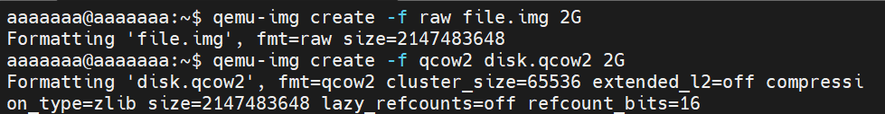
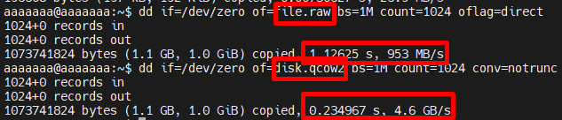
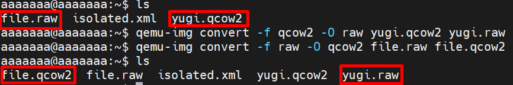
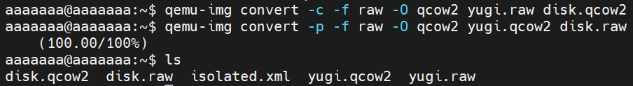

# Các định dạng ổ đĩa trong KVM
### 1. ISO(International Organization for Standardization) image
- **Khái niệm**: là một tệp tin đơn lẻ, sao chép chính xác toàn bộ nội dung, cấu trúc và dữ liệu của một đĩa quang (CD, DVD, Blu-ray) hoặc phương tiện lưu trữ. Nó hoạt động như một ổ đĩa ảo, giúp lưu trữ, phân phối phần mềm, hoặc cài đặt hệ điều hành (như Windows) mà không cần đĩa vật lý.

Thay vì cầm một chiếc đĩa vật lý trên tay, bạn có một tệp tin duy nhất chứa tất cả mọi thứ: từ cấu trúc thư mục, tệp tin dữ liệu cho đến các thông tin khởi động (boot information).
- **Đặc điểm**:
  - Đóng gói duy nhất: Dù đĩa gốc có hàng nghìn tệp tin, khi chuyển sang ISO, nó chỉ còn là một tệp duy nhất.
  - Chỉ đọc(read-only), không thể ghi dữ liệu mới vào.
  - Nguyên bản (Uncompressed): Thông thường, tệp ISO không nén dữ liệu để tiết kiệm dung lượng; nó tập trung vào việc bảo toàn cấu trúc dữ liệu chính xác như trên đĩa gốc.
  - Khả năng khởi động (Bootable): Đây là đặc điểm quan trọng nhất. Các tệp ISO của hệ điều hành (như Ubuntu, Windows, Rocky Linux) chứa mã nguồn để máy tính có thể "boot" vào đó và bắt đầu quá trình cài đặt.

### 2. RAW
**RAW Disk Image**:
- RAW Disk Image là định dạng ảnh đĩa thô, lưu trữ dữ liệu trực tiếp theo dạng nhị phân (bit-by-bit) giống hệt như trên ổ đĩa vật lý.
- Đây là định dạng không nén, không có metadata quản lý phức tạp, nên hiệu năng truy xuất thường nhanh và ổn định.
- File RAW có cấu trúc rất đơn giản, dữ liệu được ghi tuần tự giống như sector trên ổ cứng thật.

**Đặc điểm**
- Là file image phi cấu trúc (unstructured image), không có cơ chế quản lý block nâng cao như snapshot, compression, hoặc encryption.
- Khi tạo máy ảo với disk format RAW, nếu dùng cơ chế  Thick Provisioning thì: dung lượng file disk sẽ bằng đúng dung lượng ổ đĩa máy ảo được cấp phát.

Ví dụ: tạo VM với disk 20GB → file RAW sẽ chiếm ngay 20GB trên host.
- RAW lưu dữ liệu theo từng bit giống ổ đĩa thật, nên có thể được mount hoặc convert dễ dàng sang các định dạng khác.
- Đây là định dạng mặc định của QEMU và được sử dụng rộng rãi trong môi trường ảo hóa như KVM.

**Ưu điểm**
- Hiệu năng I/O cao (ít overhead).
- Cấu trúc đơn giản → dễ debug, dễ convert.
- Tương thích tốt với nhiều hypervisor.

**Nhược điểm**
- Không hỗ trợ snapshot nội tại.
- Không hỗ trợ nén hoặc tối ưu dung lượng.
- Khi dùng Thick Provisioning sẽ chiếm toàn bộ dung lượng ngay từ đầu.

### 3. Qcow2 (QEMU Copy-On-Write 2)
QCOW2 (QEMU Copy-On-Write version 2) là định dạng ảnh đĩa được phát triển bởi QEMU dùng cho môi trường ảo hóa như KVM.

Đây là phiên bản nâng cấp của định dạng QCOW, được thiết kế để hỗ trợ nhiều tính năng quản lý lưu trữ nâng cao như snapshot, nén dữ liệu, mã hóa và Thin Provisioning.

QCOW2 sử dụng cơ chế Copy-On-Write (COW), nghĩa là dữ liệu gốc sẽ không bị thay đổi trực tiếp; khi có ghi dữ liệu mới, hệ thống sẽ tạo block mới để lưu thay đổi. Cơ chế này giúp quản lý snapshot và sao chép máy ảo hiệu quả.

**Đặc điểm**: 
  - Hỗ trợ Thin Provisioning: dung lượng file disk sẽ tăng dần theo lượng dữ liệu thực tế được ghi vào.
  - File ảnh đĩa ban đầu có kích thước nhỏ và chỉ mở rộng khi máy ảo sử dụng thêm dung lượng.
  - Tối ưu cho môi trường ảo hóa sử dụng QEMU/KVM
  - Hỗ trợ Copy-On-Write, cho phép tạo bản sao và snapshot hiệu quả mà không cần sao chép toàn bộ dữ liệu.

**Tính năng**
- **Snapshot**: Cho phép lưu lại trạng thái của máy ảo tại một thời điểm và có thể khôi phục lại khi cần.
- **Nén dữ liệu (Compression)**: Giảm dung lượng lưu trữ của file ảnh đĩa.
- **Mã hóa (Encryption)**: Hỗ trợ mã hóa dữ liệu (ví dụ AES) để tăng tính bảo mật.
- **Thin Provisioning**: Dung lượng file ảnh đĩa chỉ chiếm dung lượng tương ứng với dữ liệu thực tế được sử dụng, giúp tiết kiệm không gian lưu trữ.

# II. So sánh raw và qcow2
| Tiêu chí | RAW | QCOW2 |
|----------|-----|-------|
| Dung lượng | Thick: chiếm toàn bộ dung lượng. Thin: Ít linh hoạt hơn qcow2 | Thin: Chỉ chiếm dung lượng thực tế, hỗ trợ nén|
| Hiệu năng | Cao nhất, đọc/ghi trực tiếp | Thấp hơn, nhưng tối ưu với VirtlO |
| Snap Shot | Không hỗ trợ | Hỗ trợ, linh hoạt cho kiểm thử |

### 1. Dung lượng
Để kiểm tra dung lượng của 2 định dạng này, ta sẽ dùng lệnh `qemu-img` để tạo ra một file có định dạng raw và một file có định dạng qcow2, cả 2 file nàu đều có dung lượng là 2G.

File Raw:
```bash
qemu-img create -f raw file.raw 2G
```
File qcow2:
```bash
qemu-img create -f qcow2 disk.qcow2 2G
```



### 2. Hiệu năng
Để test hiệu năng giữa 2 định dạng ày, sự dụng lệnh `dd` để đọc và ghi dữ liệu từ các file trên.

Đọc dữ liệu: `raw` < `qcow2`
```bash
dd if=file.raw of=test1 bs=8k count=100000
dd if=file.qcow2 of=test2 bs=8k count=100000
```
- `dd`: dùng để sao chép dữ liệu ở cấp độ thấp giữa file hoặc thiết bị.
- `if=file.raw`-> input file là file.`raw`
- `of=test1` -> output file là `test1`
- `bs=8k` -> block size là 8 kilobyte (1 block = 8192 byte)- `count=100000` -> sao chép 100000 block

-> Tổng dung lượng sao chép `8KB * 100000 = 800MB` -> đang đọc `800MB` từ `file.raw` và ghi vào `test1`, với block size 8KB.

Ghi dữ liệu: `raw` > `qcow2`
```bash
dd if=/dev/zero of=file.raw bs=1M count=2048
dd if=/dev/zero of=disk.qcow2 bs=1M count=2048
```



### 3. SnapShot
- Chỉ Qcow2 hỗ trợ tạo SnapShot

# III. Cách chuyển đổi giữa raw và qcow2
### 1. Chuyển từ `raw` sang `qcow2`
```bash
qemu-img convert -f raw -O qcow2 file.raw file.qcow2
```
- `-f raw`: Định dạng đầu vào là raw.
- `-O qcow2`: Định dạng đầu ra là qcow2
- `disk.img`: file ảnh đĩa định dạng là raw
- `disk.qcow2`: file đầu ra qcow2

Ý nghĩa:
- Giảm dung lượng lưu trữ(do Qcow2 dùng Thin Provisioning)
- Cho phép sử dụng thêm snapshot, nén, mã hóa
### 2. Chuyển từ `qcow2`-> `raw`
```bash
qemu-img convert -f qcow2 -O raw file.qcow2 file.raw
```

**Ý nghĩa**:
- Tăng hiệu năng I/O (Raw ít overhead hơn)
- Phù hợp khi deploy production cần tốc độ cao.



### 3. Chú ý 
- Máy ảo phải tắt (shutdown) trước khi convert để tránh lỗi dữ liệu.
- Cần đảm bảo đủ dung lượng ổ đĩa khi chuyển sang RAW (vì RAW = full size).
- QCOW2 có snapshot → khi convert sang RAW sẽ mất snapshot.

### 4. Một số tùy chọn hữu ích
- Hiển thị thông tin file disk:
```bash
qemu-img info disk.qcow2
```
- Convert và tối ưu(nén Qcow2):
```bash
qemu-img convert -c -f raw -O qcow2 disk.raw disk.qcow2
```
- Convert với tiến trình hiển thị:
```bash
qemu-img convert -p -f qcow2 -O raw disk.qcow2 disk.raw
```



### 5. Kiểm tra định dạng file hiện tại

```bash
qemu-img info <file-name>
```

