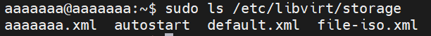

# Tổ chức file trong KVM
### 1. Thư mục lưu các disk của VM
```bash
/var/lib/libvirt/images
```


### 2. Thư mục chứa các file `.xml` thông số kỹ thuật của VM
```bash
/etc/libvirt/qemu
```

### 3. Thư mục chứa các file liên quan đến `network`
```bash
/etc/libvirt/qemu/networks
```

### 4. Thư mục chứa các storage
```bash
/etc/libvirt/storage
```


### 5. Thư mục lưu các bản snapshot của VM
```bash
/var/lib/libvirt/qemu/snapshot
```
