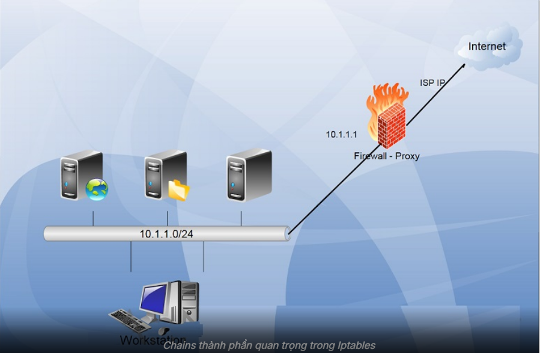
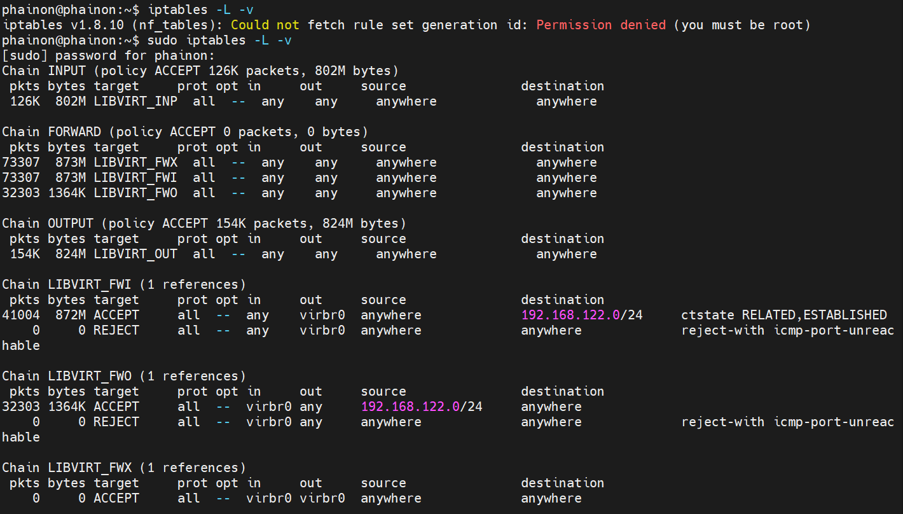

# Tìm hiểu IPtables
## 1. Khái niệm


- iptables là công cụ user-space cấu hình firewall Linux, dùng để thiết lập rule cho Netfilter trong kernel nhằm lọc và kiểm soát lưu lượng mạng.
- **iptables = firewall ở mức kernel (netfilter)**

TẤT CẢ traffic mạng trên máy Linux đều đi qua nó:
- Host
- VM (KVM/libvirt)
- Docker
- Loopback (localhost)

iptables quản lý phạm vi toàn bộ network stack của máy bao gồm:

| Thành phần           | Có đi qua iptables không |
| -------------------- | ------------------------ |
| App trên host        | ✔                        |
| SSH, HTTP            | ✔                        |
| VM (KVM/libvirt)     | ✔                        |
| Docker container     | ✔                        |
| Loopback (127.0.0.1) | ✔                        |

"Bộ lọc Giao thông Mạng"
Và 3 thành phần cốt lõi tạo nên nó:
- **Table (Bảng)**: "Sổ tay" quy định chức năng (Lọc gói tin, Chuyển hướng IP).
- **Chain (Chuỗi)**: "Trạm kiểm soát" (Vào - INPUT, Ra - OUTPUT, Đi ngang qua - FORWARD).
- **Target (Hành động)**: "Quyết định" của bảo vệ (ACCEPT - Cho qua, DROP - Chặn âm thầm, REJECT - Từ chối có thông báo).

## 2. Thành phần của IPtables
Về cơ bản, IPtables chỉ là giao diện dòng lệnh để tương tác với packet filtering của netfilter framework. Cơ chế packet filtering của IPtables hoạt động gồm 3 thành phần là Tables, Chains và Targets
### 2.1 Các bảng trong IPtables


Table được `IPtables` sử dụng để định nghĩa các rules dành cho các gói tin.
- `Filter Table`: Là một trong những tables được IPtables sử dụng nhiều nhất, Filter Table sẽ quyết định việc một gói tin có được đi đến đích dự kiến hay từ chối yêu cầu của gói tin.
- `NAT Table`: Để dùng các rules về NAT, NAT table sẽ có trách nhiệm chỉnh sửa sourceIP hoặc destIP của các gói tin khi thực hiện cơ chế NAT.
- `mangle`: Table này liên quan đến việc sửa header của gói tin, ví dụ chỉnh sửa giá trị các trường TTL, MTU, Type of Service.
- `raw`: 1 gói tin có thể chuộc một kết nối mới hoặc cũng có thể là của 1 kết nối đã tồn tại. Table raw cho phép bạn làm việc với gói tin trước khi kernel kiểm tra trạng thái gói tin.

### 2.2 Chain



Chuỗi quy tắc trong mỗi bảng, định nghĩa điểm xử lý gói tin(ví dụ: `INPUT`, `OUTPUT`, `FORWARD` trong `filter`).
- `INPUT`: Xử lý các gói tin đến từ mạng bên ngoài vào máy chủ.
- `OUTPUT`: Xử lý các gói tin từ máy chủ ra mạng bên ngoài.
- `FORWARD`: Xử lý các gói tin đi qua máy chủ (không phải từ hoặc đến máy chủ).
-`PREROUTING`: Xử lý các gói tin ngay khi chúng đến, trước khi chúng được định tuyến.
- `POSTROUTING`: Xử lý các gói tin ngay trước khi chúng rời khỏi máy chủ.

### 2.3 Rule
Mỗi **Chain** chứa nhiều **Rule**, được kiểm tra theo thứ tự từ trên xuống. Khi khớp rule, sẽ thực hiện Target (ACCEPT, DROP, REJECT, MASQUERADE…).
- **ACCEPT**: Chấp nhận gói tin, cho phép gói tin đi vào hệ thống.
- **DROP**: Loại bỏ gói tin, không có gói tin trả lời, giống như là hệ thống không tồn tại.
- **REJECT**: loại bỏ gói tin nhưng có trả lời table gói tin khác, ví dụ trả lời table 1 gói tin "connection reset" đối với gói TCP hoặc bản tin "destination host unreachable" đối với gói UDP và ICMP
- **LOG**: Chấp nhận gói tin nhưng có ghi lại log. Gói tin sẽ đi qua tất cả các rule chứ không dừng lại khi đã đúng với 1 rule đặt ra. Đối với những gói tin không khớp với rule nào cả mặc định sẽ được chấp nhận.

## II. Cách thức hoạt động của iptables
### 1. Vị trí của iptables trong hệ thống
- **iptables** là công cụ người dùng(user-space).
- Nó giao tiếp với **netfilter** trong kernel để kiểm soát gói tin.
- Khi gói tin đi vào/ra hệ thống, **netfilter** sẽ gọi các hooks(điểm chặn), tại đó **iptables rule** sẽ được áp dụng.
### 2. Các điểm chặn (Netfilter hooks)
Khi một gói tin đi qua Linux host, nó có thể đi qua các hook sau: 
```bash
(1) PREROUTING   – xử lý trước khi định tuyến (routing)
(2) INPUT        – gói tin đến chính máy host
(3) FORWARD      – gói tin đi qua máy (host như router)
(4) OUTPUT       – gói tin do máy host sinh ra
(5) POSTROUTING  – xử lý sau khi định tuyến, trước khi ra ngoài
```
Mỗi hooks này được gắn với các chain trong iptables.
### 3. Quy trình xử lý gói tin
**Gói tin đến (Inbound Packet)**:


#### 3.1 Gói tin từ mạng đi VÀO máy chủ (Inbound Packet)
Đây là gói tin có đích đến là một ứng dụng đang chạy trên chính máy này (ví dụ: truy cập Web Server, SSH).

1. **Giai đoạn Tiền xử lý(PREROUTING):**
- **Raw table**: Kiểm tra gói tin đầu tiên, có thể đánh dấu để không bị hệ thống theo dõi trạng thái (NOTRACK) nhằm tăng tốc độ.
- **Connection Tracking(conntrack)**: Hệ thống ghi nhận đây là gói tin mới (NEW) hay đã có từ trước (ESTABLISHED).
- **Mangle table**: Thay đổi các thông số kỹ thuật trong header (như TTL, TOS).
- **NAT table (DNAT)**: Chỉnh sửa địa chỉ IP đích nếu máy chủ đóng vai trò chuyển hướng (Port Forwarding).

2. **Quyết định định tuyến (Routing Decision 1)**
- Kiểm tra IP đích:
  - Nếu là IP của máy -> đi vào INPUT
  - Nếu không -> chuyển sang FORWARD

3. **Giai đoạn kiểm soát đầu vào (INPUT)**
- **Mangle table**: chỉnh sửa thêm nếu cần
- **Filter table**: Kiểm tra cho phép/chặn (port 22,80,443,...)

4. **Đích đến**
- Gói tin đi vào socket -> ứng dụng xử lý

#### 3.2 Gói tin đi NGANG qua máy (Forwarding Packet)
Máy đóng vai trò router/firewall

1. **Giai đoạn Tiền xử lý(PREROUTING)**
- **Raw → Connection Tracking → Mangle → NAT (DNAT)**(Tương tự trên).

2. **Quyết định định tuyến**
IP đích KHông phải máy -> đi vào Forward

3. **Giai đoạn Chuyển tiếp(FORWARD)**
- **Mangle table**: chỉnh sửa header
- **Filter table**: cho phép/chặn gói tin đi qua giữa các mạng

4. **POSTROUTING**
- **Mangle table**: chỉnh sửa lần cuối
- **NAT table(SNAT/MASQUERADE)**: đổi IP nguồn (LAN → Internet)

#### 3.3 Gói tin do máy chủ tự tạo  (Outbound Packet)
Ví dụ: Bạn đứng ở máy chủ và thực hiện lệnh `ping` hoặc gửi dữ liệu đi.
1. **Khởi tạo**: Gói tin từ Network Socket (Ứng dụng) sinh ra.

2. **Quyết định Định tuyến**: Xác định gói tin sẽ đi ra bằng card mạng nào (eth0, eth1...).

3. **Giai đoạn Kiểm soát đầu ra (OUTPUT)**: (Vùng màu xanh dương).
  - Raw table: Xử lý thô.
  - Connection Tracking: Đánh dấu trạng thái gói tin đi ra.
  - Mangle table: Chỉnh sửa header.
  - NAT table (DNAT): Thay đổi đích đến của gói tin nội bộ nếu cần.
  - Filter table: Kiểm tra xem máy chủ có được phép gửi dữ liệu này ra ngoài không.

4. **Giai đoạn Hậu xử lý (POSTROUTING):**
- Đi qua các bảng Mangle và NAT (SNAT) giống như kịch bản 2 trước khi chính thức rời khỏi máy.
## III. Lệnh cơ bản
### 1. Xem rule hiện tại
```bash
iptables -L -n -v
```
- `-L`: Liệt kê (list) các chuỗi quy tắc (chains) trong các bảng (tables), mặc định là bảng `filter` nếu không chỉ định.
- `-n`: Hiển thị địa chỉ IP và cổng dưới dạng số (numeric), không phân giải tên miền (DNS) hoặc tên dịch vụ, giúp nhanh hơn và rõ ràng hơn.
- `-v`: Hiển thị thông tin chi tiết (verbose), bao gồm số gói tin và byte đã được xử lý bởi mỗi quy tắc, cung cấp dữ liệu thống kê.



**Các chuỗi mặc định (Default Chains)**

Đây là các "cửa ngõ" chính của hệ thống Linux:
- **Chain INPUT**: Kiểm soát các gói tin đi vào chính máy chủ của bạn.
  - `policy ACCEPT`: Mặc định cho phép mọi thứ nếu không khớp quy tắc nào.
  - Có một quy tắc chuyển hướng mọi lưu lượng sang chuỗi `LIBVIRT_INP`.

- **Chain FORWARD**: Kiểm soát các gói tin **đi ngang qua** máy chủ (ví dụ: từ máy ảo ra internet hoặc ngược lại).
  - Đây là nơi quan trọng nhất cho ảo hóa. Nó chuyển tiếp lưu lượng sang các chuỗi con `LIBVIRT_FWX`, `FWI`, và `FWO`.

- **Chain OUTPUT**: Kiểm soát các gói tin do chính máy chủ gửi ra ngoài.
  - Chuyển hướng sang `LIBVIRT_OUT`.

**Các chuỗi LIBVIRT (Dành cho máy ảo)**

Libvirt tạo ra các chuỗi này để quản lý giao diện mạng ảo (thường là virbr0 với dải IP mặc định 192.168.122.x).

- **Chain LIBVIRT_FWI (Forward Inbound)**
  - Dòng 1: Cho phép các gói tin thuộc một kết nối đã thiết lập trước đó (RELATED,ESTABLISHED) đi vào dải IP 192.168.122.0/24.
  - Dòng 2: Nếu không phải dữ liệu cũ, nó sẽ REJECT (từ chối) và gửi thông báo "port-unreachable".

- **Chain LIBVIRT_FWO (Forward Outbound)**
  - Dòng 1: Cho phép mọi thứ xuất phát từ dải IP 192.168.122.0/24 đi ra ngoài thông qua card mạng ảo virbr0.
  - Dòng 2: Từ chối mọi thứ khác.

- **Chain LIBVIRT_INP (Input to Host from VM)**: Cho phép máy ảo giao tiếp với máy chủ thật để sử dụng các dịch vụ mạng cơ bản:
  - UDP/TCP port 53 (domain): Cho phép máy ảo truy vấn DNS từ máy chủ.
  - UDP port 67 (bootps): Cho phép máy ảo nhận IP thông qua DHCP từ máy chủ.

- **Chain LIBVIRT_OUT (Output from Host to VM)** Cho phép máy chủ phản hồi lại máy ảo:
  - Phản hồi DNS và cấp phát IP (DHCP - port 68) cho các máy ảo.
  
### 2. Thêm rule cho chain INPUT (cho phép ping)
```bash
iptables -A INPUT -p icmp -j ACCEPT
```
-`A INPUT`: Thêm (append) quy tắc vào chuỗi INPUT, xử lý gói tin đến máy.
-`p icmp`: Chỉ định giao thức là ICMP (Internet Control Message Protocol), dùng cho ping và các thông báo lỗi mạng.
-`j ACCEPT`: Hành động (jump) là chấp nhận (accept) gói tin, cho phép nó đi qua mà không bị chặn.

### 3. Chặn ip cụ thể
```bash
iptables -A INPUT -s 192.168.100.5 -j DROP
```

### 4. NAT(VM ra Internet thông qua host)
```bash
iptables -t nat -A POSTROUTING -s 192.168.100.0/24 -o eth0 -j MASQUERADE
```
- `-t nat`: Xác định dùng bảng NAT, dùng để xử lý các quy tắc chuyển đổi địa chỉ mạng
- `-A POSTROUTING`: Thêm (append) quy tắc vào chuỗ POSTROUTING, áp dụng sau khi gói tin được định tuyến, trước khi gửi ra giao diện.
- `-s 192.168.100.0/24`: Chỉ định nguồn gói tin từ mạng con 192.168.100.0/24 (mạng nội bộ).
- `-o eth0`: Gói tin sẽ xuất hiện ra giao diện eth0(giao diện mạng vật lý kết nối Internet).
- `-j MASQUERAE`: Hành động là masquerade, tự độngt hay đổi (NAT) địa chỉ nguồn IP từ 192.168.100.0/24 thành địa chỉ IP của eth0, thích hợp cho mạng động DHCP

### 5. Xóa tất cả các rules
```bash
sudo iptables -F
sudo iptables -t nat -F
```
### 6. Một vài tùy chọn khác
| Option    | Ý nghĩa                                |
| --------- | -------------------------------------- |
| `-t`      | Chỉ định tên table (mặc định `filter`) |
| `-p`      | Chỉ định giao thức                     |
| `-i`      | Chỉ định card mạng vào                 |
| `-o`      | Chỉ định card mạng ra                  |
| `-s`      | Chỉ định địa chỉ IP nguồn              |
| `-d`      | Chỉ định địa chỉ IP đích               |
| `--sport` | Chỉ định port nguồn                    |
| `--dport` | Chỉ định port đích                     |


| Option      | Ý nghĩa                                                                                                        |
| ----------- | -------------------------------------------------------------------------------------------------------------- |
| iptables -N | Tạo chain mới                                                                                                  |
| iptables -X | Xóa hết các rule đã tạo trong chain                                                                            |
| iptables -P | Đặt chính sách cho các chain built-in. Ví dụ: IPtables -P INPUT ACCEPT để chấp nhận các packet vào chain INPUT |
| iptables -L | Liệt kê các rule có trong chain                                                                                |
| iptables -F | Xóa các rule có trong chain                                                     |


| Option | Ý nghĩa        |
| ------ | -------------- |
| `-A`   | Thêm rule      |
| `-D`   | Xóa rule       |
| `-R`   | Thay thế rule  |
| `-I`   | Chèn thêm rule |
