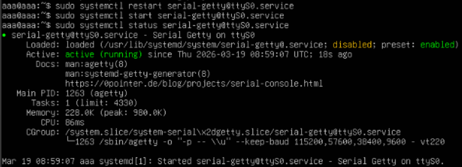
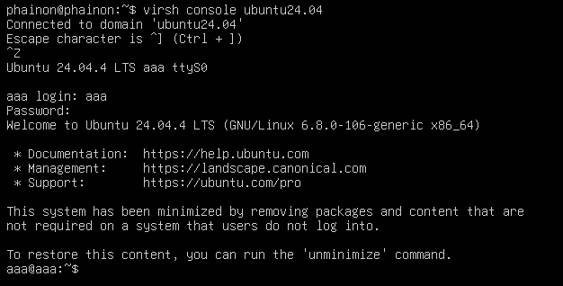

# Truy cập console VM
- Cần khởi động dịch vụ VM
```bash
systemctl enable serial-getty@ttyS0.service
systemctl start serial-getty@ttyS0.service
```



- Trên Host KVM
```bash
virsh console <tên_VM>
```
- Muốn quay lại host ta nhập tổ hợp phím: `CTRL + ]`

