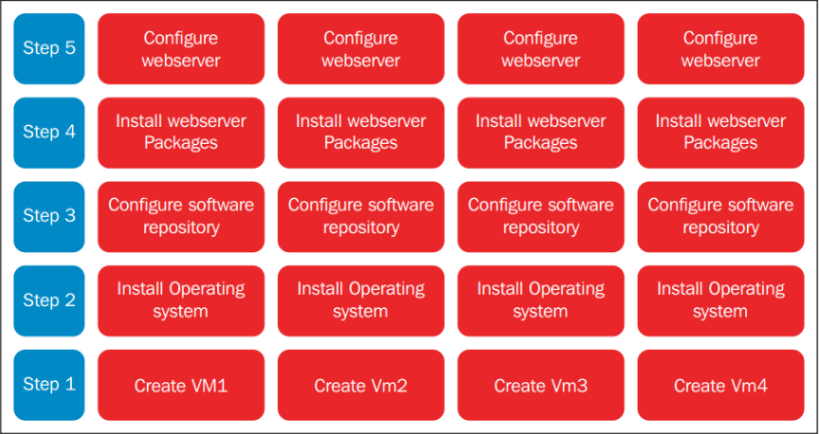
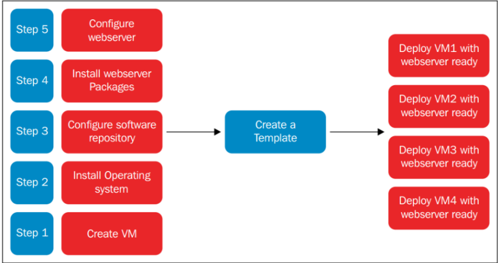
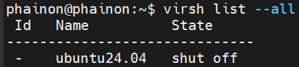

# Tạo template cho VM và tạo VM từ template
## 1. Khái niệm
**VM template (virtual machine template)** là một bản sao được chuẩn bị sẵn của một máy ảo (VM). Nó bao gồm hệ điều hành đã được cài đặt, các ứng dụng, cấu hình mạng và các thiết lập khác, được dùng làm cơ sở để tạo nhanh các máy ảo mới.

Thay vì phải cài đặt và cấu hình thủ công từng máy ảo từ đầu, người dùng có thể sử dụng một template để sao chép hàng loạt các máy ảo giống hệt nhau. Điều này giúp tiết kiệm thời gian, đảm bảo tính nhất quán và giảm thiểu sai sót trong quá trình triển khai.

- **Đặc điểm**:
  - **Read-only**: Template thường được đánh dấu chỉ đọc, để không ai vô tình khởi động hay thay đổi.
  - **Chuẩn hóa**: VM được tạo từ template đều có cấu hình OS, phần mềm, driver giống nhau.
  - **Tiện lợi**: Thay vì cài đặt OS từ đầu, chúng ta chỉ việc deploy từ template
  - **Tự động**: Kết hợp với các công cụ như **cloud-init**(Linux) hoặc **Sysprep**(Windows), các máy ảo sinh ra từ template sẽ tự động đổi hostname, user, IP,... để tránh bị trùng lặp.

- **Ví dụ**:


thay vì phải tốn thời gian nếu có VM ta chỉ cần



- Điều này giúp tạo nhiều VM có cấu hình đồng nhất
- Tiết kiệm thời gian thay vì phải cài đặt OS từ ISO mỗi lần.
- Đảm bảo tính nhất quán trong môi trường lab hoặc production

## 2. Sự khác biệt giữa Clone và template
### 2.1 Clone VM
- Copy y hệt 1 máy ảo
- Giống nhau 100%: OS, Data, user, và cả IP(nếu cấu hình IP tĩnh), có thể cùng hostname, SSH key
- Dùng khi muốn nhân bản nhanh 1 máy đã cấu hình sẵn, lab, test
### 2.2 Template
- Máy ảo gốc hoàn toàn sạch để tạo ra nhiều máy mới
- Khi tạo VM mới sẽ custom lại (hostname, IP, user,...)
- Dùng khi triển khai nhiều VM giống nhau, Production, cloud

## 3. Hai phương thức triển khai máy ảo `Thin` và `Clone`
### 3.1 Thin
VM mới không sao chép toàn bộ disk của template, mà dùng chung disk gốc và chỉ ghi phần thay đổi.
- Cách hoạt động:
```bash
Base Image (gốc, read-only)
        ↓
Overlay (VM1)
Overlay (VM2)
```
- **Ưu điểm**: Tiết kiệm dung lượng, Tạo VM cực nhanh
- Phụ thuộc vào base image, xóa base tất cả VM đều chết
- Vì dùng chung hiệu năng hơi kém.

### 3.2 Clone(full clone)
VM mới copy toàn bộ disk của VM cũ
- **Đặc điểm**:
  - Tạo file disk mới(qcow2/img)
  - Copy toàn bộ dữ liệu từ máy gốc
  - 2 VM độc lập hoàn toàn
- **Ưu điểm**: Không phụ thuộc vào nhau, xóa 1 cái không ảnh hưởng cái còn lại
- Tuy nhiên bị tốn dung lượng và tạo chậm.

## 4. Các bước tạo 1 template
- Tạo máy ảo gốc
- Cấu hình hệ thống cơ bản
- Dọn sạch hệ thống(Quan trọng nhất), xóa các thông tin riêng của máy: 
```bash
# Xóa machine-id
sudo truncate -s 0 /etc/machine-id

# Xóa SSH key
sudo rm -f /etc/ssh/ssh_host_*

# Xóa DHCP lease
sudo rm -rf /var/lib/dhcp/*

# Clear log
sudo journalctl --vacuum-time=1s
```
- Shutdown máy
- Convert thành Template
- Tạo VM mới từ Template

**Thin**: `qemu-img create -f qcow2 -b base.qcow2 vm1.qcow2`

**Clone full**: `cp base.qcow2 vm1.qcow2`
- Khởi động VM mới:
  - Boot lên
  - Cloud-init sẽ: set hostname, set IP , tạo User

```bash
Create VM → Config → Clean → Shutdown → Convert → Deploy
```

## 4. Virt-sysprep
`virt-sysprep` là một công cụ thuộc bộ **libguestfs** trong Linux, được dùng để chuẩn bị(sysprep = system preparation) một máy ảo hoặc một disk image trước khi dùng làm template hoặc clone.

Nói cách khác nó là một công cụ dùng trong môi trường ảo hóa để "làm sạch" một máy ảo trước khi biến nó thành template hoặc clone.

Ví dụ: 
  - Xóa **hostname**
  - Xóa **SSH host keys**
  - Xóa **MAC address**
  - Xóa **log files**(messgaes, secure, journal,...)
  - Reset **user account password** nếu cần.
  - Reset **machine-id**

chạy bằng lệnh:
```bash
virt-sysprep -a /var/lib/libvirt/images/centos-stream9.qcow2
```
- `-a` chỉ định file disk image
- Công cụ sẽ chỉnh sửa trực tiếp vào disk image( không cần VM đang chạy).

Sau khi chạy lệnh có thể dùng `virt-clone` hoặc `virt-install` để tạo VM mới từ image này.

## 5. Lab tạo template và cài đặt VM từ template
### 5.1 Tạo template
Cài đặt 1 VM trên host KVM. Cài đặt các gói cần thiết để dùng làm template.

Shutdown VM:



Cài đặt gói `libguestfs-tools-c` trên KVM host:
```bash
sudo apt install libguestfs-tools
```
Sử dụng `virt-sysprep` để loại bỏ các thông tin cấu hình như UUID, MAC, ... đồng thời niêm phong và biến máy ảo thành template
```bash
virt-sysprep -d ubuntu24.04
```

Backup file xml của template bằng lệnh `dumpxml`
```bash
virsh dumpxml ubuntu24.04 > /root/template.xml
```
Undefine máy ảo
```bash
virsh undefine ubuntu24.04
```
### 5.2 Sử dụng template
