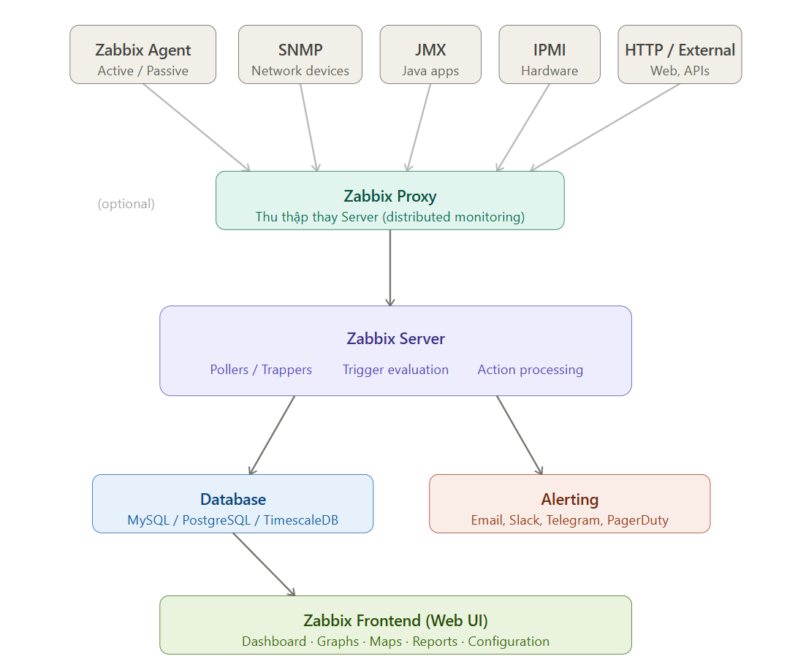

# Tổng quan về Zabbix
## 1. Khái niệm
Zabbix là một nền tảng monitoring mã nguồn mở (open-source) dùng để giám sát toàn diện hạ tầng IT, bao gồm **Servers, VMs, Containers, Network devices (router, switch, firewall), Databases, Applications, Cloud services** trong thời gian thực. Nó là giải pháp giám sát toàn diện, hỗ trợ nhiều loại dữ liệu: CPU, RAM, Disk, Network, dịch vụ web, database, log,...

Zabbix đóng vai trò như một "trạm kiểm soát trung tâm", liên tục thu thập dữ liệu từ khắp nơi trong hệ thống để đảm bảo mọi thứ đang hoạt động ổn định.

## 2. Các thành phần chính của Zabbix
- **Zabbix Server**: Trung tâm xử lý, nhận & phân tích dữ liệu.
- **Database**: Lưu trữ config, metrics, history(MySQL, PostgreSQL, Oracle).
- **Zabbix Web Interface**: Giao diện đồ họa trên trình duyệt để người dùng cấu hình và xem biểu đồ.
- **Zabbix Agent**: Một phần mềm nhỏ cài đặt trên các thiết bị cần giám sát(Server Linux/ Windows) thu thập metrics, gửi dữ liệu về Server.
- **Zabbix Proxy (Tùy chọn)**: Giúp giảm tải cho Server chính bằng cách thu thập dữ liệu từ các khu vực mạng từ xa rồi mới gửi về trung tâm.
- **Front-end**: Giao diện web để quản lý, xem dashboard
## 3. Zabbix quan sát
Zabbix có thể soi được hầu hết mọi thứ trong hạ tầng kỹ thuật:
  - **Hệ điều hành**: Theo dõi CPU, RAM, dung lượng ổ đĩa của Ubuntu, CentOS, Windows Server,...
  - **Thiết bị mạng**: Giám sát lưu lượng qua Port, tình trạng hoạt động của Router, Switch( thông qua giao thức SNMP)



### 3.1 Thu thập dữ liệu (Data Collection)
Zabbix hỗ trợ nhiều phương thức thu thập:
- **Passive check**: **Server** chủ động kết nối đến **Agent** và hỏi "CPU hiện tại bao nhiêu?" → **Agent** trả lời. Đây là chế độ mặc định.
- **Active check**: **Agent** tự động kết nối đến **Server**, hỏi "tôi cần collect gì?" rồi tự thu thập và đẩy dữ liệu lên. Thích hợp khi Agent nằm sau firewall.

### 3.2 Zabbix Proxy (nếu có) 
Dùng Proxy khi hạ tầng phân tán địa lý hoặc có nhiều remote site. Proxy thu thập dữ liệu thay Server, giảm tải network và tăng khả năng mở rộng.

Nhận dữ liệu từ Agent, xử lý sơ bộ và gửi về Zabbix Server.
### 3.3 Xử lý tại Zabbix Server
Sau khi nhận dữ liệu, Server xử lý theo trình tự:
```bash
Raw data → Preprocessing → Item storage → Trigger evaluation → Action
```
- `Preprocessing`: Tính toán delta, parse JSON/XML, convert đơn vị
- `Item`: Đơn vị dữ liệu nhỏ nhất (1 item = 1 metric)
- `Trigger`: Điều kiện cảnh báo, ví dụ {host:cpu.util.avg(5m)} > 90
- `Action`: Khi trigger kích hoạt → gửi alert, chạy remote command, tạo ticket

### 3.4 Trigger & Problem lifecycle
```bash
OK → PROBLEM (trigger fires) → ACKNOWLEDGED → RESOLVED → OK
```
Trigger có severity từ thấp đến cao: Not classified → Information → Warning → Average → High → Disaster.
### 3.5 Lưu trữ dữ liệu
Zabbix dùng SQL database với 3 loại bảng chính:
| Bảng | Mục đích | 
|------|------------|
| history | Dữ liệu thô gần đây (vài tuần)| 
| trends | Dữ liệu đã tổng hợp (min/max/avg theo giờ, lưu lâu dài)| 
| events | Lịch sử trigger, action, alert|

### 3.6 Zabbix Web Interface
Truy xuất dữ liệu từ Database để hiển thị cho người dùng.

Nếu có điều kiện cảnh báo, Zabbix Server sẽ kích hoạt action như gửi email, SMS.