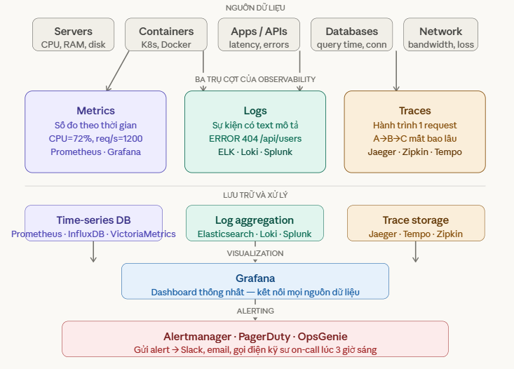
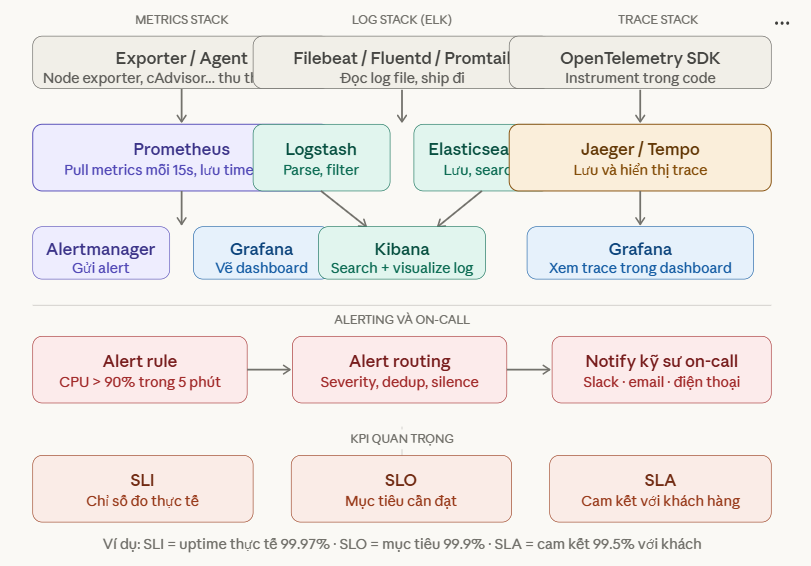
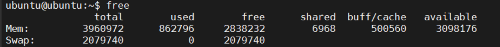
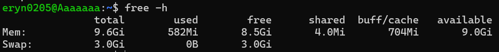
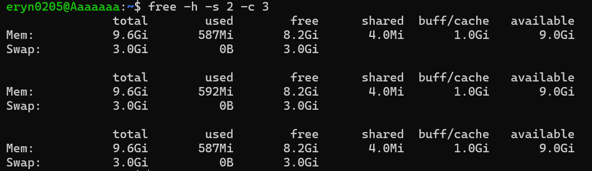
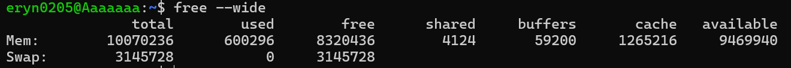
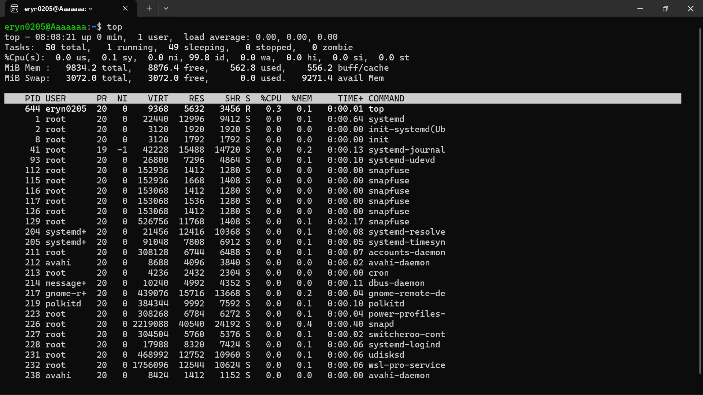
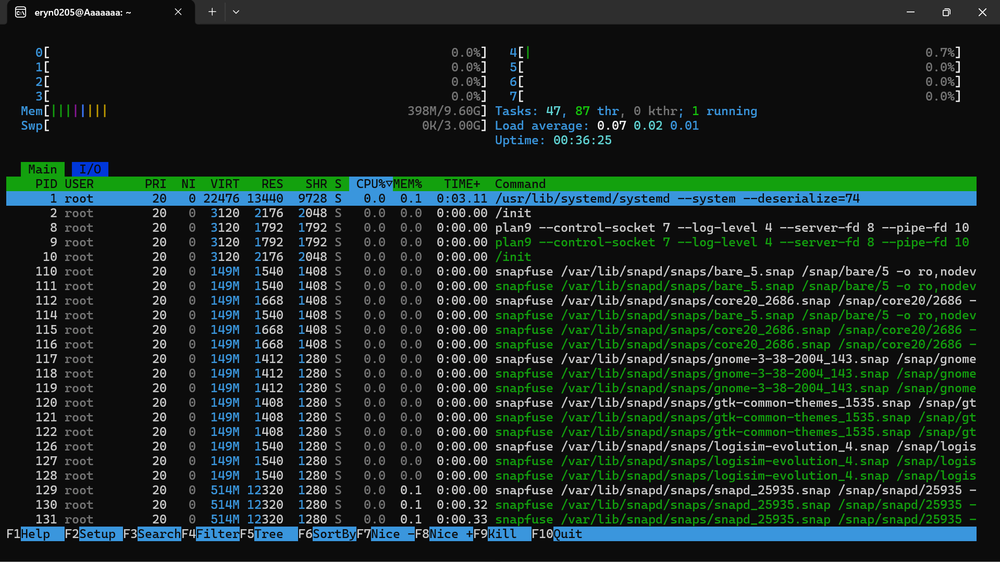
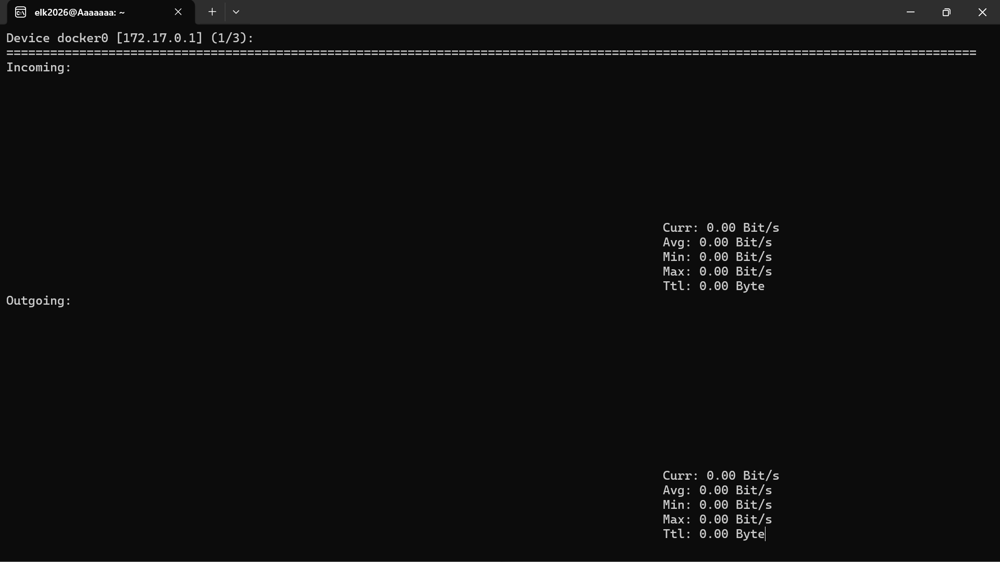
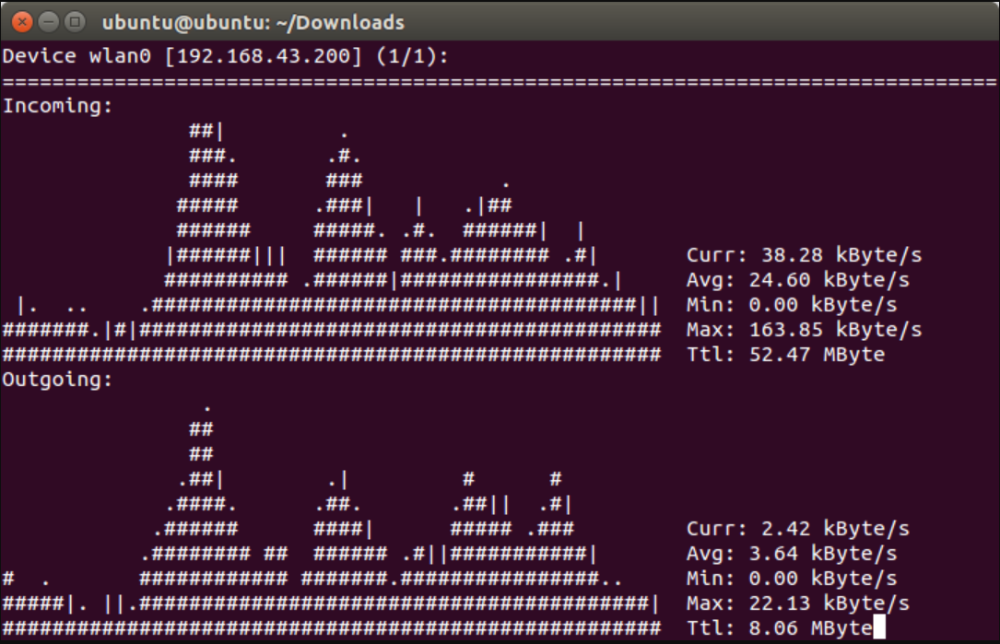

# Monitoring
## 1. Đặt vấn đề
Hình dung bạn vận hành một server chạy website. Không có monitoring, bạn chỉ biết server chết khi... khách hàng gọi điện phàn nàn. Với monitoring, bạn biết trước khi nó chết — thấy CPU đang leo lên 95%, thấy disk sắp đầy, thấy response time đang chậm dần.
## 2. Khái niệm
Monitoring là hệ thống mắt và tai của kỹ sư vận hành hạ tầng. (Giám sát) quá trình thu thập, phân tích và theo dõi liên tục các thông số hoạt động của hệ thống. Mục tiêu chính của monitoring là:
  - **Đảm bảo hiệu suất**: Xác định và khắc phục các vấn đề hiệu suất (ví dụ: CPU quá tải, bộ nhớ đầy, I/O chậm) trước khi chúng ảnh hưởng đến người dùng.
  - **Phát hiện sự cố**: Nhanh chóng nhận diện các lỗi, sự cố hoặc hành vi bất thường của hệ thống (ví dụ: dịch vụ dừng đột ngột, tấn công từ chối dịch vụ).
  - **Tối ưu hóa tài nguyên**: Hiểu rõ cách tài nguyên được sử dụng để có thể phân bổ hoặc nâng cấp một cách hiệu quả.
  - **Lập kế hoạch dung lượng**: Dự đoán nhu cầu tài nguyên trong tương lai dựa trên xu hướng sử dụng hiện tại.
  - **Bảo mật**: Phát hiện các hoạt động đáng ngờ có thể chỉ ra một vi phạm bảo mật.

Monitoring có thể được thực hiện thủ công thông qua các lệnh dòng lệnh hoặc tự động hóa bằng các công cụ monitoring chuyên dụng (như Nagios, Zabbix, Prometheus, Grafana).

Sơ đồ hệ sinh thái:



- **Metrics** là số đo liên tục theo thời gian — CPU đang dùng bao nhiêu %, có bao nhiêu request mỗi giây, bao nhiêu MB RAM còn trống. Metrics rất nhẹ, lưu lâu được, dễ vẽ đồ thị và đặt ngưỡng cảnh báo. Nhưng nó chỉ cho biết "cái gì đang xảy ra", không giải thích tại sao.
- **Logs** là văn bản ghi lại sự kiện — `ERROR: database connection timeout at 14:32:05, INFO: user john@gmail.com logged in`. Logs cho biết chính xác điều gì đã xảy ra và khi nào. Nhược điểm là rất nặng, không thể lưu mãi, và khó tổng hợp thành bức tranh tổng thể.
- **Traces** là hành trình của một request xuyên qua nhiều service. Trong hệ thống microservices, một request từ user có thể đi qua 10 service khác nhau. Trace cho thấy request đó mất bao lâu ở mỗi bước, bước nào đang là bottleneck. Đây là thứ khó triển khai nhất nhưng rất cần trong hệ thống phức tạp.

## 3. Stack phổ biến nhất hiện nay



### 3.1 Alerting và On-call
Monitoring không có nghĩa gì nếu không ai được thông báo khi có vấn đề. Alerting là cầu nối giữa dữ liệu và hành động.

Một alert rule : "nếu CPU > 90% liên tục trong 5 phút thì gửi alert". Khi rule kích hoạt, Alertmanager xử lý — deduplicate (tránh spam cùng một alert 100 lần), route đúng team, rồi gửi đến Slack, email, hoặc gọi điện thẳng đến kỹ sư on-call qua PagerDuty.

On-call là ca trực — kỹ sư phải sẵn sàng 24/7, kể cả 3 giờ sáng. Đây là phần không ai thích nhưng không thể thiếu trong production.

**SLI / SLO / SLA — ba khái niệm hay bị nhầm**
- **SLI** (Service Level Indicator) là số đo thực tế: uptime hôm nay là 99.97%.
- **SLO** (Service Level Objective) là mục tiêu nội bộ team đặt ra: phải duy trì 99.9% uptime.
- **SLA** (Service Level Agreement) là hợp đồng cam kết với khách hàng: đảm bảo 99.5%. Vi phạm SLA thường kéo theo bồi thường tiền.

## 4. Lệnh `Free`
Lệnh `free` dùng để:
  - Hiển thị thông tin về bộ nhớ: bao gồm RAM và SWAP.
  - Giúp kiểm tra mức độ sử dụng, còn trống, và cache.
  - Là công cụ quan trọng để giám sát hiệu suất hệ thống trong thời gian thực.

Lệnh free hữu ích để:
  - Kiểm tra hệ thống có thiếu RAM không.
  - Phát hiện hệ thống dùng nhiều SWAP (dấu hiệu quá tải bộ nhớ).



- `total`: tổng RAM vật lý gắn trên máy, không đổi trừ khi gắn thêm RAM.
- `used`: RAM đang dùng = total - free - buff/cache, bao gồm RAM của tất cả process đang chạy
- `free`: RAM hoàn toàn trống, chưa dùng cho bất cứ thứ gì.
- `shared`: RAM dùng chung giữa các process (tmpfs, shm).
- `buff/cache`: RAM kernel dùng làm buffer I/O và disk cache. Tuy nhiên, nó có thể được giải phóng nếu ứng dụng cần RAM.
- `available`: quan trọng nhất, RAM thực sự có thể dùng cho process mới.

Số bạn cần quan tâm là cột `available` — đây mới là lượng RAM thực sự sẵn sàng cấp cho process mới. Nếu `available` gần về 0, lúc đó mới lo.

### 4.1 Các options dòng lệnh (Flags)
| Option | Mô tả | Ví dụ |
|--------|-------|-------|
| `-h` | Hiển thị đơn vị dễ đọc (Human-readable): MB, GB,... | `free -h` |
| `-b`, `-k`, `-m`, `-g` | Hiển thi đơn vị theo byte, KB, MB, GB tương ứng | `free -b`, `free -k` ,...|
| `-s <seconds>` | Lặp lại hiển thị theo mỗi giây ( theo dõi liên lạc) | `free -s` |
| `-t` | Thêm dòng tổng (`total`) cho RAM + SWAP |
| `-c <count>`| Kết hợp với `-s` để lặp lại một lần cụ thể | `free -h -s 2 -c 3` |
| `--wide` | Tách buff và cache thành 2 cột riêng | `free --wide` |







### 4.2 `Swap`
Dòng `Swap` là RAM ảo trên disk. Khi RAM vật lý đầy, kernel đẩy một phần dữ liệu xuống `swap`. `Swap` chậm hơn RAM hàng chục lần — nếu thấy cột used của `Swap` tăng cao và liên tục, đó là dấu hiệu server đang thiếu RAM nghiêm trọng, cần nâng cấp hoặc tắt bớt process.
- Kết hợp với các lệnh khác trong monitoring:
```bash
# Xem process nào đang ngốn RAM nhất
ps aux --sort=-%mem | head -10

# Xem chi tiết hơn từng process
top        # hoặc htop nếu đã cài

# Xem RAM theo từng process cụ thể
cat /proc/<PID>/status | grep VmRSS
```

## 5. Lệnh `Top`
`top` là một công cụ dòng lệnh dùng để giám sát hiệt suất hệ thống theo thời gian thực. Nó hiển thị các thông tin về:
  - CPU, RAM, swap
  - Số tiến trình đang chạy
  - Các tiến trình đang tiêu tốn tài nguyên nhất

`top` là công cụ monitor `real-time` — hiển thị liên tục trạng thái CPU, RAM và danh sách process đang chạy, tự cập nhật mỗi 3 giây. Khác với `free` chỉ cho một snapshot, `top` cho bạn thấy hệ thống đang diễn biến như thế nào theo thời gian thực.

Giúp quản trị viên nhanh chóng phát hiện quá tải, treo tiến trình hoặc sự cố hệ thống.

### 5.1 Cách sử dụng lệnh `top`



- `PID`: Process ID - định danh duy nhất của mỗi process
- `USER`: Tên người dùng sở hữu tiến trình
- `PR`: Độ ưu tiên của tiến trình
- `NI`: Giá trị nice của tiến trình (giá trị ưu tiên)
- `RES`: RAM vật lý thực sự đang dùng - số quan trọng nhất. Resident Set Size - RAM đang nằm trong bộ nhớ thật.
- `VIRT`: Tổng không gian địa chỉ ảo process được cấp.
Gồm: code chương trình + heap + stack + thư viện + vùng mmap + phần chưa đụng tới. 
- `SHR`: Phần trong RES được chia sẻ với process khác. Ví dụ: libC, libpthread — nhiều process dùng chung một bản duy nhất trên RAM. Tiết kiệm bộ nhớ.
- `S`: Trạng thái của tiến trình (R: Running — đang chạy trên CPU. S: Sleeping — chờ event (bình thường). D: Disk wait — chờ I/O, không thể interrupt. Z: Zombie — đã chết nhưng chưa được dọn dẹp.)
- `%MEM`: Phần trăm RAM vật lý = RES/ total RAM x 100. Dựa trên RES, không phải VIRT. Máy 16GB, process RES=1.6GB → %MEM = 10%.
- `%CPU`: Tỷ lệ phần trăm CPU mà tiến trình đang sử dụng
- `TIME +`: Tổng thời gian CPU process đã tiêu thụ từ khi start. Khác uptime — đây là thời gian CPU thật, không phải
thời gian thực. Process ngủ không tính vào đây.
- `COMMAND`: Tên lệnh hoặc tiến trình đang chạy


### 5.2 Troubleshooting thông thường
- Server lag, chậm -> nhìn % CPU + sort P
- RAM gần đầy -> Nhìn RES + sort M
- Disk I/O chậm -> Tìm process trạng thái `D`


### 5.3 Phím tắt khi đang chạy TOP

| Phím tắt | Chức năng |
|---------|----------|
| `P` | Sắp xếp theo %CPU (mặc định) |
| `M` | Sắp xếp theo %MEM |
| `T` | Sắp xếp theo thời gian CPU (TIME+) |
| `H` | Hiện thread thay vì process |
| `u` | Lọc theo username |
| `1` | Xem từng CPU core riêng |
| `h` | Trợ giúp |
| `k` | kill tiến trình (nhập PID của tiến trình) |
| `r` | renice - Thay đổi độ ưu tiên của một tiến trình (nhập PID và giá trị ưu tiên mới) |
| `d` | Thay đổi thời gian cập nhật (nhập số giây) |
| `q` | Thoát khỏi lệnh `top` |


Chạy từ dòng lệnh:
```bash
top -u eryn2025
```
- Chỉ xem process của user eryn
```bash
top -p 3821
```
- Chỉ theo dõi process có PID 3821
```bash
top -b -n 1
```
- Batch mode - xuất ra file, dùng trong script
```bash
top -d 5 
```
- Refresh mỗi 5 giây

### 5.4 Đọc 5 dòng header đầu trong lệnh `top`

```yaml
top - 14:22:57 up 2 days,  4:37,  2 users,  load average: 0.10, 0.11, 0.12
Tasks: 142 total,   1 running, 141 sleeping,   0 stopped,   0 zombie
%Cpu(s):  2.5 us,  1.3 sy,  0.0 ni, 96.0 id,  0.1 wa,  0.0 hi,  0.1 si,  0.0 st
MiB Mem :   7895.8 total,   1287.3 free,   2456.8 used,   4151.6 buff/cache
MiB Swap:   2048.0 total,   2048.0 free,      0.0 used.   4876.2 avail Mem
```

Thời gian hệ thống:

- `up 2 days, 4:37`: máy chạy liên tục 2 ngày 4 giờ 37 phút.
- `2 users`: có 2 người dùng đang đăng nhập vào hệ thống.
- `load average: 0.10, 0.11, 0.12`: tải trung bình trong 1, 5 và 15 phút qua. (Load average là số process trung bình đang chờ hoặc đang dùng CPU tại một thời điểm. ba con số gần bằng nhau và đều nhỏ. Điều này nói lên hai thứ: tải thấp, và tải ổn định — không có spike bất thường nào trong 15 phút vừa qua.)
 - Một số tình huống khác:
   - `0.10, 0.11, 0.12` — ba số gần bằng nhau → tải đang ổn định, không có gì bất thường.
   - `3.50, 1.20, 0.30` — 1 phút cao hơn nhiều so với 15 phút → vừa có spike gì đó xảy ra gần đây, đang hạ dần.
   - `0.20, 0.80, 2.50` — 1 phút thấp hơn 15 phút → hệ thống từng bận trước đó, vừa mới hạ tải.

Task:

- `142 total`: tổng số tiến trình đang tồn tại là 142.
- `1 running`: có 1 tiến trình đang chạy.
- `141 sleeping`: có 141 tiến trình đang ngủ (không hoạt động).
- `0 stopped`: không có tiến trình nào bị dừng lại.
- `0 zombie`: không có tiến trình zombie (tiến trình đã kết thúc nhưng vẫn còn tồn tại trong bảng tiến trình).

%CPU(s):

- `2.5 us`: 2.5% CPU đang được sử dụng cho các tiến trình người dùng.
- `1.3 sy`: 1.3% CPU đang được sử dụng cho các tiến trình hệ thống (kernel).
- `0.0 ni`: 0.0% CPU đang được sử dụng cho các tiến trình ưu tiên thấp (nice).
- `96.0 id`: 96.0% CPU đang nhàn rỗi (idle (rảnh)).
- `0.1 wa`: 0.1% CPU đang chờ vào/ra (I/O wait). `wa` cao (>10–15%) là dấu hiệu disk đang là bottleneck, không phải CPU. Lúc này CPU thực ra đang rảnh, chỉ ngồi chờ disk đọc/ghi xong. Nhiều người thấy server chậm rồi nhìn vào CPU thấy thấp thì bối rối — thực ra thủ phạm là disk.
- `0.0 hi`: 0.0% CPU đang xử lý ngắt phần cứng (hardware interrupts).
- `0.1 si`: 0.1% CPU đang xử lý ngắt phần mềm (software interrupts).
- `0.0 st`: 0.0% CPU đang bị đánh cắp bởi máy ảo (steal time - stolen). Số này chỉ xuất hiện khi máy bạn là **VM trên cloud (AWS EC2, GCP...)**. Khi hypervisor lấy CPU của VM bạn đi phục vụ VM khác mà không hỏi, đó là "stolen". Máy vật lý thì st luôn = 0. Nếu thấy st cao (>5%) trên cloud nghĩa là bạn đang bị "CPU steal" — nên nâng cấp instance.

MiB Mem - Memory (RAM):

- `7895.8 total`: tổng dung lượng RAM là 7895.8 MiB.
- `1287.3 free`: dung lượng RAM còn trống là 1287.3 MiB.
- `2456.8 used`: dung lượng RAM đang được sử dụng là 2456.8 MiB.
- `4151.6 buff/cache`: dung lượng RAM đang được sử dụng cho bộ đệm và cache là 4151.6 MiB.

MiB Swap:

- `4876.2 avail Mem`: dung lượng RAM khả dụng cho các tiến trình là 4876.2 MiB.
- Khi dùng RAM đầy, truy xuất chậm hơn
- `Swap 0.0 used` — Swap = 0 nghĩa là hệ thống chưa cần dùng đến RAM ảo trên disk, tức RAM vật lý vẫn đủ dùng.

## 6. Lệnh `htop`
htop là công cụ giám sát hệ thống nâng cao so với top, cung cấp giao diện tương tác, màu sắc và dễ sử dụng hơn. Cho phép:
  - Giám sát CPU, RAM, swap, tiến trình.
  - Sắp xếp/sort theo cột bằng phím tắt.
  - Chọn và thao tác tiến trình bằng bàn phím.
  - Hữu ích khi kiểm tra web server, app server đang bị ngốn CPU/RAM.

`htop` về bản chất là `top` nhưng được làm lại cho dễ nhìn và dễ dùng hơn — cùng thông tin, khác cách trình bày.

Cài lệnh top:
```bash
sudo apt install htop
```
### 6.1 Cách sử dụng lệnh `htop`



| Màu | Ý nghĩa thực tế| 
|-----|----------------|
| Xanh lá | User — app của bạn đang dùng CPU |
| Đỏ| Kernel/system — kernel đang dùng CPU| 
| Xanh dương| Thanh RAM: phần buff/cache| 
| Vàng| Thanh RAM: phần đang dùng thực sự (used) — hoặc IRQ| 
| Tím/hồng| Nice — process ưu tiên thấp|

**Vùng RAM và Swap**
```bash
Mem[||||||||          398M/9.60G]
Swp[                    0K/3.00G]
```
- Thanh `Mem` — máy có **9.60GB RAM**, đang dùng **398MB**. Thanh màu chỉ lấp đầy khoảng 1/10 — rất nhàn.
- Thanh `Swp` — **Swap trống hoàn toàn**, 0K dùng trên 3GB. Tốt — nghĩa là RAM vật lý vẫn thừa, chưa cần dùng đến swap.

**Vùng thông tin bên phải**
```bash
Tasks: 47, 87 thr, 0 kthr; 1 running
Load average: 0.07  0.02  0.01
Uptime: 00:36:25
```
- **47 process, 87 thread** đang tồn tại, nhưng chỉ có 1 cái đang thực sự chạy — còn lại đang ngủ hết.
- Load average `0.07, 0.02, 0.01` — cực kỳ thấp, máy mới bật được 36 phút, tải đang giảm dần (1 phút > 5 phút > 15 phút đọc ngược lại nghĩa là tải vừa có chút gì đó rồi hạ xuống).

### 6.2 Danh sách các tiến trình ( tương tự `top`)
### 6.3 Phím tắt hay dùng

| Phím tắt | Chức năng |
|---------|----------|
| `F1` | Help |
| `F2` | SETUP (Cấu hình hiển thị) |
| `F3` | Tìm kiếm process theo tên |
| `F4` | Lọc — chỉ hiện process chứa từ khóa |
| `F5` | Tree view (dạng cây tiến trình) |
| `F6` | Chọn cột để sort |
| `F7/F8` | Thay đổi nice value |
| `F9` | Kill process đang chọn |
| `F10` | Thoát khỏi htop |
| `Space` | Đánh dầu nhiều process cùng lúc |
| `u` | Lọc theo user |
| `q` | Thoát |

### 6.4 Các options dòng lệnh
| Option | Mô tả |
|---------|-------|
| `-d N` | Đặt tốc độ làm mới (N = phần mười giây) |
| `-u <username>` | Hiển thị tiến trình của người dùng cụ thể |
| `-p PID[,PID...]` | Chỉ hiển thị tiến trình với PID cụ thể |
| `-s COLUMN` | Sắp xếp theo cột mặc định |
| `--tree` | Bật chế độ cây tiến trình |

```bash
htop -u www-data         # Xem tiến trình của user www-data
htop -p 1234,5678        # Xem PID cụ thể
htop --tree              # Hiển thị dạng cây
```
### 6.5 Khuyến nghị 1 bài test
```bash
# Cài (nếu chưa có)
sudo apt install htop      # Ubuntu/Debian
sudo yum install htop      # CentOS/RHEL

# Chạy
htop

# Lọc theo user ngay từ đầu
htop -u ngoc

# Theo dõi một PID cụ thể
htop -p 3821
```

## 7. Lệnh `nload`
### 7.1 Khái niệm
`nload` là công cụ dòng lệnh để giám sát lưu lượng mạng ( network traffic) theo thời gian thực.

Nó hiển thị băng thông tải vào (inbound) và băng thông tải ra (outbound) trên mỗi interface mạng.

Có biểu đồ trực quan (ASCII), dễ nhìn hơn so với nhiều lệnh khác như: `ifstat`, `vnstat`, `ip -s`

`nload` là công cụ monitor băng thông mạng real-time — hiển thị traffic vào/ra trên từng network interface dưới dạng đồ thị ASCII trực tiếp trong terminal.

### 7.2 Cài và sử dụng `nload`
```bash
sudo apt install nload
```
```bash
nload # Mặc định sẽ giám sát interface mạng chính (như eth0, enp0s3, v.v.)
```
or
```bash
nload <interface_name>
```



### 7.3 Kết quả hiển thị của `nload` bao gồm
Giao diện chia làm 2 phần:



- Incoming (nửa trên, màu xanh lá) — traffic đang đi vào máy bạn. Ví dụ đang download file, nhận dữ liệu từ database, client gửi request đến server.
- Outgoing (nửa dưới, màu xanh dương) — traffic đang đi ra khỏi máy. Ví dụ đang upload, server trả response về cho client.
  - **Curr (Current)**: Băng thông tại thời điểm hiện tại, đang truyền bao nhiêu. Số này thay đổi liên tục theo thời gian thực.
  - **Avg (Average)**: Trung bình từ lúc bắt đầu chạy `nload` đến giờ. Dùng để đánh giá tải mạng tổng thể..
  - **Minimum/Maximum**: Băng thông thấp nhất và cao nhất ghi nhận được. Max giúp biết lúc nào network bị spike nặng nhất.
  - **Ttl (Total)**: Tổng dữ liệu đã truyền từ lúc chạy nload. Incoming: 1.24GB nhận vào — Outgoing: 0.18GB gửi ra.

### 7.4 Các options dòng lệnh

| Option | Mô tả |
|---------|-------|
| `-u H` | Hiển thị đơn vị ở dạng dễ đọc (Human-readable), ví dụ: Kbit/s, Mbit/s, Gbit/s |
| `-u b` | Hiển thị đơn vị là bit/s |
| `-u k` | Hiển thị đơn vị là kbit/s |
| `-u m` | Hiển thị đơn vị là Mbit/s |
| `-i <interface>` | Chỉ định interface mạng để theo dõi, ví dụ: `nload -i eth0` |
| `-m` | Bật chế độ chọn interface từ menu danh sách (multi-interface menu) |
| `-t <milliseconds>` | Thiết lập khoảng thời gian cập nhật (refresh rate), đơn vị mili giây (mặc định: 500ms) |
| `-a <seconds>` | Thiết lập khoảng thời gian (tính bằng giây) dùng để tính tốc độ trung bình |
| `-o` | Ẩn phần Outgoing (lưu lượng gửi đi) |
| `-I` | Ẩn phần Incoming (Lưu lượng nhận vào) |
| `-h` hoặc `--help` | Hiển thị trợ giúp |

Ví dụ kết hợp:

```bash
nload -u m -t 1000 -a 30 -i eth0
```

- Đơn vị là Mbit/s.
- refresh mỗi giây (1000ms).
- Tính trung bình trên 30 giây.
- Giám sát `interface eth0`.
