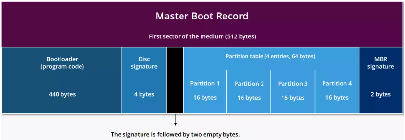
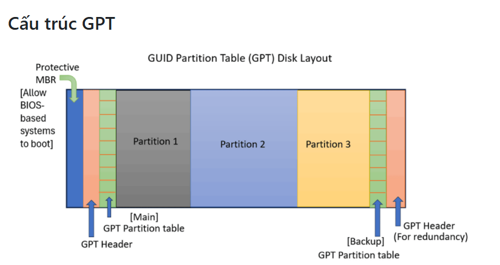

# MRB và GPT -  Partition Table Schemes

## 1. Khái niệm 
Trước khi dùng ổ đĩa, cần phải phân vùng (partition) nó. Partition table cho hệ điều hành biết các phân vùng và dữ liệu trên ổ đĩa được tổ chức như thế nào. Có 2 chuẩn phân vùng chính là MRB và GPT

Hai phương pháp chính mà ổ đĩa cứng hoặc SSD (Solid State Drive) sử dụng để tổ chức thông tin về các phân vùng (partitions) trên chúng. Chúng xác định cách dữ liệu được lưu trữ, số lượng phân vùng có thể tạo và cách máy tính khởi động từ ổ đĩa đó.

## 2. Partitioning Schemes:
### 2.1 MRB
- **MBR (Master Boot Record)**: Là chuẩn phân vùng cũ ra đời từ năm 1983 (cùng với PC BIOS). Thông tin về phân vùng được lưu trong sector đầu tiên của ổ đĩa (sector 0). Sector này gọi là MBR.
  - **Đặc điểm**:
    - Hỗ trợ tối đa 4 primary partitions (nếu muốn nhiều hơn phải dùng 1 “extended partition” rồi chia nhỏ thành “logical partitions”).
    - Giới hạn dung lượng ổ cứng: tối đa 2TB (nếu ổ lớn hơn, phần dư sẽ không sử dụng được).
    - Chỉ dùng tốt với hệ thống khởi động bằng BIOS truyền thống.

#### Cấu trúc MRB
MBR — 3 vùng trong 512 bytes

Bootstrap Code (446 bytes, offset `0x000–0x1BD`): Đây là đoạn mã thực thi đầu tiên khi máy khởi động. BIOS load toàn bộ sector 0 vào địa chỉ RAM `0x7C00` rồi nhảy vào đó. Code này có nhiệm vụ quét 4 partition entry, tìm entry có status = `0x80` (active), đọc VBR (Volume Boot Record) của partition đó và chuyển quyền điều khiển.

Đây là code rất nhỏ → chỉ làm nhiệm vụ “dẫn đường”

Partition Table (64 bytes tiếp theo): Gồm 4 entry, mỗi entry 16 bytes Mỗi partition entry chứa:
  - Trạng thái (bootable hay không)
  - Kiểu partition (Linux, NTFS, FAT…)
  - Địa chỉ bắt đầu (LBA)
  - Kích thước partition

| Thành phần | Kích thước | Mô tả |
|------------|------------|-------|
| **Bootloader (program code)** | `440 bytes` | Phần mã khởi động đầu tiên mà BIOS thực thi. Tải hệ điều hành hoặc bootloader chính từ phân vùng. |
| **Disk signature** | `4 bytes` | Giá trị duy nhất để nhận diện ổ đĩa (Disk ID). Một số hệ điều hành như Windows sử dụng để nhận dạng đĩa. |
| **Padding / Reserved** | `2 bytes (đen trong hình)` | Không dùng hoặc dành riêng. Một số tài liệu tính 446 bytes cho bootloader gồm luôn phần này. |
| **Partition table** | `4 × 16 bytes = 64 bytes` | Bảng mô tả 4 phân vùng chính hoặc 3 chính + 1 mở rộng. MBR chỉ hỗ trợ tối đa 4 primary partitions |
| **MBR signature** | `2 bytes (giá trị 0x55AA)` | Xác nhận đây là sector boot hợp lệ |

### 2.2 GPT
- **GPT (GUID Partition Table)**: Là chuẩn phân vùng mới (ra đời cùng với chuẩn UEFI). Dùng GUID (Globally Unique Identifier) để định danh phân vùng.
  - **Đặc điểm**:
    - Cho phép tạo lên đến 128 phân vùng (trên Windows, Linux có thể còn nhiều hơn).
    - Hỗ trợ ổ cứng có dung lượng rất lớn (lý thuyết đến 9.4 ZB ~ không giới hạn thực tế).
    - Lưu thông tin phân vùng ở nhiều nơi (đầu và cuối ổ) → tăng độ an toàn.
    - Yêu cầu máy hỗ trợ UEFI firmware để boot trực tiếp (nhưng có thể dùng kết hợp với BIOS trong một số trường hợp).

#### Cấu trúc GPT

| Thành phần | Vị trí | Mô tả |
|------------|------------|-------|
| **Protective MBR** | Sector đầu tiên (LBA 0) | Dành cho các hệ thống BIOS cũ không hỗ trợ GPT, giúp nhận diện đĩa là “đã phân vùng” và ngăn không cho phần mềm ghi đè GPT. Không chứa bootloader. |
| **GPT Header (Main)** | Sector thứ hai (LBA 1) | Chứa thông tin chính về GPT như số lượng entry, vị trí bảng phân vùng, CRC để kiểm tra lỗi. |
| **GPT Partition Table (Main)** | Sau GPT Header | Danh sách các phân vùng trên đĩa (mỗi entry thường 128 bytes). Thường có thể chứa tới 128 phân vùng. |
| **Các phân vùng (Partition 1, 2, 3...)** | Tiếp theo | Dữ liệu thực tế của người dùng, hệ điều hành, EFI, v.v. |
| **GPT Partition Table (Backup)** | Trước sector cuối cùng | Bản sao của bảng phân vùng chính để dự phòng. |
| **GPT Header (Backup)** | Sector cuối cùng | Bản sao của GPT Header chính, phục vụ khôi phục nếu bị hỏng. |

### So sánh nhanh

| Tiêu chí          | MBR                        | GPT                                 |
| ----------------- | -------------------------- | ----------------------------------- |
| Năm ra đời        | 1983                       | 2000s (chuẩn UEFI)                  |
| Dung lượng tối đa | 2 TB                       | ~9.4 ZB (gần như vô hạn)            |
| Số phân vùng      | 4 primary (tối đa)         | 128 (Windows), nhiều hơn trên Linux |
| Cơ chế boot       | BIOS                       | UEFI                                |
| Độ an toàn        | Thấp (1 bảng MBR duy nhất) | Cao (có backup, CRC check)          |
| Ứng dụng hiện nay | Máy cũ, ổ < 2TB            | Máy mới, ổ > 2TB, chuẩn khuyến nghị |
