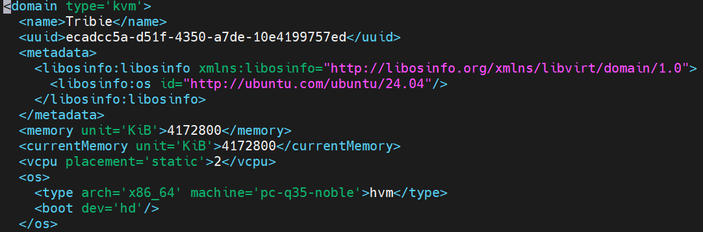

# Tìm hiểu về file XML trong KVM
## I. Cơ bản về XML 
XML (Extensible Markup Language - Ngôn ngữ đánh dấu mở rộng) là một định dạng văn bản dùng để lưu trữ và trao đổi dữ liệu có cấu trúc giữa các hệ thống máy tính khác nhau. Nó cho phép người dùng tự định nghĩa các thẻ (tags) để mô tả dữ liệu, giúp cả người và máy đều có thể đọc được. XML không dùng để hiển thị mà chú trọng vào cấu trúc.

Trong KVM, file XML là thành phần cốt lõi để định nghĩa và quản lý các máy ảo (VMs) và mạng ảo. `libvirt`(daemon quản lý KVM) sử dụng các file XML này như một bản blueprint để biết cách tạo và chạy một MV hoặc một Network

Một máy ảo(VM) trong KVM có 2 thành phần chính đó là:
- VM's defination được lưu dưới dạng file XML và nằm trong thư mục `/etc/libvirt/qemu`
- VM's storage lưu dưới dạng file image

Các file XML trong KVM mô tả chi tiết toàn bộ cấu hình phần cứng của một máy ảo. Nó bao gồm mọi thứ từ tên, UUID, số lượng CPU, RAM cho đến các thiết bị lưu trữ, card mạng, card đồ họa,...

## II. Các thành phần trong file domain XML của VM
Sử dụng `virsh edit` để mở và chỉnh sửa các file XML của máy ảo:
```bash
virsh edit <ten_file>
```
- lệnh này mở file XML của máy ảo trong trình soạn thảo văn bản mặc định (thường là `vi` hoặc `nano` hoặc `vim`).
- Sau khi chỉnh sửa, lưu và thoát trình soạn thảo. `virsh` sẽ tự động kiểm tra cú pháp XML.


- `name`: tên của VM
- `uuid`: uuid của VM
- `memory`: dung lượng RAM của VM
- `unit='KiB'`: đơn vị đo dung lượng RAM, có thể sử dụng các đơn vị khác
- `currentMemory`: dung lượng RAM hiện tại
- `vcpu`: số CPU ảo được cài đặt
- `os`: hệ điều hành đang cài đặt trên máy ảo

## III. Tạo 1 VM bằng file domain XML

Copy file từ máy ảo đã tạo bằng `virt-manager` hoặc bằng dòng lệnh CLi từ trước đó:
- Truy cập vào file `xml` vừa copy đổi tên cho file bằng tên máy ảo mới và thay đổi các trường dữ liệu sau:
- `<name>`
- `<uuid>`: (Có thể ra ngoài `sudo apt install uuid` -> `uuid`: máy tự gen 1 uuid ngẫu nhiên).
- **Disk path**: `<source file='/var/lib/libvirt/images/Castorice.qcow2'/>`
- **MAC address**
- **Machine type**: cần biết host hỗ trợ version nào, mặc định `x86_64` dùng `machine='pc-q35-noble'`
- **CPU mode**
- **Memory**

```bash
<domain type='kvm'>
  <name>Castorice</name>
  <uuid>c8f28a38-21e5-11f1-8549-17d9cd5de1dd</uuid>
  <metadata>
    <libosinfo:libosinfo xmlns:libosinfo="http://libosinfo.org/xmlns/libvirt/domain/1.0">
      <libosinfo:os id="http://ubuntu.com/ubuntu/24.04"/>
    </libosinfo:libosinfo>
  </metadata>
  <memory unit='KiB'>417280</memory>
  <currentMemory unit='KiB'>2172800</currentMemory>
  <vcpu placement='static'>2</vcpu>
  <os>
   <type arch='x86_64' machine='pc-q35-noble'>hvm</type>
   <boot dev='cdrom'/>
   <boot dev='hd'/>
  </os>
  <features>
    <acpi/>
    <apic/>
    <vmport state='off'/>
  </features>
  <cpu mode='host-passthrough' check='none' migratable='on'/>
  <clock offset='utc'>
    <timer name='rtc' tickpolicy='catchup'/>
    <timer name='pit' tickpolicy='delay'/>
    <timer name='hpet' present='no'/>
  </clock>
  <on_poweroff>destroy</on_poweroff>
  <on_reboot>restart</on_reboot>
  <on_crash>destroy</on_crash>
  <pm>
    <suspend-to-mem enabled='no'/>
    <suspend-to-disk enabled='no'/>
  </pm>
  <devices>
    <emulator>/usr/bin/qemu-system-x86_64</emulator>
    <disk type='file' device='disk'>
      <driver name='qemu' type='qcow2' discard='unmap'/>
      <source file='/var/lib/libvirt/images/Castorice.qcow2'/>
      <target dev='vda' bus='virtio'/>
      <address type='pci' domain='0x0000' bus='0x04' slot='0x00' function='0x0'/>
    </disk>
    <disk type='file' device='cdrom'>
      <driver name='qemu' type='raw'/>
      <source file='/var/lib/libvirt/file-iso/ubuntu-24.04.4-live-server-amd64.iso'/>
      <target dev='sda' bus='sata'/>
      <readonly/>
      <address type='drive' controller='0' bus='0' target='0' unit='0'/>
    </disk>
    <controller type='usb' index='0' model='qemu-xhci' ports='15'>
      <address type='pci' domain='0x0000' bus='0x02' slot='0x00' function='0x0'/>
    </controller>
    <controller type='pci' index='0' model='pcie-root'/>
    <controller type='pci' index='1' model='pcie-root-port'>
      <model name='pcie-root-port'/>
      <target chassis='1' port='0x10'/>
      <address type='pci' domain='0x0000' bus='0x00' slot='0x02' function='0x0' multifunction='on'/>
    </controller>
    <controller type='pci' index='2' model='pcie-root-port'>
      <model name='pcie-root-port'/>
      <target chassis='2' port='0x11'/>
      <address type='pci' domain='0x0000' bus='0x00' slot='0x02' function='0x1'/>
    </controller>
    <controller type='pci' index='3' model='pcie-root-port'>
      <model name='pcie-root-port'/>
      <target chassis='3' port='0x12'/>
      <address type='pci' domain='0x0000' bus='0x00' slot='0x02' function='0x2'/>
    </controller>
    <controller type='pci' index='4' model='pcie-root-port'>
      <model name='pcie-root-port'/>
      <target chassis='4' port='0x13'/>
      <address type='pci' domain='0x0000' bus='0x00' slot='0x02' function='0x3'/>
    </controller>
    <controller type='pci' index='5' model='pcie-root-port'>
      <model name='pcie-root-port'/>
      <target chassis='5' port='0x14'/>
      <address type='pci' domain='0x0000' bus='0x00' slot='0x02' function='0x4'/>
    </controller>
    <controller type='pci' index='6' model='pcie-root-port'>
      <model name='pcie-root-port'/>
      <target chassis='6' port='0x15'/>
      <address type='pci' domain='0x0000' bus='0x00' slot='0x02' function='0x5'/>
    </controller>
    <controller type='pci' index='7' model='pcie-root-port'>
      <model name='pcie-root-port'/>
      <target chassis='7' port='0x16'/>
      <address type='pci' domain='0x0000' bus='0x00' slot='0x02' function='0x6'/>
    </controller>
    <controller type='pci' index='8' model='pcie-root-port'>
      <model name='pcie-root-port'/>
      <target chassis='8' port='0x17'/>
      <address type='pci' domain='0x0000' bus='0x00' slot='0x02' function='0x7'/>
    </controller>
    <controller type='pci' index='9' model='pcie-root-port'>
      <model name='pcie-root-port'/>
      <target chassis='9' port='0x18'/>
      <address type='pci' domain='0x0000' bus='0x00' slot='0x03' function='0x0' multifunction='on'/>
    </controller>
    <controller type='pci' index='10' model='pcie-root-port'>
      <model name='pcie-root-port'/>
      <target chassis='10' port='0x19'/>
      <address type='pci' domain='0x0000' bus='0x00' slot='0x03' function='0x1'/>
    </controller>
    <controller type='pci' index='11' model='pcie-root-port'>
      <model name='pcie-root-port'/>
      <target chassis='11' port='0x1a'/>
      <address type='pci' domain='0x0000' bus='0x00' slot='0x03' function='0x2'/>
    </controller>
    <controller type='pci' index='12' model='pcie-root-port'>
      <model name='pcie-root-port'/>
      <target chassis='12' port='0x1b'/>
      <address type='pci' domain='0x0000' bus='0x00' slot='0x03' function='0x3'/>
    </controller>
    <controller type='pci' index='13' model='pcie-root-port'>
      <model name='pcie-root-port'/>
      <target chassis='13' port='0x1c'/>
      <address type='pci' domain='0x0000' bus='0x00' slot='0x03' function='0x4'/>
    </controller>
    <controller type='pci' index='14' model='pcie-root-port'>
      <model name='pcie-root-port'/>
      <target chassis='14' port='0x1d'/>
      <address type='pci' domain='0x0000' bus='0x00' slot='0x03' function='0x5'/>
    </controller>
    <controller type='sata' index='0'>
      <address type='pci' domain='0x0000' bus='0x00' slot='0x1f' function='0x2'/>
    </controller>
    <controller type='virtio-serial' index='0'>
      <address type='pci' domain='0x0000' bus='0x03' slot='0x00' function='0x0'/>
    </controller>
    <interface type='network'>
      <mac address='52:54:00:a1:67:3d'/>
      <source network='Aggy'/>
      <model type='virtio'/>
      <address type='pci' domain='0x0000' bus='0x01' slot='0x00' function='0x0'/>
    </interface>
    <serial type='pty'>
      <target type='isa-serial' port='0'>
        <model name='isa-serial'/>
      </target>
    </serial>
    <console type='pty'>
      <target type='serial' port='0'/>
    </console>
    <channel type='unix'>
      <target type='virtio' name='org.qemu.guest_agent.0'/>
      <address type='virtio-serial' controller='0' bus='0' port='1'/>
    </channel>
    <channel type='spicevmc'>
      <target type='virtio' name='com.redhat.spice.0'/>
      <address type='virtio-serial' controller='0' bus='0' port='2'/>
    </channel>
    <input type='tablet' bus='usb'>
      <address type='usb' bus='0' port='1'/>
    </input>
    <input type='mouse' bus='ps2'/>
    <input type='keyboard' bus='ps2'/>
    <graphics type='spice' autoport='yes'>
      <listen type='address'/>
      <image compression='off'/>
    </graphics>
    <sound model='ich9'>
      <address type='pci' domain='0x0000' bus='0x00' slot='0x1b' function='0x0'/>
    </sound>
    <audio id='1' type='spice'/>
    <video>
      <model type='virtio' heads='1' primary='yes'/>
      <address type='pci' domain='0x0000' bus='0x00' slot='0x01' function='0x0'/>
    </video>
    <redirdev bus='usb' type='spicevmc'>
      <address type='usb' bus='0' port='2'/>
    </redirdev>
    <redirdev bus='usb' type='spicevmc'>
      <address type='usb' bus='0' port='3'/>
    </redirdev>
    <watchdog model='itco' action='reset'/>
    <memballoon model='virtio'>
      <address type='pci' domain='0x0000' bus='0x05' slot='0x00' function='0x0'/>
    </memballoon>
    <rng model='virtio'>
      <backend model='random'>/dev/urandom</backend>
      <address type='pci' domain='0x0000' bus='0x06' slot='0x00' function='0x0'/>
    </rng>
  </devices>
</domain>
```
File domain XML này sẽ tạo ra máy ảo với những thông số sau:
- 417MB Ram, 2vCPU
- Đường dẫn tới ổ đĩa: `var/lib/libvirt/images/Castorice.qcow2`
- Máy ảo được boot từ CD-ROM: `/var/lib/libvirt/file-iso/ubuntu-24.04.4-live-server-amd64.iso`
- Sử dụng network: `Aggy` với đ/c MAC: `52:54:00:a1:67:3d`

**Lưu ý quan trọng**: 
- Trong phần `<os>`: Nếu bạn boot từ ổ disk(vda) thì khai báo:
```bash
<boot dev='hd'/>
```
Nhưng phần lớn disk `qcow2` là do chúng ta tự tạo new nên sẽ là ổ đĩa chống và ko có hệ điều hành, không boot được.

Phần `<os>` cần chỉnh thành 
```bash
  <boot dev='cdrom'/>
  <boot dev='hd'/>
```
- Boot từ ISo trước, sau khi cài xong tự boot vào disk

**Lưu ý quan trọng(x2)**: Sau khi tải xong hệ điều hành máy sẽ bắt chúng ta reboot now. Nếu chúng ta reboot:
- Máy sẽ bắt chúng ta cài lại hệ điều hành lần nữa
- Lần đầu tiên là boot từ ISO cài Ubuntu vào `qcow2`
- Lần 2 vẫn đang gắn ISO + boot từ cdrom nên vẫn sẽ bị
- Sau khi tải xong hệ điều hành lần đầu cần tắt máy ngay lập tức: `virsh shutdown Castorice`
- Vào file xml chỉnh sửa lại: `virsh edit Castorice`
- bỏ boot bằng cdrom
- `virsh define Castorice` 
- Mở lại máy, đến đây việc cài đặt thủ công hoàn tất.

- **Ngoài ra**: ta có thể tạo 1 file `XML` bằng `dump` từ một máy ảo đang chạy:
```bash
virsh dumpxml Tribie > newUbuntu.xml
```
**Hoàn tất việc khởi tạo máy ảo**:
```bash
virsh create <tên_file_domain>.xml
```
```bash
virsh define <tên_file_domain>.xml
```
- **Lưu ý**: khi ta thay đổi file xml của bất kỳ máy nào trong:
`etc/libvirt/qemu` ta đều phải define lại để áp dụng thay đổi.

## IV. Một vài chỉnh sửa khác với XML
### 4.1 Thêm Disk vào VM 
- Kiểm tra số lượng đĩa ảo của VM
```bash
fdisk -l | grep vd
```
- Mặc định sẽ có  1 đĩa ảo vda (3 phân vùng `vda1`, `vda2` và `vda3`)
- Tạo thêm 1 đĩa ảo trên host KVM
```bash
cd /var/lib/libvirt/images
qemu-img create -f qcow2 newDisk.qcow2 3G
```
- Truy cập file `*.xml` để chỉnh sửa(* là tên của máy ảo VM)
```bash
virsh edit ubuntu20.04
```
- Chỉnh sửa như sau:
```bash
<disk type='file' device='disk'>
    <driver name='qemu' type='qcow2'/>
    <source file='/var/lib/libvirt/images/newDisk.qcow2'/>
    <target dev='vdb' bus='virtio'/>
</disk>
```
Trong đó:
- `<driver name='qemu' type='qcow2'/>`: Tên driver và kiểu disk
- `<source file='/var/lib/libvirt/images/newDisk.qcow2'/>`: đường dẫn tới disk ảo trên host KVM
- `<target dev='vdb' bus='virtio'/>` : cần tạo tên khác với những disk ảo đã có của VM. 
Define lại `virsh define ubuntu20.04.xml`
- Start và kiểm tra

### 4.2 Phân vùng disk
Trên VM mới thêm disk `vdb`, ta thực hiện phân vùng:
```bash
fdisk /dev/vdb

Command (m for help):
```
- Nhập `n` để tạo phân vùng mới

- Nhập `p` để tạo phân vùng chính
- Chọn phân vùng có sẵn, Ở đây ta chọn phân vùng 1
- Sau khi hoàn thành nhập w để xác nhận thay đổi
- Định dạng phân vùng với với hệ thống file `ext4`
```bash
mkfs -t ext4 /dev/vdb1
```
- Xem thêm ở phần ubuntu

### 4.3 Thêm card mạng
- Check những card mạng hiện có trên 1 máy ảo 
```bash
virsh domiflist <tên_máy_ảo>
```
- Chỉnh sửa file xml của VM
- Thêm đoạn `interface` như sau vào file xml
```bash
<interface type='network'>
    <source network='hostonly'/>
    <model type='virtio'/>
</interface>
```
Trong đó:
- `interface type`: kiểu card mạng
- `source`: dải mạng mà card cắm vào

Define file xml của VM và reboot VM

### 4.4 Xóa card mạng
Ta có thể xóa card mạng bằng 2 cách:
  - Xóa trong file xml
  
```bash
  virsh detach-interface --domain demo --type network --mac 52:54:00:2c:24:cb --config
  ```