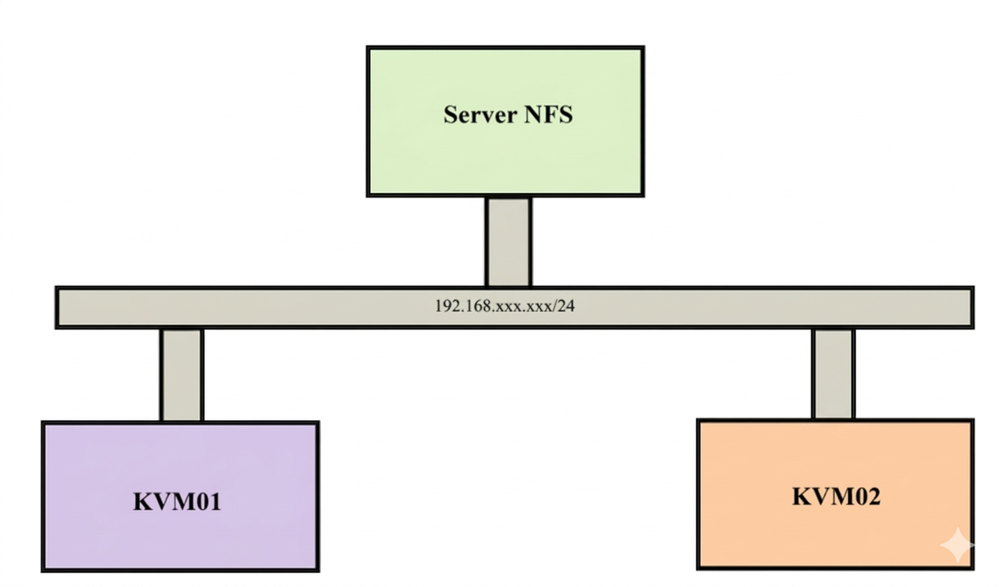
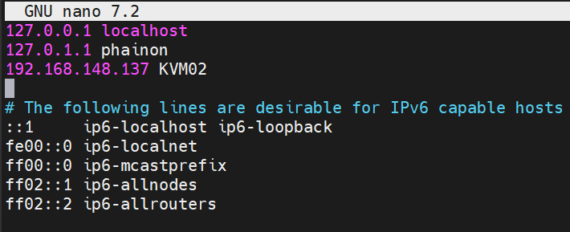
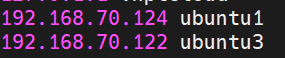
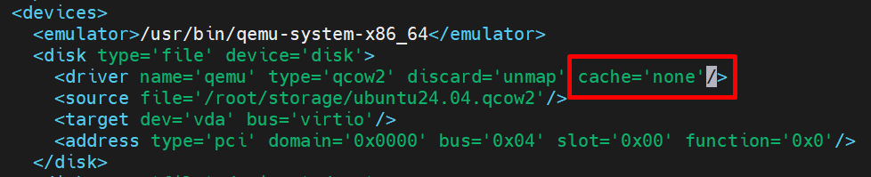
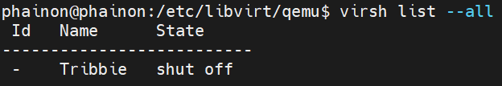
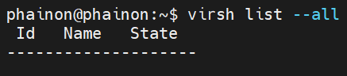
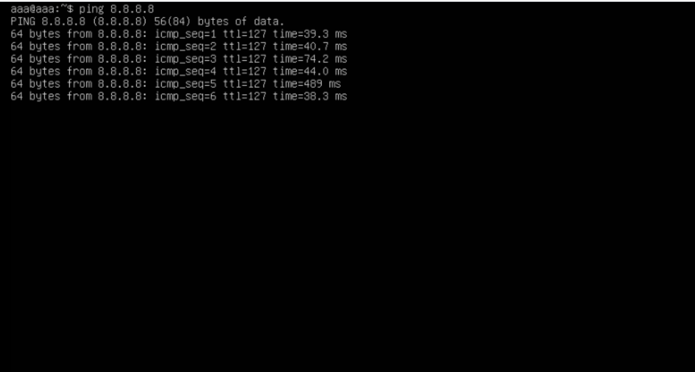

# Live migrate trên KVM
## I. Tổng quan 
### 1. Kỹ thuật Migrate
Kỹ thuật `migrate` trong `KVM (Kernel-based Virtual Machine)` cho phép di chuyển máy ảo (VM) từ một host này sang host khác mà không làm gián đoạn `(live migrate)` hoặc với gián đoạn tối thiểu `(cold migrate)`.

## II. Mô hình lab



| HostName | Distro Linux | IP | CPUs | RAM (GB) | DISK(GB)|
|----------|--------------|----|-------|--------|-----|
|NFS Server| Ubuntu 24.04 | 192.168.70.114| 2 | 6 | 20 |
|KVM01| Ubuntu 24.04 | 192.168.70.122| 2 | 6 | 20 |
|KVM02| Ubuntu 24.04 | 192.168.70.124| 2 | 6 | 20 |

**Cơ chế hoạt động của Live Migrate**:

Về cơ bản cơ chế di chuyển vm khi vm vẫn đang hoạt động. Quá trình trao đổi diễn ra nhanh các phiên bản làm việc kết nối hầu như không cảm nhận được sự gián đoạn nào. Quá trình Live Migrate được diễn ra như sau:
- Bước đầu tiên của quá trình Live Migrate: 1 screenshot ban đầu của VM cần chuyển trên host1 được chuyển sang VM trên host2
- Trong trường hợp người dùng đang truy cập VM tại host KVM01 thì những sự thay đổi và hoạt động trên host KVM01 vẫn diễn ra bình thường, tuy nhiên những thay đổi này sẽ không được ghi nhận
- Những thay đổi của VM trên host KVM01 được đồng bộ liên tục đến host KVM02
- Khi đã đồng bộ xong thì VM trên host KVM01 sẽ offline và các phiên truy cập trên host KVM01 được chuyển sang host KVM02

## III. Lab
### 1. Thông báo tên miền
Để có thể live migrate giữa 2 KVM host thì 2 máy cần biết tên miền của nhau. Ta có thể cấu hình DNS phân dải tên miền cho cả 2 máy, tuy nhiên đây là mô hình lab nhỏ nên ta có thể cấu hình thẳng vào file host trên 2 máy.

Trên KVM01



Trên KVM02



Khi làm xong nhớ kiểm tra lại bằng lệnh `hostname`, nếu thấy khác dùng lệnh `sudo hostname <tenbandat>` để đổi
### 2. Cài đặt NFS
- **Trên NFS Server**
```bash
sudo apt update
sudo apt install -y nfs-kernel-server
```
Tạo một thư mục để làm mục share `/root/storage`
```bash
mkdir /root/storage
```
Chia sẻ thư mực này với các máy KVM host bằng cách ghi các thông tin như sau vào trong file `/etc/exports`
```bash
/root/storage 192.168.70.124/24(rw,sync,no_subtree_check,no_root_squash)
/root/storage 192.168.70.122/24(rw,sync,no_subtree_check,no_root_squash)
```
Cập nhập lại file 
```bash
exportfs -a
```
Khởi động dịch vụ NFS
```bash
sudo systemctl enable nfs-server
sudo systemctl start nfs-server
sudo systemctl status nfs-server
```
**Trên máy KVM host**
Trên 2 máy KVM thực hiện các lệnh sau:
- Cài đặt NFS:
```bash
sudo apt install -y nfs-common
```
- Sử dụng thư mục chưa file disk. Ở đây, ta tạo thư mục mới để lab
```bash
sudo mkdir /mnt/kvm-nfs
```
- Mount thư mục chứa máy ảo với thư mục đã share.
```bash
sudo mount -t nfs -o vers=3,rw,sync,noatime 192.168.70.114:/root/storage /mnt/kvm-nfs
```
Tạo storage pool trong libvirt
```bash
virsh pool-define-as nfs-pool dir - - - - /mnt/kvm-nfs
virsh pool-start nfs-pool
virsh pool-autostart nfs-pool
virsh pool-list --all
```
Mount tự động khi khởi động:
```bash
echo "192.168.70.114:/root/storage/ /var/lib/libvirt/images/ nfs defaults 0 0" | sudo tee -a /etc/fstab
```
- **Lưu ý quan trọng**: Nếu không làm bước này sau khi khởi động lại mount tự động ngắt, khi mount lại disk lưu ở nfs server sẽ dẫn đến lỗi -> phải cài lại máy ảo từ đầu.
### 3. Cài đặt KVM
- Thực hiện cài đặt KVM trên cả 2 máy KVM host:
```bash
qemu-img create -f qcow2 /mnt/kvm-nfs/testvm.qcow2 10G
virt-install \
--name testvm \
--ram 2048 \
--vcpus 2 \
--disk path=/mnt/kvm-nfs/testvm.qcow2 \
--cdrom ....\
--network network=default \
--graphics none
```
- Khi cài đặt VM ta cần lưu file disk của VM vào thư mục đã mount với thư mục được share của NFS server.
- Khi cài máy ảo xong ta cần thêm thông tin sau vào trong file xml của VM bằng cách dùng lệnh
```bash
virsh edit <tên-VM>
```
- Thêm vào `cache='none'` để tránh trường hợp migrate bị mất dữ liệu



- Sau đó define và reboot lại VM
### 4. Kết nối qemu giữa 2 KVM host
- Thực hiện trên cả 2 máy host KVM
```bash
sudo sed -i 's/#listen_tls = 0/listen_tls = 0/g' /etc/libvirt/libvirtd.conf 
sudo sed -i 's/#listen_tcp = 1/listen_tcp = 1/g' /etc/libvirt/libvirtd.conf
sudo sed -i 's/#tcp_port = "16509"/tcp_port = "16509"/g' /etc/libvirt/libvirtd.conf
sudo sed -i 's/#listen_addr = ""/listen_addr = "0.0.0.0"/g' /etc/libvirt/libvirtd.conf
sudo sed -i 's/#auth_tcp = "sasl"/auth_tcp = "none"/g' /etc/libvirt/libvirtd.conf
sudo sed -i 's/#libvirtd_opts="--listen"/libvirtd_opts="--listen"/g' /etc/default/libvirtd
```
Restart lại libvirtd trên cả 2 máy:
```bash
systemctl restart libvirtd
```
### 5. Migrate
Kiểm tra trên VM KVM01



KVM02 không có VM nào:



Trước khi migrate, ta chạy lệnh `ping` trên ubuntu 20.04 của KVM01



Migrate từ `KVM01(192.168.133.134)` sang `KVM02(192.168.133.129)` Thực hiện câu lệnh trên KVM01:
```bash
virsh migrate --live testvm qemu+tcp://192.168.133.129/system
```

### 6. Bật libvirt listen TCP trên host 2
```bash
sudo nano /etc/libvirt/libvirtd.conf
```
```bash
listen_tls = 0
listen_tcp = 1
auth_tcp = "none"
```
```bash
sudo systemctl restart libvirtd
```
Check port đã mở chưa
```bash
ss -ltnp | grep 16509 -> LISTEN 0  ... 0.0.0.0:16509(không có = lỗi)
```
- Check firewall:
```bash
sudo ufw allow 16509/tcp
sudo ufw disable
```