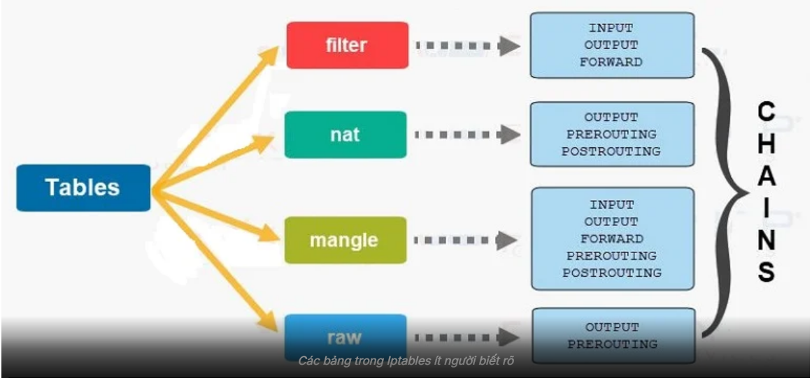
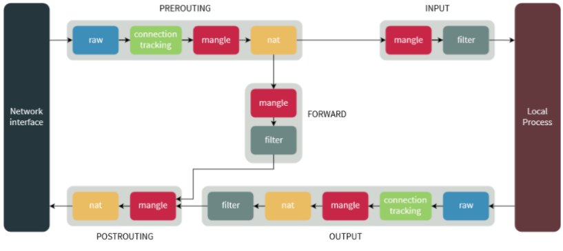
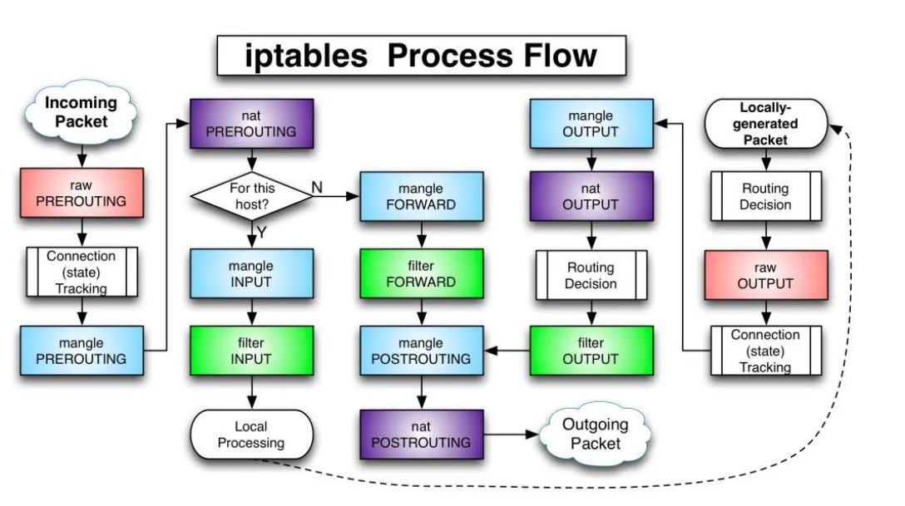
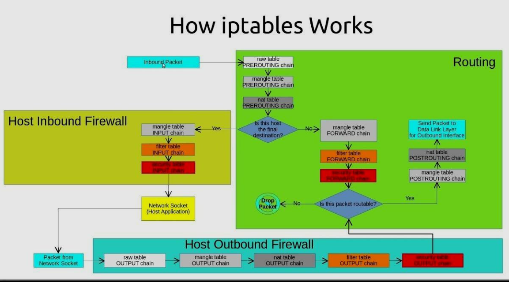

# Tìm hiểu IPtables
## 1. Khái niệm


- iptables là công cụ user-space cấu hình firewall Linux, dùng để thiết lập rule cho Netfilter trong kernel nhằm lọc và kiểm soát lưu lượng mạng.
- **iptables = firewall ở mức kernel (netfilter)**

TẤT CẢ traffic mạng trên máy Linux đều đi qua nó:
- Host
- VM (KVM/libvirt)
- Docker
- Loopback (localhost)

Iptables là một gói phần mềm để tạo tường lửa cho máy linux của bạn nó có các chức năng lọc gói tin, nat gói tin qua đó để giúp làm nhiệm vụ bảo mật thông tin cá nhân tránh mất mát thông tin và áp dụng nhưng chính sách đổi với người sử dụng. iptables quản lý phạm vi toàn bộ network stack của máy bao gồm:

| Thành phần           | Có đi qua iptables không |
| -------------------- | ------------------------ |
| App trên host        | ✔                        |
| SSH, HTTP            | ✔                        |
| VM (KVM/libvirt)     | ✔                        |
| Docker container     | ✔                        |
| Loopback (127.0.0.1) | ✔                        |

"Bộ lọc Giao thông Mạng"
Và 3 thành phần cốt lõi tạo nên nó:
- **Table (Bảng)**: "Sổ tay" quy định chức năng (Lọc gói tin, Chuyển hướng IP).
- **Chain (Chuỗi)**: "Trạm kiểm soát" (Vào - INPUT, Ra - OUTPUT, Đi ngang qua - FORWARD).
- **Target (Hành động)**: "Quyết định" của bảo vệ (ACCEPT - Cho qua, DROP - Chặn âm thầm, REJECT - Từ chối có thông báo).

Các tính năng chính

- stateless packet filtering (IPv4 and IPv6)
- stateful packet filtering (IPv4 and IPv6)
- all kinds of network address and port translation, e.g. NAT/NAPT (IPv4 and IPv6)
- flexible and extensible infrastructure
- multiple layers of API's for 3rd party extensions

**stateful filter**: sẽ giữ 1 danh sách các connections đã được thiết lập, nó được cho là có hiệu quả hơn trong việc phát hiện các gói tin giả mạo và có thể thực hiện một loạt các functions của IPsec như tunnels và encryption.

**stateless filter**: không giữ danh sách ấy, mọi packet đều được process một cách độc lập với nhau. Nó được cho là sẽ xử lí gói tin nhanh hơn.

### 1.2 Mục đích sử dụng chính của iptables
- Xây dựng một hệ thống tường lửa cho hệ thống dựa trên stateless và stateful packet filtering
- Triển khai một cụm cluster stateless và stateful firewall
- Dùng NAT và masquerading để chia sẻ kết nối internet
- Dùng NAT để xây dựng transparent proxies
- Thực hiệm một số tác vụ với packet như thay đổi TOS/DSCP/ECN trong IP header

## 2. Thành phần của IPtables
iptables bao gồm 2 phần là netfilter nằm bên trong nhân Linux và iptables nằm ở vùng ngoài nhân. iptables chịu trách nhiệm giao tiếp với người dùng và sau đó đẩy rules của người dùng vào cho netfilter xử lý. netfilter thực hiện công việc lọc các gói tin ở mức IP. netfilter làm việc trực tiếp ở trong nhân của Linux nhanh và không làm giảm tốc độ của hệ thống.

Về cơ bản, IPtables chỉ là giao diện dòng lệnh để tương tác với packet filtering của netfilter framework. Cơ chế packet filtering của IPtables hoạt động gồm 3 thành phần là Tables, Chains và Targets
### 2.1 Các bảng trong IPtables



Table được `IPtables` sử dụng để định nghĩa các rules dành cho các gói tin.

#### NAT table
Cho phép route các gói tin đến các host khác nhau trong mạng bằng cách thay đổi IP nguồn và IP đích của gói tin. Table này quy định và cho phép các kết nối có thể truy cập tới các dịch vụ không được truy cập trực tiếp. Bao gồm 3 thành phần:

- `PREROUTING chain` – Thay đổi gói tin trước khi định tuyến, điều này có nghĩa là việc dịch gói tin sẽ xảy ra ngay lập tức sau khi gói tin đến hệ thống. Điều này thực hiện thay đổi địa chỉ IP đích thành một địa chỉ nào đó sao cho phù hợp với việc định tuyến trên máy chủ cục bộ - DNAT.
- `POSTROUTING chain` – Thay đổi gói tin sau khi định tuyến, điều này có nghĩa là dịch gói tin khi gói tin ra khỏi hệ thống. Điều này thực hiện thay đổi địa chỉ IP nguồn của gói tin thành một địa chỉ nào đó phù hợp với việc định tuyến trên máy chủ đích - SNAT.
- `OUTPUT chain` – thực hiện NAT cho các gói tin được thực hiện cục bộ trên firewall.

#### FILTER table
Đây là table được sử dụng mặc định bởi `iptables` khi bạn tạo các `chain` mà không khai báo cho `chain` đó thuộc vào table nào. Table hoạt động với việc quy định việc quyết định có cho phép gói tin được chuyển đến địa chỉ đích hay không. Bao gồm 3 thành phần:
- `INPUT chain`: Các gói tin đến firewall. Áp dụng đối với các gói tin đến máy chủ cục bộ.

- `OUTPUT chain`: Các gói tin đi ra khỏi firewall. Áp dụng với các gói tin được tạo ra cục bộ và đi ra khỏi máy chủ.

- `FORWARD chain`: Áp dụng đối với các gói tin được định tuyến đi qua máy chủ.

#### MANGLE table
Table này liên quan đến việc sửa header của gói tin, ví dụ chỉnh sửa giá trị các trường TTL, MTU, Type of Service.

Bao gồm các thành phần sau:
- PREROUTING chain
- OUTPUT chain
- FORWARD chain
- INPUT chain
- POSTROUTING chain

#### RAW Table
Bảng này được sử dụng chủ yếu dành cho việc cấu hình sử dụng chain có sẵn. Bao gồm:
- PREROUTING chain
- OUTPUT chain

#### Security Table
Đây là bảng được sử dụng cho **Mandatory Access Control (MAC)** - kiểm soát truy cập bắt buộc đối với các rule về network.

MAC được triển khai bởi **Linux Security Modules** được biết đến như là SELinux. Gói tin được chuyển đến table này sau khi đi qua **FILTER table** và cho phép một vài **Discretionary Access Control (DAC)** - kiểm soát truy cập tùy ý trong **FILTER table** gây ảnh hưởng trước các MAC rule. Table này cung cấp các chain có sẵn là:
- INPUT chain.
- OUTPUT chain.
- FORWARD chain.

### 2.2 Chain
`chain` là một quy tắc xử lý các gói tin bao gồm nhiều rules có liên quan tới nhau.


Chuỗi quy tắc trong mỗi bảng, định nghĩa điểm xử lý gói tin. Mỗi table sẽ được tạo với một hoặc nhiều chain. chain cho phép lọc gói tin tại các điểm khác nhau. iptable có thể được thiết lập đối với các loại chain như sau:

- `INPUT`: Xử lý các gói tin đến từ mạng bên ngoài vào máy chủ. Các rule thuộc chain này sẽ áp dụng cho các gói tin ngay trước khi gói tin đi vào hệ thống. chain này có trong table MANGLE và FILTER.
- `OUTPUT`: Xử lý các gói tin từ máy chủ ra mạng bên ngoài. Các rule thuộc chain này áp dụng ngay cho các gói tin đi ra từ hệ thống. chain có trong table MANGLE, RAW và FILTER.
- `FORWARD`: Xử lý các gói tin đi qua máy chủ (không phải từ hoặc đến máy chủ). Các rule thuộc chain này áp dụng các gói tin được chuyển tiếp qua hệ thống. chain có trong table MANGLE.
-`PREROUTING`: Xử lý các gói tin ngay khi chúng đến, trước khi chúng được định tuyến. các rule thuộc chain này sẽ được áp dụng ngay sau khi gói tin vừa đi vào đến dải mạng(Network interface). chain này chỉ có thể có ở table NAT, RAW, MANGLE.
- `POSTROUTING`: Xử lý các gói tin ngay trước khi chúng rời khỏi máy chủ. Các rule thuộc chain này áp dụng cho các gói tin tới dải mạng (Network Interface). chain này có trong table MANGLE và NAT



### 2.3 Rule
Mỗi **Chain** chứa nhiều **Rule**, được kiểm tra theo thứ tự từ trên xuống. Khi khớp rule, sẽ thực hiện Target (ACCEPT, DROP, REJECT, MASQUERADE…). **rule** là một luật, hành động cụ thể xử lý gói tin ứng với mỗi trường hợp, tiêu chí mà ta đề ra.

- **ACCEPT**: Chấp nhận gói tin, cho phép gói tin đi vào hệ thống.
- **DROP**: Loại bỏ gói tin, không có gói tin trả lời, giống như là hệ thống không tồn tại.
- **REJECT**: loại bỏ gói tin nhưng có trả lời table gói tin khác, ví dụ trả lời table 1 gói tin "connection reset" đối với gói TCP hoặc bản tin "destination host unreachable" đối với gói UDP và ICMP
- **LOG**: Chấp nhận gói tin nhưng có ghi lại log. Gói tin sẽ đi qua tất cả các rule chứ không dừng lại khi đã đúng với 1 rule đặt ra. Đối với những gói tin không khớp với rule nào cả mặc định sẽ được chấp nhận.

## II. Cách thức hoạt động của iptables
### 1. Vị trí của iptables trong hệ thống
- **iptables** là công cụ người dùng(user-space).
- Nó giao tiếp với **netfilter** trong kernel để kiểm soát gói tin.
- Khi gói tin đi vào/ra hệ thống, **netfilter** sẽ gọi các hooks(điểm chặn), tại đó **iptables rule** sẽ được áp dụng.
### 2. Các điểm chặn (Netfilter hooks)
Khi một gói tin đi qua Linux host, nó có thể đi qua các hook sau: 
```bash
(1) PREROUTING   – xử lý trước khi định tuyến (routing)
(2) INPUT        – gói tin đến chính máy host
(3) FORWARD      – gói tin đi qua máy (host như router)
(4) OUTPUT       – gói tin do máy host sinh ra
(5) POSTROUTING  – xử lý sau khi định tuyến, trước khi ra ngoài
```
Mỗi hooks này được gắn với các chain trong iptables.
### 3. Quy trình xử lý gói tin
Iptables hoạt động bằng cách so sánh network traffic với một danh sách các rules. Rule định nghĩa các tính chất mà packet cần có để match với rule kèm theo những hành động sẽ được thực thi với những matching packets.

Có rất nhiều các options để thiết lập rule sao cho nó match với packets đi qua như protocol, ip, interface... Khi một packet match, target được thực thi. Target có thể là quyết định cuối cùng áp dụng đối với packet ví dụ như ACCEPT hoặc DROP. Nó cũng có thể chuyển packet tới chain khác để xử lí hoặc đơn giản log lại.

Các rules này được gộp lại thành nhóm gọi là chains. Chains là danh sách các rules và nó sẽ được check lần lượt. Khi một packet match với 1 rules, nó sẽ được thực thi với hành động tương ứng và không cần phải check với các rules còn lại.

Mỗi chain có thể có một hoặc nhiều rule nhưng mặc định nó sẽ có 1 policy. Trong trường hợp packets không match với bất cứ rules nào, policy sẽ được thực thi, bạn có thể accept hoặc drop nó.

**Gói tin đến (Inbound Packet)**:





#### 3.1 Gói tin từ mạng đi VÀO máy chủ (Inbound Packet)

Đây là gói tin có đích đến là một ứng dụng đang chạy trên chính máy này (ví dụ: truy cập Web Server, SSH).

1. **Giai đoạn Tiền xử lý(PREROUTING):**
- **Raw table**: Kiểm tra gói tin đầu tiên, có thể đánh dấu để không bị hệ thống theo dõi trạng thái (NOTRACK) nhằm tăng tốc độ.
- **Connection Tracking(conntrack)**: Hệ thống ghi nhận đây là gói tin mới (NEW) hay đã có từ trước (ESTABLISHED).
- **Mangle table**: Thay đổi các thông số kỹ thuật trong header (như TTL, TOS).
- **NAT table (DNAT)**: Chỉnh sửa địa chỉ IP đích nếu máy chủ đóng vai trò chuyển hướng (Port Forwarding).

| Table | Description |
|-------|-------------|
| NAT | dùng để NAT, thường dựa vào địa chỉ nguồn hoặc đích. Nó có 3 chains là:  OUTPUT, POSTROUTING, và PREROUTING |
| FILTER | Dùng để thiết lập policies cho các traffic vào, qua và ra khỏi hệ thống. iptables lấy đây làm table default, nếu bạn không khai báo bất cứ thông tin gì về table trong câu lệnh, iptables sẽ mặc định áp dụng nó cho filter table. Nó bao gồm các chains: FORWARD, INPUT, và OUTPUT |
| MANGLE | Dùng để thay đổi một số thông tin cụ thể của packet. Nó có các chains là : FORWARD, INPUT, OUTPUT, POSTROUTING, và PREROUTING |

2. **Quyết định định tuyến (Routing Decision 1)**
- Kiểm tra IP đích:
  - Nếu là IP của máy -> đi vào INPUT
  - Nếu không -> chuyển sang FORWARD

3. **Giai đoạn kiểm soát đầu vào (INPUT)**
- **Mangle table**: chỉnh sửa thêm nếu cần
- **Filter table**: Kiểm tra cho phép/chặn (port 22,80,443,...)

4. **Đích đến**
- Gói tin đi vào socket -> ứng dụng xử lý

#### 3.2 Gói tin đi NGANG qua máy (Forwarding Packet)
Máy đóng vai trò router/firewall

1. **Giai đoạn Tiền xử lý(PREROUTING)**
- **Raw → Connection Tracking → Mangle → NAT (DNAT)**(Tương tự trên).

2. **Quyết định định tuyến**
IP đích KHông phải máy -> đi vào Forward

3. **Giai đoạn Chuyển tiếp(FORWARD)**
- **Mangle table**: chỉnh sửa header
- **Filter table**: cho phép/chặn gói tin đi qua giữa các mạng

4. **POSTROUTING**
- **Mangle table**: chỉnh sửa lần cuối
- **NAT table(SNAT/MASQUERADE)**: đổi IP nguồn (LAN → Internet)

#### 3.3 Gói tin do máy chủ tự tạo  (Outbound Packet)
Ví dụ: Bạn đứng ở máy chủ và thực hiện lệnh `ping` hoặc gửi dữ liệu đi.
1. **Khởi tạo**: Gói tin từ Network Socket (Ứng dụng) sinh ra.

2. **Quyết định Định tuyến**: Xác định gói tin sẽ đi ra bằng card mạng nào (eth0, eth1...).

3. **Giai đoạn Kiểm soát đầu ra (OUTPUT)**: (Vùng màu xanh dương).
  - Raw table: Xử lý thô.
  - Connection Tracking: Đánh dấu trạng thái gói tin đi ra.
  - Mangle table: Chỉnh sửa header.
  - NAT table (DNAT): Thay đổi đích đến của gói tin nội bộ nếu cần.
  - Filter table: Kiểm tra xem máy chủ có được phép gửi dữ liệu này ra ngoài không.

4. **Giai đoạn Hậu xử lý (POSTROUTING):**
- Đi qua các bảng Mangle và NAT (SNAT) giống như kịch bản 2 trước khi chính thức rời khỏi máy.
## III. Lệnh cơ bản

### 1. Cài đặt iptables
```bash
iptables --version
```
```bash
sudo apt install -y iptables
```

### 1. Xem rule hiện tại
```bash
iptables -L -n -v
```
- `-L`: Liệt kê (list) các chuỗi quy tắc (chains) trong các bảng (tables), mặc định là bảng `filter` nếu không chỉ định.
- `-n`: Hiển thị địa chỉ IP và cổng dưới dạng số (numeric), không phân giải tên miền (DNS) hoặc tên dịch vụ, giúp nhanh hơn và rõ ràng hơn.
- `-v`: Hiển thị thông tin chi tiết (verbose), bao gồm số gói tin và byte đã được xử lý bởi mỗi quy tắc, cung cấp dữ liệu thống kê.


**Các chuỗi mặc định (Default Chains)**

Đây là các "cửa ngõ" chính của hệ thống Linux:
- **Chain INPUT**: Kiểm soát các gói tin đi vào chính máy chủ của bạn.
  - `policy ACCEPT`: Mặc định cho phép mọi thứ nếu không khớp quy tắc nào.
  - Có một quy tắc chuyển hướng mọi lưu lượng sang chuỗi `LIBVIRT_INP`.

- **Chain FORWARD**: Kiểm soát các gói tin **đi ngang qua** máy chủ (ví dụ: từ máy ảo ra internet hoặc ngược lại).
  - Đây là nơi quan trọng nhất cho ảo hóa. Nó chuyển tiếp lưu lượng sang các chuỗi con `LIBVIRT_FWX`, `FWI`, và `FWO`.

- **Chain OUTPUT**: Kiểm soát các gói tin do chính máy chủ gửi ra ngoài.
  - Chuyển hướng sang `LIBVIRT_OUT`.

**Các chuỗi LIBVIRT (Dành cho máy ảo)**

Libvirt tạo ra các chuỗi này để quản lý giao diện mạng ảo (thường là virbr0 với dải IP mặc định 192.168.122.x).

- **Chain LIBVIRT_FWI (Forward Inbound)**
  - Dòng 1: Cho phép các gói tin thuộc một kết nối đã thiết lập trước đó (RELATED,ESTABLISHED) đi vào dải IP 192.168.122.0/24.
  - Dòng 2: Nếu không phải dữ liệu cũ, nó sẽ REJECT (từ chối) và gửi thông báo "port-unreachable".

- **Chain LIBVIRT_FWO (Forward Outbound)**
  - Dòng 1: Cho phép mọi thứ xuất phát từ dải IP 192.168.122.0/24 đi ra ngoài thông qua card mạng ảo virbr0.
  - Dòng 2: Từ chối mọi thứ khác.

- **Chain LIBVIRT_INP (Input to Host from VM)**: Cho phép máy ảo giao tiếp với máy chủ thật để sử dụng các dịch vụ mạng cơ bản:
  - UDP/TCP port 53 (domain): Cho phép máy ảo truy vấn DNS từ máy chủ.
  - UDP port 67 (bootps): Cho phép máy ảo nhận IP thông qua DHCP từ máy chủ.

- **Chain LIBVIRT_OUT (Output from Host to VM)** Cho phép máy chủ phản hồi lại máy ảo:
  - Phản hồi DNS và cấp phát IP (DHCP - port 68) cho các máy ảo.
  
### 2. Thêm rule cho chain INPUT (cho phép ping)
```bash
iptables -A INPUT -p icmp -j ACCEPT
```
-`A INPUT`: Thêm (append) quy tắc vào chuỗi INPUT, xử lý gói tin đến máy.
-`p icmp`: Chỉ định giao thức là ICMP (Internet Control Message Protocol), dùng cho ping và các thông báo lỗi mạng.
-`j ACCEPT`: Hành động (jump) là chấp nhận (accept) gói tin, cho phép nó đi qua mà không bị chặn.

**Lưu ý quan trọng**:
- Phải cài thêm:
```bash
sudo apt install iptables-persistent
```
```bash
sudo netfilter-persistent save 
```
hoặc
```bash
sudo iptables-save > /etc/iptables.rules
```
nếu không làm bước này khi bạn reset lại iptables nó sẽ không lưu rule thêm vào
### 3. Chặn ip cụ thể
```bash
iptables -A INPUT -s 192.168.100.5 -j DROP
```

### 4. NAT(VM ra Internet thông qua host)
```bash
iptables -t nat -A POSTROUTING -s 192.168.100.0/24 -o eth0 -j MASQUERADE
```
- `-t nat`: Xác định dùng bảng NAT, dùng để xử lý các quy tắc chuyển đổi địa chỉ mạng
- `-A POSTROUTING`: Thêm (append) quy tắc vào chuỗ POSTROUTING, áp dụng sau khi gói tin được định tuyến, trước khi gửi ra giao diện.
- `-s 192.168.100.0/24`: Chỉ định nguồn gói tin từ mạng con 192.168.100.0/24 (mạng nội bộ).
- `-o eth0`: Gói tin sẽ xuất hiện ra giao diện eth0(giao diện mạng vật lý kết nối Internet).
- `-j MASQUERAE`: Hành động là masquerade, tự độngt hay đổi (NAT) địa chỉ nguồn IP từ 192.168.100.0/24 thành địa chỉ IP của eth0, thích hợp cho mạng động DHCP

### 5. Xóa tất cả các rules
```bash
sudo iptables -F
sudo iptables -t nat -F
```
### 6. Một vài tùy chọn khác
|Option|Mô tả|Ví dụ|
|------|-----|-----|
|`-A`, `--append`|Chèn rule vào cuối chain hay nói cách khác là đây sẽ là rule được check cuối cùng trong chain này tới khi bạn thêm chain khác vào|`iptables -A INPUT ...`|
|`-D`, `--delete`|Xóa rule trong chain, được thực hiện bằng 2 cách: điền toàn bộ rule (như ở ví dụ) hoặc chỉ định số thứ tự của rule bắt đầu từ 1|`iptables -D INPUT --dport 80 -j DROP`, `iptables -D INPUT 1`|
|`-R`, `--replace`|Thay thế entry cũ dựa theo số thứ tự dòng|`iptables -R INPUT 1 -s 192.168.0.1 -j DROP`|
|`-I`, `--insert`|Chèn rule vào chain theo số thứ tự dòng|`iptables -I INPUT 1 --dport 80 -j ACCEPT`|
|`-L`, `--list`|Hiển thị toàn bộ rules ở chain hoặc table chỉ định|`iptables -L INPUT`|
|`-F`, `--flush`|Xóa toàn bộ rule ở chain chỉ định|`iptables -F INPUT`|
|`-Z`, `--zero`|Xóa toàn bộ counters ở chain chỉ định hoặc tất cả chain|`iptables -Z INPUT`|
|`-N`, `--new-chain`|Tạo mới một chain|`iptables -N allowed`|
|`-X`, `--delete-chain`|Xóa chain chỉ định khỏi table|`iptables -X allowed`|
|`-P`, `--policy`|Chỉ định policy mặc định nếu packet không match với rule nào trong chain. Hai tùy chọn được cho phép đó là ACCEPT và DROP|`iptables -P INPUT DROP`|
|`-E`, `--rename-chain`|Thay đổi tên table, lưu ý nó không làm thay đổi cách table hoạt động|`iptables -E allowed disallowed`|

----

|Option|Mô tả|Tùy chọn đi kèm|
|------|-----|---------------|
|`-v`, `--verbose`|Cho ra output chi tiết thường dùng với `--list`|`--list`, `--append`, `--insert`, `--delete`, `--replace`|
|`-x`, `--exact`|Cho ra các con số chi tiết, được dùng với --list, sẽ cho ra số lượng packets và bytes chi tiết được count (có bao nhiêu packet và byte match với rule theo dạng K (x1000), M (x1,000,000) and G (x1,000,000,000) multipliers)|`--list`|
|`-n`, `--numeric`|iptables sẽ hiển thị kèm theo các giá trị số, IP và port sẽ được hiển thị dưới dạng numerical values|`--list`|
|`--line-numbers`|Cho ra output với số thứ tự dòng|`--list`|
|`-c`, `--set-counters`|Thường dùng khi tạo mới rule. Ta có thể dùng nó để khai báo số packet và byte counter ban đầu|`--insert`, `--append`, `--replace`|
|`--modprobe`|Khai báo modules nào sẽ được sử dụng|All|

#### Match

##### Generic matches

|Match|Mô tả|Ví dụ|
|-----|-----|-----|
|`-p`, `--protocol`|Check protocol|`iptables -A INPUT -p tcp`|
|`-s`, `--src`, `--source`|Check địa chỉ ip nguồn, ta có thể khai báo dưới dạng địa chỉ thuần, CIDR hoặc network range cũng như netmask. Mặc định là match all ip|`iptables -A INPUT -s 192.168.1.1`|
|`-d`, `--dst`, `--destination`|Check địa chỉ đích đến của packet, hoạt động như --source||
|`-i`, `--in-interface`	|Dùng cho interface mà packet được chuyển tới, chỉ được dùng với chain `INPUT`, `FORWARD` và `PREROUTING`, mặc định nó sẽ accpet tất cả. Ta cũng có thể dùng `!` để khai báo except. Ví dụ `-i! eth0` là accept tất cả trừ eth0|`iptables -A INPUT -i eth0`|
|`-o`, `--out-interface`|Dùng cho interface mà packet rời đi. chỉ dùng cho chain `OUTPUT`, `FORWARD` and `POSTROUTING`. hoạt động giống với `-i`|`iptables -A FORWARD -o eth0`|
|`-f`, `--fragment`|Dùng để match với phần thứ 2 và 3 của gói tin phân mảnh|`iptables -A INPUT -f`|

##### Implicit matches
**TCP**
|Match|Mô tả|Ví dụ|
|-----|-----|-----|
|`--sport`, `--source-port`|Match với source port của gói tin. Ta có thể dùng port number hoặc service name. Nếu bạn dùng service name thì nó phải giống với trong file `/etc/services` vì iptables dùng file này để tìm kiếm. Ta cũng có thể dùng nó để match với port range ví dụ `--source-port 22:80` và check except với `!`|`iptables -A INPUT -p tcp --sport 22`|
|`--dport`, `--destination-port`|Match với port đích, cách hoạt động giống với `--source-port`|`iptables -A INPUT -p tcp --dport 22`|
|`--tcp-flags`|Dùng để check các TCP flags trong packet|`iptables -p tcp --tcp-flags SYN,FIN,ACK SYN`|

**UDP**
- `--sport`, `--source-port`
- `--dport`, `--destination-port`

Hoạt động tương tự như TCP. Nhưng không có `--tcp-flags`

#### Target và Jump

##### Jumps
Ví dụ ta tạo mới 1 chain trong cùng table, có tên `tcp_packets`:
```
iptables -N tcp_packets
```

Sau đó, ta có thể jump vào target đó:
```
iptables -A INPUT -p tcp -j tcp_packets
```

Ta có thể bắt đầu traverse trong chain mới. Khi tới cuối chain, nó sẽ trả về INPUT chain và packet sẽ traverse bắt đầu traverse từ rules phía dưới rule đã jump nó. Trong trường hợp packet được accept ở sub-chain, nó cũng sẽ được accept ở superset chain và không cần quay về nữa. Lưu ý rằng nó vẫn sẽ traverse ở các chain trong các bảng khác như bình thường.

##### Target
**ACCEPT target**

Target này không có thêm bất cứ options nào khác. Nếu packet match, nó sẽ được pass qua table nhưng nó sẽ vẫn phải traverse qua cùng chain ở tables khác.

**DNAT target**

Được dùng để rewrite lại địa chỉ đích. Nếu packet match và đây là target của rule, packet và tất cả các subsequent packets khác trên cùng một stream sẽ được translate và route vào đúng device, network. DNAT chỉ được dùng với chain PREROUTING and OUTPUT trong bảng nat.

DNAT target options
|Option|Mô tả|Ví dụ|
|-|-|-|
|`--to-destination`|Phương thức để set địa chỉ đích vào ip header và đâu sẽ là nơi gói tin được gửi đến|`iptables -t nat -A PREROUTING -p tcp -d 15.45.23.67 --dport 80 -j DNAT --to-destination 192.168.1.1-192.168.1.10`|

**DROP target**

Nó sẽ drop packet và không tiến hành thêm bất cứ tiến trình xử lí nào nữa.

**REJECT target**

Cách làm việc gần giống với DROP target nhưng nó sẽ gửi lại một error message. Hiện nó chỉ hoạt động với chain `INPUT`, `FORWARD` and `OUTPUT`.

**RETURN target**

Packet sẽ không traverse ở chain hiện tại. Nếu nó là subchain thì nó sẽ quay lại superior chain. Nếu nó là main chain thì policy sẽ được áp dụng.

**REDIRECT target**

Chỉ dùng với chain PREROUTING and OUTPUT . Nó sẽ rewrite địa chỉ đích của gói tin
## IV. State Machine
Về bản chất, có thể coi iptables là một stateful packets filtering firewall. Nó có cơ chế giám sát các kết nối đi qua.

Với iptables, có 4 trạng thái của các kết nối đó là: `NEW`, `ESTABLISHED`, `RELATED` và `INVALID`

Iptables sử dụng một framework trong kernel có tên gọi là conntrack, nó có thể được load như một module hoặc cũng có thể là 1 phần của kernel. Tất cả các giám sát kết nối đều được thực hiện ở chain `PREROUTING`, trừ những packet từ local đi ra thì được kiểm soát bởi chain `OUTPUT`.

**Ví dụ:** ta có 1 gói tin gửi đi, nó sẽ có trạng thái `NEW` ở chain `OUTPUT`, khi nó được phản hồi về, trạng thái của nó ở chain `PREROUTING` sẽ là `ESTABLISHED`.

File `/proc/net/nf_conntrack` chứa toàn bộ những entries trong conntrack database.

### User-land states

|State|Mô tả|
|-----|-----|
|`NEW`|Trạng thái này cho ta biết đó là packet đầu tiên mà conntrack module thấy (những packet có cờ SYN)|
|`ESTABLISHED`|Điều kiện để có trạng thái này đơn giản là 1 host gửi packet đi và nhận lại reply từ host khác|
|`RELATED`|Kết nối ở trạng thái này khi nó liên quan tới kết nối khác ở trạng thái `ESTABLISHED`. Đầu tiên ta có 1 kết nối đã `ESTABLISHED`, sau đó kết nối này tiếp tục tạo ra một kết nối khác ra bên ngoài kết nối chính. Kết nối mới này được coi là `RELATED`|
|`INVALID`|Có nghĩa rằng packet không thể được xác nhận hoặc nó không có bất cứ trạng thái nào, thông thường những paket như này sẽ bị drop|
|`UNTRACKED`|Đây là những packet được đánh dấu trong bảng raw với target là `NOTRACK`. Sau đó nó sẽ được đánh dấu state là `UNTRACKED`|