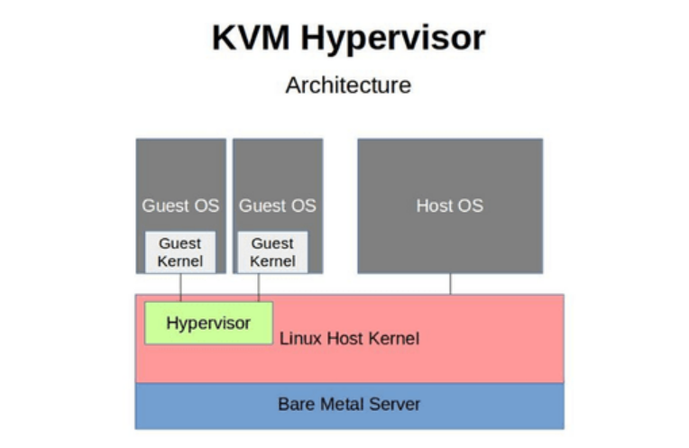
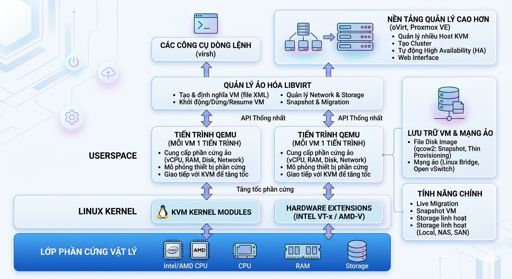

# KVM (Kernel-based Virtual Machine)

### 1. Khái niệm
KVM( Kernel-based Virtual Machine) là một công nghệ ảo hóa mã nguồn mở cho hệ điều hành Linux, **một module tích hợp trực tiếp vào kernel Linux(biến Linux thành Hypervisor Type - 1)**, cho phép Linux biến thành một máy chủ ảo hóa để chạy nhiều máy ảo (VM). Nó cung cấp khả năng ảo hóa hỗ trợ phần cứng( Hardware-assisted Virtualization).

Mặc dù chạy "trong" Linux, nhưng vì KVM có quyền truy cập trực tiếp vào các tính năng ảo hóa của phần cứng (Intel VT-x hoặc AMD-V) và điều khiển phần cứng mà không cần thông qua một hệ điều hành trung gian nào khác, nên nó thường được xếp vào nhóm Type 1.

**Đặc điểm:**
  - **Hỗ trợ đa kiến trúc phần cứng**: KVM không chỉ chạy trên x86 mà còn nhiều kiến trúc CPU khác như AMD64, Intel 64-bit (x86_64), ARM64 (AArch64) và IBM Z systems.
  - **Mô-đun nhân**: KVM là mô-đun của Linux kernel, biến Linux kernel thành một hypervisor. KVM kết hợp với QEMU để cung cấp phần cứng ảo (CPU, network, disk, v.v.) cho máy ảo.
  - **Driver VirtIO**: VirtIO là bộ para-virtualized drivers hiệu suất cao cho I/O của VM (network, disk, memory, ballooning…), giúp giảm overhead so với việc giả lập thiết bị hoàn toàn.
  - **Bảo mật**: KVM sử dụng kết hợp Security-Enhanced Linux và sVirt để bảo mật và cô lập các VM. SELinux sử dụng cơ chế Mandatory Access Control (MAC), nghĩa là quyền truy cập không chỉ dựa vào user mà còn dựa vào policy bảo mật. Mỗi VM chạy như một process của Linux, SELinux tạo security boundary quanh process đó nên VM1 không thể truy cập memory, disk hoặc resource của VM2. sVirt mở rộng SELinux bằng cách tự động gán security label cho VM, giúp tránh lỗi gán nhãn thủ công.
  - **Storage flexibility**: KVM có thể sử dụng hầu hết các hệ thống lưu trữ mà Linux hỗ trợ. Vì KVM chạy trong kernel nên nó kế thừa toàn bộ storage stack của Linux. Ví dụ: Local disk (/dev/sda, LVM), Network storage (NFS, iSCSI, Ceph), hoặc shared storage để nhiều host cùng truy cập VM image.
  - **Live migration**: KVM hỗ trợ live migration, cho phép di chuyển VM đang chạy từ host A sang host B gần như không gián đoạn dịch vụ (VM vẫn chạy, network connection vẫn giữ).
  - **Lưu và tiếp tục trạng thái máy ảo**: KVM có thể save và restore trạng thái VM, bao gồm CPU state, memory state và device state, cho phép pause VM rồi resume sau (tương tự cơ chế hibernate).
  - **Hiệu năng gần native:** KVM tận dụng hardware virtualization extensions (Intel VT-x / AMD-V) nên VM có hiệu năng gần với máy vật lý, đặc biệt khi kết hợp với VirtIO drivers.
### 2. Chức năng KVM
- **Tạo và quản lý máy ảo**: Chạy nhiều máy ảo (Linux, Windows,v.v) trên một máy chủ vật lý, chia và tối ưu tài nguyên phần cứng.
- **Tối ưu hiệu suất**: Sử dụng ảo hóa hỗ trợ phần cứng(Intel VT-x, AMD-V) và VirtlO để đạt hiệu suất gần với máy vật lý.
- **Hỗ trợ Cloud**: Cung cấp nền tảng cho các dịch vụ đám mây( VD: OpenStack, Proxmox) để triển khai máy ảo linh hoạt
- **Kiểm thử và phát triển**: Tạo môi trường ảo để thử nghiệm phần mềm, hệ điều hành, hoặc cấu hình mà không ảnh hưởng hệ thống chính. Thậm chí là launch một hệ điều hành đã lỗi thời hay không còn hỗ trợ, chúng ta vx có thể giữ nó tồn tại trên hệ thống phần cứng hiện đại.
- **Quản lý tập trung**: Dùng công cụ như libvirt, virt-manager để cấu hình, giám sát, và sao lưu máy ảo dễ dàng.
- **Tiết kiệm chi phí**: Giảm số lượng máy chủ vật lý, tiết kiệm điện, không gian và chi phí bảo trì.
- **Bảo mật**: Các máy ảo đều cô lập, giảm rủi ro lây lan mã độc, tận dụng tính năng bảo mật của Linux.

### 3. Các loại ảo hóa KVM

**KVM** thuộc Hypervisor loại 1 (Type 1: **hypervisor bare-metal**).

**So sánh KVM với các loại hypervisor còn lại:**

| Tiêu chí | KVM | VMware ESXi | Microsoft Hyper-V | Xen | VirtualBox/VMware WS |
|----------|-----|-------------|-------------------|-----|-----------|
| Loại hypervisor | Type 1 (nhúng trong kernel Linux) | Type 1 (bare-metal) | Type 1 (nhưng chạy trên Windows) | Type 1 (bare-metal hoặc host-based) | Type 2 (trên OS) |
| Môi trường chạy | Linux | Bare-metal | Windows | Bare-metal hoặc Linux | Windows, macOS, Linux |
| Hiệu năng ảo hóa | Rất cao (gần như native) | Rất cao (enterprise-level) | Cao (tốt cho Windows workload) | Cao (tốt cho cloud) | Trung bình đến thấp |
| Cấp độ tích hợp kernel | Cao (module của Linux kernel) | Không tích hợp OS | Gắn với Windows OS | Chạy riêng biệt hoặc qua Dom0 | Phụ thuộc vào OS host |
| Hỗ trợ tính năng nâng cao | Live Migration, Snapshots, etc. | Rất đầy đủ, mạnh nhất | Có nhưng chủ yếu với Windows | Đầy đủ nhưng phức tạp | Có nhưng giới hạn |
| Dễ sử dụng | Trung bình (CLI + libvirt, virt-manager) | Rất thân thiện (GUI quản lý vSphere) | Thân thiện nếu quen Windows | Khá khó (CLI, cấu hình phức tạp) | Rất dễ dùng cho người mới |
| Tính mở và chi phí | Miễn phí, mã nguồn mở | Mất phí bản quyền | Có bản miễn phí, bản đầy đủ trả phí | Miễn phí, mã nguồn mở | Miễn phí (hoặc giới hạn bản Pro) |
| Ứng dụng phổ biến | Server Linux, Cloud (OpenStack, Proxmox) | Doanh nghiệp lớn, Data center | Môi trường Windows doanh nghiệp | Cloud (AWS EC2 trước đây dùng Xen) | Thử nghiệm, học tập |

### 4. Các thành phần trong KVM
- **Công cụ quản lý**: Các công cụ như `virsh`(Cli) và `virt-manager`(GUI) cung cấp giao diện thân thiện với người dùng để quả lý các KVM instances.
- **VirtIO Drivers**: Một driver đặc biệt để cải thiện hiệu xuất I/O (Networking và ổ đĩa) giữa khách hàng với máy chủ. Giảm chi phí mô phỏng, tăng tốc độ truy cập tài nguyên. virsh là công cụ dòng lệnh (CLI) của libvirt, cho phép người dùng thực hiện các thao tác như tạo, start, stop, snapshot máy ảo thông qua libvirt.
- **Libvirt**: libvirt là một lớp API abstraction, đóng vai trò trung gian giữa người dùng và hypervisor (KVM/QEMU). Nó cung cấp interface thống nhất để quản lý VM, network, storage mà không cần thao tác trực tiếp với QEMU.
- **QEMU(Quick Emulator)**: QEMU là trình emulator và cũng là runtime để chạy máy ảo. Khi kết hợp với KVM, QEMU sử dụng KVM để tận dụng hardware virtualization (VT-x/AMD-V), giúp VM chạy gần với hiệu năng thật thay vì chỉ giả lập
- **Processor Specific Modules(`kvm-intel.ko` or `kvm-amd.ko`)**: Cung cấp khả năng ảo hóa hỗ trợ phần cứng(Hardware-assisted virtualization) trên Intel VT-x hay AMD-V processors.
- **KVM Kernel Module(`kvm.ko`)**: Module core chuyển nhân Linux thành hypervisor, cung cấp ảo hóa CPU và ảo hóa memory.

**Tóm tắt**
- KVM cung cấp khả năng ảo hóa ở mức kernel
- QEMU chịu trách nhiệm chạy máy ảo
- libvirt quản lý và điều phối
- virsh là công cụ để người dùng tương tác

QEMU command rất phức tạp, libvirt giúp chuẩn hóa và quản lý tập trung VM, network, storage thông qua API và tool như virsh.

#### Một vài thành phần Optional hay hỗ trợ khác
- **Volumes/Pool lưu trữ**: Hỗ trợ đa dạng loại lưu trữ như raw files, qcow2, và LVM.
- **Networking**:  Linux bridges, Open vSwitch (OVS), and NAT for VM connectivity.
- **Virtualization Platforms**: Các công cụ quản lý cấp cao như Proxmox hay oVirt
- **Live Migration = vMotion**: KVM+QEMU+libvirt hỗ trợ live migration sử dụng `virsh migrate` có thể hoặc không cần share lưu trữ.
### 5. Cơ chế hoạt động của KVM

**KVM được tích hợp trong Linux Kernel**
- KVM được tích hợp trực tiếp vào Linux kernel dưới dạng các module của kernel.
- Khi hệ điều hành Linux khởi động, các module của KVM cũng được nạp(load) vào kernel. Nhờ vậy, Linux có thể hoạt động như một hypervisor - tức là một nền tảng cho phép chạy nhiều máy ảo(Virtual Machines -VM) trên cùng một máy vật lý.
- Các module KVM chịu trách nhiệm:
  - Tạo và quản lý virtual CPU (vCPU) cho máy ảo
  - Quản lý memory virtualization
  - Tận dụng các extension ảo hóa phần cứng như Intel VT-x hoặc AMD-V
  - Thực hiện các cơ chế VM entry/ VM exit để chuyển giữa host và guest
- Nhờ được tích hợp trong kernel, KVM có thể tận dụng trực tiếp các chức năng của Linux như process scheduling, memory management và device drivers, giúp tăng hiệu năng và độ ổn định.

**QEMU chạy ở Userspace để cung cấp phần cứng ảo**
- Để máy ảo có thể hoạt động đầy đủ, KVM kết hợp với QEMU
- QEMU là một chương trình chạy trong userspace của hệ điều hành Linux. Mỗi máy ảo thường được đại diện bởi một tiến trình QEMU riêng biệt.(QEMU Stack)
- QEMU đảm nhiệm các nhiệm vụ như:
  - Cung cấp phần cứng ảo cho VM (virtual CPU, RAM, disk, network card, v.v.)
  - Mô phỏng các thiết bị phần cứng cần thiết để hệ điều hành guest có thể khởi động
  - Giao tiếp với KVM để tăng tốc quá trình thực thi máy ảo
- Khi QEMU chạy cùng với KVM, phần xử lý CPU của VM sẽ được tăng tốc bằng phần cứng, thay vì bị giả lập hoàn toàn bằng phần mềm. Điều này giúp hiệu năng của VM gần với máy thật.

**Libvirt dùng để quản lý máy ảo**
- Để quản lý các máy ảo một cách thuận tiện, KVM thường sử dụng libvirt.
- Libvirt là một thư viện và API cung cấp giao diện quản lý ảo hóa thống nhất. Thay vì thao tác trực tiếp với QEMU hoặc các module của KVM, người quản trị có thể sử dụng libvirt để quản lý hệ thống ảo hóa.
- Libvirt cho phép thực hiện nhiều thao tác như:
  - Tạo và định nghĩa máy ảo bằng file cấu hình XML
  - Khởi động hoặc dừng máy ảo
  - Tạm dừng, resume hoặc xóa VM
  - Quản lý mạng ảo và storage của VM
  - Thực hiện snapshot và migration
- Ngoài ra, libvirt còn cung cấp công cụ dòng lệnh như: `virsh` để quản trị hệ thống VM từ terminal.

**Các nền tảng quản lý cao hơn như oVirt hoặc Proxmox**
- Trong các hệ thống ảo hóa quy mô lớn, người ta thường sử dụng thêm các nền tảng quản lý cấp cao chạy phía trên KVM.

Ví dụ:
- oVirt
- Proxmox VE

Các nền tảng này cung cấp các tính năng quản lý nâng cao như:
- Quản lý nhiều host KVM từ một giao diện trung tâm
- Tạo cluster gồm nhiều máy chủ
- Tự động High Availability (HA) khi một host bị lỗi
- Quản trị hệ thống thông qua web interface
- Theo dõi tài nguyên và trạng thái của các VM

Nhờ các nền tảng này, KVM có thể được sử dụng để xây dựng hạ tầng ảo hóa lớn trong datacenter hoặc cloud.

**Lưu trữ VM và hệ thống mạng ảo**
- Các máy ảo trong KVM thường được lưu trữ dưới dạng file disk image. Một định dạng phổ biến là:`qcow2`
- Định dạng này hỗ trợ nhiều tính năng như:
  - snapshot (chụp trạng thái VM)
  - thin provisioning (tiết kiệm dung lượng)
  - copy-on-write
- Ngoài ra, KVM cũng hỗ trợ nhiều loại network virtualization. Các VM có thể kết nối mạng thông qua:
  - Linux bridge – cầu nối mạng ảo trong Linux
  - Open vSwitch – switch ảo nâng cao dùng trong cloud
- Nhờ đó, hệ thống KVM hỗ trợ các tính năng quan trọng như:
  - Live migration (di chuyển VM giữa các host mà không tắt máy)
  - Snapshot VM
  - Storage linh hoạt (local disk, NAS, SAN, distributed storage)

### 6. Mối quan hệ giữa KVM và OS(Operating System)
**KVM là một phần của Linux Kernel**

- KVM không phải là một phần mềm riêng biệt chạy trên hệ điều hành như VirtualBox.
- Nó là một mô-đun được tích hợp vào nhân (kernel) của Linux, bắt đầu từ phiên bản 2.6.20.
- Khi được bật, Linux kernel có thể hoạt động như một hypervisor Type 1 (giống như VMware ESXi hay Hyper-V).

> Linux + KVM = Hypervisor Type 1

**Linux OS là môi trường host (Host OS)**

- Người dùng cài đặt Linux OS trên máy chủ vật lý. Sau đó bật/tải mô-đun KVM.
- KVM tận dụng các tính năng của Linux như:
  - Quản lý bộ nhớ.
  - Lập lịch CPU.
  - Hệ thống tập tin.
  - Driver thiết bị.
- Vì vậy, Linux OS vừa là một hệ điều hành đầy đủ, vừa là nền tảng để KVM tạo và quản lý máy ảo.

**Từ Linux host, có thể tạo các máy ảo (Guest OS)**

- Sau khi KVM được kích hoạt, có thể tạo các VM (máy ảo) sử dụng các công cụ như `libvirt`, `virt-manager`, `virsh`, hoặc dùng QEMU trực tiếp.
- Mỗi máy ảo có thể cài đặt hệ điều hành riêng biệt: Linux, Windows, BSD, v.v.

| Thành phần | Vai trò |
|------------|--------|
| **Linux OS (Host)** | Hệ điều hành chủ, nơi mô-đun KVM hoạt động, cung cấp tài nguyên hệ thống |
| **KVM** | Một mô-đun trong kernel Linux, biến hệ điều hành Linux thành hypervisor |
| **Guest OS** | Các máy ảo chạy trên KVM, có thể là bất kỳ hệ điều hành nào |