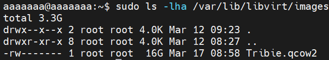
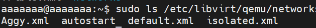
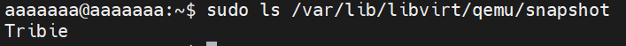

# Tổ chức file trong KVM

|Đặc điểm| `/etc/libvirt/qemu/`| `/var/lib/libvirt/qemu/`|
|--------|---------------------|-------------------------|
| Loại dữ liệu | Cấu hình (Configuration) | Trạng thái (Runtime State) |
| Định dạng| Tệp XML| "Tệp Log, Socket, RAM dump, NVRAM"| 
| Mục đích | Định nghĩa máy ảo là gì?| Máy ảo đang làm gì và chạy ra sao?| 
| Khi nào xóa?| Chỉ khi bạn undefine (xóa) máy ảo.| Thường chứa dữ liệu tạm thời khi máy đang chạy.|

## 1. Thư mục lưu các disk của VM
```bash
/var/lib/libvirt/images
```


## 2. Thư mục chứa các file `.xml` thông số kỹ thuật của VM
```bash
/etc/libvirt/qemu
```

## 3. Thư mục chứa các file liên quan đến `network`
```bash
/etc/libvirt/qemu/networks
```

## 4. Thư mục chứa các storage
```bash
/etc/libvirt/storage
```


- Thư mục `/etc/libvirt/storage/` là Storage pool KHÔNG lưu dữ liệu, nó chỉ là Nơi chỉ định chỗ để lưu dữ liệu VM
- Bên trong thường có các file XML, mỗi file đại diện cho một storage pool:
```bash
/etc/libvirt/storage/
├── default.xml
├── images.xml
```
Mỗi file sẽ mô tả:
- Tên storage pool (vd: default)
- Kiểu storage:
  - `dir` → thư mục (phổ biến nhất)
  - `logical` → LVM
  - `netfs` → NFS
  - `iscsi` → iSCSI
- Đường dẫn thực tế trên host
- Trạng thái autostart
```bash
<pool type='dir'>
  <name>default</name>
  <target>
    <path>/var/lib/libvirt/images</path>
  </target>
</pool>
```
Pool tên `default`

Lưu VM disk ở `/var/lib/libvirt/images`
- `/etc/libvirt/storage/` = config storage
- `/var/lib/libvirt/images/` = data thật (disk VM .qcow2)


| Thứ                                | Vai trò                           |
| ---------------------------------- | --------------------------------- |
| `/var/lib/libvirt/images/`         |  Kho chứa thật (disk VM)        |
| `/etc/libvirt/storage/default.xml` |  Bản đồ chỉ đường tới kho      |
| storage pool                       |  Cái tên logic đại diện cho kho |

Nếu:
- thư mục `/var/lib/libvirt/images` vẫn còn
- nhưng storage pool bị mất
- Kết quả: Disk vẫn còn. Nhưng `libvirt` sẽ không thấy gì hết/

### 4.1 Một vài lỗi mắc phải khi xóa `Storage pool`
- Stop pool (nếu đang chạy)
```bash
virsh pool-destroy <tên_pool>
```
- Undefine (xóa config)
```bash
virsh pool-undefine <tên_pool>
```
- Kiểm tra: `virsh pool-list --all`
- Xóa cả disk thật: `rm -rf /var/lib/libvirt/images/*`

Lỗi **“ghost pool” của libvirt**
- `libvirt` biết có pool iso (nằm trong internal state + UUID)
nhưng file config XML bị lỗi / mất / không truy cập được
→ nên: không redefine được (already exists), không undefine được (cannot remove config)
- Check file config thật:
```bash
ls -l /etc/libvirt/storage/
```
Nếu không có, tạo thủ công
```bash
cat > /etc/libvirt/storage/iso.xml <<EOF
<pool type='dir'>
  <name>iso</name>
  <target>
    <path>/var/lib/libvirt/file-iso</path>
  </target>
</pool>
EOF
```
- Sau đó: `virsh pool-undefine iso`
- (Option):
```bash
systemctl stop libvirtd
rm -rf /var/run/libvirt/*
rm -rf /var/lib/libvirt/storage/*
systemctl start libvirtd
```

## 5. Thư mục lưu các bản snapshot của VM
```bash
/var/lib/libvirt/qemu/snapshot
```
