# Lab Iptable
## Kiến trúc cơ bản Iptable
### 3 tables chính

| Table | Chức năng |
|--------|------------------|
| `filter` | Lọc gói tin (mặc định)| 
| `nat` | Chuyển đổi địa chỉ mạng (NAT)| 
| `mangle`| Chỉnh sửa header gói tin|

### 5 chains chính

| Chain | Mô tả | 
|--------|-----------------|
| `INPUT` | Gói tin đến máy local| 
| `OUTPUT`| Gói tin từ máy local đi ra| 
| `FORWARD`| Gói tin đi qua máy (routing)| 
| `PREROUTING`| Trước khi routing| 
| `POSTROUTING`| Sau khi routing|

### Các lệnh cơ bản
```bash
# Xem rules hiện tại
iptables -L -v -n

# Xem với số dòng
iptables -L --line-numbers

# Xóa tất cả rules (flush)
iptables -F

# Xóa rules theo table
iptables -t nat -F
```

### Lệnh lọc gói tin
```bash
# Chặn IP cụ thể
iptables -A INPUT -s 192.168.1.100 -j DROP

# Cho phép SSH (port 22)
iptables -A INPUT -p tcp --dport 22 -j ACCEPT

# Cho phép HTTP và HTTPS
iptables -A INPUT -p tcp --dport 80 -j ACCEPT
iptables -A INPUT -p tcp --dport 443 -j ACCEPT

# Chặn port 23 (Telnet)
iptables -A INPUT -p tcp --dport 23 -j DROP

# Cho phép ICMP (ping)
iptables -A INPUT -p icmp -j ACCEPT

# Chặn ping từ bên ngoài
iptables -A INPUT -p icmp --icmp-type echo-request -j DROP
```

### Lệnh  Stateful Firewall
```bash
# Cho phép kết nối đã được thiết lập
iptables -A INPUT -m state --state ESTABLISHED,RELATED -j ACCEPT

# Cho phép loopback
iptables -A INPUT -i lo -j ACCEPT

# Policy mặc định: DROP tất cả INPUT
iptables -P INPUT DROP
iptables -P FORWARD DROP
iptables -P OUTPUT ACCEPT
```

### NAT (Network Address Translation)
```bash
# SNAT: Chia sẻ internet cho mạng nội bộ
iptables -t nat -A POSTROUTING -o eth0 -j MASQUERADE

# DNAT: Port forwarding (chuyển port 80 vào 192.168.1.10)
iptables -t nat -A PREROUTING -p tcp --dport 80 \
  -j DNAT --to-destination 192.168.1.10:80

# Bật IP forwarding
echo 1 > /proc/sys/net/ipv4/ip_forward
```

### Giới hạn tốc độ
```bash
# Chống brute-force SSH: tối đa 3 kết nối/phút
iptables -A INPUT -p tcp --dport 22 \
  -m limit --limit 3/min --limit-burst 3 -j ACCEPT

# Chống SYN Flood
iptables -A INPUT -p tcp --syn \
  -m limit --limit 1/s --limit-burst 4 -j ACCEPT

# Log gói tin bị DROP
iptables -A INPUT -j LOG --log-prefix "IPTables-DROP: "
```

### Lưu và khôi phục rules
```bash
# Lưu rules (Ubuntu/Debian)
iptables-save > /etc/iptables/rules.v4

# Khôi phục rules
iptables-restore < /etc/iptables/rules.v4

# Cài iptables-persistent để tự load khi khởi động
apt install iptables-persistent
```

## LAB 1
### 1. Mô hình lab


### 2. Yêu cầu 
- DROP các INPUT traffic mặc định tới server(từ chối các kết nối tới máy chủ)
- ACCEPT các OUTPUT traffic mặc định từ server(Cho phép gói tin đi ra từ hệ thống)
- ACCEPT các traffic đã kết nối (ESTABLISHED) (cho phép thiết lập các kết nối đi vào hệ thống)
- ACCEPT kết nối từ loopback
- ACCEPT các kết nối ping 5 lần 1 phút từ internal network (192.168.133.0/24)
- ACCEPT các kết nối SSH từ internal network (192.168.133.0/24)

### 3. Thực hiện
- Xóa các rules và chain do người dùng tạo
```bash
iptables -F     # Xóa tất cả rules
iptables -X     # Xóa các chain người dùng tạo
```
- DROP các INPUT traffic mặc định tới server
```bash
iptables -P INPUT DROP
```


- Ảnh trên cho thấy đã mất connect SSH ngay trong MobaXterm và máy khác cùng dải không ping được tới nữa. Ngay cả từ máy Server Ping ra ngoài cũng không được.


- ACCEPT các OUTPUT traffic mặc định từ server
```bash
iptables -P OUTPUT ACCEPT
```


- Cho phép kết nối đã established (stateful)
```bash
iptables -A INPUT -m conntrack --ctstate ESTABLISHED,RELATED -j ACCEPT
```
- ACCEPT kết nối từ loopback
```bash
iptables -A INPUT -s 127.0.0.1 -d 127.0.0.1 -j ACCEPT
```
- ACCEPT các kết nối ping 5 lần 1 phút từ internal network (192.168.133.0/24)
```bash
iptables -A INPUT -p icmp --icmp-type echo-request -s 192.168.133.0/24 -d 192.168.133.137 -m limit --limit 1/m --limit-burst 5 -j ACCEPT
```


- Đã ping được, cũng như ping được từ trong ra ngoài


- ACCEPT các kết nối SSH từ internal network (192.168.133.0/24)
```bash
iptables -A INPUT -p tcp -m conntrack --ctstate NEW -s 192.168.133.0/24 -d 192.168.133.140 --dport 22 -j ACCEPT

iptables -A INPUT -p tcp --dport 22 -j ACCEPT
```


- Đã ssh thành công

## LAB 2
### 0. Một số lưu ý về lab Iptables
- Ở lab 1 ta có dùng: 
```bash
iptables -F     # Xóa tất cả rules
iptables -X     # Xóa các chain người dùng tạo
```
- Một số dịch vụ sẽ bị xóa mất rules và chain mặc định:


Và lỗi này:

```bash
phainon@phainon:~$ virsh net-start default
error: Failed to start network default
error: internal error: Failed to apply firewall rules /usr/sbin/iptables -w --table filter --insert LIBVIRT_INP --in-interface virbr0 --protocol tcp --destination-port 67 --jump ACCEPT: iptables: No chain/target/match by that name.
```

- `Chain LIBVIRT_INP` đã bị mất trong iptables
- Bạn chỉ cần: Restart `libvirt`(auto tạo lại chain) sau đó `virsh net-start default`
- Mọi dịch vụ khác nếu bị lỗi đều có thể làm tương tự.
```bash
systemctl restart libvirtd
virsh net-destroy default
virsh net-start default
```
### 1. Mô hình triển khai


### 2. Mục tiêu

- Drop các Input traffic mặc định tới server
- Accept các output traffic mặc định từ server
- Drop các traffic forward mặc định
- ACCEPT các traffic đã kết nối (ESTABLISHED)
- ACCEPT kết nối từ loopback
- ACCEPT các kết nối ping 5 lần 1 phút từ internal Network (192.168.122.0/24)
- ACCEPT các kết nối ssh từ internal network (192.168.122.0/24)
- ACCEPT các kết nối ra ngoài từ internal network và chuyển đổi địa chỉ nguồn

### 3. Thực hiện 
- Xóa các rule và chain đang có của iptables
```bash
iptables -F
iptables -X
```
- Kích hoạt chế độ chuyển gói tin ở mức kernel (loading module). Tính năng này cần được kích hoạt để iptables có thể chuyển gói tin từ máy này sang máy khác.
```bash
# bật vĩnh viễn
echo "net.ipv4.ip_forward=1" | sudo tee -a /etc/sysctl.conf

# bật tạm thời
sudo sysctl -w net.ipv4.ip_forward=1
```
- Xóa các rule trong bảng: `nat`:
```bash
iptables -t nat -F
```
- Từ chối kết nối đi tới và chuyển hướng:
```bash
iptables -P INPUT DROP
iptables -P FORWARD DROP
```
- Cho phép gói tin đi ra từ hệ thống:
```bash
iptables -P OUTPUT ACCEPT
```
- Chấp nhận gói tin được chuyển hướng
```bash
iptables -A FORWARD -i enp1s0 -o ens33 -s 192.168.122.0/24 -j ACCEPT
```
**Trong đó**:
  - `-i enp1s0`: Khai bảo interface mà gói tin đi vào
  - `-o ens33`: Khai báo interface mà gói tin đi ra
  - `-s 192.168.122.0/24`: Khai báo dải mạng của nguồn gói tin gửi đến.
  - `-j ACCEPT`: khai báo target xử lý gói tin

- Cho phép thiết lập các kết nối đi vào hệ thống:
```bash
iptables -A INPUT -m conntrack --ctstate ESTABLISHED,RELATED -j ACCEPT
iptables -A FORWARD -m conntrack --ctstate ESTABLISHED,RELATED -j ACCEPT
```
- Chấp nhận kết nối loopback
```bash
iptables -A INPUT -s 127.0.0.1 -d 127.0.0.1 -j ACCEPT
```
- Chấp nhận các kết nối ssh từ mạng LAN
```bash
iptables -A INPUT -p tcp -m conntrack --ctstate NEW -s 192.168.122.0/24 -d 192.168.122.113 --dport 22 -j ACCEPT
```
- Cho phép các kết nối ping với giới hạn 5 lần 1 phút đối với các kết nối từ mạng cục bộ:
```bash
iptables -A INPUT -p icmp --icmp-type echo-request -s 192.168.122.0/24 -d 192.168.122.113 -m limit --limit 1/m --limit-burst 5 -j ACCEPT
```
- Thực hiện NAT địa chỉ IP
```bash
iptables -t nat -A POSTROUTING -o ens33 -s 192.168.122.0/24 -j MASQUERADE
```
- Lưu cấu hình iptables
```bash
systemctl restart iptables
sudo netfilter-persistent save # Lưu vĩnh viễn (không dùng nếu là lab)
```

- Test bắt gói tin bằng TCP dump:

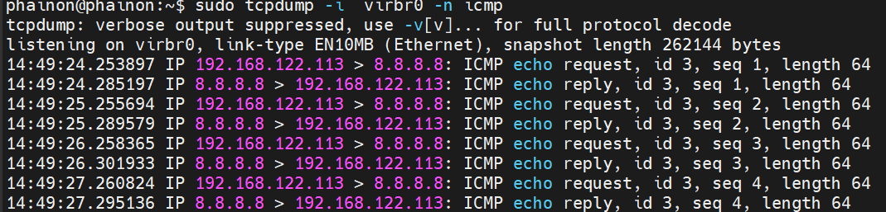

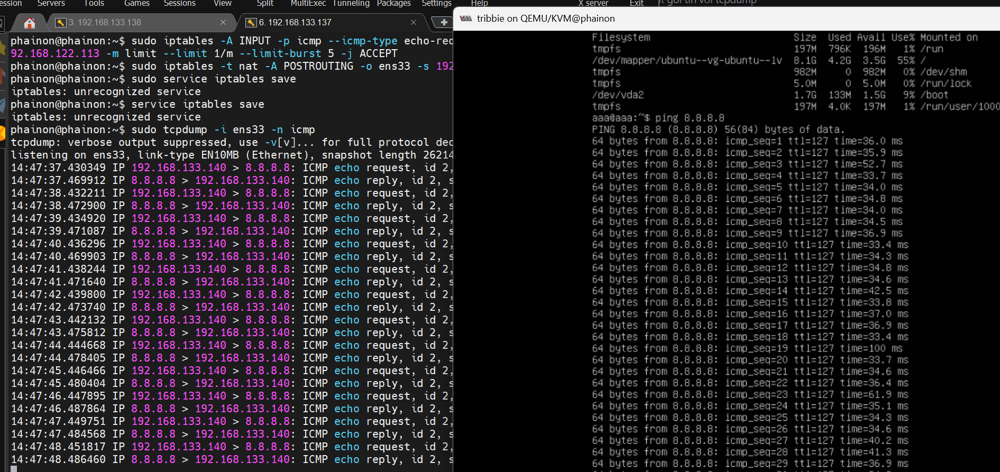

- NAT thành công ở cổng mạng ảo giao tiếp là 192.168.122.113 nhưng khi ra `ens33` đã được biến thành `192.168.133.140`(IP máy Server)

## LAB 3
### 1. Mô hình lab

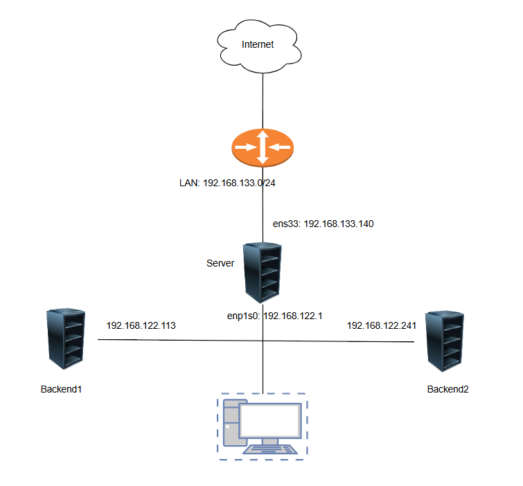

### 2. Mục tiêu

- DROP các INPUT traffic mặc định tới server
- ACCEPT các OUTPUT traffic mặc định từ server
- DROP các traffic forward mặc định
- ACCEPT các traffic đã kết nối (ESTABLISHED)
- ACCEPT kết nối từ loopback
- FORWARD các packet từ port 80 eth0 tới Backend1 trên cùng port
- FORWARD các packet từ port 443 eth0 tới Backend2 trên cùng port
- DROP các packet từ địa chỉ `192.168.133.138`
- ACCEPT các kết nối ping 5 lần 1 phút từ internal network (`192.168.122.0/24`)
- ACCEPT các kết nối ssh từ internal network (`192.168.122.0/24`)
- DROP các packet từ địa chỉ `192.168.133.138`
- ACCEPT các kết nối ra ngoài từ internal network và chuyển đổi địa chỉ nguồn

### 3. Thực hiện
```bash
# Xóa hết rules hiện tại
sudo iptables -F
sudo iptables -X
sudo iptables -Z
```
- Kích hoạt chế độ chuyển gói tin ở mức kernel
```bash
# bật tạm thời
sudo sysctl -w net.ipv4.ip_forward=1
```
- Xóa các rule trong bảng NAT
```bash
iptables -t nat -F
```
- DROP các INPUT traffic mặc định tới server
```bash
iptables -P INPUT DROP
```
- ACCEPT các OUTPUT traffic mặc định từ server
```bash
iptables -P OUTPUT ACCEPT
```
- DROP các traffic forward mặc định
```bash
iptables -P FORWARD DROP
```
- ACCEPT các traffic đã kết nối (ESTABLISHED)
```bash
iptables -A FORWARD -i enp1s0 -o ens33 -s 192.168.122.0/24 -j ACCEPT

iptables -A FORWARD -m state --state ESTABLISHED,RELATED -j ACCEPT
```
- ACCEPT kết nối từ loopback
```bash
iptables -A INPUT -s 127.0.0.1 -d 127.0.0.1 -j ACCEPT

iptables -A FORWARD -m state --state ESTABLISHED,RELATED -j ACCEPT
```
- FORWARD các packet từ port 80 ens33 tới Backend1 trên cùng port:
```bash
iptables -A FORWARD -p tcp -d 192.168.122.113 --dport 80 -j ACCEPT

iptables -t nat -A PREROUTING -p tcp -d 192.168.133.140 --dport 80 -j DNAT --to-destination 192.168.122.113:80
```
- FORWARD các packet từ port 443 ens33 tới Backend2 trên cùng port:
```bash
iptables -A FORWARD -p tcp -d 192.168.122.241 --dport 443 -j ACCEPT

iptables -t nat -A PREROUTING -p tcp -d 192.168.133.140 --dport 443 -j DNAT --to-destination 192.168.122.241:443
```
- DROP các packet từ địa chỉ `192.168.133.138`
```bash
iptables -A FORWARD -s 192.168.133.138/24 -j DROP
```
- ACCEPT các kết nối ping 5 lần 1 phút từ internal network (192.168.122.0/24)
```bash
iptables -A INPUT -p icmp --icmp-type echo-request -s 192.168.122.0/24 -d 192.168.122.113 -m limit --limit 1/m --limit-burst 5 -j ACCEPT
```
- Chấp nhận các kết nối ssh từ mạng LAN
```bash
iptables -A INPUT -p tcp -m conntrack --ctstate NEW -s 192.168.122.0/24 -d 192.168.122.113 --dport 22 -j ACCEPT
```
- DROP các packet từ địa chỉ 192.168.122.20
```bash
iptables -A INPUT -s 192.168.122.20/24 -j DROP
```
- ACCEPT các kết nối ra ngoài từ internal network và chuyển đổi địa chỉ nguồn
```bash
iptables -t nat -A POSTROUTING -o ens33 -s 192.168.122.0/24 -j MASQUERADE
```

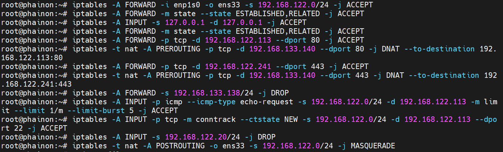

```bash
ens33  In  192.168.133.138 > 192.168.133.140.80   ← Packet vào gateway
virbr0 Out 192.168.133.138 > 192.168.122.113.80   ← DNAT → forward sang Backend1 ✓
vnet0  Out 192.168.133.138 > 192.168.122.113.80   ← Đến VM Backend1 ✓
vnet0  P   192.168.122.113 > 192.168.133.138       ← Backend1 trả lời [R.] ✓
ens33  Out 192.168.133.140 > 192.168.133.138       ← SNAT trả về client ✓
```
### 4. Kiểm tra
- Để kiểm tra bắt gói tin ta dùng công cụ hping3 để ping xuyên port.
- hping3 là công cụ tạo packet thủ công theo ý muốn — về cơ bản là ping nhưng tùy chỉnh được mọi thứ: protocol, port, flags, payload, TTL...
```bash
sudo apt install hping3 -y
```
```bash
sudo hping3 -S -p 443 192.168.133.140 -c 3
sudo hping3 -S -p 80 192.168.133.140 -c 3
```

- Sử dụng 1 trong 3 lệnh dưới để test `tcpdump`
```bash
sudo tcpdump -i any host 192.168.122.113
sudo tcpdump -i any port 80
sudo tcpdump -i any -n port 80
```

```bash
iptables -t nat -L PREROUTING -n -v
iptables -L FORWARD -n -v
```

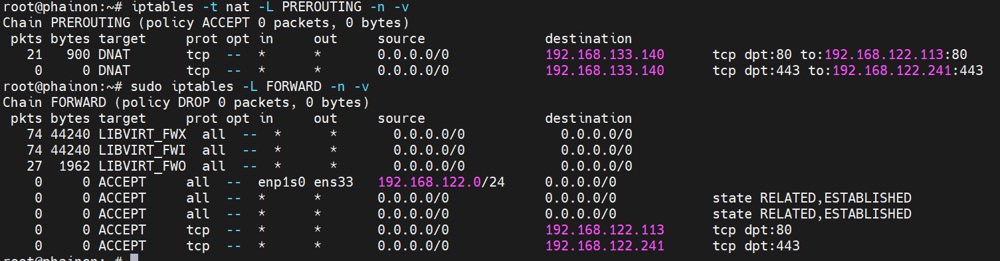

```bash
21 packets → DNAT tcp dpt:80 to:192.168.122.113:80
```
- Có 21 packet TCP tới port 80 của 192.168.133.140
```bash
Client → 192.168.133.140:80
```
- Rewrite thành: `→ 192.168.122.113:80`
- DNAT đang hoạt động thật (đã có packet đi qua)

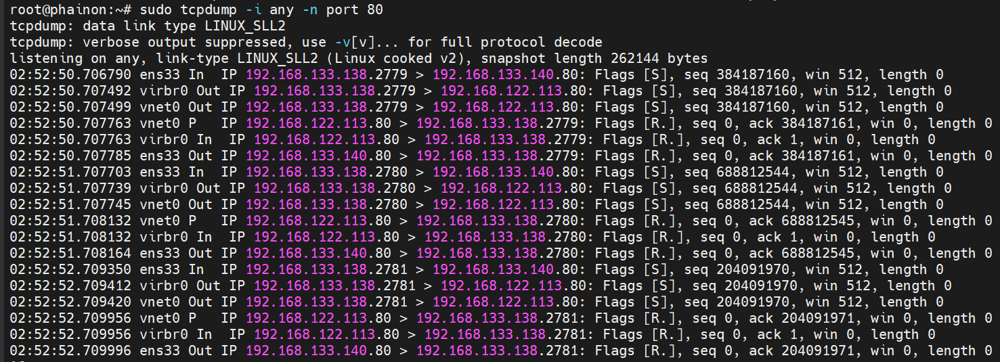


### 5. Quá trình sửa lỗi 
- Bỏ qua bước 4 sau khi xong bước 3:
- Nhìn counter của DNAT
```bash
iptables -t nat -L PREROUTING -n -v
```
- Xác nhận packet đi qua FORWARD
```bash
iptables -L FORWARD -n -v
```
Phải thấy : `pkts tăng ở rule ACCEPT tới 192.168.122.113:80`(pkts viết tắt là Packets :>)

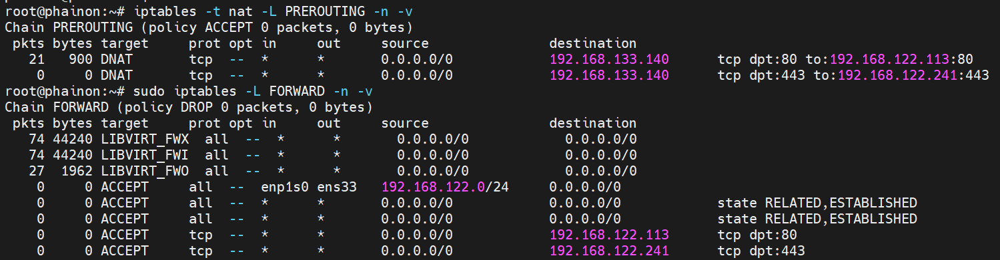
- **NAT - PREROUTING (DNAT)**:
```bash
21 packets → DNAT tcp dpt:80 to:192.168.122.113:80
```
- Có 21 packet TCP tới port 80 của `192.168.133.140` và được rewrite thành `→ 192.168.122.113:80` -> ĐÚNG

- **FORWARD chain(Quan trọng hơn)**
  - 3 dòng đầu là RULE của libvirt

```bash
0 packets ACCEPT all -- enp1s0 → ens33 192.168.122.0/24
```
- Cho VM ra Internet -> OK
```bash
0 packets ACCEPT state RELATED,ESTABLISHED
```
- counter = 0 → chưa match packet nào (xác định là bị lỗi rồi)
```bash
0 packets ACCEPT tcp → 192.168.122.113:80
```
- RULE Cho DNAT Forward : 0 packets chứng tỏ là nó đã không được forward bất kỳ gói tin nào do ở trên là (21)

- Vậy Packet đã DNAT nhưng không đi qua rule `FORWARD` 
```bash
Client → 192.168.133.140:80
        ↓
PREROUTING (DNAT OK)
        ↓
KHÔNG đi qua FORWARD rule của bạn
        ↓
rơi vào chain libvirt hoặc bị xử lý khác
```
- Chúng ta áp dụng đưa rule lên trên:
```bash
sudo iptables -I FORWARD 1 -p tcp -d 192.168.122.113 --dport 80 -j ACCEPT
```
- `-I 1` = chèn lên đầu
```bash
iptables -L FORWARD -n -v
```

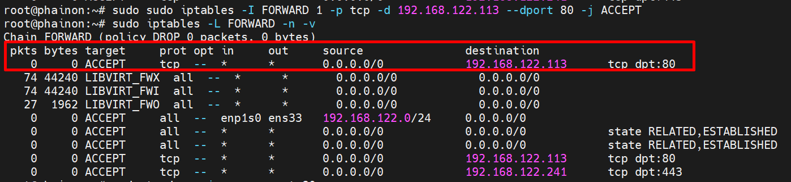

Làm tương tự với port `443`

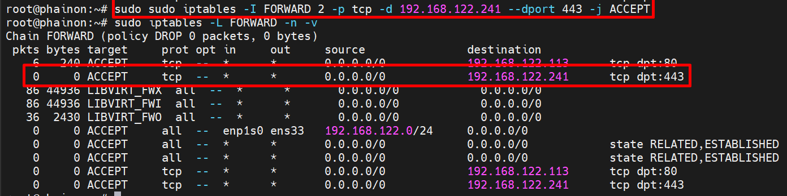

- Forward thành công.

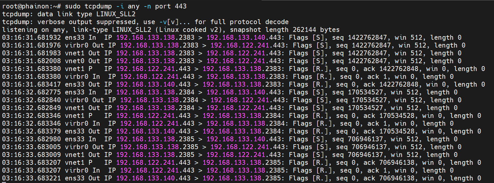

**Lưu ý 2**: Không khuyên dùng `nc` `service` test local vì Linux sẽ xử lý traffic LOCAL trước khi DNAT (Đi vào INPUT chứ không phải FORWARD chain). 
- Mà ở trên ta đa ban INPUT nên sẽ fail. 

## Cách xóa 1 RULE 

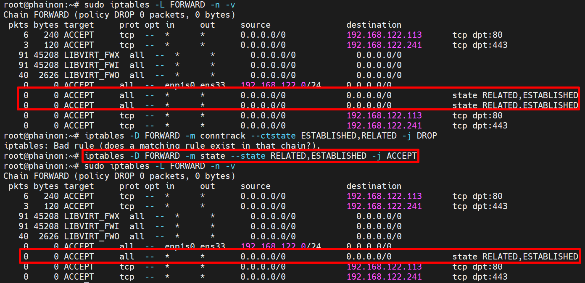
- hoặc
```bash
iptables -L FORWARD -n --line-numbers
iptables -D FORWARD <line-numbers>
```
- Hoặc dùng c(check) trước khi add
```bash
iptables -C FORWARD -m conntrack --ctstate RELATED,ESTABLISHED -j ACCEPT || \
iptables -A FORWARD -m conntrack --ctstate RELATED,ESTABLISHED -j ACCEPT
```

## LAB 4

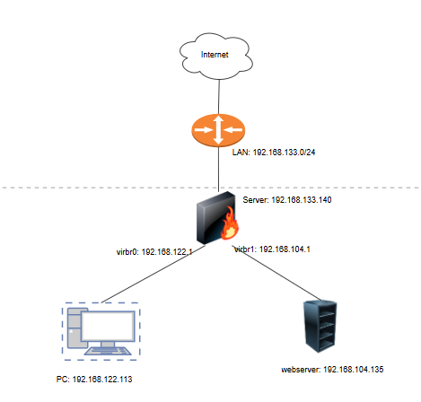