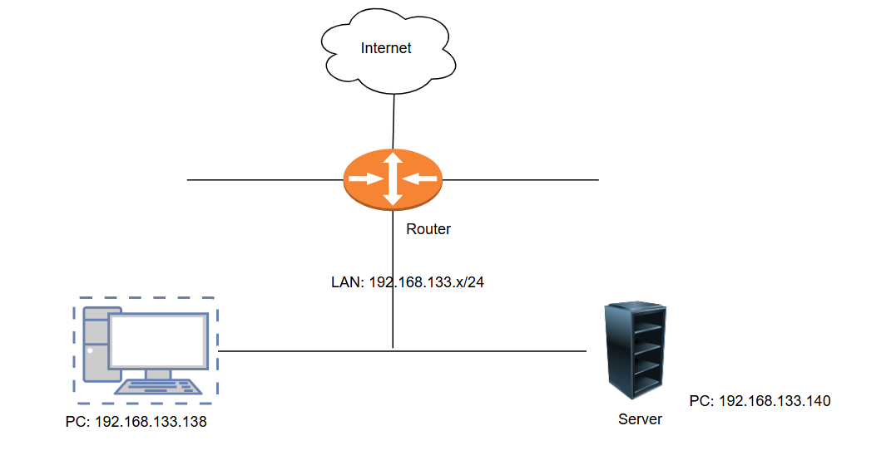
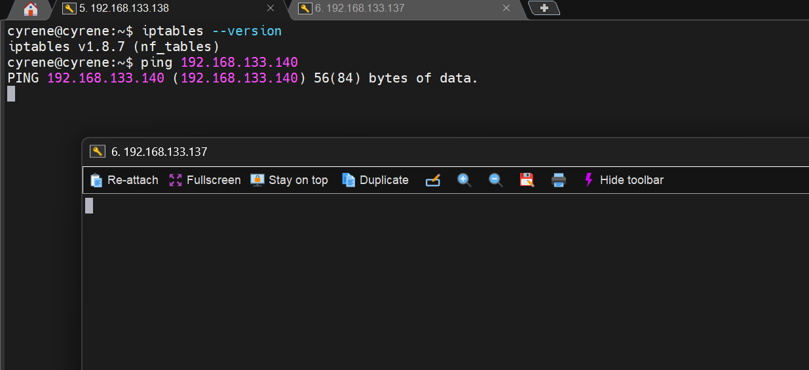
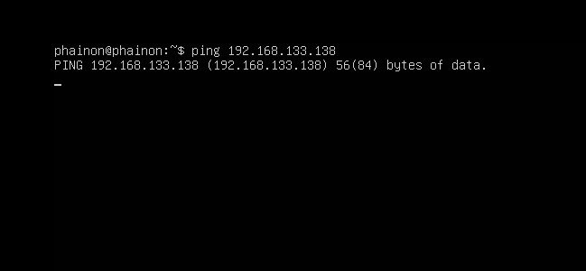
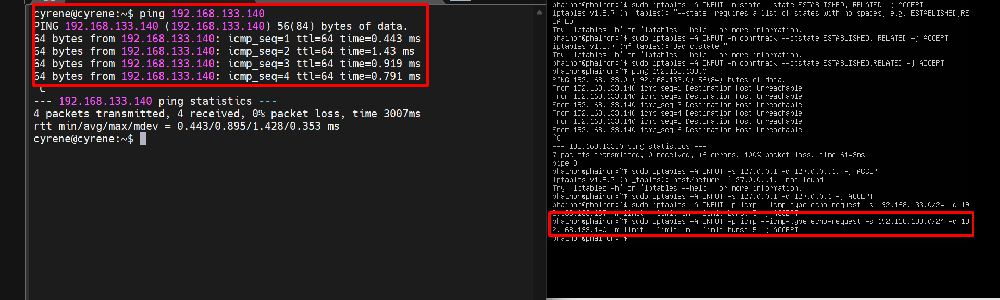
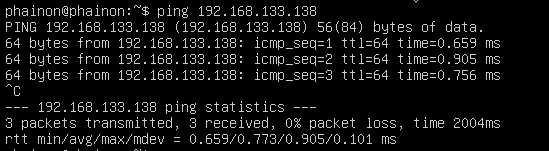
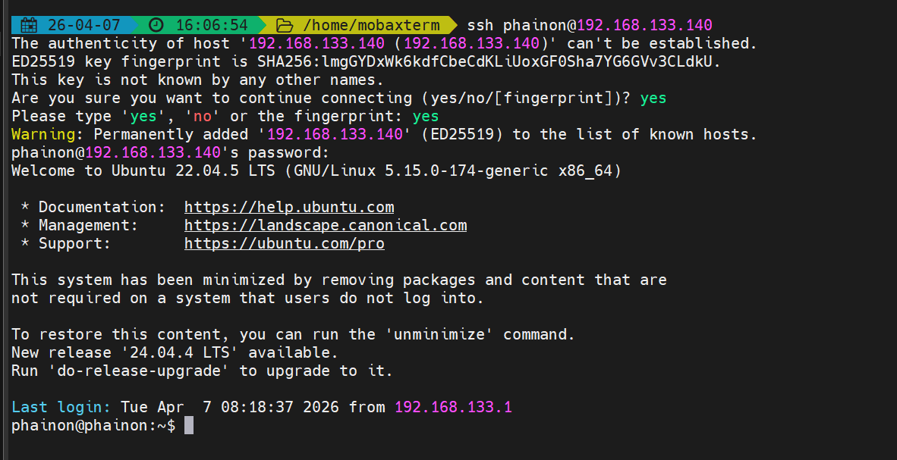
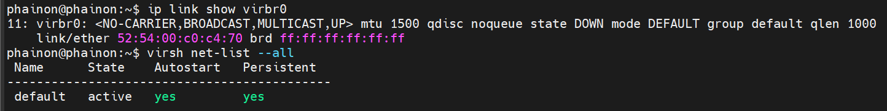
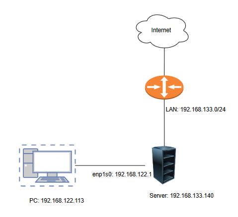

# Lab Iptable
## Kiến trúc cơ bản Iptable
### 3 tables chính

| Table | Chức năng |
|--------|------------------|
| `filter` | Lọc gói tin (mặc định)| 
| `nat` | Chuyển đổi địa chỉ mạng (NAT)| 
| `mangle`| Chỉnh sửa header gói tin|

### 5 chains chính

| Chain | Mô tả | 
|--------|-----------------|
| `INPUT` | Gói tin đến máy local| 
| `OUTPUT`| Gói tin từ máy local đi ra| 
| `FORWARD`| Gói tin đi qua máy (routing)| 
| `PREROUTING`| Trước khi routing| 
| `POSTROUTING`| Sau khi routing|

### Các lệnh cơ bản
```bash
# Xem rules hiện tại
iptables -L -v -n

# Xem với số dòng
iptables -L --line-numbers

# Xóa tất cả rules (flush)
iptables -F

# Xóa rules theo table
iptables -t nat -F
```

### Lệnh lọc gói tin
```bash
# Chặn IP cụ thể
iptables -A INPUT -s 192.168.1.100 -j DROP

# Cho phép SSH (port 22)
iptables -A INPUT -p tcp --dport 22 -j ACCEPT

# Cho phép HTTP và HTTPS
iptables -A INPUT -p tcp --dport 80 -j ACCEPT
iptables -A INPUT -p tcp --dport 443 -j ACCEPT

# Chặn port 23 (Telnet)
iptables -A INPUT -p tcp --dport 23 -j DROP

# Cho phép ICMP (ping)
iptables -A INPUT -p icmp -j ACCEPT

# Chặn ping từ bên ngoài
iptables -A INPUT -p icmp --icmp-type echo-request -j DROP
```

### Lệnh  Stateful Firewall
```bash
# Cho phép kết nối đã được thiết lập
iptables -A INPUT -m state --state ESTABLISHED,RELATED -j ACCEPT

# Cho phép loopback
iptables -A INPUT -i lo -j ACCEPT

# Policy mặc định: DROP tất cả INPUT
iptables -P INPUT DROP
iptables -P FORWARD DROP
iptables -P OUTPUT ACCEPT
```

### NAT (Network Address Translation)
```bash
# SNAT: Chia sẻ internet cho mạng nội bộ
iptables -t nat -A POSTROUTING -o eth0 -j MASQUERADE

# DNAT: Port forwarding (chuyển port 80 vào 192.168.1.10)
iptables -t nat -A PREROUTING -p tcp --dport 80 \
  -j DNAT --to-destination 192.168.1.10:80

# Bật IP forwarding
echo 1 > /proc/sys/net/ipv4/ip_forward
```

### Giới hạn tốc độ
```bash
# Chống brute-force SSH: tối đa 3 kết nối/phút
iptables -A INPUT -p tcp --dport 22 \
  -m limit --limit 3/min --limit-burst 3 -j ACCEPT

# Chống SYN Flood
iptables -A INPUT -p tcp --syn \
  -m limit --limit 1/s --limit-burst 4 -j ACCEPT

# Log gói tin bị DROP
iptables -A INPUT -j LOG --log-prefix "IPTables-DROP: "
```

### Lưu và khôi phục rules
```bash
# Lưu rules (Ubuntu/Debian)
iptables-save > /etc/iptables/rules.v4

# Khôi phục rules
iptables-restore < /etc/iptables/rules.v4

# Cài iptables-persistent để tự load khi khởi động
apt install iptables-persistent
```

## LAB 1
### 1. Mô hình lab



### 2. Yêu cầu 
- DROP các INPUT traffic mặc định tới server(từ chối các kết nối tới máy chủ)
- ACCEPT các OUTPUT traffic mặc định từ server(Cho phép gói tin đi ra từ hệ thống)
- ACCEPT các traffic đã kết nối (ESTABLISHED) (cho phép thiết lập các kết nối đi vào hệ thống)
- ACCEPT kết nối từ loopback
- ACCEPT các kết nối ping 5 lần 1 phút từ internal network (192.168.133.0/24)
- ACCEPT các kết nối SSH từ internal network (192.168.133.0/24)

### 3. Thực hiện
- Xóa các rules và chain do người dùng tạo
```bash
iptables -F     # Xóa tất cả rules
iptables -X     # Xóa các chain người dùng tạo
```
- DROP các INPUT traffic mặc định tới server
```bash
iptables -P INPUT DROP
```





- Ảnh trên cho thấy đã mất connect SSH ngay trong MobaXterm và máy khác cùng dải không ping được tới nữa. Ngay cả từ máy Server Ping ra ngoài cũng không được.


- ACCEPT các OUTPUT traffic mặc định từ server
```bash
iptables -P OUTPUT ACCEPT
```


- Cho phép kết nối đã established (stateful)
```bash
iptables -A INPUT -m conntrack --ctstate ESTABLISHED,RELATED -j ACCEPT
```
- ACCEPT kết nối từ loopback
```bash
iptables -A INPUT -s 127.0.0.1 -d 127.0.0.1 -j ACCEPT
```
- ACCEPT các kết nối ping 5 lần 1 phút từ internal network (192.168.133.0/24)
```bash
iptables -A INPUT -p icmp --icmp-type echo-request -s 192.168.133.0/24 -d 192.168.133.137 -m limit --limit 1/m --limit-burst 5 -j ACCEPT
```


- Đã ping được, cũng như ping được từ trong ra ngoài



- ACCEPT các kết nối SSH từ internal network (192.168.133.0/24)
```bash
iptables -A INPUT -p tcp -m conntrack --ctstate NEW -s 192.168.133.0/24 -d 192.168.133.140 --dport 22 -j ACCEPT

iptables -A INPUT -p tcp --dport 22 -j ACCEPT
```



- Đã ssh thành công

## LAB 2
### 0. Một số lưu ý về lab Iptables
- Ở lab 1 ta có dùng: 
```bash
iptables -F     # Xóa tất cả rules
iptables -X     # Xóa các chain người dùng tạo
```
- Một số dịch vụ sẽ bị xóa mất rules và chain mặc định:



Và lỗi này:

```bash
phainon@phainon:~$ virsh net-start default
error: Failed to start network default
error: internal error: Failed to apply firewall rules /usr/sbin/iptables -w --table filter --insert LIBVIRT_INP --in-interface virbr0 --protocol tcp --destination-port 67 --jump ACCEPT: iptables: No chain/target/match by that name.
```

- `Chain LIBVIRT_INP` đã bị mất trong iptables
- Bạn chỉ cần: Restart `libvirt`(auto tạo lại chain) sau đó `virsh net-start default`
- Mọi dịch vụ khác nếu bị lỗi đều có thể làm tương tự.
### 1. Mô hình triển khai

