# Lab Linux Bridge
## 1. Mô hình bài Lab
### 1.1 Thành phần chính
```bash
Host 1 (192.168.133.137)                  Host 2 (192.168.133.138)
┌────────────────────────┐               ┌────────────────────────┐
│        VM141           │               │        VM142           │
│     10.0.1.141/24      │               │     10.0.2.142/24      │
│        (vnet0)         │               │        (vnet0)         │
│           │            │               │           │            │
│        ┌──┴──┐         │               │        ┌──┴──┐         │
│        │ br1 │         │               │        │ br1 │         │
│        │10.0.1.1       │               │        │10.0.2.1       │
│        └──┬──┘         │               │        └──┬──┘         │
│           │            │               │           │            │
│        (routing)       │               │        (routing)       │
│           │            │               │           │            │
│        ┌──┴──┐         │               │        ┌──┴──┐         │
│        │ br0 │         │               │        │ br0 │         │
│        │192.168.133.137│               │        │192.168.133.138│
│        └──┬──┘         │               │        └──┬──┘         │
│           │            │               │           │            │
│         ens33          │               │         ens33          │
└───────────┼────────────┘               └───────────┼────────────┘
            │                                        │
            └────────── VMware NAT Network ──────────┘
                      (192.168.133.0/24)
                           │
                     Gateway: .2 
```
`br0`: Bridge (external/bridged), kết nối với mạng LAN thật `192.168.133.0/24` qua `ens33`.
- Host 1 gán IP `192.168.133.137` cho br0.
- Host 2 gán IP `192.168.133.138` cho br0.

`br1`: Bridge (internal), dành riêng cho VM.
- Trên Host 1: br1 có IP `10.0.1.1/24` (làm gateway cho VM141).
  - VM141 (`10.0.1.141/24`) gắn vào br1 của Host 1 qua vnet0.
- Trên Host 2: br1 có IP `10.0.2.1/24` (làm gateway cho VM142).
  - VM142 (`10.0.2.142/24`) gắn vào br1 của Host 2 qua vnet0.

Hai Host giao tiếp với nhau qua mạng VMware NAT (thực chất là mạng LAN `192.168.133.0/24`), với gateway là `.2`

Mục đích bài lab: để hai VM nằm trên hai subnet riêng biệt (10.0.1.0/24 và 10.0.2.0/24) trên hai Host khác nhau vẫn ping được nhau.     

### 1.2 Vai trò từng thành phần

- `ens33`: Card mạng vật lý thật của mỗi Host. Nó được thêm vào bridge `br0`, nên `br0` trở thành cửa sổ ra mạng LAN `192.168.133.0/24`.
- `br0 (192.168.133.137 / .138)`: Đây là bridge bridged (bridge to physical). Nó cho phép Host có IP công khai trên mạng LAN thật và cho phép traffic từ VM (sau khi routing) đi ra ngoài hoặc sang Host kia.
- `br1 (10.0.1.1 / 10.0.2.1)`: Đây là bridge riêng cho VM (được tạo bằng libvirt network kiểu routed hoặc nat, routed + manual routing).
- `br1` không gắn trực tiếp với `ens33`, nên VM không thấy trực tiếp mạng `192.168.133.0/24`. Tất cả traffic của VM phải đi qua Host (routing + NAT/masquerade).

Mỗi Host phải có route để biết:
- Mạng `10.0.1.0/24` đi qua br1 (Host 1)
- Mạng `10.0.2.0/24` đi qua br1 (Host 2)
- Để đi sang mạng kia (ví dụ từ Host 1 sang 10.0.2.0/24), phải route qua br0 → sang Host 2 qua mạng 192.168.133.0/24.

VMware NAT Network (192.168.133.0/24): Lớp mạng trung gian kết nối 2 máy Host

`10.0.1.141` -> br1 (Host1) -> routing (Host1) -> br0 -> ens33 -> VMware NAT network -> ens33 (Host2) -> br0 -> routing (Host2) -> br1 -> `10.0.2.142`

| Layer | Thành phần |
| ----- | ---------- |
| L2    | br1, br0   |
| L3    | ip route   |
| NAT   | iptables   |


## 2. Cài KVM + bridge-utils
```bash
apt update
apt install -y qemu-kvm libvirt-daemon-system virtinst bridge-utils
# Kiểm tra KVM đã cài chưa
virsh version
```

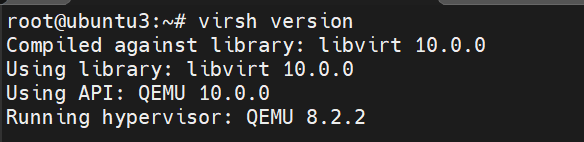

## 3. Tạo Linux Bridge (làm trên cả Host A và Host B)
- Xác định tên card mạng vật lý:
```bash
ip -br addr show
```

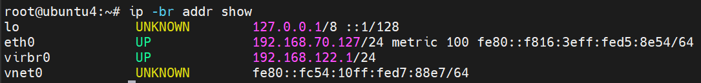

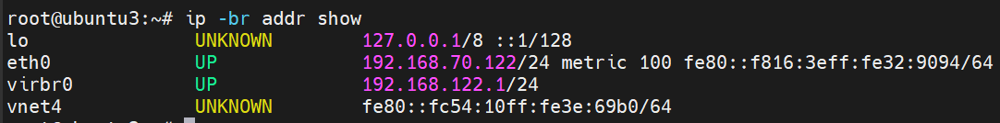

- Chỉnh sửa file : `/etc/netplan/50-cloud-init.yaml`
```bash
sudo nano /etc/netplan/50-cloud-init.yaml
```
```bash
network:
  version: 2
  ethernets:
    ens33:
      dhcp4: no
  bridges:
    br0:
      interfaces: [ens33]
      addresses: [192.168.133.137/24]
      routes:
        - to: default
          via: 192.168.133.2
      nameservers:
        addresses: [8.8.8.8, 8.8.4.4]
      parameters:
        stp: true
        forward-delay: 4
```

Hoặc
```bash
network:
  version: 2
  ethernets:
    ens33:
      dhcp4: no
  bridges:
    br0:
      interfaces: [ens33]
      dhcp4: true
      parameters:
        stp: true
        forward-delay: 4
```
- Vì `ens33` đã được gắn vào bridge br0 rồi, nên `ens33` chỉ đóng vai trò là một "port" của bridge — nó không cần IP riêng nữa.
- Nếu để dhcp4: true cho cả `ens33` lẫn br0, thì cả hai sẽ cùng xin IP từ DHCP → xung đột, hoặc `ens33` nhận IP nhưng traffic lại đi qua br0 → rối.
- Nói đơn giản: IP chỉ nên đặt ở bridge (br0), còn `ens33` chỉ là dây nối vào bridge, không cần địa chỉ gì cả. Giống như port trên switch vật lý — port không có IP, chỉ switch mới có management IP.
```bash
netplan apply
```

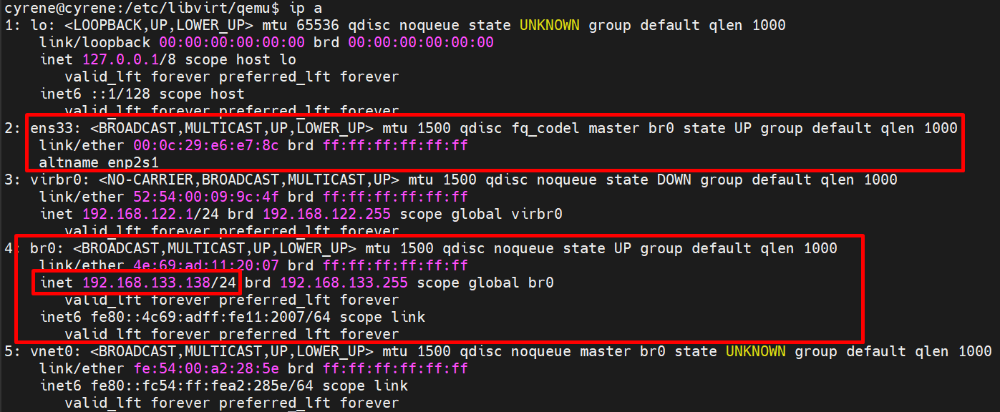

- Cách 2: Dùng lệnh brctl thủ công (tạm thời, mất khi reboot)
```bash
sudo brctl addbr br0
sudo brctl addif br0 ens33
sudo ip addr flush dev ens33
sudo ip addr add 192.168.70.122/24 dev br0
sudo ip link set br0 up
sudo ip route add default via 192.168.70.1
```
- Kiểm tra brctl show:
```bash
# Xem bridge
brctl show

# Kết quả mong đợi:
# bridge name   bridge id           STP enabled   interfaces
# br0           8000.xxxxxxxxxxxx   yes           ens33

# Kiểm tra IP
ip addr show br0

# Ping thử giữa 2 host
ping 192.168.133.137   # từ Host 1
ping 192.168.133.138   # từ Host 2
```

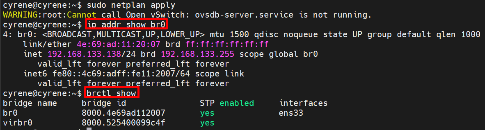

## 4. Tạo 2 VM trên mỗi host
```bash
# VM1
sudo virt-install \
  --name vm1 \
  --ram 1024 \
  --vcpus 1 \
  --disk path=/var/lib/libvirt/images/vm1.qcow2,size=10 \
  --os-variant ubuntu22.04 \
  --network bridge=br0 \
  --graphics vnc,listen=0.0.0.0 \
  --cdrom /path/to/ubuntu.iso \
  --noautoconsole

# VM2
sudo virt-install \
  --name vm2 \
  --ram 1024 \
  --vcpus 1 \
  --disk path=/var/lib/libvirt/images/vm2.qcow2,size=10 \
  --os-variant ubuntu22.04 \
  --network bridge=br0 \
  --graphics vnc,listen=0.0.0.0 \
  --cdrom /path/to/ubuntu.iso \
  --noautoconsole
```

Đảm bảo network dùng bridge `br0`
```bash
# Xem cấu hình network của VM
virsh dumpxml tribbie | grep -A5 "interface"

# Sửa nếu cần
virsh edit tribbie
```
- Trong phần card mạng: Sửa phần `<interface>`:
```bash
    <interface type='network'>
      <mac address='52:54:00:eb:2a:74'/>
      <source network='default'/>
      <model type='virtio'/>
      <address type='pci' domain='0x0000' bus='0x01' slot='0x00' function='0x0'/>
    </interface>
```
- Xóa trên thay bằng:
```bash
<interface type='bridge'>
  <source bridge='br0'/>
  <model type='virtio'/>
</interface>
```

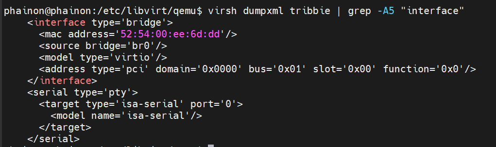

## 6. Test VM truy cập Internet
```bash
sudo apt install iputils-ping
```
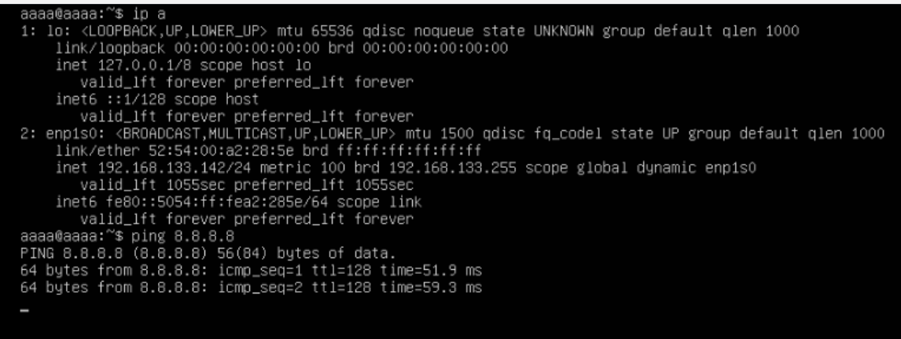

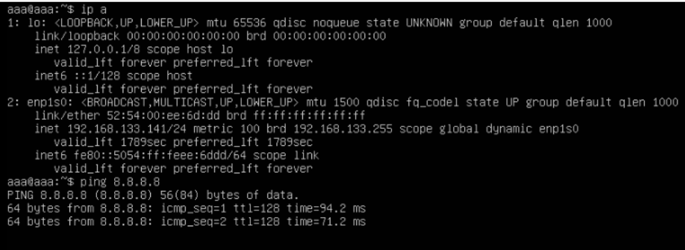


## 7. Tạo bridge riêng cho VM trên mỗi Host
- Host 1:
```bash
# br0 giữ nguyên cho management (192.168.133.137)
# Tạo thêm br1 cho VM, không gắn card vật lý
sudo brctl addbr br1
sudo ip addr add 10.0.1.1/24 dev br1
sudo ip link set br1 up
```
- Host 2:
```bash
sudo brctl addbr br1
sudo ip addr add 10.0.2.1/24 dev br1
sudo ip link set br1 up
```
**hoặc:(Trên chỉ là để test)**
```bash
network:
  version: 2
  ethernets:
    ens33:
      dhcp4: no

  bridges:
    br0:
      interfaces: [ens33]
      addresses: [192.168.133.137/24]
      routes:
        - to: default
          via: 192.168.133.2
        - to: 10.0.2.0/24
          via: 192.168.133.138
      nameservers:
        addresses: [8.8.8.8, 8.8.4.4]

    br1:
      interfaces: []
      addresses: [10.0.1.1/24]
```
Host 2 chỉ cần đổi lại:
```bash
br0:
  addresses: [192.168.133.138/24]
  routes:
    - to: default
      via: 192.168.133.2
    - to: 10.0.1.0/24
      via: 192.168.133.137

br1:
  addresses: [10.0.2.1/24]
```
## 8. Gắn VM vào br1
- Sửa lại đoạn này:
```bash
<interface type='bridge'>
  <source bridge='br1'/> # không dùng br0 nữa
  <model type='virtio'/>
</interface>
```
## 9. Bật IP forwarding trên cả 2 host
```bash
sudo sysctl -w net.ipv4.ip_forward=1
```
hoặc
```bash
echo "net.ipv4.ip_forward=1" | sudo tee -a /etc/sysctl.conf
```
## 10. Thêm route và NAT trên mỗi Host
- Host 1
```bash
# NAT cho VM ra ngoài
sudo iptables -t nat -A POSTROUTING -s 10.0.1.0/24 -o br0 -j MASQUERADE

# Route đến subnet VM của Host 2
sudo ip route add 10.0.2.0/24 via 192.168.133.138
```
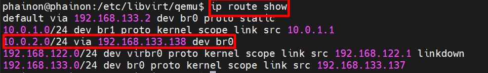

- Host 2
```bash
sudo iptables -t nat -A POSTROUTING -s 10.0.2.0/24 -o br0 -j MASQUERADE

# Route đến subnet VM của Host 1
sudo ip route add 10.0.1.0/24 via 192.168.133.137
```

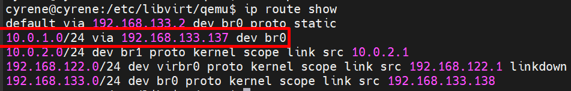

IPtables - lưu persistent:
```bash
sudo apt install iptables-persistent
sudo netplan apply
sudo iptables -t nat -A POSTROUTING -s 10.0.1.0/24 -o br0 -j MASQUERADE
sudo netfilter-persistent save
```
## 11. Cấu hình IP trong VM
- VM01
```bash
sudo ip addr add 10.0.1.141/24 dev enp1s0
sudo ip link set enp1s0 up
sudo ip route add default via 10.0.1.1
```
- VM02
```bash
sudo ip addr add 10.0.2.142/24 dev enp1s0
sudo ip link set enp1s0 up
sudo ip route add default via 10.0.2.1
```

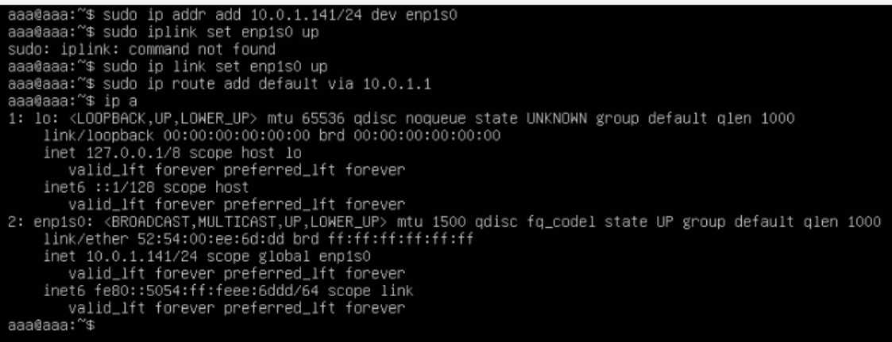

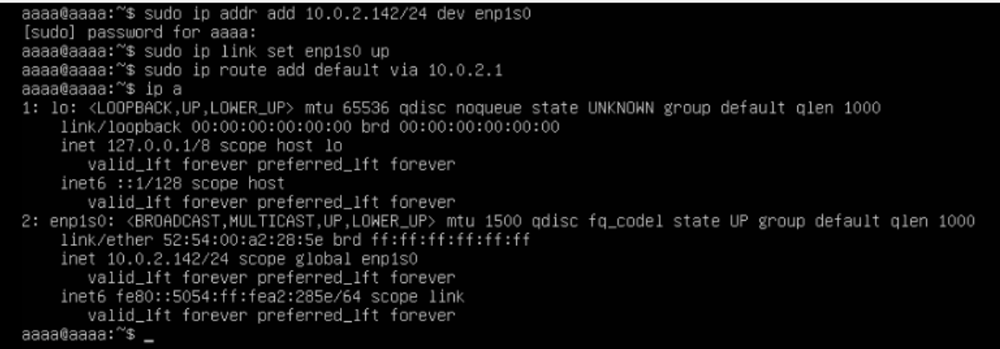

## 12. Bắt gói tin với tcpdump
- Trên host 1: VM1 ping VM3
```bash
# Terminal 1: bắt trên br1 (bridge nội bộ VM)
sudo tcpdump -i br1 -n icmp

# Terminal 2: bắt trên br0 (bridge ra ngoài)
sudo tcpdump -i br0 -n icmp

# Terminal 3: bắt trên eth0 (card vật lý)
sudo tcpdump -i eth0 -n icmp
```
- Bắt gói trên interface tap của VM
```bash
# Xem tên tap interface
virsh domiflist vm1
# Kết quả ví dụ: vnet0

# Bắt gói trên tap interface của VM1
sudo tcpdump -i vnet0 -n icmp
```
- Bắt gói ARP (quan sát quá trình ARP resolution)
```bash
sudo tcpdump -i br0 -n arp
```
- Bắt gói và lưu file để phân tích bằng Wireshark
```bash
sudo tcpdump -i br0 -w /tmp/bridge_capture.pcap -c 100
```
- So sánh traffic cùng host vs khác host
```bash
# Terminal 1: bắt trên br0
sudo tcpdump -i br0 -n icmp

# Terminal 2: bắt trên ens33 (card vật lý)
sudo tcpdump -i ens33 -n icmp
```

## 13 Phân tích gói tin
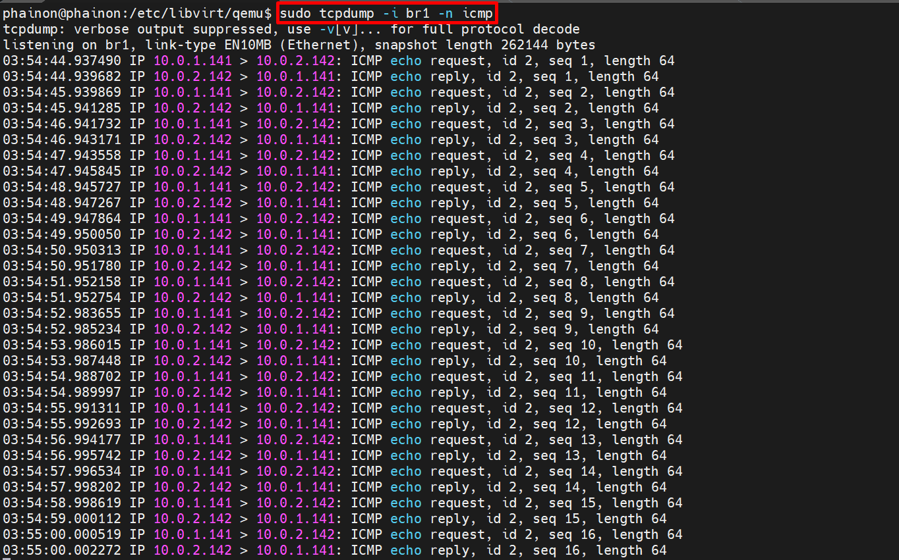

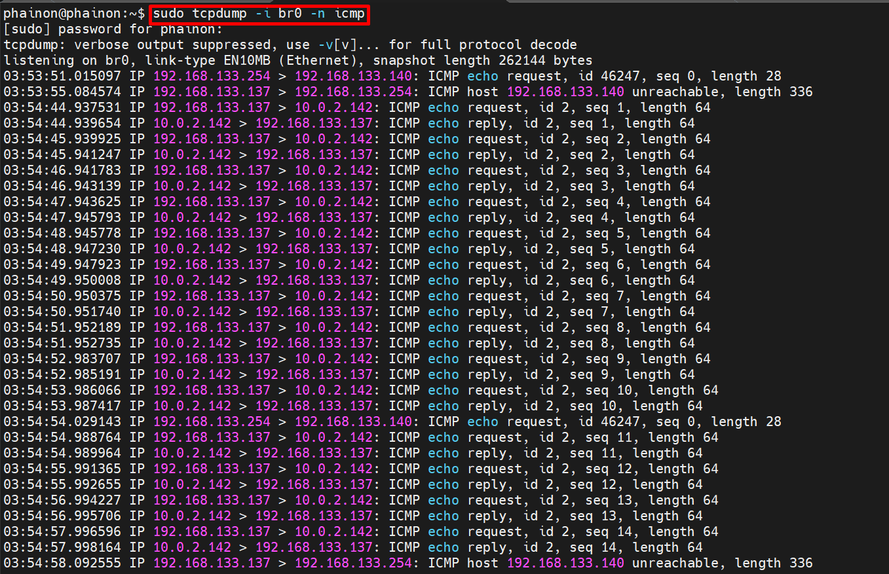

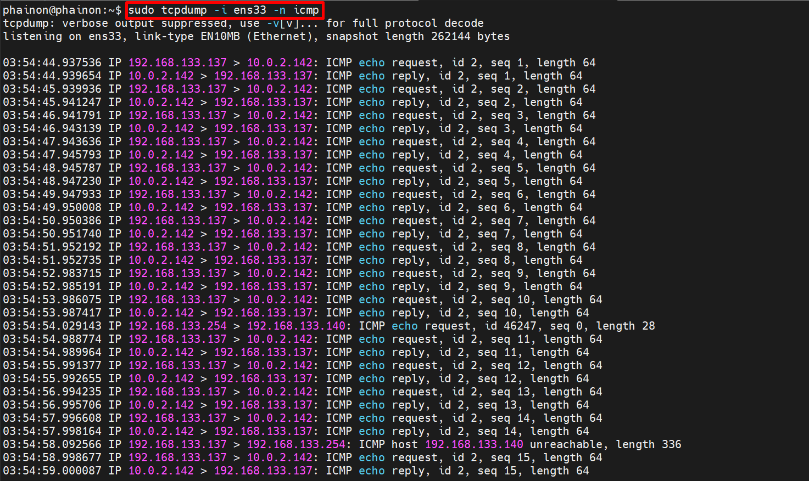

### 13.1 Tại `br1` (mạng VM nội bộ)
- Ping từ bên trong VM01 `(10.0.1.141)`, tới VM02 `(10.0.2.142)`
- Traffic phải đi ra ngoài qua routing + NAT (masquerade) trên hai Host.

- Ta để ý từ lúc thời điểm: `03:53:44`

**VM01**:
- VM01 tạo gói ICMP Echo Request: **Source IP**: `10.0.1.141`, **Destination IP**: `10.0.2.142`
- VM01 gửi gói tin ra gateway mặc định của nó → đó là `10.0.1.1` (IP của br1 trên Host 1).
- Gói tin đi qua vnet0 → vào bridge br1 của Host 1.
- Host 1 tra bảng route → biết `10.0.2.0/24` không phải mạng local, phải forward ra ngoài (thường qua `br0` hoặc `default route`).
- IP Masquerade (NAT) được kích hoạt ( do iptables POSTROUTING rules): Source IP bị thay đổi từ `10.0.1.141` → `192.168.133.137` (IP của Host 1 trên br0).
- Gói tin sau NAT: Source = `192.168.133.137`, Dest = `10.0.2.142`.
- Gói tin được forward từ `br1` → `br0`.
- Tcpdump -i br0 và -i ens33 thấy:
```bash
IP 192.168.133.137 > 10.0.2.142: ICMP echo request
```
- → Gói tin đã ra khỏi Host 1 qua ens33 → vào mạng VMware NAT / LAN `192.168.133.0/24`.
- Gói tin đi qua mạng LAN → đến Host 2 (`192.168.133.138`).
- Host 2 nhận gói tin trên ens33 → br0 (source vẫn là `192.168.133.137`).
- Host 2 tra route → biết `10.0.2.142` thuộc mạng br1 của mình.
- Host 2 forward gói tin vào br1 (có thể có un-NAT hoặc không, tùy cấu hình).
- Gói tin đến VM02 (`10.0.2.142`).
- VM02 tạo reply: Source: `10.0.2.142` Destination: `10.0.1.141` (vì gói request gốc có source là `10.0.1.141`)
- Host 2 routing + có thể NAT ngược → gửi reply ra br0 với source = `10.0.2.142`, dest = `192.168.133.137` (hoặc giữ nguyên tùy NAT).
- Reply đi qua mạng LAN `192.168.133.0/24` → về ens33/br0 của Host 1.
- Tcpdump trên br0/ens33 thấy:
```bash
IP 10.0.2.142 > 192.168.133.137: ICMP echo reply
```
- Host 1 nhận reply → un-NAT (đổi destination về 10.0.1.141) → forward vào br1.
- TCPdump trên br1 thấy:
```bash
IP 10.0.2.142 > 10.0.1.141: ICMP echo reply
```
- VM01 nhận được reply → ping thành công.
## 14. (Option) Xóa Iptables (ngược của bước 10)
```bash
sudo iptables -t nat -D POSTROUTING -s 10.0.1.0/24 -o br0 -j MASQUERADE # D = Delelte
sudo iptables -t nat -D POSTROUTING -s 10.0.1.0/24 -o ens33 -j MASQUERADE
ip route del 10.0.2.0/24
ip route # Check route
```