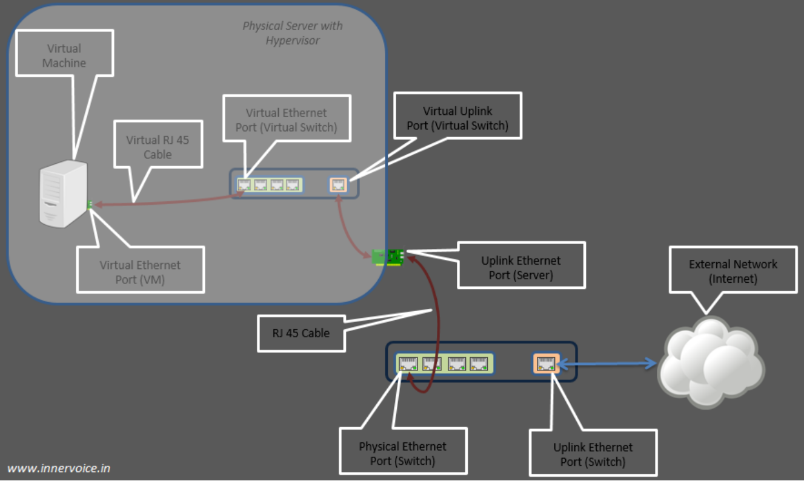
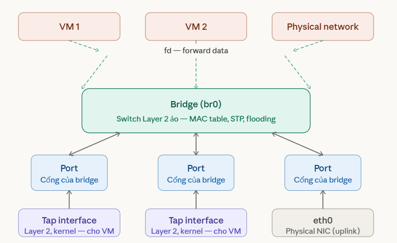

# Virtual Switch
## 1. Khái niệm 
Virtual Switch (vSwitch) là switch mạng nhưng chạy bằng phần mềm 

Chức năng:
  - Kết nối các VM với nhau
  - Kết nối VM ra mạng ngoài
  - Forward frame dựa trên MAC (giống switch thật)

## 2. Linux Bridge
Linux Bridge là một dạng virtual switch Layer 2 có sẵn trong kernel Linux. Là một soft switch – 1 trong 3 công nghệ cung cấp switch ảo trong hệ thống Linux (bên cạnh `macvlan` và `OpenvSwitch`), giải quyết vấn đề ảo hóa network bên trong các máy vật lý.

Linux bridge sẽ tạo ra các switch layer 2 kết nối các máy ảo (VM) để các VM đó giao tiếp được với nhau và có thể kết nối được ra mạng ngoài. Linux bridge thường sử dụng kết hợp với hệ thống ảo hóa KVM-QEMU.

Linux Bridge thật ra chính là một switch ảo và được sử dụng với ảo hóa KVM/QEMU. Nó là 1 module trong nhân kernel. Sử dụng câu lệnh `brctl` để quản lý .

## 3. Physical port và Virtual port

- **Physical swtich port**: Là port sử dụng cho Ethernet switch, cổng vật lý xác định bởi các port RJ45. Một port RJ45 kết nối tới port trên NIC của máy host.

- **Virtual swtich port**: là port ảo tồn tại trên virtual switch. Cả virtual NIC (vNIC) và virtual port đều là phần mềm, nó liên kết với virtual cable kết nối vNIC(máy ảo VM có virtual network adapters mà đóng vai trò là NIC cho máy ảo.)

## 4. Các thành phần cấu thành Linux Bridge

- `Bridge`: là trung tâm - switch ảo Layer 2 chạy trong Kernel, chịu trách nhiệm học MAC, ra quyết định forward hay flood frame. tương đương với switch layer 2
- `Port`: là điểm kết nối của bridge - mỗi interface muốn tham gia vào bridge đều phải được gắn vào 1 port. Giống hệt cổng RJ-45 trên switch thật. Các loại port như : Physical NIC- Kết nối mạng thật, Virtual NIC của VM - Interface ảo do hypervisor tạo(`vnet0`), Tap interface- Dùng để nối VM (từ QEMU) vào bridge.
- `Tap interface`: là loại interface đặc biệt dành cho VM - nó hoạt động ở Layer 2, nằm trong kernel, và được QEMU/KVM dùng để kết nối VM vào bridge. Khi VM gửi Ethernet frame, frame đó ra khỏi tap và vào bridge ngay lập tức. (Tap là 1 loại port)

Nói chung tap interface là một port trên switch dùng để kết nối với các máy ảo VM.
- `fd`(forward data) là cơ chế chuyển tiếp - mô tả hành động bridge thực hiện khi nhận frame từ tap/port và quyết định chuyển nó đi đâu dựa trên MAC table.

Linux Bridge là một switch Layer 2 trong kernel Linux, gồm bridge trung tâm, các port (physical và virtual như tap), và một MAC table để forward frame giữa các VM và mạng ngoài.

### 4.1 Các tính năng
- **STP**: Spanning Tree Protocol giao thức chống loop gói tin mạng.
- **VLAN**: chia switch (do linux bridge tạo ra) thành các mạng LAN ảo, cô lập traffic giữa các VM trên các VLAN khác nhau của cùng một switch.
- **FDB**: chuyển tiếp các gói tin theo database để nâng cao hiệu năng switch.

### 4.2 Một số khái niệm khác
**Uplink Port**: Uplink port là khái niệm chỉ điểm vào ra của lưu lượng trong một switch ra các mạng bên ngoài. Nó sẽ là nơi tập trung tất cả các lưu lượng trên switch nếu muốn ra mạng ngoài.

Khái niệm virtual uplink switch port được hiểu có chức năng tương đương, là điểm để các lưu lượng trên các máy guest ảo đi ra ngoài máy host thật, hoặc ra mạng ngoài. Khi thêm một interface trên máy thật vào bridge (tạo mạng bridging với interface máy thật và đi ra ngoài), thì interface trên máy thật chính là virtual uplink port.
