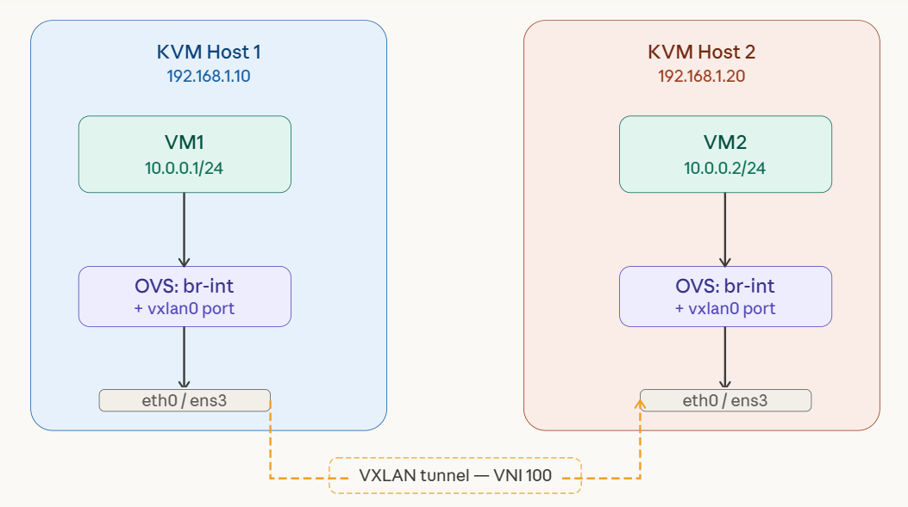
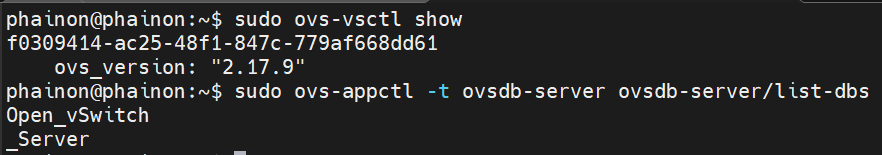
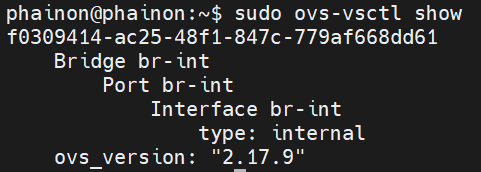
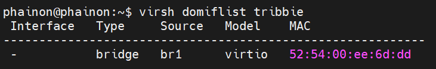
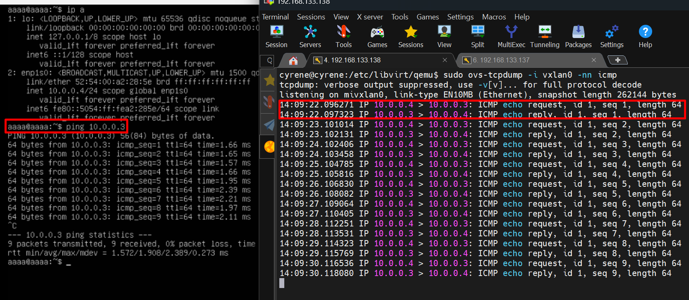
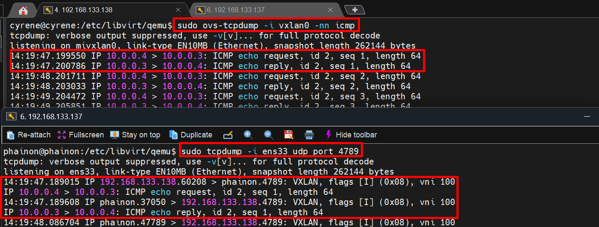

# Lab OpenvSwitch OVS VXLAN overlay 

## 0. Các nhóm lệnh chính trong OVS VXLAN

### 1. Open vSwitch Daemon Commands
- Dùng để điều khiển toàn hệ thống OVS.
- Công cụ chính: ovs-vsctl (tương tác với ovs-vswitchd).
- Hiển thị toàn bộ bridge, port, interface trong OVS.

```bash
# Kiểm tra cấu hình hiện tại
sudo ovs-vsctl show
```

### 2. Bridge Commands
- Dùng để quản lý virtual switch (bridge).
```bash
# Tạo bridge mới
sudo ovs-vsctl add-br br0

# Xóa bridge
sudo ovs-vsctl del-br br0

# Xem danh sách bridge
sudo ovs-vsctl list-br
```

### 3. Port Commands
- Quản lý cổng (port) được gắn vào bridge.
```bash
# Thêm port vật lý ens33 vào br0
sudo ovs-vsctl add-port br0 ens33

# Thêm port nội bộ (internal)
sudo ovs-vsctl add-port br0 br0-int -- set interface br0-int type=internal

# Xóa port
sudo ovs-vsctl del-port br0 ens33

# Liệt kê port của bridge
sudo ovs-vsctl list-ports br0
```

### 4. Interface Commands
- Quản lý interface gắn với port.
```bash
# Liệt kê tất cả interfaces
sudo ovs-vsctl list interface

# Xem chi tiết interface cụ thể
sudo ovs-vsctl list interface ens33
```

### 5. Database Commands
- OVS sử dụng `ovsdb-server` để lưu trữ cấu hình trong dạng database.
- Các table chính: `Bridge`, `Port`, `Interface`, `Open_vSwitch`, `Flow_Table`...

```bash
# Liệt kê tất cả bảng trong database
sudo ovs-vsctl list-tables

# Liệt kê record trong bảng Bridge
sudo ovs-vsctl list Bridge

# Hiển thị chi tiết record theo cột
sudo ovs-vsctl list interface name,type

# Tìm kiếm record có name=br0 trong bảng Bridge
sudo ovs-vsctl find Bridge name=br0
```   

## 1. Chuẩn bị môi trường



- Host 1: `192.168.133.137` - VM: `10.0.1.3`
- Host 2: `192.168.133.138` - VM: `10.0.1.4`
- VXLAN VNI: `100`, UDP port: `4789`

## 2. Cài đặt Open vSwitch (thực hiện trên cả 2 host)
```bash
# Ubuntu/Debian
apt update && apt install -y openvswitch-switch

# CentOS/RHEL
yum install -y openvswitch
systemctl enable --now openvswitch

# Kiểm tra
ovs-vsctl show
ovs-appctl -t ovsdb-server ovsdb-server/list-dbs
```


## 3. Tạo OVS Bridge và gán VM vào (trên cả 2 host)
```bash
# Tạo bridge br-int
sudo ovs-vsctl add-br br-int

# Xóa bridge
sudo ovs-vsctl del-br br-int

# Kiểm tra
ovs-vsctl show
```



- Tạo 1 máy KVM 
- Chỉ định interface VM kết nối vào `br-int`. Nếu VM đã chạy, lấy tên `vnet` interface:
```bash
virsh domiflist tribbie
```


- Nếu VM dùng Linux bridge mặc định, chuyển sang OVS bridge:
```bash
# Xóa khỏi linux bridge cũ (nếu có)
brctl delif virbr0 vnet0

# Gán vào OVS bridge
ovs-vsctl add-port br-int vnet0
```
Hoặc
```bash
virsh edit tribbie
```
Thay đoạn interface(như Linux Bridge) bằng
```bash
<interface type='bridge'>
  <mac address='52:54:00:a2:28:5e'/>  
  <source bridge='br-int'/>
  <virtualport type='openvswitch'/>
  <model type='virtio'/>
</interface>
```

## 4. Tạo VXLAN Tunnel
- Trên Host 1 (remote = IP của Host 2):
```bash
ovs-vsctl add-port br-int vxlan0 -- \
  set interface vxlan0 \
  type=vxlan \
  options:remote_ip=192.168.133.138 \
  options:key=100 \
  options:dst_port=4789
```
- Trên Host 2 (remote = IP của Host 1):
```bash
ovs-vsctl add-port br-int vxlan0 -- \
  set interface vxlan0 \
  type=vxlan \
  options:remote_ip=192.168.133.140 \
  options:key=100 \
  options:dst_port=4789
```


## 5. Cấu hình IP cho các VM
```bash
# VM1 (trên Host 1)
ip addr add 10.0.0.1/24 dev enp1s0
ip link set enp1s0 up 

# VM2 (trên Host 2)
ip addr add 10.0.0.2/24 dev enp1s0
ip link set enp1s0 up 
```

## 6. Verify và test
- Kiểm tra cấu hình OVS:
```bash
# Xem toàn bộ cấu hình bridge
ovs-vsctl show

# Kiểm tra port và type
ovs-vsctl list interface vxlan0

# Xem flow table
ovs-ofctl dump-flows br-int

# Xem MAC table đã học
ovs-appctl fdb/show br-int
```
- Kiểm tra tunnel hoạt động:
```bash
# Trên Host 1 — capture packet VXLAN
tcpdump -i eth0 udp port 4789 -nn

# Ping từ VM1 sang VM2 (cùng host)
ping 10.0.0.2
```

## 7. Bắt gói tin bằng TCPdump
```bash
ovs-tcpdump -i vxlan0 -nn icmp
```




```bash
sudo tcpdump -i ens33 udp port 4789
```



VXLAN = **Layer 2 over Layer 3 (overlay)**
- Bên trong: frame L2 (Ethernet)
- Bên ngoài: được encapsulate vào UDP/IP (L3) để đi qua mạng vật lý

VXLAN cần:
- Underlay (L3): 2 host phải reach được IP của nhau (HOST A phải ping được HOST B, UDP port 4789 (VXLAN) không bị chặn)
- Overlay (L2): VXLAN tạo mạng ảo cho VM

Luồng Packet:
```bash
VM1 (ICMP 10.0.0.3 → 10.0.0.4)
   ↓
vxlan0
   ↓ (ENCAPSULATION)
UDP packet:
   SRC: 192.168.133.1
   DST: 192.168.133.2
   PORT: 4789 (VXLAN)
   Payload: Ethernet frame (ICMP 10.0.0.3 → 10.0.0.4)
   ↓
ens33 (physical NIC)
   ↓
Internet
   ↓
Host B vxlan0
   ↓
VM2 (10.0.0.4)
```
Đổi IP khác subnet thì ping fail bởi VXLAN **KHÔNG phải** router: VXLAN chỉ làm: Extend Layer 2 (giống switch). Không làm Layer 3 routing

VXLAN chỉ giúp 2 VM ở xa nhau giả vờ cùng switch L2,
còn muốn đi subnet khác → phải có router thật.

Khác lab của Linux Bridge ở 1 điểm:
- VM1 (Host A): 10.0.0.3
- VM2 (Host B): 10.0.0.4
  - vẫn ping như cùng LAN, không cần router