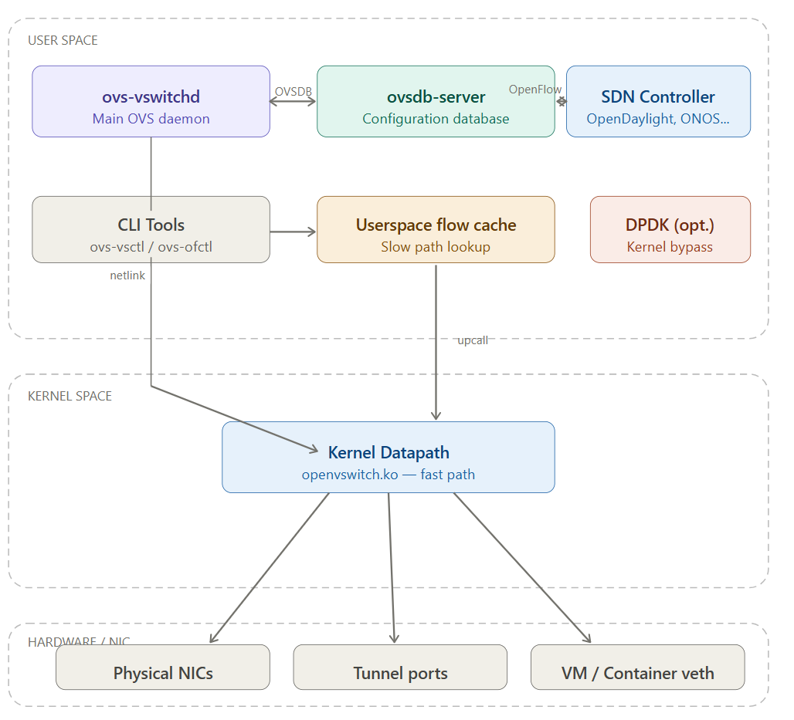
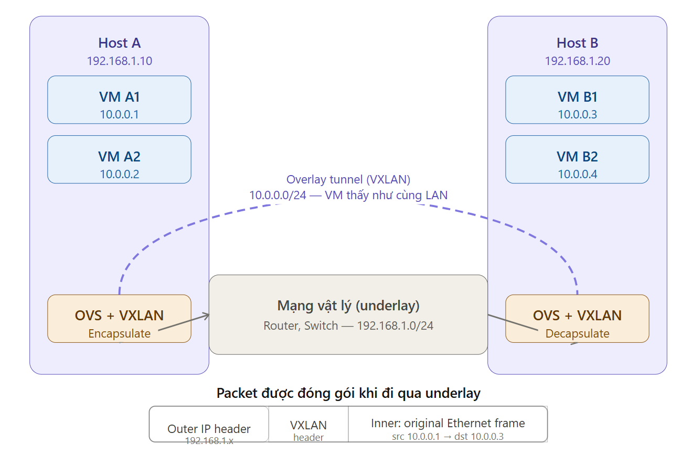
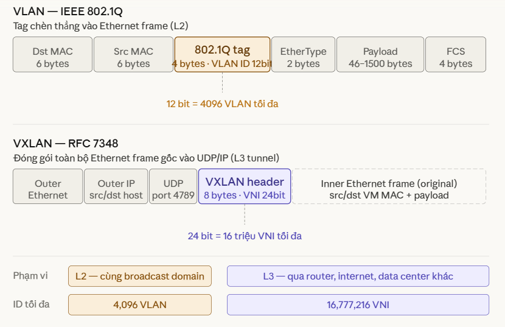
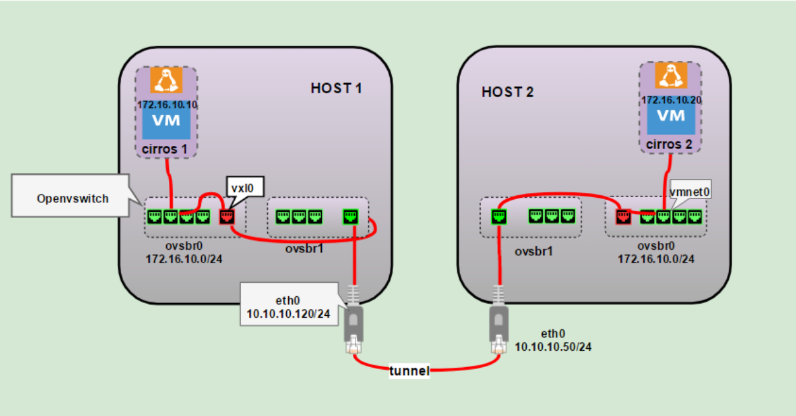
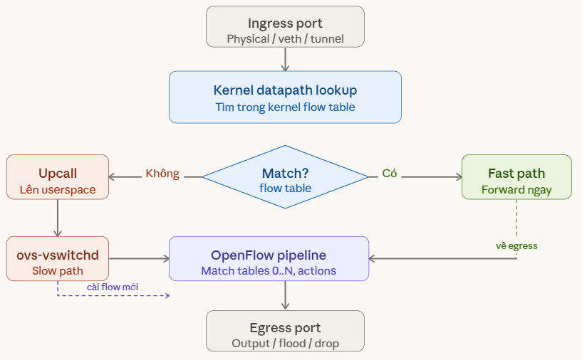
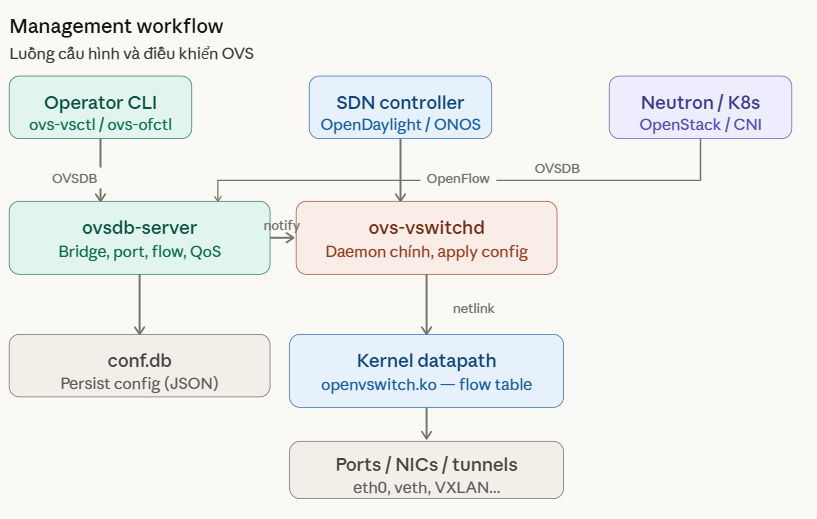
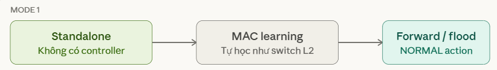
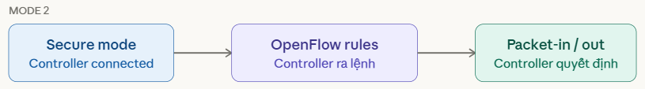
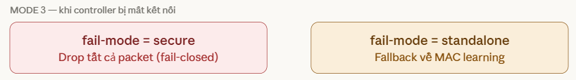
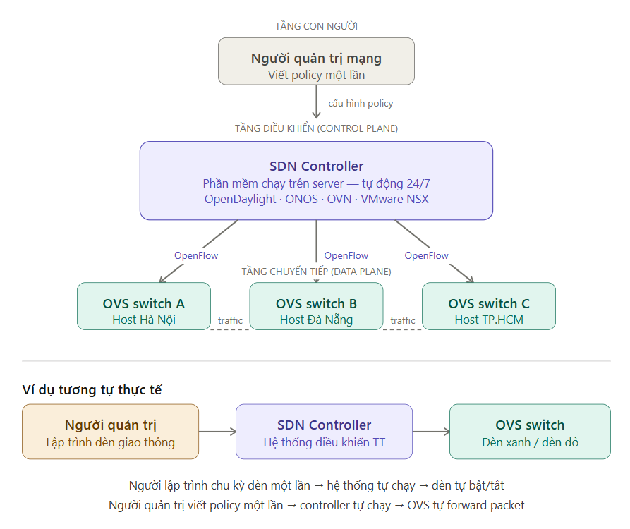

# Open vSwitch

Open vSwitch là một virtual switch hoạt động theo mô hình split architecture:
- Data plane: kernel datapath (fast path)
- Control plane: ovs-vswitchd + SDN controller
- Management plane: OVSDB

Packet được xử lý theo cơ chế flow-based forwarding: lần đầu xử lý ở userspace, sau đó cache xuống kernel để đạt hiệu năng cao.
## 1. Khái niệm
Open vSwitch (OVS) là một virtual switch mã nguồn mở, được thiết kế để dùng trong môi trường ảo hóa và cloud computing. Nó hoạt động giống như một switch trong mạng vật lý, nhưng thay vì kết nối các thiết bị vật lý, OVS kết nối các máy ảo (VM), container, host trong môi trường ảo hóa, vừa hỗ trợ overlay networking – đây là combo lý tưởng cho hạ tầng cloud/SDN.

Điều khiển network giống switch thật (L2/L3) nhưng bằng software

## 2. Các tính năng chính của Open vSwitch
### 2.1 Switching & Forwarding
- **MAC learning**: học địa chỉ MAC động như switch vật lý
- **VLAN tagging/trunking**: hỗ trợ IEEE 802.1Q đầy đủ
- **STP/RSTP**: Spanning Tree Protocol để tránh vòng lặp
- **LACP/Link Aggregation**: gộp nhiều uplinkk tăng băng thông và dự phòng

### 2.2 Tunneling & Overlay

- **VXLAN, GRE, Geneve, STT, LISP** tạo mạng overlay giữa các host vật lý
- Cho phép scale lên hàng triệu tenant (vượt giới hạn 4096 VLAN của 802.1Q)

### 2.3 Flow-based Forwarding (OpenFlow)
- Hỗ trợ OpenFlow 1.0–1.5 – tách control plane khỏi data plane
- Tích hợp với các SDN controller: OpenDaylight, ONOS, Ryu, Faucet
- Multiple flow tables với pipeline xử lý linh hoạt

### 2.4 QoS & Traffic Shaping

- **Ingress policing** (giới hạn tốc độ vào) và egress shaping (rate limiting ra)
- **Queue-based QoS** theo chuẩn OpenFlow

### 2.5 Monitoring & Visibility

- **sFlow** – export telemetry tốc độ cao
- **NetFlow** / IPFIX – flow accounting cho billing/monitoring
- **SPAN/RSPAN** – mirror traffic để phân tích
- **BFD** – Bidirectional Forwarding Detection để phát hiện link failure nhanh

### 2.6 Security

- **OpenFlow ACL** – lọc traffic theo flow rule
- **Port Security** – giới hạn MAC address trên port
- Kết hợp với **Linux iptables/nftables** cho firewall

### 2.7 High Availability

- **OVSDB** database quản lý cấu hình, hỗ trợ clustering
- Hot-reload cấu hình không gián đoạn traffic
- Tích hợp **DPDK (kernel bypass)** cho throughput cực cao ở user space

### 2.8 Tích hợp hệ sinh thái

- Neutron (OpenStack) – backend mạng tiêu chuẩn
- Kubernetes / OVN-Kubernetes – CNI plugin qua OVN (Open Virtual Network)
- Xen, KVM, VirtualBox, Hyper-V

## 3. Open vSwitch Components

### 3.1 User Space
- `ovs-vswitchd`: là tiến trình daemon chính của OVS. Nó thực hiện toàn bộ logic switch: xử lý các packet "upcall" từ kernel khi không tìm thấy flow, tính toán hành động, cài flow mới xuống kernel datapath. Đây là "não" của hệ thống.
- `ovsdb-server` lưu toàn bộ cấu hình dưới dạng database (file JSON). Mọi thứ — bridge, port, VLAN, tunnel, QoS — đều được persist ở đây. `ovs-vswitchd` đọc cấu hình từ đây qua giao thức OVSDB (RFC 7047).
- **Cli Tools**: (`ovs-vsctl`, `ovs-ofctl`) là giao diện người dùng. `ovs-vsctl` thao tác với OVSDB (tạo bridge, thêm port...), còn `ovs-ofctl` gửi lệnh OpenFlow trực tiếp đến `ovs-vswitchd`.
- **Userspace flow cache** là bảng flow tạm thời trong RAM của ovs-vswitchd, dùng cho "slow path" — khi kernel không match được flow và upcall lên userspace để xử lý.
- **SDN Controller** (OpenDaylight, ONOS, Ryu...) kết nối qua giao thức OpenFlow để lập trình flow rule từ xa, tách control plane ra khỏi data plane.
- **DPDK** (tùy chọn) cho phép bypass kernel hoàn toàn, xử lý packet trong userspace với tốc độ cực cao — dùng khi cần throughput line-rate (10/40/100 Gbps).

### 3.2 Kernel Space
**Kernel Datapath `(openvswitch.ko)`** là module kernel thực hiện "fast path" — forwarding packet tốc độ cao dựa trên bảng flow đã được cài sẵn. Khi có packet vào: nếu match flow → forward ngay trong kernel (microsecond); nếu không match → upcall lên ovs-vswitchd xử lý (slow path).

### 3.3 Hardware / NIC
Ba loại port OVS kết nối xuống phần cứng: **Physical NIC** (eth0, eth1...), **Tunnel port** (VXLAN/GRE — tạo overlay network), và **Internal/veth port** (kết nối VM hoặc container).

(Tham khảo rõ hơn từng thành phần tại: http://openvswitch.org/support/dist-docs/ )

### 3.4 Đường đi gói tin mạng
Packet đến NIC → Kernel datapath kiểm tra flow table → Nếu match: forward ngay (fast path) → Nếu không match: upcall lên ovs-vswitchd → vswitchd tra userspace cache, tính action → cài flow mới xuống kernel → forward packet.
## 4. Overlay Network
**Overlay network** là một mạng ảo được xây dựng "chồng lên" mạng vật lý có sẵn.

Ví dụ: bạn có 3 máy chủ vật lý ở 3 địa điểm khác nhau, mỗi máy chạy 10 VM. Các VM trên các máy khác nhau cần nói chuyện với nhau như thể chúng cùng một mạng LAN — nhưng thực tế chúng cách nhau qua nhiều router, switch vật lý.

Overlay network giải quyết bằng cách đóng gói (encapsulate) packet gốc vào bên trong một packet khác để vận chuyển qua mạng vật lý, rồi bóc gói (decapsulate) ở đầu kia trả lại packet gốc.

Cụ thể hơn: VM A1 (`10.0.0.1`) muốn gửi packet đến VM B1 (`10.0.0.3`). Hai VM này ở hai máy vật lý khác nhau, nhưng cả hai đều nghĩ mình đang cùng một mạng `10.0.0.0/24`.

Khi packet rời VM A1, OVS trên Host A bọc nó vào một UDP packet mới với địa chỉ nguồn `192.168.1.10` và đích `192.168.1.20` — đây là IP thật của hai host vật lý. Packet này đi qua mạng vật lý bình thường. Khi đến Host B, OVS bóc lớp vỏ ngoài ra, lấy packet gốc và chuyển vào VM B1 như thể nó đến từ cùng LAN.

Tại sao cần làm vậy?

Mạng vật lý chỉ có tối đa **4096 VLAN** (giới hạn 12-bit của 802.1Q). Trong môi trường cloud có hàng triệu tenant, con số đó không đủ. VXLAN dùng 24-bit VNI (Virtual Network Identifier) — hỗ trợ hơn **16 triệu** mạng ảo độc lập trên cùng một hạ tầng vật lý. Đó là lý do OpenStack, Kubernetes đều dùng VXLAN overlay.

### 4.1 Phân biệt VLAN và VXLAN
- Cả VLAN và VXLAN đều là kỹ thuật phân tách mạng ảo, nhưng ra đời ở 2 thời điểm khác nhau để giải quyết hai bài toán khác nhau.

**VLAN (Virtual LAN)** ra đời từ những năm 90, giải quyết bài toán đơn giản: chia một switch vật lý thành nhiều mạng logic riêng biệt. Switch chèn thêm một tag 4 byte vào Ethernet frame, trong đó 12 bit dùng để đánh ID — tối đa 4096 VLAN. Các máy trong cùng VLAN nói chuyện được với nhau như cùng LAN; khác VLAN thì phải qua router.

VLAN chỉ hoạt động ở Layer 2, tức là switch/router phải hỗ trợ trực tiếp, và không thể đi qua internet hay WAN. Nếu có hai văn phòng ở Hà Nội và TP.HCM, bạn không thể kéo VLAN qua đường truyền giữa hai nơi mà không có thiết bị đặc biệt.

**VXLAN (Virtual eXtensible LAN)**: ra đời năm 2012, thiết kế cho cloud. Thay vì chèn tag vào frame gốc, nó bọc toàn bộ Ethernet frame gốc vào một UDP packet mới rồi gửi qua mạng IP bình thường. Phần header thêm vào có 24-bit VNI (VXLAN Network Identifier) — hơn 16 triệu network độc lập.

Vì chạy trên UDP/IP (Layer 3), VXLAN đi được qua bất kỳ mạng IP nào — kể cả internet, WAN, giữa các data center. VM ở Hà Nội và VM ở TP.HCM có thể cùng một "VLAN ảo" mà không cần thiết bị đặc biệt ở giữa.

VXLAN thực chất là một tunnel: bên ngoài là giao tiếp bình thường giữa hai host vật lý qua IP, bên trong là mạng ảo riêng của các VM/container — hai lớp hoàn toàn độc lập với nhau.

Tóm tắt sự khác nhau
|  Thuộc tính  | VLAN | VXLAN |
|----|------|-------|
| Hoạt động ở | Layer 2 |Layer 3(tunnel qua UDP/IP)|
| Số lượng ID| 4,096 | 16+ triệu| 
| hạm vi| Trong cùng switch/campus| Qua internet, multi-datacenter| 
| Overhead| 4 byte | ~50 byte(header UDP+IP+VXLAN)| 
| Dùng cho| Enterprise LAN truyền thống| Cloud, OpenStack, Kubernetes|

## 5. Kiến trúc xử lý gói tin (Packet Processing) và luồng quản lý (Management Workflow) trong Open vSwitch
**Packet Processing (luồng xử lý gói tin)**

Khi một packet đến OVS, mọi thứ bắt đầu ở **kernel datapath**. Module `openvswitch.ko` tra bảng flow trong kernel — nếu đã có rule khớp (flow cache hit), packet được forward ngay trong kernel mà không cần lên userspace. Đây là **fast path**, độc lập hoàn toàn với userspace, latency chỉ vài microsecond.

Nếu không tìm thấy flow nào khớp (miss), kernel gửi upcall lên `ovs-vswitchd` ở userspace. `vswitchd` tra OpenFlow pipeline — một chuỗi flow table từ 0 đến N, mỗi table có thể match nhiều trường (MAC, IP, port, VLAN...) và thực hiện action (output, drop, mod field, goto table...). Sau khi tìm ra action, `vswitchd` làm hai việc: forward packet đó, và cài flow mới xuống kernel qua netlink để các packet tiếp theo cùng loại đi fast path. Đây là slow path, chỉ xảy ra lần đầu.

**Management Workflow (luồng quản lý)**

Có ba nguồn điều khiển OVS:
- **Operator CLI** dùng `ovs-vsctl` để tạo bridge, thêm port, cấu hình VLAN — ghi vào `ovsdb-server` qua giao thức OVSDB. `ovs-vsctl` add-br br0 là ví dụ điển hình.
- **SDN Controller** (OpenDaylight, ONOS, Ryu...) kết nối trực tiếp đến `ovs-vswitchd` qua giao thức **OpenFlow**, gửi flow rule động — không cần qua OVSDB. Đây là control plane tách biệt hoàn toàn.
- `Neutron / Kubernetes CNI` ghi cấu hình vào **ovsdb-server** theo cách tự động khi spawn VM hay pod mới.
- `ovsdb-server` là nguồn sự thật duy nhất cho cấu hình. `ovs-vswitchd` subscribe vào OVSDB — mỗi khi có thay đổi (thêm port, sửa VLAN...), vswitchd nhận notify và **apply ngay xuống kernel datapath** qua netlink. Mọi config được persist vào file `conf.db` trên disk — reboot xong OVS tự khôi phục toàn bộ trạng thái.

## 6. Open vSwitch - controller connection modes
### 6.1 Standalone

OVS hoạt động như một L2 switch thuần — tự học MAC address, flood unknown unicast, forward theo bảng MAC. Flow rule mặc định được cài là `actions=NORMAL`, tức là OVS tự quyết định mọi thứ. Không cần controller, không cần cấu hình phức tạp. Phù hợp cho lab, dev environment, hoặc các deployment đơn giản không cần SDN.

### 6.2 Secure (có controller)

Controller toàn quyền kiểm soát forwarding qua OpenFlow. OVS không tự học MAC — khi có packet không khớp flow nào, nó gửi Packet-In lên controller, controller trả về Packet-Out kèm action. Mọi flow rule đều do controller cài xuống. Đây là mode SDN thực sự, dùng trong OpenStack, OVN, NSX.

### 6.3 Fail modes (khi mất controller)

`fail-mode=secure` — drop toàn bộ packet. Không có controller thì không forward gì cả. An toàn nhất, tránh loop và traffic leak trong môi trường multi-tenant. OpenStack Neutron dùng mode này mặc định.

`fail-mode=standalone` — tự động fallback về MAC learning như switch L2 bình thường. Traffic vẫn đi được dù mất controller. Ưu tiên uptime hơn security, dùng cho edge hoặc môi trường không có yêu cầu isolation nghiêm ngặt.

## 7. Controller trong SDN
Controller ở đây là một phần mềm chạy trên server, không phải người. Người quản trị cấu hình controller một lần, sau đó controller tự động vận hành.

Trong SDN, control plane được tách khỏi data plane. Controller đóng vai trò trung tâm, lập trình hành vi của các switch như Open vSwitch thông qua các giao thức như OpenFlow.

Controller là một phần mềm, chạy liên tục trên một server riêng (hoặc cluster server), hoạt động tự động 24/7 không cần người ngồi điều khiển.

**Người quản trị mạng** ngồi viết policy một lần, kiểu như "VM nào thuộc tenant A thì chỉ nói chuyện được với nhau, không được ra ngoài" hay "traffic từ web server chuyển về database server phải đi qua firewall". Sau đó họ nạp policy này vào controller rồi thôi.

**SDN Controller** là phần mềm nhận policy đó và tự động dịch thành flow rule OpenFlow, rồi tự động cài xuống tất cả các OVS switch trong hệ thống. Khi có VM mới được tạo ra lúc 3 giờ sáng, controller tự tính toán và cài flow rule mới — không cần người ngồi canh. Các ví dụ phần mềm controller thực tế: OpenDaylight, ONOS, OVN (Open Virtual Network — controller đi kèm OVS luôn), VMware NSX.

**OVS switch** chỉ là "tay chân" — nhận lệnh từ controller qua giao thức OpenFlow, cài vào bảng flow, rồi forward packet theo đúng rule đó.

Ví dụ: hệ thống đèn giao thông thông minh. Kỹ sư lập trình chu kỳ đèn và quy tắc ưu tiên một lần — sau đó hệ thống điều khiển trung tâm tự vận hành, tự điều chỉnh theo mật độ xe, không cần người đứng điều khiển từng cái đèn. OVS switch chính là từng cái đèn đó.

Một số controller phổ biến:
- OpenDaylight
- ONOS
- VMware NSX
- OVN (dùng với OVS)

## 8. Openflow
OpenFlow là một giao thức mạng — cụ thể là ngôn ngữ giao tiếp giữa SDN Controller và OVS switch. Nó định nghĩa chính xác controller communicate với switch như thế nào.

Switch truyền thống (Cisco, Juniper...) gộp cả control plane (quyết định forward đi đâu) và data plane (thực sự forward) vào trong cùng một thiết bị. OpenFlow tách hai thứ đó ra — controller, switch. OpenFlow là dây nối giữa hai phần.

Mỗi OVS switch giữ một bảng flow gồm 3 cột:
- **Match fields** — mô tả packet trông như thế nào: đến từ port nào, MAC nguồn/đích, IP nguồn/đích, TCP port, VLAN tag... Có thể match một trường hoặc kết hợp nhiều trường cùng lúc.
- **Priority** — số càng cao càng ưu tiên. Khi một packet khớp nhiều rule cùng lúc, rule có priority cao nhất thắng.
- **Actions** — làm gì với packet đó: output:2 (chuyển ra port 2), drop (hủy), set_vlan (gắn VLAN tag), CONTROLLER (gửi lên hỏi controller)...

**Các loại message**

- OpenFlow hoạt động như một cuộc hội thoại qua TCP giữa controller và switch:
- **Hello / Features** — bắt tay khi kết nối lần đầu, switch báo cho controller biết mình có bao nhiêu port, hỗ trợ OpenFlow version nào.
- **Flow-Mod** — controller ra lệnh thêm, sửa hoặc xóa một flow rule trong bảng flow của switch. Đây là lệnh quan trọng nhất.
- **Packet-In / Packet-Out** — khi packet đến mà không khớp rule nào, switch gửi Packet-In lên hỏi controller. Controller trả lời bằng Packet-Out kèm action, đồng thời thường cài thêm Flow-Mod để các packet tương tự sau này không phải hỏi nữa.
- **Stats Request/Reply** — controller hỏi switch về thống kê: bao nhiêu byte đã đi qua một rule, packet count, port utilization... dùng cho monitoring và traffic engineering.

## So sánh Open vSwitch với Linux Bridge

**Linux Bridge — switch ảo "nguyên thủy"**

- `bridge.ko` là module đã có trong kernel Linux từ lâu, không cần cài thêm gì. Hoạt động hoàn toàn trong kernel, không có userspace daemon, nên overhead cực thấp. Cấu hình bằng brctl hoặc ip link — quen thuộc, dễ debug.
- Nhưng nó chỉ hiểu L2: thấy frame Ethernet thì học MAC, flood nếu không biết đích, forward nếu biết. Không có flow pipeline, không có OpenFlow, không có VXLAN tích hợp sẵn. Muốn làm gì phức tạp hơn phải ghép thêm `iptables`, `tc`, `ip link add` thủ công từng thứ.
- Docker khi tạo network mặc định (docker0) dùng Linux Bridge. Đủ dùng cho môi trường đơn giản.

**OVS — switch ảo "lập trình được"**
- OVS ra đời để phục vụ cloud và SDN. Nó có cả kernel module lẫn userspace daemon, có OVSDB để lưu config, có OpenFlow để nhận lệnh từ controller. Toàn bộ các tính năng — VLAN, VXLAN, GRE, QoS, sFlow, NetFlow — đều tích hợp sẵn và quản lý tập trung qua OVSDB.
- Điểm mạnh lớn nhất là khả năng lập trình được: controller có thể thay đổi toàn bộ hành vi forwarding trong milliseconds mà không cần chạm vào cấu hình host. Đây là điều Linux Bridge không thể làm.
- Đánh đổi là độ phức tạp vận hành cao hơn nhiều — phải hiểu cả ba tầng: OVSDB, OpenFlow pipeline, và kernel datapath.

| Tiêu chí | Linux Bridge | Open vSwitch |
|---------|-------------|--------------|
| KIẾN TRÚC | - Một module kernel đơn giản bridge.ko, tích hợp sẵn Linux. Không có userspace daemon | Kernel module + userspace daemon openvswitch.ko + ovs-vswitchd + ovsdb-server |
| HOẠT ĐỘNG Ở LAYER | Layer 2 (L2) MAC forwarding only | Layer 2 + L3 + tunnel MAC, IP, VXLAN, GRE... |
| FLOW CONTROL | Không có — MAC learning đơn giản iptables/nftables cho filtering | OpenFlow pipeline đầy đủ Multi-table, priority, actions |
| SDN CONTROLLER | Không hỗ trợ Không có OpenFlow | Hỗ trợ đầy đủ OpenFlow 1.0–1.5 |
| VLAN / TUNNEL | VLAN cơ bản (802.1Q) Tunnel cần thêm ip link tạo thủ công từng cái | VLAN, VXLAN, GRE, Geneve Tích hợp sẵn, quản lý tập trung qua OVSDB |
| QoS / MONITORING | Không có QoS native Cần tc (traffic control) | QoS, sFlow, NetFlow, IPFIX Tích hợp sẵn, lập trình được |
| HIỆU NĂNG | Rất nhanh cho L2 đơn giản Overhead thấp — thuần kernel Không hỗ trợ DPDK | Fast path: ngang Linux Bridge Slow path: upcall tốn thêm DPDK mode: line-rate |
| ĐỘ PHỨC TẠP VẬN HÀNH | Đơn giản, dễ debug brctl / ip link — quen thuộc | Phức tạp hơn đáng kể OVSDB + OpenFlow + daemon |
| DÙNG KHI NÀO | Lab, dev VM đơn giản Docker bridge mặc định, LXC | OpenStack, Kubernetes, cloud Multi-tenant, SDN, production |