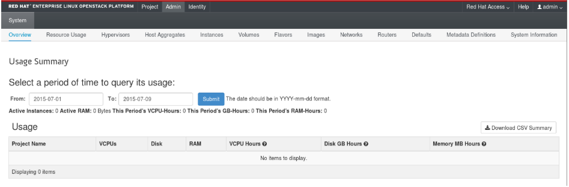

# Introduction to the OpenStack Dashboard
The OpenStack dashboard is a web-based graphical user interface for managing OpenStack services.

To access the browser dashboard, the dashboard service must be installed, and you must know the dashboard host name (or IP) and login password. The dashboard URL is:
```bash
http://HOSTNAME/dashboard/
```

## 2. The Admin Tab
The Admin tab provides an interface where administrative users can view usage and manage instances, volumes, flavors, images, projects, users, services, and quotas.

> Note: The Admin tab displays in the main window only if you have logged in as a user with administrative privileges.

