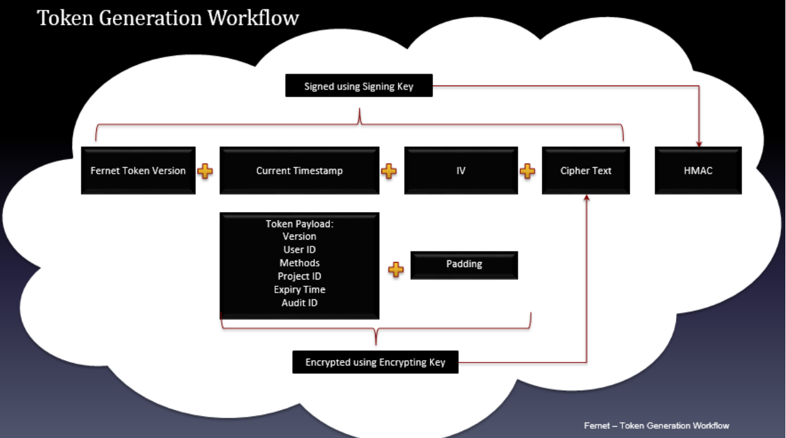
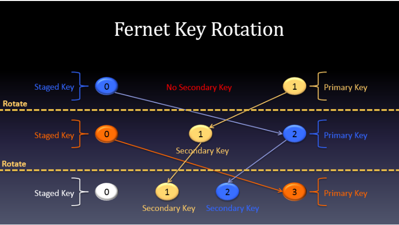
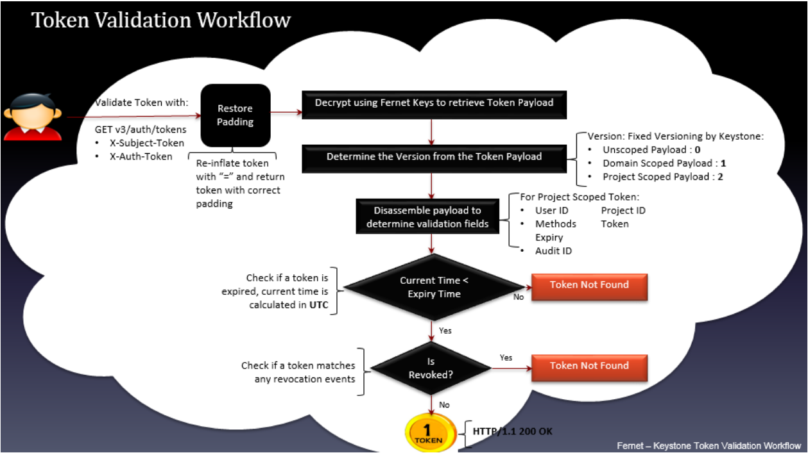
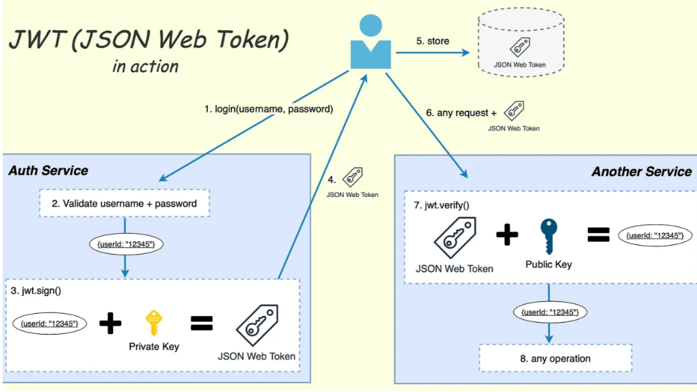
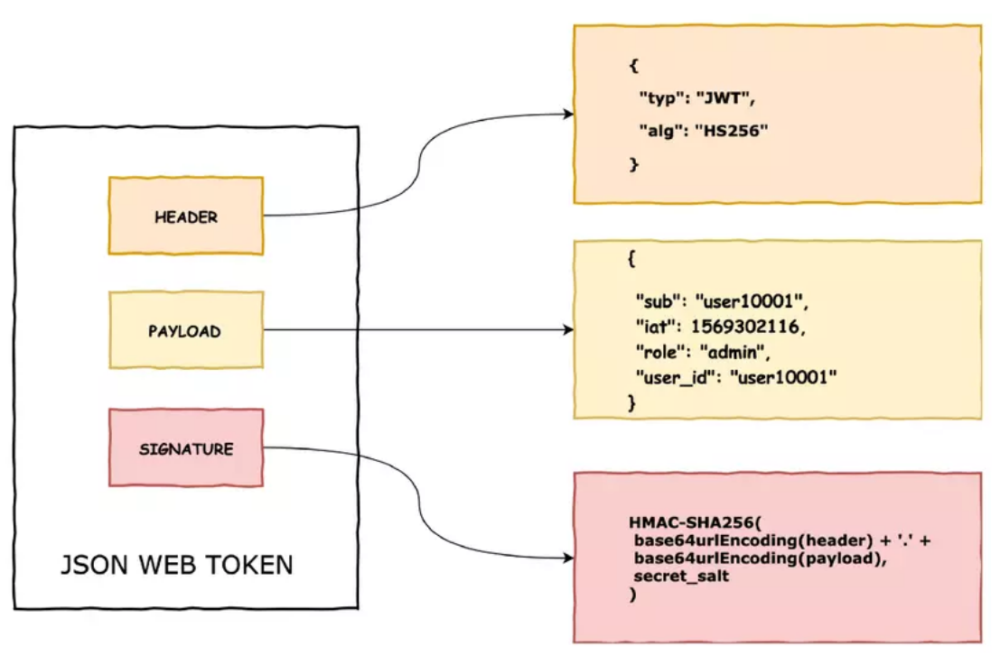

# Token Formats
Tokens được sử dụng để xác thực và ủy quyền tương tác của user với Openstack APIs. Tokens được chia thành nhiều phạm vi 
## 1. Authorization Scopes (Phạm vi quyền hạn của Token)
Authorization Scope (phạm vi ủy quyền) là cách OpenStack giới hạn token chỉ được phép hoạt động trong một phạm vi nhất định.

Token không phải lúc nào cũng có quyền làm mọi thứ. Mỗi token chỉ được cấp quyền trong một scope (một phạm vi) duy nhất:
  - Project
  - Domain
  - System

Token scoped cho project A không thể dùng để làm việc ở project B.
### 1.1 Unscoped Token (Token không có scope)
- Đây là thẻ chỉ chứng minh "Tôi là ai" (đã nhập đúng user/password), nhưng chưa cấp quyền đi vào bất kỳ phòng ban nào. 
  - Không chứa:
    - Service Catalog
    - Roles
    - Project/Domain/System information
- Mục đích chính: Dùng để sau này xin cấp token có scope(scoped token), mà không cần nhập lại username/password nhiều lần.
- Điều kiện để nhận unscoped token:
  - Không chỉ định project/domain nào khi authenticate
  - Tài khoản của bạn không có default project (hoặc có nhưng bạn chưa có role trong đó).

### 1.2 Project-scoped Token (Token scoped theo Project) - Phổ biến nhất
- Dùng cho người dùng thông thường (end-user)
- Token này cho phép bạn làm việc trong một project cụ thể (ví dụ: tạo máy ảo, tạo volume, tạo network,...)
- Token chứa:
  - Service Catalog
  - Các role bạn có trong project đó
  - Thông tin về project

### 1.3 Domain-scoped Token
- Dùng cho quản trị viên domain (domain admin)
- Domain là không gian chứa nhiều project, user, group.
- Token này cho phép bạn:
  - Tạo user mới
  - Tạo project mới
  - Quản lý user/group trong domain đó
- Token chứa thông tin về domain

### 1.4 System-scoped Token
- Dùng cho Operator/ Cloud Administrator (người quản trị toàn hệ thống)
- Dùng cho các thao tác ảnh hưởng đến toàn bộ cloud, ví dụ:
  - Quản lý service
  - Thêm/sửa endpoint
  - Xem thông tin hypervisor
  - Một số API hệ thống khác
- Token chứa thông tin về "system" (toàn bộ deployment)
- Khi bạn cần thực hiện các thao tác ở tầng hạ tầng cốt lõi (ví dụ như quản lý các máy chủ vật lý, can thiệp vào các hypervisor như KVM để di chuyển máy ảo, hoặc cấu hình mạng lưới), bạn bắt buộc phải dùng thẻ này. Nó tác động đến toàn bộ hệ thống (deployment system) chứ không chỉ một dự án lẻ tẻ.

### 1.5 Tại sao cần chia nhiều scope
- Để an toàn và tuân thủ nguyên tắc Least Privilege
  - Người bình thường chỉ được phép làm việc trong project của họ.
  - Domain admin chỉ quản lý được trong domain của mình.
  - Chỉ Operator mới được phép chạm vào cấu hình hệ thống.

## 2. Token Providers
Keystone (Identity service) có thể tạo ra nhiều loại token khác nhau. Người dùng cấu hình loại token nào sẽ được sử dụng trong file `/etc/keystone/keystone.conf`

Keystone hiện hỗ trợ 2 công nghệ chính để đúc ra thẻ (Token Provider): **Fernet** và **JWS.**

Cả hai đều không lưu token vào database (non-persistent), giúp tránh database bị phình to.
### 2.0 Payload
Payload là phần dữ liệu vận chuyển của một gói tin giữa 2 đối tác, mà không chứa dữ liệu giao thức hay siêu dữ liệu chỉ được gửi đi để dùng cho việc chuyên chở payload. Payload thường là văn bản, dấu hiệu hay âm thanh. Payload thường nằm dưới phần đầu (header), và tùy theo giao thức mạng có thể có thêm phần cuối (trailer).
### 2.1 Fernet Tokens
UUID: Token random → phải check DB → chậm → bỏ

PKI: Token chứa full info → quá to → bỏ

UUID bị bottleneck do phải validate qua Keystone. PKI giải quyết bằng cách self-contained nhưng token quá lớn. Vì vậy OpenStack chuyển sang Fernet – vừa nhỏ, vừa stateless, phù hợp production.
#### Khái niệm 
Fernet token là một định dạng token xác thực (bearer token) được giới thiệu trong OpenStack phiên bản Kilo (2015) và hiện là định dạng mặc định của Keystone
#### Cấu trúc kỹ thuật
Một Fernet token không phải là chuỗi ngẫu nhiên, mà là một cấu trúc dữ liệu được mã hóa theo công thức:



```bash
Version || Timestamp || IV || Ciphertext || HMAC
```

| Thành phần | Mô tả | Mục đích |
|------------|-------|----------|
| Version | Số phiên bản định dạng (hiện tại là `0x80`)| Đảm bảo tương thích ngược khi nâng cấp |
| Timestamp | Thời gian tạo token (Unix epoch, 8 bytes) | Kiểm tra hạn token mà không cần query DB |
| IV | Initialization Vector (16 bytes) | Đảm bảo cùng nội dung mã hóa 2 lần sẽ ra 2 kết quả khác nhau |
| Ciphertext | Payload đã mã hóa bằng **AES-128-CBC**(128 bit) | Chứa thông tin user ID, project, roles, service catalog,... |
| HMAC | Chữ ký xác thực bằng **SHA256-HMAC** (128 bit) | Chống giả mạo: nếu token bị sửa 1 bit, HMAC sẽ sai và bị từ chối |

Toàn bộ chuỗi sau đó được mã hóa base64url (an toàn cho URL/header HTTP) để tạo thành token cuối cùng.
#### Đặc điểm nổi bật
- Không cần lưu trữ(Stateless): Token không ghi vào database giảm tải I/O, không bị "bload" bảng token, không cần cron job dọn dẹp.
- Kích thước nhỏ (< 250 byte): tiết kiệm bandwidth, đặc biệt quan trọng khi token đi kèm mọi request API.
- **Fernet key**: Sử dụng Mã hóa đối xứng (Symmetric encryption). Nghĩa là dùng chung 1 "chìa khóa" (Key) để vừa tạo ra thẻ, vừa kiểm tra thẻ. Nội dung thẻ bị mã hóa hoàn toàn, người ngoài nhìn vào chỉ thấy một chuỗi ký tự vô nghĩa (ciphertext).
- Mã hóa đối xứng hiệu năng cao: AES-128 + HMAC-SHA256 chạy rất nhanh trên phần cứng hiện đại, độ trễ validate token chỉ ~5ms
- Hỗ trợ xoay khóa linh hoạt: Cơ chế `staged/primary/secondary` keys cho phép rotate khóa mà không làm gián đoạn dịch vụ 
- Web-safe: Định dạng base64url có thể truyền trực tiếp qua HTTP header `X-Auth-Token` mà không cần encoding thêm

#### Hạn chế & lưu ý bảo mật
- Fernet Tokens là bearer token nghĩa là Ai có token là có quyền user đó, luôn dùng https, không log token, set short expiration. 
- Khóa đối xứng phải đồng bộ: Tất cả node Keystone phải có cùng `key_repository` mặc định là: `/etc/keystone/fernet-keys/`. Nếu lộ 1 khóa, attacker có thể tạo token giả. → Dùng Ansible/Puppet để phân phối khóa an toàn, `chmod 400/600`, `chown keystone:keystone`
- Payload không minh bạch: Bạn không thể "đọc" token bằng mắt thường để debug. Phải dùng `keystone token-get` hoặc decode bằng tool có khóa.
- Thu hồi token khó: Vì không lưu DB, không thể revoke 1 token cụ thể. Cách duy nhất: rotate toàn bộ khóa → mọi token cũ vô hiệu ngay lập tức

#### Quy trình xoay khóa (Key Rotation)

Cơ chế 3 loại khóa giúp Fernet vừa an toàn vừa không downtime:
```bash
[Staged:0] → [Primary:N] → [Secondary:N-1, N-2, ...]
```
- **Staged Key**(luôn có đúng 1, tên là file `0`)
  - Đây là "key tiếp theo sẽ biến thành Primary"
  - Khóa mới, chưa dùng để mã hóa, chỉ dùng để giải mã.
- **Primary Key**
  - Khóa duy nhất dùng để encrypt (tạo) token mới và decrypt token cũ
  - Luôn có số thứ tự cao nhất
- **Secondary Key**
  - Là Primary key cũ, nay bị hạ cấp
  - Chỉ dùng để decrypt token (không tạo token mới).

Công thức tính `max_active_keys` để giữ đủ khóa giải mã:
```bash
max_active_keys = (token_expiration / rotation_frequency) + 2
# +2 cho staged key + buffer
```



#### Token validation workflow



- Gửi yêu cầu xác thực token với API GET v3/auth/tokens
- Khôi phục lại padding, trả lại token với padding chính xác
- Decrypt sử dụng Fernet Keys để thu lại token payload
- Xác định phiên bản của token payload. (Unscoped token: 0, Domain scoped payload: 1, Project scoped payload: 2 )
- Tách các trường của payload để chứng thực. Ví dụ với token trong tầm vực project gồm các trường sau: user id, project id, method, expiry, audit id
- Kiểm tra xem token đã hết hạn chưa. Nếu thời điểm hiện tại lớn hơn so với thời điểm hết hạn thì trả về thông báo "Token not found". Nếu token chưa hết hạn thì chuyển sang bước tiếp theo
- Kiểm tra xem token đã bị thu hồi chưa. Nếu token đã bị thu hồi (tương ứng với 1 sự kiện thu hồi trong bảng revocation_event của database keystone) thì trả về thông báo "Token not found". Nếu chưa bị thu hồi thì trả lại token (thông điệp phản hồi thành công HTTP/1.1 200 OK)

#### Quy trình Tạo Token (Creation):

- Client gửi POST `/v3/auth/tokens` với credentials (`username`, `password`, `project/scope`…).
- Keystone thu thập:
  - User info (từ Identity backend: LDAP/SQL).
  - Project/Domain info (Resource backend).
  - Roles (Assignment backend).
  - Service Catalog (endpoints).
- Xây dựng payload (claims): user_id, project_id, roles, expires_at, audit_id, issued_at…
- Sử dụng Fernet symmetric key (từ thư mục fernet-keys/) để mã hóa + ký payload → sinh ra Fernet token string.
- Trả token về client trong header X-Subject-Token.
- Không lưu token đầy đủ vào DB (chỉ lưu revocation events nếu cần).

#### Quy trình Xác thực Token (Validation):
- Service khác gửi request kèm X-Auth-Token: `<fernet-token>`.
- Keystone lấy token → giải mã bằng cùng bộ Fernet key (phải sync key giữa các node).
- Kiểm tra:
  - Chữ ký hợp lệ không?
  - Token có expired chưa? (so sánh expires_at với thời gian hiện tại UTC).
  - Token có bị revoke không? (kiểm tra revocation_event table).

Nếu OK → trả 200 với token info (user, roles, catalog…). Không cần query token table như UUID cũ.

#### Quy trình Thu hồi Token (Revocation):

Dùng DELETE /v3/auth/tokens.
Tạo event trong bảng revocation_event (dựa trên audit_id hoặc user/project/issued_before).
Keystone tự prune (dọn) các event của token đã expired để bảng không to.

Lưu ý triển khai: Phải chạy keystone-manage fernet_setup và fernet_rotate định kỳ (thường 1-3 tháng/lần). Key phải sync qua tất cả node (thường qua Ansible hoặc shared storage).

### 2.2 JWS Token (JSON Web Signature)



JWS (JSON Web Signature) là một chuẩn IETF (RFC 7515) để ký điện tử hoặc xác thực dữ liệu JSON bằng MAC 

Trong OpenStack, JWS token provider được thêm vào từ phiên bản Stein (2019) như một lựa chọn thay thế cho Fernet, đặc biệt phù hợp với kiến trúc microservice và federated identity

#### Cấu trúc JWS Compact Serialization
Token JWS trong Keystone dùng định dạng "compact" (3 phần nối bằng dấu chấm), tương tự JWT:

```bash
BASE64URL(UTF8(Protected Header)) . BASE64URL(Payload) . BASE64URL(Signature)
```
VÍ DỤ:
```bash
eyJhbGciOiJFUzI1NiIsInR5cCI6IkpXVCJ9.eyJ1c2VyX2lkIjoi...
.MEUCIQDxK... (chữ ký ECDSA)
```

| Phần | Nội dung | Ghi chú |
|------|----------|---------|
| Protected Header | `{"alg":"ES256", "typ":"JWT", "kid":"..."}`| Thuật toán ký, loại token, ID khóa công khai |
| Payload | JSON chứa `user_id`, `project_id`, `roles`, `exp`, `scope`,...| Đọc được sau khi base64 decode, nhưng không được tin cậy nếu chưa verify chữ ký|
| Signature | Chữ ký ECDSA P-256 + SHA-256 (ES256) | Tạo bằng private key, verify bằng public key tương ứng|



#### Đặc điểm nổi bật
- **Chữ ký bất đối xứng**: Mỗi node Keystone tự sinh cặp khóa. Chỉ cần sync `public key` giữa các node, `private key` không bao giờ rời node → giảm rủi ro lộ khóa tập trung
- **Payload minh bạch(nhưng không tin cậy)**: Có thể decode base64 để debug nhanh nội dung token (user, project, expiry...) mà không cần gọi API. Lưu ý: Luôn validate chữ ký qua Keystone trước khi dùng thông tin này
- **Tương thích chuẩn JWT**: Dễ dàng tích hợp với hệ thống bên ngoài dùng OIDC/OAuth2, reverse proxy, API gateway hiểu JWT
- **Không cần persistence**: Giống Fernet, token không lưu DB hiệu năng cao, không bload database.

#### Hạn chế và lưu ý bảo mật
- **Payload đọc được**: Không chứa thông tin nhạy cảm (password, secret). Keystone có thể thay đổi cấu trúc payload bất cứ lúc nào → không build logic business dựa vào decoded payload
- **Token lớn hơn Fernet**: Do chứa JSON plaintext + chữ ký ECDSA (~300-400 bytes), lớn hơn Fernet (~250 bytes) → cân nhắc nếu bandwidth là bottleneck
- **Quản lý public key phức tạp**: Phải đảm bảo mọi node có public key của tất cả node khác. Nếu thiếu, token từ node A sẽ fail validate ở node B.

#### Quy trình xoay khóa JWS
Quy trình xoay khóa (key rotation) JWS được thiết kế cực kỳ an toàn và không downtime nhờ đặc tính bất đối xứng (asymmetric cryptography) của JWS/JWT.

Khác hoàn toàn với Fernet (symmetric cryptography – dùng chung 1 secret key để vừa ký vừa verify), JWS chỉ cần private key để ký (sign) và public key để verify. Private key không bao giờ cần truyền qua mạng, chỉ public key được sync → giảm thiểu rủi ro lộ key rất nhiều.

##### 1.Sinh key pair mới trên node cần rotate: Chỉ thực hiện trên node đang rotate (không cần làm trên tất cả node).
```bash
# Tạo private key mới (bí mật)
openssl genpkey -algorithm RSA -out private_new.pem -pkeyopt rsa_keygen_bits:4096

# Tạo public key tương ứng (có thể public)
openssl rsa -in private_new.pem -pubout -out public_new.pem
```
  - Private Key chỉ tồn tại trên node này
  - Public Key sẽ được sync ra ngoài
  - Nên dùng key ID (kid) trong header JWT để sau này dễ quản lý nhiều key cùng lúc (ví dụ: `kid: "2026-04-13-rotated-node1"`).

##### 2.Sync public key mới sang `jws_public_key_repository` của tất cả node trong cluster.
  - `jws_public_key_repository` thường là một thư mục (hoặc volume shared, S3, Consul KV, etcd, database…) mà tất cả các node đều đọc được.
  - Chỉ copy file `public_new.pem` (hoặc public key dưới dạng base64/JWK) vào repository.
  - Không sync private key → đây là điểm khác biệt lớn nhất và an toàn nhất so với Fernet.
  - Sau bước này: Mọi node đều có cả public key cũ + public key mới trong repository.
  - Logic verify token sẽ thử tất cả public keys trong repo (hoặc dùng `kid` trong JWT header để chọn key chính xác).

##### 3.Thay private key trên node đang rotate → node bắt đầu ký token bằng khóa mới.
```bash
# Đổi tên private key mới thành private key đang active
mv private_new.pem private.pem

# (Tùy hệ thống) restart service hoặc reload config nếu cần
# Ví dụ: systemctl reload your-app-service
```

 - Từ lúc này, mọi token mới được node này ký sẽ dùng private key mới.
  - Các node khác vẫn verify được vì chúng đã có public key mới ở bước 2.
  - Token cũ (đã ký bằng private cũ) vẫn hợp lệ vì public key cũ vẫn còn trong repository.
  - Zero downtime, user không bị logout

##### 4.Đợi token cũ hết hạn (≥ `token_expiration` trong config). Đây là bước quan trọng nhất để không làm gián đoạn người dùng.
- Giả sử `token_expiration = 24h (86400 giây)`, bạn phải chờ ít nhất 24 giờ (thường chờ thêm buffer 10-30 phút để an toàn).
- Trong khoảng thời gian này:
  - Token mới - ký bằng private mới
  - Token cũ - vẫn verify được nhờ public key cũ còn trong repo
  - Nếu xóa public key cũ quá sớm → tất cả user đang dùng token cũ sẽ bị 401 Unauthorized ngay lập tức → trải nghiệm người dùng tệ.
  - Chờ tự nhiên hết hạn là cách rotation không downtime và không cần refresh token bắt buộc.
##### 5.Xóa public key cũ khỏi tất cả node (quan trọng nếu private key cũ bị lộ).
- Sau khi đã chờ đủ thời gian:
  - Xóa file `public_old.pem` (hoặc key có kid cũ) khỏi `jws_public_key_repository` trên tất cả node.
  - (Tùy hệ thống) có thể trigger reload key repository mà không restart service.
- Không cần downtime, không cần sync private key qua mạng.

Đảm bảo sau này không ai (kể cả attacker) có thể dùng private key cũ để ký token mới hợp lệ.

Đây chính là cơ chế revocation tự nhiên của key rotation.
Nếu private key cũ bị lộ (leak) → sau bước 5, attacker không thể tạo token mới hợp lệ nữa, dù hắn có private key.

#### Quy trình Tạo Token (Creation) – Tương tự Fernet ở bước thu thập dữ liệu:
- Client gửi auth request như trên.
- Keystone thu thập user, project, roles, catalog…
- Xây dựng JWT payload (claims giống Fernet).
- Sử dụng private key (file private.pem trong jws_private_key_repository) để ký (thường dùng thuật toán ES256 – ECDSA P-256 + SHA256).
- Sinh token dạng: header.payload.signature (Base64).
- Trả token về client.

#### Quy trình Xác thực Token (Validation):
- Service gửi request với token.
- Keystone lấy tất cả public keys từ jws_public_key_repository.
- Thử verify signature bằng từng public key (hoặc dùng kid trong header nếu có).
- Kiểm tra expiration và revocation (giống Fernet).
- Nếu hợp lệ → trả thông tin token.

#### Quy trình Key Rotation (điểm mạnh nhất của JWS – như bạn hỏi trước):
- Trên node cần rotate: sinh key pair mới (keystone-manage create_jws_keypair hoặc openssl).
- Sync public key mới sang jws_public_key_repository của tất cả node.
- Thay private.pem trên node đó bằng private mới → node bắt đầu ký token mới.
- Đợi hết thời gian expiration của token cũ.
- Xóa public key cũ khỏi tất cả node.

→ Zero downtime, private key không bao giờ truyền qua mạng.
### 3. So sánh nhanh

| Tiêu chí | Fernet | JWS (JWT) |
|---------|--------|----------|
| Loại mã hóa | Đối xứng (AES-128 + HMAC-SHA256) | Bất đối xứng (ECDSA ES256: P-256 + SHA-256) |
| Payload | Opaque (ciphertext, không đọc được) | JSON plaintext (có thể base64 decode) |
| Kích thước token | ~250 bytes (gần như cố định) | ~300–400 bytes (phụ thuộc payload) |
| Quản lý khóa | Phải đồng bộ toàn bộ key repository giữa các node | Chỉ cần sync public key; private key giữ tại từng node |
| Rotate khóa | `keystone-manage fernet_rotate` + sync toàn bộ repo | Tạo key pair mới → sync public key → đợi token cũ expire |
| Debug token | Cần key + tool để decrypt | Decode base64 là đọc được (nhưng vẫn phải verify signature) |
| Tương thích ngoài | Chỉ dùng nội bộ OpenStack | Chuẩn JWT → dùng được với OIDC, OAuth2, API Gateway |
| Rủi ro lộ khóa | Lộ 1 key → attacker tạo được mọi token | Lộ private key của 1 node → giả mạo token từ node đó |
| Use-case phù hợp | - Deployment thuần OpenStack <br> - Ưu tiên hiệu năng, token nhỏ <br> - Có cơ chế sync key an toàn | - Multi-cloud / federated identity <br> - Tích hợp hệ thống ngoài (SSO, IAM) <br> - Không muốn dùng symmetric key |