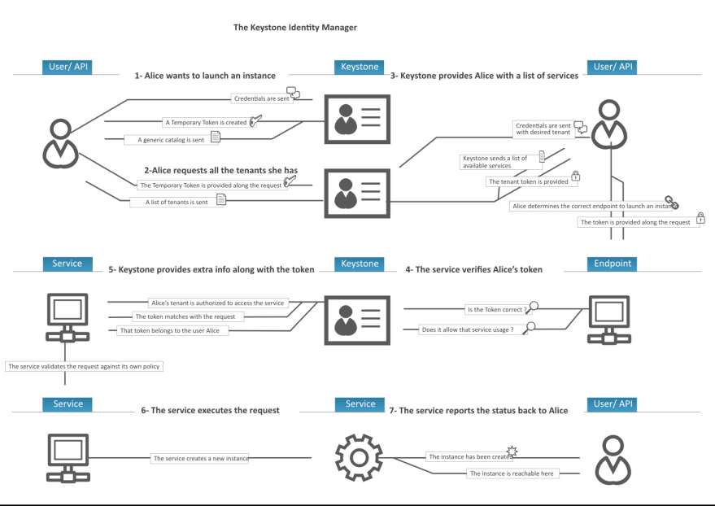

# Luồng làm việc của Keystone

## 1. User muốn truy cập vào hệ thống
  - User gửi thông tin đăng nhập (username, password, domain) tới Keystone qua API POST /v3/auth/tokens.
  - Keystone kiểm tra thông tin. Nếu đúng, trả về Unscoped Token (token không có scope) và Service Catalog (danh mục dịch vụ).
## 2. User yêu cầu danh sách Project (hoặc Domain/System) mà mình có quyền truy cập
  - User gửi Unscoped Token kèm request GET /v3/auth/projects (hoặc /domains, /system).
  - Keystone trả về danh sách Project/Domain/System mà User có role assignment.
  - (Bước này thường được Horizon hoặc openstackclient thực hiện tự động.)
## 3. User yêu cầu Scoped Token cho Project/Service cụ thể
  - User gửi lại Unscoped Token (hoặc credentials) kèm scope (project/domain/system) trong request POST /v3/auth/tokens.
  - Keystone kiểm tra quyền và trả về Scoped Token (project-scoped là phổ biến nhất) kèm **Service Catalog** đầy đủ (chứa endpoint public/internal/admin của các service).

  (Hiện nay có thể request scoped trực tiếp trong bước 1 nếu biết project, nhưng luồng unscoped → scoped vẫn là cách chuẩn và phổ biến.)

## 4. User gọi dịch vụ với Scoped Token
- User xác định endpoint từ Service Catalog và gửi request kèm header: `X-Auth-Token: <scoped-token>`
## 5. Service xác minh Token qua Keystone
- Service (Nova, Glance, Neutron,...) nhận token và chuyển cho Keystone middleware (keystone)
- Keystone kiểm tra qua GET /v3/auth/tokens (hoặc HEAD):
  - Token có hợp lệ không
  - Có hết hạn không
  - Scope và roles có khớp nhau không.
- Keystone trả về thông tin User + roles + scope cho Service
## 6. Service kiểm tra Policy và thực hiện yêu cầu
- Service dùng oslo.policy để kiểm tra User có quyền thực hiện action đó theo file policy.json/yaml không (dựa trên roles và scope).
- Nếu policy cho phép -> Service thực hiện request của User.
## 7. Service trả kết quả cho User
- Service trả về trạng thái và kết quả (thành công hoặc lỗi 401/403).
- Token có thời hạn (thường 1 giờ, có thể re-scope mà không cần nhập lại password).

## 8. Những điểm cần lưu ý
- **Token type**: Mặc định là Fernet (opaque, an toàn), hoặc JWS (JWT-style, readable payload).
- **System Scope**: Dành cho admin quản lý toàn hệ thống (không cần project).
- **Application Credentials**: Dùng cho script/automation (không cần lưu password).
- **MFA**: Có thể yêu cầu nhiều bước auth (password + TOTP).
- **Validation**: Vẫn phải gọi Keystone (không cache lâu vì token có thể revoke ngay lập tức).