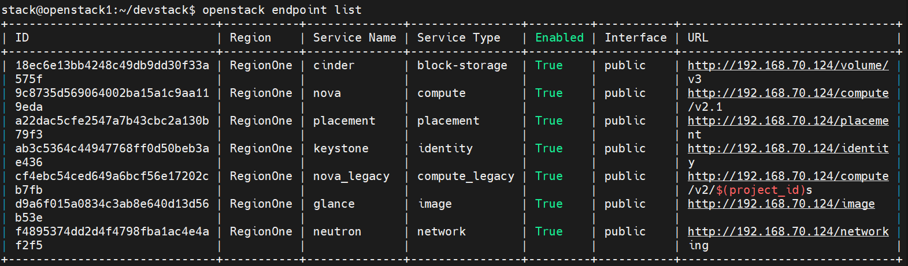

# Khái niệm Endpoint và Catalog

Endpoint trong Keystone là một URL có thể được sử dụng để truy cập dịch vụ trong OpenStack. Mỗi endpoint giống như một điểm liên lạc để người dùng hoặc các service khác tìm đến đúng địa chỉ của dịch vụ cần dùng.

## 3 loại Endpoint (Interface)

| Interface | Mục đích | Người dùng |
|-----------|----------|------------|
| `public` | URL dành cho client bên ngoài truy cập qua internet/mạng ngoài | End-user, CLI, dashboard |
| `internal` | URL dành cho các service giao tiếp nội bộ với nhau | Nova gọi Glance, Neutron, ... |
| `admin` | URL dành cho tác vụ quản trị (thường mở thêm API đặc quyền) | Admin operator |

**Tại sao cần 3 URL riêng?**
- `internal` giúp các service giao tiếp qua mạng nội bộ — nhanh hơn, bảo mật hơn, không tốn băng thông public.
- `admin` có thể mở thêm các API nhạy cảm (xóa user, reset token...) không nên expose ra ngoài.
- `public` là địa chỉ duy nhất client bên ngoài được phép biết.

## Mối quan hệ: Service → Region → Endpoint

Một **Service** (ví dụ: keystone, nova, glance) có thể tồn tại ở nhiều **Region** khác nhau. Mỗi Region chứa 3 endpoint (public/internal/admin):

```
Service (nova)
  └── Region: RegionOne
        ├── public:   http://controller:8774/v2.1
        ├── internal: http://controller:8774/v2.1
        └── admin:    http://controller:8774/v2.1
  └── Region: RegionTwo
        ├── public:   http://controller2:8774/v2.1
        ...
```

Đây là lý do `openstack endpoint list` hiển thị nhiều dòng cho cùng một service.

## Flow sử dụng Catalog sau khi xác thực

```
1. Client gửi username/password → Keystone
2. Keystone trả về Token + Service Catalog
3. Client tra Catalog để biết URL của service cần gọi (ví dụ: Nova)
4. Client dùng Token + URL đó để gọi API Nova
```

Service Catalog được nhúng trực tiếp vào token response (với Fernet/UUID token). Đây là lý do mỗi lần lấy token mới, catalog cũng được cấp lại theo đúng scope (project/domain).

## Show list endpoint

- Source file môi trường admin
```bash
source openrc admin admin
```
- Hoặc source file môi trường demo
```bash
source openrc demo demo
```
```bash
openstack endpoint list
```



- Hiển thị chi tiết một endpoint
```bash
openstack endpoint show <endpoint_id>
```
Ví dụ:
```bash
openstack endpoint show 01db1e80d3b540639861c1ee9d0a451f
```

## CRUD Endpoint

### Tạo endpoint
```bash
openstack endpoint create \
  --region RegionOne \
  <service_name_or_id> \
  <interface> \
  <url>
```
Ví dụ:
```bash
openstack endpoint create --region RegionOne keystone public http://controller:5000/v3
openstack endpoint create --region RegionOne keystone internal http://controller:5000/v3
openstack endpoint create --region RegionOne keystone admin http://controller:5000/v3
```

### Cập nhật endpoint
```bash
openstack endpoint set --url <new_url> <endpoint_id>
openstack endpoint set --disable <endpoint_id>
openstack endpoint set --enable <endpoint_id>
```

### Xóa endpoint
```bash
openstack endpoint delete <endpoint_id>
```

## Catalog

Catalog trong OpenStack là tập hợp toàn bộ các service sẵn có, kèm theo URL endpoint theo từng region và interface. Nó được Keystone cấp cho client ngay trong quá trình xác thực.

Service catalog cung cấp:
- Danh sách các dịch vụ có sẵn (nova, glance, neutron...)
- URL của từng service theo region và interface
- Phiên bản API tương ứng

Catalog giúp các service và client tự động tìm đúng địa chỉ mà không cần cấu hình thủ công từng URL.

### List Catalog
```bash
openstack catalog list
```


### Show thông tin một mục trong catalog
```bash
openstack catalog show <service>
```
Ví dụ:
```bash
openstack catalog show keystone
```

## Câu hỏi thường gặp

**Q: Sự khác nhau giữa Endpoint và Catalog?**
> Endpoint là một URL cụ thể của một service ở một region với một interface. Catalog là tập hợp tất cả các endpoint đó, được trả về cùng với token khi xác thực.

**Q: Tại sao cần internal endpoint?**
> Để các service OpenStack giao tiếp với nhau qua mạng nội bộ (management network), tránh đi qua public network — nhanh hơn và bảo mật hơn.

**Q: Nếu xóa endpoint của một service, điều gì xảy ra?**
> Các service hoặc client cố gọi service đó sẽ nhận lỗi `EndpointNotFound` vì Catalog không còn URL để trỏ tới.

**Q: Catalog được lưu ở đâu?**
> Keystone lưu thông tin endpoint trong database. Khi client xác thực, Keystone tổng hợp và trả về catalog trong token response theo đúng scope của token đó.