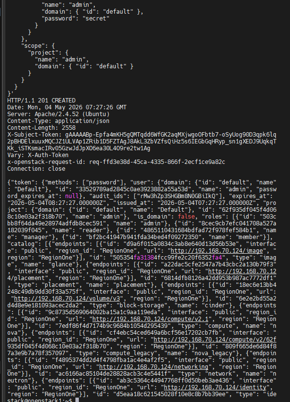
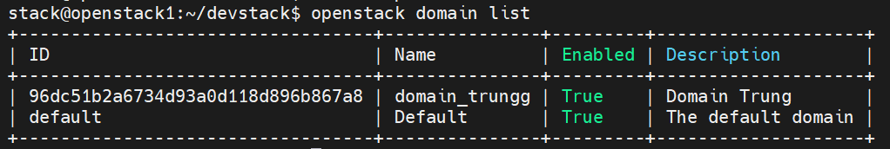
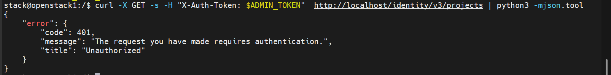

# Tìm hiểu về API Keystone và sử dụng `curl` để gọi API
## 1. Review lại các phương thức (Methods/Verbs) phổ biến
- **GET**: Cho tôi xem dữ liệu. ("Ví dụ: Liệt kê danh sách user, danh sách máy ảo).
- **POST**: Tôi gửi thông tin này, hãy tạo mới hoặc xử lý nó giúp tôi. (Ví dụ: Gửi mật khẩu để lấy Token, tạo một Project mới).
- **PUT**: Hãy thay thế toàn bộ dữ liệu hiện có bằng dữ liệu mới này.
- **PATCH**: Hãy cập nhật một phần nhỏ của dữ liệu thôi.
- **DELETE**: Hãy xóa tài nguyên này đi

Về bản chất, khi bạn sử dụng curl, bạn đang đóng vai trò là Client (người yêu cầu) gửi một "bức thư" kỹ thuật số tới Server (người cung cấp dịch vụ).


## 2. Thành phần của một yêu cầu mà curl đóng gói
Khi bạn chạy lệnh curl, nó sẽ gom các thông tin sau vào một gói tin duy nhất:

URL (Địa chỉ): Xác định bạn đang gửi yêu cầu tới đâu (ví dụ: `http://localhost:5000/v3/auth/tokens`).

Headers (Tiêu đề): Chứa các thông tin bổ trợ.

Ví dụ: Content-Type: application/json (Nói với server rằng "Tôi đang gửi dữ liệu dạng JSON đấy") hoặc X-Auth-Token (Tấm thẻ bài để chứng minh bạn đã đăng nhập).

Body (Thân của yêu cầu): Chứa dữ liệu thực tế bạn muốn gửi lên (thường dùng với POST hoặc PUT). Trong OpenStack, Body chính là đoạn mã JSON chứa username và password.

### 2.2 Ví dụ mô phỏng thực tế
Hãy tưởng tượng việc gọi API qua curl giống như bạn đi gửi một bưu phẩm:

Phương thức (Method): Là loại dịch vụ bạn chọn (Gửi nhanh, Chuyển phát, hoặc Yêu cầu hoàn trả).

URL: Là địa chỉ người nhận ghi trên vỏ hộp.

Headers: Là những nhãn dán bên ngoài như "Hàng dễ vỡ", "Phí người gửi chịu", "Giấy tờ kèm theo".

Body: Là món quà thực sự nằm bên trong chiếc hộp.

### 2.3 Tại sao lại dùng curl mà không dùng trình duyệt?
Mặc dù trình duyệt (Chrome, Firefox) cũng gửi các yêu cầu tương tự, nhưng:
  - Trình duyệt chủ yếu gửi yêu cầu GET để lấy hình ảnh/văn bản về hiển thị.
  - `curl` cho phép bạn can thiệp sâu vào Headers và Body, giúp bạn làm việc trực tiếp với các hệ thống backend (như OpenStack) vốn không có giao diện đồ họa đẹp mắt mà chỉ trao đổi qua các dòng code JSON.

## 3. Sử dụng `curl` để gọi API
### 3.1 Lấy token
**Dùng curl**

**Method**: POST - request source để đăng nhập OpenStack bằng user admin (lấy token từ OpenStack Keystone)

```bash
curl -i -X POST http://localhost/identity/v3/auth/tokens \
-H "Content-Type: application/json" \
-d '{
  "auth": {
    "identity": {
      "methods": ["password"],
      "password": {
        "user": {
          "name": "admin",
          "domain": { "id": "default" },
          "password": "secret"
        }
      }
    },
    "scope": {
      "project": {
        "name": "admin",
        "domain": { "id": "default" }
      }
    }
  }
}'
```
Option sử dụng trong lệnh curl:
- `i` (--include): Output sẽ chứa cả HTTP-header
- `-H`(--header): kết hợp với Content-Type để xác định kiểu dữ liệu truyền vào header. Tại đây là dạng json
- `-d`(--data): Dữ liệu truyền vào body
- Nếu muốn Lấy Unscoped Token (Chỉ định danh): Dùng khi bạn chỉ muốn kiểm tra xem username/password có đúng không. Token này không thể dùng để tạo VM hay Network. Bỏ trường scope đi.

**Lưu ý**:
- Trên các bản OpenStack mới (đặc biệt lab dùng DevStack), Keystone thường chạy sau web server như Apache HTTP Server và expose qua:
```bash
http://localhost/identity
```
chứ không còn:
```bash
http://localhost:5000
```

`POST /v3/auth/tokens`:
- Gửi yêu cầu xác thực
- Nếu đúng thì server trả về token

`"identity"`: 
- Nói với Keystone xác thực bằng Password

`"methods": ["password"]`:
- Có nhiều cách login:
  - Password, token, application credential

**User**
```JSON
"user": {
  "name": "admin",
  "domain": {
    "id": "default"
  },
  "password": "secret"
}
```
- Đăng nhập user: 
  - username: `admin`
  - domain: `default`
  - password: `secret`

**Scope**:
```JSON
"scope": {
  "project": {
    "name": "admin",
    "domain": {
      "id": "default"
    }
  }
}
```
- Thông báo yêu cầu cấp token để thao tác trong project admin
- Không có scope thì thường chỉ ra unscoped token

Cả đoạn trên là gửi API username/password lên Keystone để xin token.

Keystone trả về:
- mã trạng thái
- token
- thông tin user/project/role
- service catalog



```html
HTTP/1.1 201 CREATED
Date: Wed, 15 Jul 2020 02:54:06 GMT
Server: Apache/2.4.6 (CentOS) mod_wsgi/3.4 Python/2.7.5
X-Subject-Token: gAAAAABfDm_OtSOIyIfHMTZFY_y4wht8_BOVNM06Jvhnfe2QpW-kP4KCm4N8IPA92TKLlX3DbFlD1hfUcWmtr79pH1889nzObvNy2sUFZ8O9mPp5eHF99mKoh_ODRSwbGgiB3XEyOZiC-q5SLiD_dmtTNAkx0He0M3BaWQE8i8H5xO0Zc4NYVaQ
Vary: X-Auth-Token
x-openstack-request-id: req-6a2d1a83-b4e5-4e2a-a8c3-ae5e81e99088
Content-Length: 3443
Content-Type: application/json

{
  "token": {
    "is_domain": false,
    "methods": [
      "password"
    ],
    "roles": [
      {
        "id": "6edcf71488424352817939a8505267b1",
        "name": "admin"
      },
      {
        "id": "e62c83155a654bd4a31b4bc692b835f5",
        "name": "reader"
      },
      {
        "id": "f1b4e02022d4444ba29769ec76146a23",
        "name": "member"
      }
    ],
    "expires_at": "2020-07-15T03:54:06.000000Z",
    "project": {
      "domain": {
        "id": "default",
        "name": "Default"
      },
      "id": "5b4c1d2155004acf849cd3aac03b8f36",
      "name": "admin"
    },
    "catalog": [
      {
        "endpoints": [
          {
            "region_id": "RegionOne",
            "url": "http://10.10.31.166:9696",
            "region": "RegionOne",
            "interface": "internal",
            "id": "2aad8b16f9534fa18fceaccc50fc927d"
          },
          {
            "region_id": "RegionOne",
            "url": "http://10.10.31.166:9696",
            "region": "RegionOne",
            "interface": "public",
            "id": "e1d529ec9dc64f36ab3a4799c297ae17"
          },
          {
            "region_id": "RegionOne",
            "url": "http://10.10.31.166:9696",
            "region": "RegionOne",
            "interface": "admin",
            "id": "f0cd24d2520540b895efe81a3d00b437"
          }
        ],
        "type": "network",
        "id": "01c45c0eefbf45f9b1005be92b5bd091",
        "name": "neutron"
      },
      {
        "endpoints": [
          {
            "region_id": "RegionOne",
            "url": "http://10.10.31.166:9292",
            "region": "RegionOne",
            "interface": "admin",
            "id": "0bae90c2cb9b4ca0a5f812da2273fb79"
          },
          {
            "region_id": "RegionOne",
            "url": "http://10.10.31.166:9292",
            "region": "RegionOne",
            "interface": "public",
            "id": "743533c9a69f468590ff6b02a871d07f"
          },
          {
            "region_id": "RegionOne",
            "url": "http://10.10.31.166:9292",
            "region": "RegionOne",
            "interface": "internal",
            "id": "acfaf8b4a9034821aad043464de64c29"
          }
        ],
        "type": "image",
        "id": "1cb30c4b8b304a0fb18f0e453ff2aa99",
        "name": "glance"
      },
      {
        "endpoints": [
          {
            "region_id": "RegionOne",
            "url": "http://10.10.31.166:8778",
            "region": "RegionOne",
            "interface": "internal",
            "id": "8537fd3b514942bebb4e407554137d0f"
          },
          {
            "region_id": "RegionOne",
            "url": "http://10.10.31.166:8778",
            "region": "RegionOne",
            "interface": "public",
            "id": "890803754a454947ad2de61b8c89dd10"
          },
          {
            "region_id": "RegionOne",
            "url": "http://10.10.31.166:8778",
            "region": "RegionOne",
            "interface": "admin",
            "id": "d6d5a5ecf36544b794dcd1021ff10769"
          }
        ],
        "type": "placement",
        "id": "30fe5529b60a4e859443051c7f650295",
        "name": "placement"
      },
      {
        "endpoints": [
          {
            "region_id": "RegionOne",
            "url": "http://10.10.31.166:5000/v3/",
            "region": "RegionOne",
            "interface": "public",
            "id": "1354449c815d4f499d88cfc4f8f785b8"
          },
          {
            "region_id": "RegionOne",
            "url": "http://10.10.31.166:5000/v3/",
            "region": "RegionOne",
            "interface": "internal",
            "id": "4004a42543744831971c53b85956450d"
          },
          {
            "region_id": "RegionOne",
            "url": "http://10.10.31.166:5000/v3/",
            "region": "RegionOne",
            "interface": "admin",
            "id": "634db163e477401393da5675eb9454d9"
          }
        ],
        "type": "identity",
        "id": "60d6403b4de346a59d92c707b2d4a437",
        "name": "keystone"
      },
      {
        "endpoints": [
          {
            "region_id": "RegionOne",
            "url": "http://10.10.31.166:8774/v2.1",
            "region": "RegionOne",
            "interface": "public",
            "id": "01db1e80d3b540639861c1ee9d0a451f"
          },
          {
            "region_id": "RegionOne",
            "url": "http://10.10.31.166:8774/v2.1",
            "region": "RegionOne",
            "interface": "admin",
            "id": "454981cfd05041edb95971db63aec819"
          },
          {
            "region_id": "RegionOne",
            "url": "http://10.10.31.166:8774/v2.1",
            "region": "RegionOne",
            "interface": "internal",
            "id": "9e8b1c9d8e4e4085bc15ba5d7f91b1bb"
          }
        ],
        "type": "compute",
        "id": "ec8b6081186f4922bc67a38b5f148ac2",
        "name": "nova"
      }
    ],
    "user": {
      "password_expires_at": null,
      "domain": {
        "id": "default",
        "name": "Default"
      },
      "id": "294c5c6181d442c68a13d5b615c4f031",
      "name": "admin"
    },
    "audit_ids": [
      "RkkiEdfCQ4WPxN7qwturcg"
    ],
    "issued_at": "2020-07-15T02:54:06.000000Z"
  }
}
```

#### A. Request thành công
```http
HTTP/1.1 201 CREATED
```
- Request thành công: Keystone đã tạo mới một authentication token

#### B. Header response
```http
Date: Mon, 04 May 2026 07:27:26 GMT
Server: Apache/2.4.52 (Ubuntu)
Content-Type: application/json
Content-Length: 2558
X-Subject-Token: gAAAAABp-Epfa4mKH5gQMTqdd6WfGK2aqMXjwgoOFbtb7-oSyUog90D3qpk6lq2pBHDElxuuxMQCJZ1ULVAp1ZRib1D5FZTAgJ8AkL3ZbVZfsQiHz5s6IEGbGqHRyp_sn1gXEDJ9UqkqTKk_iSTKsmacIRv05GzwJdJpXO6ea30L4O9re2tw1Ag
Vary: X-Auth-Token
x-openstack-request-id: req-ffd3e38d-45ca-4335-866f-2ecf1ce9a82c
Connection: close
```

- Thời điểm server trả lời.
- Keystone đang được reverse proxy qua Apache.
- Body trả về là JSON.
- Tokent hật sự, sau khi login xong, muốn gọi API khác thì nhét nó vào:
  - Ví dụ: 
```bash
curl -H "X-Auth-Token: gAAAA..." \ http://localhost/compute/v2.1/servers
```
- `Vary: X-Auth-Token`: Cho cache/proxy biết response phụ thuộc vào token.
- ID request để trace log, Nếu lỗi, admin có thể grep log: `grep req-ffd3e38d /var/log/*`

#### C. JSON body
**`methods`**

```json
"methods": ["password"]
```

Bạn xác thực bằng password.

Keystone support nhiều cách:

* password
* token
* application credential
* federation

**`user`**

```json
"user": {
  "name": "admin",
  ...
}
```

Thông tin user vừa login.

**`issued_at`**

```json
"issued_at": "2026-05-04T07:27:27"
```

Thời điểm token được cấp.

**`expires_at`**

```json
"expires_at": "2026-05-04T08:27:27"
```

Token hết hạn sau ~1 tiếng.

Sau đó phải auth lại.

**`project`**

```json
"project": {
  "name": "admin"
}
```

Token này được scoped vào project `admin`.

Tức quyền của token áp dụng trong project đó.

**`roles`**

```json
"roles": [
  {"name": "admin"},
  {"name": "reader"},
  {"name": "manager"},
  {"name": "member"}
]
```

User `admin` đang có 4 role trong project.

Keystone sẽ dùng đây để quyết định:

“mày được làm gì?”

Ví dụ:

* `reader` → xem
* `member` → thao tác cơ bản
* `manager` → quản lý
* `admin` → full quyền

(ý nghĩa cụ thể tùy policy của service)

---

#### D. `catalog` — phần cực quan trọng

Đây là **service catalog**.

Keystone trả danh sách tất cả service mà user được phép truy cập.

Ví dụ:

**Glance**

```json
"type": "image",
"name": "glance",
"url": "http://192.168.70.124/image"
```

Dùng để quản lý image VM.

**Nova**

```json
"type": "compute",
"name": "nova"
```

Quản lý compute instance.

API:

* tạo VM
* xóa VM
* list VM

**Neutron**

```json
"type": "network",
"name": "neutron"
```

Mạng:

* network
* subnet
* router
* floating IP

**Cinder**

```json
"type": "block-storage"
```

Volume storage.

**Keystone**

```json
"type": "identity"
```

Auth / token / user / project.

**Placement**

Resource scheduling.

Nova hỏi Placement:

> còn CPU/RAM ở node nào để tạo VM?

#### Tóm gọn

Response nói rằng:

**Keystone đã xác thực thành công user admin, cấp token mới, token có hiệu lực 1 tiếng, user có nhiều role trong project admin, và đây là danh bạ toàn bộ OpenStack services để dùng tiếp.**

## 4. Sự dụng curl để List user
Cấu hình môi trường cho CLI, nạp biến môi trường vào shell hiện tại:
```bash
source openrc admin admin
```
- Nên lưu lại token:
```bash
export OS_TOKEN=$(openstack token issue -f value -c id)
```
- Check:
```bash
stack@openstack1:~/devstack$ export OS_TOKEN=$(openstack token issue -f value -c id)
stack@openstack1:~/devstack$ echo $OS_TOKEN
gAAAAABp-FsJTb924LKtpb21CDFyTE5FDf3po3XYvYEFQErddf2aYHCz3XiHe09Jwki_2TbR3UWfIpXPqv3Biwo-Ii9Jt0HLre79jtj3dxUrjmhDxDI0UkAHk8Sx0AUi1EHOU4p7j3BEzC9KaOWHX9kWqlTRpX1L1yo18E-GVAGKnYoUrwfMaxQ
stack@openstack1:~/devstack$ echo $OS_AUTH_URL
http://192.168.70.124/identity
```
Command
```bash
openstack user list
```
`Curl` API
```bash
curl -X GET -s -H "X-Auth-Token: gAAAAABp-FmRZ_2u2wCrRgZgSLMVGurUIRQYWY9uUtoejZvQ_c8MeQmbJaLHowcVqcj6B28lHfQxoEJo9RG8Ut9y9AU2DVT5dJ6i3kawCk-NZv_QCVXcG_hyR2M8dd3Ca5-L0-JaAU8fp7ijXQNB6oC7mH2ltCWMrpgnBJeP0HRnROojn8rzz9M" http://localhost/identity/v3/users | python3 -mjson.tool
```
Kết quả:
```bash
{
    "users": [
        {
            "email": "alt_demo_member@example.com",
            "id": "25ac479ab49e407abefd584ea4be3e95",
            "name": "alt_demo_member",
            "domain_id": "default",
            "enabled": true,
            "password_expires_at": null,
            "options": {},
            "links": {
                "self": "http://192.168.70.124/identity/v3/users/25ac479ab49e40
            }
        },
        {
            "id": "268cb1080308428aa1993e583de56e73",
            "name": "cinder",
            "domain_id": "default",
            "enabled": true,
            "password_expires_at": null,
            "options": {},
            "links": {
                "self": "http://192.168.70.124/identity/v3/users/268cb108030842
            }
        },
        {
            "id": "33529789ad2845c0ae3923882a55a53d",
            "name": "admin",
            "domain_id": "default",
            "enabled": true,
            "password_expires_at": null,
            "options": {},
            "links": {
                "self": "http://192.168.70.124/identity/v3/users/33529789ad2845
            }
        },
        {
            "id": "4bd2057396be42c092387940d0428097",
            "name": "glance",
            "domain_id": "default",
            "enabled": true,
            "password_expires_at": null,
            "options": {},
            "links": {
                "self": "http://192.168.70.124/identity/v3/users/4bd2057396be42
            }
        },
        {
            "id": "5e6f1eefea7846ba976e932704f277f2",
            "name": "nova",
            "domain_id": "default",
            "enabled": true,
            "password_expires_at": null,
            "options": {},
            "links": {
                "self": "http://192.168.70.124/identity/v3/users/5e6f1eefea7846
            }
        },
        {
            "email": "alt_demo@example.com",
            "id": "6cd07cb0ff4d4bf5a944c899b8ab3900",
            "name": "alt_demo",
            "domain_id": "default",
            "enabled": true,
            "password_expires_at": null,
            "options": {},
            "links": {
                "self": "http://192.168.70.124/identity/v3/users/6cd07cb0ff4d4b
            }
        },
        {
            "email": "alt_demo_reader@example.com",
            "id": "7140bb6415dc463695f26ab84e2c314a",
            "name": "alt_demo_reader",
            "domain_id": "default",
            "enabled": true,
            "password_expires_at": null,
            "options": {},
            "links": {
                "self": "http://192.168.70.124/identity/v3/users/7140bb6415dc46
            }
        },
        {
            "email": "system_reader@example.com",
            "id": "77b5e6b30d3243fd9fa7271fcbaab8af",
            "name": "system_reader",
            "domain_id": "default",
            "enabled": true,
            "password_expires_at": null,
            "options": {},
            "links": {
                "self": "http://192.168.70.124/identity/v3/users/77b5e6b30d3243
            }
        },
        {
            "id": "a1d2277bd9f440f081f259f4a774151d",
            "name": "neutron",
            "domain_id": "default",
            "enabled": true,
            "password_expires_at": null,
            "options": {},
            "links": {
                "self": "http://192.168.70.124/identity/v3/users/a1d2277bd9f440
            }
        },
        {
            "email": "demo_reader@example.com",
            "id": "aba2e49d2110451190d94d0991038c61",
            "name": "demo_reader",
            "domain_id": "default",
            "enabled": true,
            "password_expires_at": null,
            "options": {},
            "links": {
                "self": "http://192.168.70.124/identity/v3/users/aba2e49d211045
            }
        },
        {
            "email": "demo@example.com",
            "id": "c704c58db9754e579ebdbdb7b6f8f924",
            "name": "demo",
            "domain_id": "default",
            "enabled": true,
            "password_expires_at": null,
            "options": {},
            "links": {
                "self": "http://192.168.70.124/identity/v3/users/c704c58db9754e
            }
        },
        {
            "email": "system_member@example.com",
            "id": "d78099fee1a64f5b9f20bc1e9cbaf393",
            "name": "system_member",
            "domain_id": "default",
            "enabled": true,
            "password_expires_at": null,
            "options": {},
            "links": {
                "self": "http://192.168.70.124/identity/v3/users/d78099fee1a64f
            }
        },
        {
            "id": "fea9487503f94f57a010518de56019b5",
            "name": "placement",
            "domain_id": "default",
            "enabled": true,
            "password_expires_at": null,
            "options": {},
            "links": {
                "self": "http://192.168.70.124/identity/v3/users/fea9487503f94f
            }
        }
    ],
    "links": {
        "next": null,
        "self": "http://192.168.70.124/identity/v3/users",
        "previous": null
    }
}
```
- API này: là list toàn bộ user trong hệ thống identity
- Keystone trả về một object JSON gồm 2 phần lớn:
### 1. `"users"` — danh sách user

```json id="m7yq4v"
{
  "users": [ ... ]
}
```

Mỗi object trong mảng là **1 user trong Keystone**.

Ví dụ:

```json id="s8t2pl"
{
  "id": "33529789ad2845c0ae3923882a55a53d",
  "name": "admin",
  ...
}
```

đây là user `admin`.

### 2. `"links"` — metadata cho việc phân trang

```json id="n6f4wa"
"links": {
    "next": null,
    "self": "...",
    "previous": null
}
```

Dùng cho pagination.

Giải thích:

* **self** → URL của page hiện tại
* **next** → page kế tiếp
* **previous** → page trước

Ở đây:

```json id="r4k9zc"
"next": null
```

nghĩa là user ít, chưa cần chia page.

#### 2.1 Giải từng field trong mỗi user

Lấy user admin làm mẫu:

```json id="x1m7jq"
{
    "id": "33529789ad2845c0ae3923882a55a53d",
    "name": "admin",
    "domain_id": "default",
    "enabled": true,
    "password_expires_at": null,
    "options": {},
    "links": {
        "self": "..."
    }
}
```
#### 2.2 `id`

```json id="k3p8vd"
"id": "33529789..."
```

UUID định danh duy nhất.

Giống primary key trong database.

Dù bạn đổi tên user:

```plaintext 
id="w2g5ns"
admin → superadmin
```

thì ID vẫn giữ nguyên.

OpenStack nội bộ chủ yếu reference bằng ID, không phải name.

Ví dụ:

```bash 
id="u7z1mx"
openstack user show 33529789ad2845...
```

#### 2.3 `name`

```json id="f9b2tr"
"name": "admin"
```

Tên dễ đọc.

Dùng để thao tác:

```bash id="c6v8pl"
openstack user show admin
```
#### 2.4 `domain_id`

```json id="e4q1nw"
"domain_id": "default"
```

User này thuộc domain nào.

Trong Keystone:

```plaintext id="j8m5ka"
Domain
 ├── Users
 ├── Groups
 └── Projects
```

DevStack thường chỉ có:

```plaintext id="d7x9qo"
default
```

Nên toàn thấy:

```json id="t5n3zi"
"default"
```

Nếu enterprise thật có thể có:

* companyA
* companyB
* internal

để multi-tenant.


#### 2.5 `enabled`

```json id="a2h6rk"
"enabled": true
```

User đang active.

Nếu:

```json id="g9w4ux"
false
```

thì account bị disable, không login được.

Giống lock account.


#### 2.6 `password_expires_at`

```json id="v8c1dy"
null
```

Mật khẩu chưa set ngày hết hạn.

Nếu policy bật password expiration thì sẽ kiểu:

```json id="n1j7pf"
"2026-06-01T00:00:00Z"
```


#### 2.7 `options`

```json id="q4z8lm"
{}
```

Các option riêng của user.

Ví dụ có thể chứa policy như:

* ignore password expiry
* multi-factor settings

DevStack để rỗng.

#### 2.8 `links.self`

```json id="y6k2bs"
"self": "http://.../users/<id>"
```

Canonical URL của user này.

Có thể GET trực tiếp:

```bash id="p3r9wc"
curl ... /identity/v3/users/<id>
```

để lấy chi tiết.


### User
#### `admin`

```json id="m5t1qv"
"name": "admin"
```

Tài khoản quản trị.

Bạn đang login bằng thằng này.

Full quyền.
#### `demo`

```json id="h7u4nx"
"name": "demo"
```

User mẫu thường do DevStack tạo.

Để test như user bình thường.

#### `demo_reader`

Read-only user.

#### `alt_demo`

Alternative demo account.

DevStack tạo để test RBAC mới.

#### `alt_demo_member`

Role member.

#### `alt_demo_reader`

Role reader.

#### `system_member`

User test system-scope permissions.

#### service users

* `nova`
* `glance`
* `neutron`
* `cinder`
* `placement`

Mỗi service authenticate với Keystone như 1 user.

### Tại sao làm vậy?

Để Keystone kiểm soát quyền giữa các service.

Ví dụ:

* Nova chỉ được làm X
* Neutron chỉ được làm Y

Chứ không cho tất cả chạy bằng admin.

Nguyên tắc least privilege.


### Cách tưởng tượng dễ nhớ

Cứ hình dung hệ thống như công ty.

### User thường

Là nhân viên:

* admin
* demo


### Service users

Là bot nội bộ có account riêng:

* nova
* glance
* neutron

Mỗi bot có thẻ nhân viên để đi qua bảo vệ (Keystone).


### Từ output này bạn confirm được gì?

Lab của bạn đang ổn ở mức:

-  Keystone chạy
-  Auth token hoạt động
-  API v3 hoạt động
-  User database load bình thường
-  DevStack bootstrap thành công
-  Service accounts đã được tạo

## 5. List group
Tương tự list user, thay thế URL
```bash
curl -X GET -s -H "X-Auth-Token: gAAAAABp-FmRZ_2u2wCrRgZgSLMVGurUIRQYWY9uUtoejZvQ_c8MeQmbJaLHowcVqcj6B28lHfQxoEJo9RG8Ut9y9AU2DVT5dJ6i3kawCk-NZv_QCVXcG_hyR2M8dd3Ca5-L0-JaAU8fp7ijXQNB6oC7mH2ltCWMrpgnBJeP0HRnROojn8rzz9M" http://localhost/identity/v3/groups | python3 -mjson.tool
```
Kết quả
```bash
{
    "groups": [
        {
            "id": "2ffb2a98f91b4387b33d1a3907b9459c",
            "name": "admins",
            "domain_id": "default",
            "description": "openstack admin group",
            "links": {
                "self": "http://192.168.70.124/identity/v3/groups/2ffb2a98f91b4387b33d1a3907b9459c"
            }
        },
        {
            "id": "6eb4168a83bb4eceb6b2face458c3a94",
            "name": "nonadmins",
            "domain_id": "default",
            "description": "non-admin group",
            "links": {
                "self": "http://192.168.70.124/identity/v3/groups/6eb4168a83bb4eceb6b2face458c3a94"
            }
        }
    ],
    "links": {
        "next": null,
        "self": "http://192.168.70.124/identity/v3/groups",
        "previous": null
    }
}
```
## 6. List project
```bash
curl -X GET -s -H "X-Auth-Token: $OS_TOKEN"  http://localhost/identity/v3/projects | python3 -mjson.tool
```
## 6. List role
```bash
curl -X GET -s -H "X-Auth-Token: $OS_TOKEN"  http://localhost/identity/v3/projects | python -mjson.tool
```

## 7. List domain
```bash
curl -X GET -s -H "X-Auth-Token: $OS_TOKEN"  http://localhost/identity/v3/domains | python -mjson.tool
```

## 8. Tạo domain
```bash
curl -X POST -s \
-H "X-Auth-Token: $OS_TOKEN" -H "Content-Type: application/json" \
-d \
'{
  "domain": {
    "name": "domain_trungg",
    "description": "Domain Trung"
  }
}' \
http://localhost/identity/v3/domains | python3 -mjson.tool
```



## 9. Verify/Inspect then Revoke Token
### Khai báo biến (gọn hơn)
```bash
export OS_AUTH_URL="http://localhost/identity/v3"
export ADMIN_TOKEN="gAAAAABp-vw_DVvFiUQT7E-rj1vrlIzA_N1BJT_wYmQETG7VgMtPGm7akH-9rw-HA1lcaVYffFiA9AhNVxvY14tXQgBALVD_dw6XID2tEnj6IrKMwtQ1UJKlii-RX4qCjIOOxV5UokAku6B93ikVHSK23vfoDLC5grv1ExWqBgrlp_R45btFO-c"
# Đây là token bạn muốn kiểm tra hoặc thu hồi (sử dụng admin kiểm tra admin hoàn toàn hợp lệ)
export TARGET_TOKEN="gAAAAABp-vw_DVvFiUQT7E-rj1vrlIzA_N1BJT_wYmQETG7VgMtPGm7akH-9rw-HA1lcaVYffFiA9AhNVxvY14tXQgBALVD_dw6XID2tEnj6IrKMwtQ1UJKlii-RX4qCjIOOxV5UokAku6B93ikVHSK23vfoDLC5grv1ExWqBgrlp_R45btFO-c"
```
### Read Token
```bash
curl -s \
  -H "X-Auth-Token: $ADMIN_TOKEN" \
  -H "X-Subject-Token: $TARGET_TOKEN" \
  -X GET $OS_AUTH_URL/auth/tokens | jq
```

Kết quả
```JSON
stack@openstack1:/$ curl -s \
  -H "X-Auth-Token: $ADMIN_TOKEN" \
  -H "X-Subject-Token: $TARGET_TOKEN" \
  -X GET $OS_AUTH_URL/auth/tokens | jq
{
  "token": {
    "methods": [
      "password"
    ],
    "user": {
      "domain": {
        "id": "default",
        "name": "Default"
      },
      "id": "33529789ad2845c0ae3923882a55a53d",
      "name": "admin",
      "password_expires_at": null
    },
    "audit_ids": [
      "4kny3hXCQeqsLiP6jktmsw"
    ],
    "expires_at": "2026-05-06T09:30:55.000000Z",
    "issued_at": "2026-05-06T08:30:55.000000Z",
    "project": {
      "domain": {
        "id": "default",
        "name": "Default"
      },
      "id": "62f935df045f4d068c10e03a2f318b70",
      "name": "admin"
    },
    "is_domain": false,
    "roles": [
      {
        "id": "503cbb8f64da49e28974adfdb8cec591",
        "name": "admin"
      },
      {
        "id": "8cec9cb7efc041708a527a182039f045",
        "name": "reader"
      },
      {
        "id": "4865110431684bdfad72f978fef584b1",
        "name": "manager"
      },
      {
        "id": "bf2bc41947b941fda34bed4f09272350",
        "name": "member"
      }
    ],
    "catalog": [
      {
        "endpoints": [
          {
            "id": "d9a6f015a0834c3ab8e640d13d56b53e",
            "interface": "public",
            "region_id": "RegionOne",
            "url": "http://192.168.70.124/image",
            "region": "RegionOne"
          }
        ],
        "id": "505354fa31384fcc99fe2c20f6352fa4",
        "type": "image",
        "name": "glance"
      },
      {
        "endpoints": [
          {
            "id": "a22dac5cfe2547a7b43cbc2a130b79f3",
            "interface": "public",
            "region_id": "RegionOne",
            "url": "http://192.168.70.124/placement",
            "region": "RegionOne"
          }
        ],
        "id": "6814dfb8126a42dd953b987ac7772df1",
        "type": "placement",
        "name": "placement"
      },
      {
        "endpoints": [
          {
            "id": "18ec6e13bb4248c49db9dd30f33a575f",
            "interface": "public",
            "region_id": "RegionOne",
            "url": "http://192.168.70.124/volume/v3",
            "region": "RegionOne"
          }
        ],
        "id": "6e2e2bd55a2d4d8e9e181093acec2da2",
        "type": "block-storage",
        "name": "cinder"
      },
      {
        "endpoints": [
          {
            "id": "9c8735d569064002ba15a1c9aa119eda",
            "interface": "public",
            "region_id": "RegionOne",
            "url": "http://192.168.70.124/compute/v2.1",
            "region": "RegionOne"
          }
        ],
        "id": "7edf86f4d7174b9c9684b1054d295439",
        "type": "compute",
        "name": "nova"
      },
      {
        "endpoints": [
          {
            "id": "cf4ebc54ced649a6bcf56e17202cb7fb",
            "interface": "public",
            "region_id": "RegionOne",
            "url": "http://192.168.70.124/compute/v2/62f935df045f4d068c10e03a2f318b70",
            "region": "RegionOne"
          }
        ],
        "id": "809f665de6d84f87a3e9b7a78f357097",
        "type": "compute_legacy",
        "name": "nova_legacy"
      },
      {
        "endpoints": [
          {
            "id": "f4895374dd2d4f4798fba1ac4e4af2f5",
            "interface": "public",
            "region_id": "RegionOne",
            "url": "http://192.168.70.124/networking",
            "region": "RegionOne"
          }
        ],
        "id": "ac6166ac85104de28828acb3c4e5441f",
        "type": "network",
        "name": "neutron"
      },
      {
        "endpoints": [
          {
            "id": "ab3c5364c44947768ff0d50beb3ae436",
            "interface": "public",
            "region_id": "RegionOne",
            "url": "http://192.168.70.124/identity",
            "region": "RegionOne"
          }
        ],
        "id": "d5eaa18c621545028f10e8c8b7bb39ee",
        "type": "identity",
        "name": "keystone"
      }
    ]
  }
}
```
- Giải thích:
  - **Thời hạn và Định danh**:
    - `issued_at & expires_at`: Token này có hiệu lực trong vòng đúng 1 tiếng (từ 08:30 đến 09:30). Sau giờ này, bạn sẽ nhận lỗi 401 Unauthorized và phải xin cấp lại.
    - `user`: Cho biết ai là người sở hữu token. Ở đây là user admin thuộc domain Default.
    - `audit_ids`: Mã định danh để quản trị viên truy vết (audit log) xem token này đã làm những gì trong hệ thống mà không cần lộ toàn bộ nội dung token.
  - **Phạm vi quyền hạn (The Scope & Roles)**:
    - `project`: Token này chỉ có giá trị trong project mang tên admin. Bạn không thể dùng nó để can thiệp vào tài nguyên của một project khác
    - `roles`: Danh sách "thẻ bài" mà bạn đang nắm giữ.
      - Bạn có quyền admin, manager, member, và reader.
      - Khi bạn gửi request đến Nova hay Neutron, các service đó sẽ nhìn vào danh sách này để quyết định cho bạn "đi tiếp" hay "đuổi về".
  - **Service Catalog (The Map)**
    - Đây là "bản đồ" chỉ đường cho các công cụ như OpenStack CLI hoặc Terraform. Khi bạn muốn tạo một máy ảo, CLI sẽ nhìn vào đây để tìm địa chỉ của Nova cũng như các tác vụ khác.
### Revoke Token
```bash
curl -s \
  -H "X-Auth-Token: $ADMIN_TOKEN" \
  -H "X-Subject-Token: $TARGET_TOKEN" \
  -X DELETE $OS_AUTH_URL/auth/tokens
```
Test
```bash
curl -X GET -s -H "X-Auth-Token: $ADMIN_TOKEN"  http://localhost/identity/v3/projects | python3 -mjson.tool
```



- Lỗi -> Revoke thành công
## Một số lỗi phổ biến
```bash
stack@openstack1:~/devstack$ openstack domain list 

Password.__init__() got an unexpected keyword argument 'token'
```
- OpenStack client đang cố dùng auth plugin kiểu password, nhưng lại thấy tham số token, nên nó bị confused.
- Trong khi `source openrc admin admin` set auth theo kiểu:
```bash
username + password
```
Tức là nó export kiểu:
- `OS_USERNAME`
- `OS_PASSWORD`
- `OS_PROJECT_NAME`

Client mong dùng plugin:
```bash
password
```
Nhưng lại thấy thêm:
```bash
OS_TOKEN
```
=> auth config thành kiểu nửa password nửa token.

