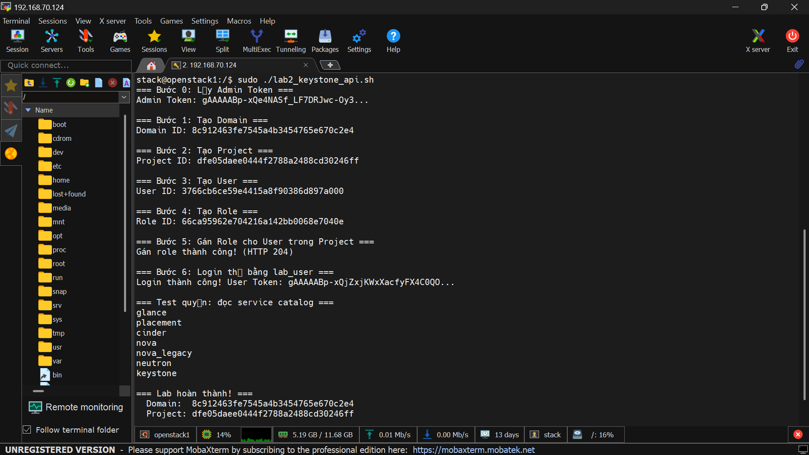

# Lab API 
## 1. RBAC trong OpenStack (Keystone)

OpenStack dùng mô hình Role-Based Access Control (RBAC) phân tầng như sau:

| Thành phần| Vai trò trong RBAC| 
|-----------|-------------------|
| Domain| Vùng tổ chức cấp cao nhất (VD: công ty, đơn vị, môi trường). Phân tách namespace cho User/Project/Group|
| Project (Tenant)| Không gian tài nguyên (Compute, Network, Volume...). Mọi resource đều thuộc 1 project.|
| User| Đại diện người dùng hoặc service account. Thuộc 1 Domain.|
| Role| Tập hợp quyền hạn (VD: `admin`, `member`, `reader`, `custom_role`). Role là global (không thuộc domain/project).|
| Assignment| Việc gán `Role` cho `User` hoặc `Group` trong ngữ cảnh Project hoặc Domain. Đây chính là cốt lõi của RBAC.|
| Scope| Khi login, token sẽ được cấp theo scope: project-scoped hoặc domain-scoped. Quyền truy cập tài nguyên chỉ có hiệu lực trong scope đó.|

> Nguyên tắc RBAC: `User/Group` + `Role` + `Project/Domain` → Assignment → Token xác thực → Cho phép/deny API call.

## 2. FLow lab
### Bước 0: Quan trọng nhất
- Lấy token domain:
```bash
ADMIN_TOKEN=$(curl -s -i -X POST "http://localhost/identity/v3/auth/tokens" \
  -H "Content-Type: application/json" \
  -d "{
    "auth": {
      "identity": {
        "methods": ["password"],
        "password": {
          "user": {
            "name": "admin",
            "domain": { "id": "default" },
            "password": "secret"
         }
        }
      },
      "scope": {
        "project": {
         "name": "admin",
          "domain": { "id": "default" }
        }
      }
    }
  }" | awk '/^X-Subject-Token:/{print $2}' | tr -d '\r')

echo "Admin Token: $ADMIN_TOKEN"
```
### Bước 1: Tạo Domain
```bash
openstack domain create \
  --description "Domain cho Lab 2" \
  --enable lab_domain
```
- Tạo bằng API với lệnh `curl`
```bash
DOMAIN_ID=$(curl -s -X POST "http://localhost/identity/v3/domains" \
  -H "X-Auth-Token: $ADMIN_TOKEN" \
  -H "Content-Type: application/json" \
  -d '{
    "domain": {
      "name": "lab_domain",
      "enabled": true,
      "description": "Domain cho Lab 2 API"
    }
  }' | jq -r '.domain.id')

echo "Domain ID: $DOMAIN_ID"
```
### Bước 2 Tạo project trong domain
```bash
openstack project create \
  --domain lab_domain \
  --description "Project Lab" \
  lab_project
```
- API curl
```bash
PROJECT_ID=$(curl -s -X POST "http://localhost/identity/v3/projects" \
  -H "X-Auth-Token: $ADMIN_TOKEN" \
  -H "Content-Type: application/json" \
  -d "{
    \"project\": {
      \"name\": \"lab_project\",
      \"domain_id\": \"$DOMAIN_ID\",
      \"enabled\": true,
      \"description\": \"Project Lab 2 API\"
    }
  }" | jq -r '.project.id')

echo "Project ID: $PROJECT_ID"
```

### Bước 3: Tạo User
```bash
openstack user create \
  --domain lab_domain \
  --password "LabPass123!" \
  --email labuser@example.com \
  --enable lab_user
```
- API curl
```bash
USER_ID=$(curl -s -X POST "http://localhost/identity/v3/users" \
  -H "X-Auth-Token: $ADMIN_TOKEN" \
  -H "Content-Type: application/json" \
  -d "{
    \"user\": {
      \"name\": \"lab_user\",
      \"domain_id\": \"$DOMAIN_ID\",
      \"password\": \"LabPass123!\",
      \"enabled\": true,
      \"email\": \"labuser@api.lab\"
    }
  }" | jq -r '.user.id')

echo "User ID: $USER_ID"
```

### Bước 4: Tạo role
- Role là global, không cần chỉ định domain
```bash
openstack role create lab_role
```
- API curl
```bash
ROLE_ID=$(curl -s -X POST "http://localhost/identity/v3/roles" \
  -H "X-Auth-Token: $ADMIN_TOKEN" \
  -H "Content-Type: application/json" \
  -d '{"role": {"name": "lab_role"}}' | jq -r '.role.id')

echo "Role ID: $ROLE_ID"
```
### Bước 5: Gán Role cho User trong Project (Assignment)
```bash
openstack role add \
  --project lab_project \
  --project-domain lab_domain \
  --user lab_user \
  --user-domain lab_domain \
  lab_role
```
- API curl
```bash
curl -s -o /dev/null -w "%{http_code}" -X PUT \
  "http://localhost/identity/v3/role_assignments?role.id=$ROLE_ID&scope.project.id=$PROJECT_ID&user.id=$USER_ID" \
  -H "X-Auth-Token: $ADMIN_TOKEN" \
  -H "Content-Type: application/json" \
  -d '{}'

echo -e "\n Gán role cho user: HTTP 204 (Success)"
```

### Bước 6: Login thử bằng User vừa tạo
```bash
openstack \
  --os-auth-url http://<keystone_ip>:5000/v3 \
  --os-username lab_user \
  --os-password "LabPass123!" \
  --os-project-name lab_project \
  --os-project-domain-name lab_domain \
  --os-user-domain-name lab_domain \
  token issue
```
- API curl
```bash
echo " Đang login với lab_user..."
USER_TOKEN=$(curl -s -i -X POST "http://localhost/identity/v3/auth/tokens" \
  -H "Content-Type: application/json" \
  -d "{
    \"auth\": {
      \"identity\": {
        \"methods\": [\"password\"],
        \"password\": {
          \"user\": {
            \"name\": \"lab_user\",
            \"domain\": { \"id\": \"$DOMAIN_ID\" },
            \"password\": \"LabPass123!\"
          }
        }
      },
      \"scope\": {
        \"project\": {
          \"id\": \"$PROJECT_ID\"
        }
      }
    }
  }" | awk '/^X-Subject-Token:/{print $2}' | tr -d '\r')

if [[ -n "$USER_TOKEN" ]]; then
  echo " Login thành công! User Token: ${USER_TOKEN:0:20}..."
  
  # Test quyền: đọc service catalog trong scope project
  curl -s -X GET "$KS_URL/auth/catalog" \
    -H "X-Auth-Token: $USER_TOKEN" | jq '.token.catalog[] | .name'
else
  echo " Login thất bại. Kiểm tra password hoặc scope."
fi
```
## 3. Bash Script Auto
```bash
#!/bin/bash
set -euo pipefail

KS_URL="http://localhost/identity/v3"

die() { echo "ERROR: $1" >&2; exit 1; }

# ─── Bước 0: Lấy Admin Token ───────────────────────────────────────────────
echo "=== Bước 0: Lấy Admin Token ==="

# Fix: dùng single-quote cho JSON tĩnh, tránh lỗi parse bash với dấu "
ADMIN_TOKEN=$(curl -s -i -X POST "$KS_URL/auth/tokens" \
  -H "Content-Type: application/json" \
  -d '{
    "auth": {
      "identity": {
        "methods": ["password"],
        "password": {
          "user": {
            "name": "admin",
            "domain": { "id": "default" },
            "password": "secret"
          }
        }
      },
      "scope": {
        "project": {
          "name": "admin",
          "domain": { "id": "default" }
        }
      }
    }
  }' | awk '/^X-Subject-Token:/{print $2}' | tr -d '\r')

[[ -z "$ADMIN_TOKEN" ]] && die "Không lấy được Admin Token. Kiểm tra password hoặc Keystone có đang chạy không."
echo "Admin Token: ${ADMIN_TOKEN:0:30}..."

# ─── Bước 1: Tạo Domain ────────────────────────────────────────────────────
echo ""
echo "=== Bước 1: Tạo Domain ==="

DOMAIN_RESP=$(curl -s -X POST "$KS_URL/domains" \
  -H "X-Auth-Token: $ADMIN_TOKEN" \
  -H "Content-Type: application/json" \
  -d '{
    "domain": {
      "name": "lab_domain",
      "enabled": true,
      "description": "Domain cho Lab 2 API"
    }
  }')

DOMAIN_ID=$(echo "$DOMAIN_RESP" | jq -r '.domain.id')
[[ -z "$DOMAIN_ID" || "$DOMAIN_ID" == "null" ]] && die "Tạo domain thất bại: $DOMAIN_RESP"
echo "Domain ID: $DOMAIN_ID"

# ─── Bước 2: Tạo Project ───────────────────────────────────────────────────
echo ""
echo "=== Bước 2: Tạo Project ==="

PROJECT_RESP=$(curl -s -X POST "$KS_URL/projects" \
  -H "X-Auth-Token: $ADMIN_TOKEN" \
  -H "Content-Type: application/json" \
  -d "{
    \"project\": {
      \"name\": \"lab_project\",
      \"domain_id\": \"$DOMAIN_ID\",
      \"enabled\": true,
      \"description\": \"Project Lab 2 API\"
    }
  }")

PROJECT_ID=$(echo "$PROJECT_RESP" | jq -r '.project.id')
[[ -z "$PROJECT_ID" || "$PROJECT_ID" == "null" ]] && die "Tạo project thất bại: $PROJECT_RESP"
echo "Project ID: $PROJECT_ID"

# ─── Bước 3: Tạo User ──────────────────────────────────────────────────────
echo ""
echo "=== Bước 3: Tạo User ==="

USER_RESP=$(curl -s -X POST "$KS_URL/users" \
  -H "X-Auth-Token: $ADMIN_TOKEN" \
  -H "Content-Type: application/json" \
  -d "{
    \"user\": {
      \"name\": \"lab_user\",
      \"domain_id\": \"$DOMAIN_ID\",
      \"password\": \"LabPass123!\",
      \"enabled\": true,
      \"email\": \"labuser@api.lab\"
    }
  }")

USER_ID=$(echo "$USER_RESP" | jq -r '.user.id')
[[ -z "$USER_ID" || "$USER_ID" == "null" ]] && die "Tạo user thất bại: $USER_RESP"
echo "User ID: $USER_ID"

# ─── Bước 4: Tạo Role ──────────────────────────────────────────────────────
echo ""
echo "=== Bước 4: Tạo Role ==="

ROLE_RESP=$(curl -s -X POST "$KS_URL/roles" \
  -H "X-Auth-Token: $ADMIN_TOKEN" \
  -H "Content-Type: application/json" \
  -d '{"role": {"name": "lab_role"}}')

ROLE_ID=$(echo "$ROLE_RESP" | jq -r '.role.id')
[[ -z "$ROLE_ID" || "$ROLE_ID" == "null" ]] && die "Tạo role thất bại: $ROLE_RESP"
echo "Role ID: $ROLE_ID"

# ─── Bước 5: Gán Role cho User trong Project (Assignment) ──────────────────
echo ""
echo "=== Bước 5: Gán Role cho User trong Project ==="

# Fix: endpoint đúng là PUT /v3/projects/{project_id}/users/{user_id}/roles/{role_id}
# KHÔNG phải /role_assignments?role.id=... (đó là endpoint để LIST, không phải gán)
HTTP_CODE=$(curl -s -o /dev/null -w "%{http_code}" -X PUT \
  "$KS_URL/projects/$PROJECT_ID/users/$USER_ID/roles/$ROLE_ID" \
  -H "X-Auth-Token: $ADMIN_TOKEN")

if [[ "$HTTP_CODE" == "204" ]]; then
  echo "Gán role thành công! (HTTP 204)"
else
  die "Gán role thất bại (HTTP $HTTP_CODE)"
fi

# ─── Bước 6: Login thử bằng lab_user ──────────────────────────────────────
echo ""
echo "=== Bước 6: Login thử bằng lab_user ==="

# Fix: $KS_URL đã được định nghĩa ở đầu script, dùng thống nhất
USER_TOKEN=$(curl -s -i -X POST "$KS_URL/auth/tokens" \
  -H "Content-Type: application/json" \
  -d "{
    \"auth\": {
      \"identity\": {
        \"methods\": [\"password\"],
        \"password\": {
          \"user\": {
            \"name\": \"lab_user\",
            \"domain\": { \"id\": \"$DOMAIN_ID\" },
            \"password\": \"LabPass123!\"
          }
        }
      },
      \"scope\": {
        \"project\": {
          \"id\": \"$PROJECT_ID\"
        }
      }
    }
  }" | awk '/^X-Subject-Token:/{print $2}' | tr -d '\r')

if [[ -n "$USER_TOKEN" ]]; then
  echo "Login thành công! User Token: ${USER_TOKEN:0:30}..."

  echo ""
  echo "=== Test quyền: đọc service catalog ==="
  curl -s -X GET "$KS_URL/auth/catalog" \
    -H "X-Auth-Token: $USER_TOKEN" | jq -r '.catalog[] | .name'
else
  die "Login thất bại. Kiểm tra password hoặc scope."
fi

echo ""
echo "=== Lab hoàn thành! ==="
echo "  Domain:  $DOMAIN_ID"
echo "  Project: $PROJECT_ID"
echo "  User:    $USER_ID"
echo "  Role:    $ROLE_ID"
```

Kết quả hoàn thành:
```bash
stack@openstack1:/$ sudo ./lab2_keystone_api.sh
=== Bước 0: Lấy Admin Token ===
Admin Token: gAAAAABp-xQe4NASf_LF7DRJwc-Oy3...

=== Bước 1: Tạo Domain ===
Domain ID: 8c912463fe7545a4b3454765e670c2e4

=== Bước 2: Tạo Project ===
Project ID: dfe05daee0444f2788a2488cd30246ff

=== Bước 3: Tạo User ===
User ID: 3766cb6ce59e4415a8f90386d897a000

=== Bước 4: Tạo Role ===
Role ID: 66ca95962e704216a142bb0068e7040e

=== Bước 5: Gán Role cho User trong Project ===
Gán role thành công! (HTTP 204)

=== Bước 6: Login thử bằng lab_user ===
Login thành công! User Token: gAAAAABp-xQjZxjKWxXacfyFX4C0QO...

=== Test quyền: đọc service catalog ===
glance
placement
cinder
nova
nova_legacy
neutron
keystone

=== Lab hoàn thành! ===
  Domain:  8c912463fe7545a4b3454765e670c2e4
  Project: dfe05daee0444f2788a2488cd30246ff
  User:    3766cb6ce59e4415a8f90386d897a000
  Role:    66ca95962e704216a142bb0068e7040e
stack@openstack1:/$
```

