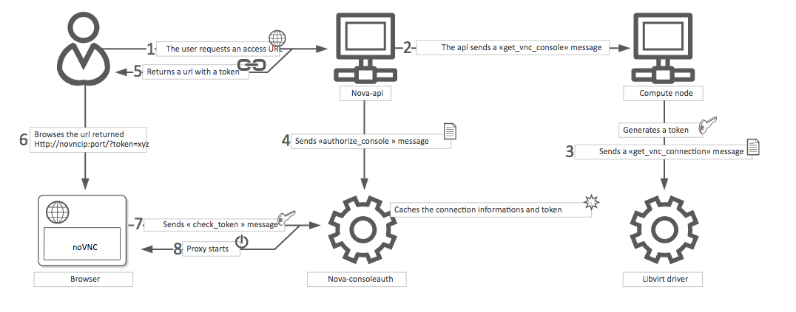

# Luồng khởi tạo và quản lý VNC (Virtual Network Computing) trong Nova
VNC trong Nova chủ yếu sử dụng **noVNC** (HTML5 + WebSockets) để người dùng truy cập console của instance qua trình duyệt mà không cần cài client VNC truyền thống. Đây là phương thức console phổ biến nhất trong OpenStack.

### 1. Các thành phần liên quan đến VNC/noVNC
- **nova-compute** (trên Compute node):  
  Tương tác với hypervisor (thường là libvirt + QEMU/KVM) để bật VNC server cho instance. Mỗi instance có một VNC port riêng (thường từ 5900 trở lên, autoport).

- **nova-novncproxy** (thường chạy trên Controller node):  
  Đây là **WebSocket proxy**. Nó nhận kết nối từ trình duyệt (noVNC client), chuyển đổi thành kết nối TCP VNC đến compute node.  
  - Lắng nghe mặc định trên port **6080** (HTTP) hoặc 6081 (HTTPS).  
  - Hỗ trợ VeNCrypt (TLS) để bảo mật kết nối giữa proxy và compute node (tính năng được cải thiện trong các release gần đây).

- **nova-api** (Controller):  
  Xử lý yêu cầu lấy console URL từ người dùng.

- **Keystone**: Xác thực người dùng ban đầu.

- **nova-consoleauth** (đã deprecated từ lâu, không còn dùng trong release mới):  
  Trước đây xử lý token, nay token được quản lý trực tiếp qua nova-api và proxy.

- **noVNC client**: JavaScript chạy trong browser (tích hợp sẵn trong Horizon hoặc truy cập trực tiếp).

### 2. Luồng khởi tạo VNC khi tạo Instance (Boot-time)

Khi bạn chạy lệnh tạo VM (`openstack server create ...`):

1. **nova-compute** nhận task spawn instance từ conductor/scheduler.
2. nova-compute gọi libvirt driver → định nghĩa domain XML cho VM.
3. Trong XML, phần `<graphics>` được cấu hình như sau (mặc định):
   ```xml
   <graphics type='vnc' port='-1' autoport='yes' listen='0.0.0.0' keymap='en-us'/>
   ```
   - `port='-1' + autoport='yes'`: Libvirt tự chọn port trống (bắt đầu từ 5900).
   - `listen='0.0.0.0'` hoặc địa chỉ nội bộ (cấu hình qua `vnc_listen` trong nova.conf).

4. VM boot → QEMU/KVM khởi động VNC server trên compute node (chỉ lắng nghe nội bộ hoặc trên mạng management).

5. nova-compute lưu thông tin VNC (host, port, internal access) vào database (instance_extra hoặc console auth info).

**Lưu ý cấu hình quan trọng** (trong `/etc/nova/nova.conf` phần `[vnc]`):
```ini
[vnc]
enabled = True
server_listen = 0.0.0.0          # hoặc IP management của compute
server_proxyclient_address = <IP compute>   # Địa chỉ mà proxy sẽ kết nối đến
novncproxy_base_url = http://<controller-ip>:6080/vnc_auto.html
vnc_auth_schemes = vencrypt,none   # Ưu tiên VeNCrypt (TLS) nếu có
```

### 3. Luồng lấy Console URL và kết nối (User access flow) 



Đây là luồng người dùng thực tế sử dụng console:

1. **Người dùng yêu cầu console**:
   - Qua Horizon: Click "Console" trên instance.
   - Hoặc CLI:
     ```bash
     openstack console url show <instance-name-or-uuid>
     ```
     Kết quả trả về một URL dạng:
     ```
     http://<controller>:6080/vnc_auto.html?token=xxxxxxxx-xxxx-xxxx-xxxx-xxxxxxxxxxxx
     ```

2. **nova-api xử lý**:
   - Kiểm tra quyền (policy) của user/project.
   - Gọi nova-compute (qua RPC) để lấy thông tin kết nối VNC hiện tại của instance (host, port).
   - Tạo một **token ngắn hạn** (console token).
   - Trả về URL chứa token cho người dùng.

3. **Trình duyệt mở URL**:
   - Browser tải noVNC client (HTML5 + JS).
   - noVNC kết nối WebSocket đến **nova-novncproxy** (port 6080) với tham số `?token=xxx`.

4. **nova-novncproxy xử lý**:
   - Nhận WebSocket request.
   - Xác thực token (kiểm tra hợp lệ, chưa hết hạn, thuộc instance nào).
   - Map token → thông tin thực tế: IP compute + VNC port nội bộ.
   - Thiết lập proxy: Chuyển tiếp WebSocket ↔ TCP VNC.
   - (Nếu bật) Sử dụng VeNCrypt để TLS hóa kết nối đến compute node.

5. **Kết nối hoàn tất**:
   - Keyboard/mouse từ browser → WebSocket → proxy → VNC server trên QEMU.
   - Màn hình VM → VNC → proxy → WebSocket → browser (render HTML5 canvas).

Toàn bộ quá trình **không expose trực tiếp VNC port của compute node ra ngoài** → tăng bảo mật (proxy làm cầu nối).

### 4. Quản lý và vận hành VNC/noVNC
**Các lệnh CLI hữu ích**:
```bash
# Lấy URL console
openstack console url show <vm>

# Xem console log (không phải VNC, mà là serial/text log)
openstack console log show <vm> [--length 500]

# Kiểm tra service
openstack compute service list | grep novncproxy
```

**Kiểm tra & debug**:
- Trên controller: `journalctl -u openstack-nova-novncproxy` hoặc `/var/log/nova/nova-novncproxy.log`
- Trên compute: Kiểm tra VNC port của instance:
  ```bash
  virsh vncdisplay <instance-uuid>   # hoặc grep graphics trong /var/lib/nova/instances/<uuid>/libvirt.xml
  ```
- Log phổ biến: "Failed to connect to VNC", "Token invalid", "Connection refused" → kiểm tra firewall, vnc_listen, proxyclient_address.

**Cấu hình bảo mật nâng cao (2025+)**:
- Bật TLS cho novncproxy (`ssl_only = True`, cert/key).
- Sử dụng VeNCrypt cho kết nối proxy → compute.
- Token có thời hạn ngắn (mặc định vài phút).
- Policy trong `/etc/nova/policy.yaml` để kiểm soát ai được lấy console.

**Hạn chế**:
- VNC chỉ phù hợp cho console đồ họa (GUI). Với server Linux headless → ưu tiên **Serial Console** (nova-serialproxy) hoặc console log.
- Trong môi trường production lớn: Chạy multiple nova-novncproxy instances + load balancer.
- Không nên để VNC listen public → luôn dùng proxy.
- Nếu dùng containerized (Kolla, OpenStack-Helm): novncproxy chạy riêng container.

### 5. So sánh nhanh với các console khác
- **noVNC (VNC)**: Browser-based, phổ biến nhất, đồ họa tốt.
- **SPICE**: Tương tự nhưng nhanh hơn với video/3D (cần spice-html5proxy).
- **Serial Console**: Text-only, ổn định cho server, không cần đồ họa.

**Tài liệu tham khảo**:
- Configure remote console access: https://docs.openstack.org/nova/2025.2/admin/remote-console-access.html
- nova-novncproxy CLI: https://docs.openstack.org/nova/2025.2/cli/nova-novncproxy.html
- Configuration options [vnc] group.

