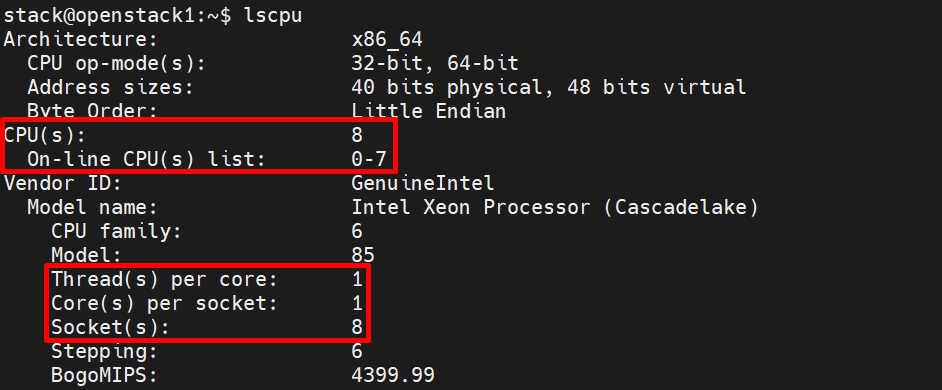

# Nova-Scheduler

## 1. Giới thiệu Nova-Scheduler

Nếu **Nova-Compute** được coi là worker thực hiện việc chạy máy ảo, thì **Nova-Scheduler** chính là "bộ não" điều khiển. Nhiệm vụ duy nhất nhưng cực kỳ quan trọng của nó là: **Quyết định xem một Instance (máy ảo) nên được khởi tạo trên Compute Node (máy chủ vật lý) nào**.

**Vai trò cụ thể**:
- Nhận RequestSpec từ `nova-api` (qua message queue).
- Truy vấn **Placement API** để lấy danh sách host có đủ tài nguyên (`allocation_candidates`).
- Áp dụng **Filters** để loại các host không phù hợp.
- Áp dụng **Weighers** để chấm điểm và chọn host tốt nhất.
- Trả kết quả về `nova-conductor` → `nova-compute` thực hiện spawn VM.

**Driver phổ biến nhất**: `filter_scheduler` (mặc định, được dùng từ phiên bản đầu đến nay).

## 2. Cơ chế hoạt động – 3 bước

Khi người dùng gửi yêu cầu tạo máy ảo, Nova-Scheduler thực hiện cuộc "tuyển chọn" gắt gao qua 3 giai đoạn:

### Bước 1: Lấy danh sách hosts (Get all hosts)

Scheduler liên lạc với **Placement API** (từ Pike trở đi, không truy vấn DB trực tiếp nữa) để lấy danh sách tất cả Compute Node đang `UP` và có đủ inventory tài nguyên. Lúc này, danh sách có thể lên tới hàng trăm hoặc hàng nghìn host.


Trong quá trình làm việc, Filter Scheduler **lặp đi lặp lại** trên các Compute node tìm được, mỗi lần lặp sẽ đánh giá lại các host, tìm ra danh sách kết quả các node đủ điều kiện, sau đó sắp xếp theo thứ tự bởi weighting. Scheduler dựa vào đó để chọn một host có weight cao nhất để launch instance.

Nếu Scheduler không thể tìm thấy host phù hợp → trả về lỗi **`NoValidHost`** và instance sẽ ở trạng thái `ERROR`.

Filter scheduler khá linh hoạt, hỗ trợ nhiều cách filtering và weighting cần thiết. Nếu bạn vẫn chưa thấy linh hoạt, bạn có thể tự định nghĩa một giải thuật filtering của riêng mình (custom filter Python class).

### Bước 2: Lọc (Filtering)

Đây là bước loại bỏ các host không đủ điều kiện. Nova-Scheduler chạy qua một chuỗi các "bộ lọc" (Filters) được cấu hình sẵn. Nếu một host **thất bại ở bất kỳ bộ lọc nào**, nó bị loại ngay lập tức.

**Các filter phổ biến nhất**:

| Filter | Chức năng |
|---|---|
| **RamFilter** / **CoreFilter** / **DiskFilter** | Loại bỏ host không đủ RAM, CPU, Disk (đã chuyển sang Placement query ở các bản mới). |
| **ComputeFilter** | Chỉ giữ lại các host đang ở trạng thái `UP` (service `nova-compute` đang chạy). |
| **ComputeCapabilitiesFilter** | Match `capabilities` đặc thù (ví dụ: hypervisor type). |
| **ImagePropertiesFilter** | Kiểm tra host có hỗ trợ kiến trúc của Image không (ví dụ: Image x86_64 không thể chạy trên host ARM). |
| **AvailabilityZoneFilter** | Lọc theo AZ user chỉ định. |
| **AggregateInstanceExtraSpecsFilter** | Match flavor `extra_specs` ↔ aggregate `metadata`. |
| **AggregateImagePropertiesIsolation** | Match image properties ↔ aggregate metadata (license, OS). |
| **AggregateMultiTenancyIsolation** | Cô lập tenant theo aggregate. |
| **ServerGroupAntiAffinityFilter** | Đảm bảo các VM trong group không chạy chung host (HA). |
| **ServerGroupAffinityFilter** | Đảm bảo các VM trong group chạy cùng host (low-latency). |
| **PciPassthroughFilter** | Lọc host có PCI device phù hợp (GPU, SR-IOV…). |
| **NUMATopologyFilter** | Lọc host hỗ trợ NUMA pinning. |

**Cấu hình filters** trong `/etc/nova/nova.conf`:

```ini
[filter_scheduler]
enabled_filters = ComputeFilter,ComputeCapabilitiesFilter,ImagePropertiesFilter,ServerGroupAntiAffinityFilter,ServerGroupAffinityFilter,AvailabilityZoneFilter,AggregateInstanceExtraSpecsFilter
available_filters = nova.scheduler.filters.all_filters
```

### Bước 3: Trọng số (Weighting)

Là cách chọn máy chủ phù hợp nhất từ một nhóm các máy chủ hợp lệ bằng cách tính toán và đưa ra trọng số (weights) cho tất cả các máy chủ trong danh sách.

Sau bước lọc, bạn có thể còn lại 5–10 host "đủ tiêu chuẩn". Nova-Scheduler sẽ không chọn đại một cái, mà nó sẽ **chấm điểm** chúng bằng các bộ tính trọng số (Weighers).

Để ưu tiên 1 weigher so với weigher khác, tất cả các weigher cần phải xác định **multiplier** sẽ được áp dụng trước khi tính toán weight cho node. Tất cả weights được **chuẩn hóa (normalize)** trước khi multiplier có thể được áp dụng. Do đó, weight cuối cùng của object sẽ là:

```ini
weight = (Weight_1 * Multiplier_1) + (Weight_2 * Multiplier_2) + ...
```

Host nào có **tổng điểm cao nhất** sẽ được chọn để cài đặt máy ảo.


**Các Weigher phổ biến**:

| Weigher | Chức năng | Multiplier mặc định |
|---|---|---|
| **RAMWeigher** | Ưu tiên host có nhiều RAM trống nhất (spreading). Đặt âm để stacking. | `1.0` |
| **CPUWeigher** | Ưu tiên host có CPU ít bận rộn hơn. | `1.0` |
| **DiskWeigher** | Ưu tiên host có nhiều disk trống nhất. | `1.0` |
| **IoOpsWeigher** | Ưu tiên host có ít VM đang build/migrate để tránh nghẽn I/O. | `-1.0` |
| **SoftAffinityWeigher** / **SoftAntiAffinityWeigher** | Ưu tiên (chứ không bắt buộc) các VM cùng/khác host. | `1.0` |
| **BuildFailureWeigher** | Trừ điểm các host gần đây bị fail khi build. | `-1000000.0` |
| **PCIWeigher** | Ưu tiên host có ít PCI device để giữ tài nguyên cho VM cần PCI. | `1.0` |
| **MetricsWeigher** | Dựa vào metrics tùy chỉnh (CPU load, network…). | `1.0` |


**Cấu hình weighers** trong `nova.conf`:

```ini
[filter_scheduler]
weight_classes = nova.scheduler.weights.all_weighers
ram_weight_multiplier = 1.0
cpu_weight_multiplier = 1.0
disk_weight_multiplier = 1.0
io_ops_weight_multiplier = -1.0
soft_affinity_weight_multiplier = 1.0
build_failure_weight_multiplier = 1000000.0
```

**Stacking vs Spreading**:
- **Spreading** (mặc định, multiplier dương): Chia đều VM trên các host → resilient hơn khi host hỏng.
- **Stacking** (multiplier âm): Đặt VM tập trung vào ít host → tiết kiệm điện, dễ tắt các host rảnh.

## 3. Host Aggregate


Host Aggregate và Availability Zone (AZ) là hai tính năng cốt lõi giúp **admin** kiểm soát placement instance một cách chính xác theo đặc tính phần cứng, vị trí vật lý hoặc yêu cầu cô lập. Đây là **công cụ chính** mà scheduler dùng để định tuyến VM.

- **Host Aggregate**: Nhóm logic **chỉ admin thấy**, dùng để gom host theo đặc điểm (SSD, GPU, CPU type, rack, DC…).
- **Availability Zone**: Nhóm logic **user thấy**, thực chất là một metadata đặc biệt (`availability_zone=xxx`) gắn vào Host Aggregate.

**Lưu ý quan trọng**: Một host có thể thuộc **nhiều Host Aggregate**, nhưng chỉ thuộc **một Availability Zone**.

### 3.1 Định nghĩa & Mục đích

Host Aggregate là một cơ chế nhóm các Compute Node (các máy chủ vật lý chạy dịch vụ `nova-compute`) lại với nhau thành các thực thể logic do **admin** tạo để:
- Nó là một khái niệm chỉ dành cho Quản trị viên (Admin). Người dùng thông thường (Tenant/User) không nhìn thấy tên của các Host Aggregate.
- Một Compute Node có thể thuộc về nhiều Host Aggregate khác nhau cùng một lúc.
- Nó sử dụng Metadata (các cặp Key-Value) để gắn thuộc tính cho nhóm máy chủ đó.

**Mục đích sử dụng**:
- **Phân nhóm theo đặc tính phần cứng**: Bạn có một số server có card đồ họa (GPU), một số khác có SSD siêu tốc, và số còn lại là CPU đời cũ. Aggregate giúp gom chúng lại để cấp phát đúng yêu cầu.
- **Cô lập tài nguyên (Isolation)**: Bạn muốn dành riêng một cụm server cực mạnh cho khách hàng VIP, không muốn VM của khách hàng thường "xài chung" máy chủ đó.
- **Quản lý Zone (Availability Zones)**: AZ trong OpenStack được triển khai dựa trên chính Host Aggregate. AZ là một Host Aggregate đặc biệt được công khai cho người dùng cuối.

**Cách thức hoạt động**:
- **Gán nhãn (Tagging)**: Admin tạo Aggregate và gán metadata cho nó.
  - Ví dụ: Tạo aggregate `High_Memory` và gán metadata `ram_type=high_performance`. Sau đó thêm `compute-01` và `compute-02` vào.
- **Yêu cầu từ Flavor**: Admin cấu hình các thuộc tính đặc biệt trong Flavor (Extra Specs).
  - Ví dụ: Tạo flavor `m1.extra_ram` và thêm thuộc tính `aggregate_instance_extra_specs:ram_type=high_performance`.
- **Lọc (Filtering) – Trái tim của hệ thống**: Khi user "Launch Instance" với flavor trên, Scheduler kích hoạt filter `AggregateInstanceExtraSpecsFilter`.
  - Quét qua tất cả các host trong hệ thống.
  - Kiểm tra Flavor yêu cầu gì (`ram_type=high_performance`).
  - Đối chiếu với Metadata của các Host Aggregate. Host nào nằm trong Aggregate có nhãn khớp sẽ giữ lại. Host nào không có nhãn này bị loại.
- **Khởi tạo**: Sau khi lọc xong, máy ảo được chỉ định chạy trên một trong các host thuộc Aggregate đã chọn.

**Ví dụ dễ nhớ**:

Giả sử bạn là Admin của một hệ thống Cloud cho một trường đại học:
- **Thiết lập**: Gom 5 server có chip Xeon mạnh nhất vào một Aggregate tên là `Lab_Nghien_Cuu`.
- **Gán nhãn**: Đặt metadata cho Aggregate này là `priority=research`.
- **Phân quyền**: Tạo một Flavor riêng chỉ dành cho các giáo sư, trong Flavor đó có yêu cầu `priority=research`.
- **Kết quả**: Khi sinh viên tạo VM (dùng flavor thường), máy của họ sẽ không bao giờ "nhảy" vào 5 server mạnh kia. Ngược lại, khi giáo sư tạo VM với flavor đặc biệt, Scheduler sẽ luôn ưu tiên đưa họ vào đúng cụm server dành riêng cho nghiên cứu.

### 3.2 Metadata – Điểm mạnh nhất

Metadata là các cặp khóa-giá trị (key-value pairs) được gán cho một Host Aggregate. Nova sử dụng các cặp này kết hợp với Flavor Extra Specs để quyết định VM sẽ được đặt trên host nào.

Metadata đóng vai trò là "nhãn" (label) được gán vào các nhóm này để điều phối việc khởi tạo VM.

Ví dụ:
```bash
ssd=true
gpu=true
cpu_type=intel
os=windows
```

- `availability_zone`: Metadata phổ biến nhất. Nó xác định phân vùng vật lý mà người dùng có thể nhìn thấy (ví dụ: `us-west-1`).
- `cpu_allocation_ratio` / `ram_allocation_ratio`: Cho phép ghi đè tỉ lệ overcommit cho riêng nhóm host đó, thay vì dùng cấu hình chung trong `nova.conf`.
- `pinned`: Thường dùng trong cấu hình CPU Pinning để cô lập các CPU core cho các VM hiệu năng cao.

**Ví dụ dễ nhớ**:

| Kịch bản | Metadata Key-Value | Mục đích |
|---|---|---|
| Phân loại phần cứng | `hardware=gpu` hoặc `cpu=skylake` | Đưa VM xử lý đồ họa hoặc cần tập lệnh CPU đặc biệt vào đúng host. |
| Phụ thuộc bản quyền | `license=windows` | Gom host đã mua license Windows để tiết kiệm chi phí. |
| Tối ưu lưu trữ | `storage=nvme` | Đảm bảo VM cần I/O cao chạy trên node NVMe. |
| Tuân thủ (Compliance) | `security=high_trust` | Cô lập VM nhạy cảm trên server vật lý có bảo mật lớp cứng (TPM). |

### 3.3 Scheduler Filters liên quan đến Aggregate

| Filter | Chức năng | Dùng với |
|---|---|---|
| **AggregateInstanceExtraSpecsFilter** | Match flavor extra_specs ↔ aggregate metadata | Hardware-specific (SSD/GPU) |
| **AggregateImagePropertiesIsolation** | Match image properties ↔ aggregate metadata | License, OS-specific |
| **AggregateMultiTenancyIsolation** | Cô lập tenant theo aggregate | Multi-tenancy |
| **AvailabilityZoneFilter** | Lọc theo AZ | User chọn AZ |

**Bật trong `/etc/nova/nova.conf`** (trên nova-scheduler):
```ini
[filter_scheduler]
enabled_filters = ...,AggregateInstanceExtraSpecsFilter,AvailabilityZoneFilter,ComputeFilter,...
```

## 4. Availability Zone (AZ)

### 4.1 Định nghĩa

Availability Zone (AZ) là một **phân vùng logic** trong OpenStack đại diện cho một cụm tài nguyên có tính chất vật lý chung (như cùng một nguồn điện, cùng một hệ thống làm mát, hoặc cùng một tủ rack).
- Thực chất, một AZ là một Host Aggregate được gắn thêm thuộc tính đặc biệt để hiển thị cho người dùng cuối.
- Khi bạn tạo một Host Aggregate và gán cho nó một cái tên vùng (Zone name), nó chính thức trở thành một AZ.

**Mục đích của Availability Zone**:
- Mục đích lớn nhất của AZ **không phải** là để chọn "máy mạnh hay yếu" mà là để tránh **lỗi đơn điểm (Single Point of Failure - SPoF)**.
  - **Chống thảm họa vật lý**: Nếu bạn có 2 tủ rack (Rack A và Rack B) với nguồn điện riêng biệt, bạn nên chia chúng thành `AZ-01` và `AZ-02`.
  - **Đảm bảo tính sẵn sàng cao (High Availability)**: Người dùng sẽ chạy VM `Web-01` ở `AZ-01` và `Web-02` ở `AZ-02`. Nếu nguyên một tủ rack AZ-01 bị cháy nguồn, VM ở `AZ-02` vẫn hoạt động bình thường.
  - **Tăng tính minh bạch**: Cho phép khách hàng biết VM của họ đang nằm ở khu vực nào.

**Cách thức hoạt động**:

AZ hoạt động dựa trên cơ chế "địa chỉ hóa" trong quá trình lập lịch của Nova:
- **Phía Admin**: Tạo Host Aggregate → Gán Metadata `availability_zone=Zone-A` → Thêm các compute node vào.
- **Phía User**: Khi tạo VM qua Dashboard (Horizon) hoặc CLI, người dùng thấy menu lựa chọn "Availability Zone".
- **Quá trình lập lịch**:
  - Nếu User chọn `Zone-A`, Scheduler chỉ nhìn vào các Host thuộc Aggregate có tên là `Zone-A`.
  - Bỏ qua tất cả các host khác, bất kể có rảnh rỗi hay mạnh đến đâu.
  - Nếu `Zone A` hết tài nguyên, việc tạo VM sẽ **thất bại** (thay vì tự động nhảy sang Zone khác) để đảm bảo đúng ý chí của người dùng.

### 4.2 So sánh Host Aggregate vs Availability Zone

Hãy tưởng tượng bạn quản lý một khách sạn:
- **Host Aggregate (Nội bộ)**: Là cách bạn phân loại phòng (Phòng có bồn tắm, view biển, phòng nhân viên). Khách thuê không cần biết mã số quản lý nội bộ này, họ chỉ chọn loại phòng.
- **Availability Zone (Công khai)**: Là việc bạn chia khách sạn thành "Tòa tháp Đông" và "Tòa tháp Tây". Khách hàng chủ động chọn "Tôi muốn ở Tháp Đông" để phòng khi Tháp Tây sửa chữa điện.

| Đặc điểm | Host Aggregate | Availability Zone (AZ) |
|---|---|---|
| **Hiển thị** | Ẩn với người dùng | Công khai cho người dùng |
| **Ghép cặp** | Một Host có thể thuộc nhiều Aggregate | Một Host chỉ thuộc một AZ duy nhất |
| **Metadata** | Dùng nhãn tự định nghĩa (`ssd=true`, `gpu=nvidia`) | Dùng nhãn mặc định `availability_zone` |
| **Mặc định** | Không có mặc định | Nếu không chỉ định, VM rơi vào zone `nova` |

## 5. Quản lý qua OpenStack CLI

### 5.1 Host Aggregate

```bash
# Tạo aggregate
openstack aggregate create fast-io --zone nova

# Gán metadata (quan trọng nhất)
openstack aggregate set --property ssd=true fast-io

# Thêm host
openstack aggregate add host fast-io compute01
openstack aggregate add host fast-io compute02

# Xem danh sách & chi tiết
openstack aggregate list --long
openstack aggregate show fast-io

# Xóa host / xóa aggregate
openstack aggregate remove host fast-io compute01
openstack aggregate delete fast-io
```

### 5.2 Availability Zone

```bash
# Tạo AZ (cách 1 - khuyến nghị)
openstack aggregate create --zone zone1 dc1-aggregate

# Hoặc tạo aggregate rồi set AZ (cách 2)
openstack aggregate set --property availability_zone=zone1 my-aggregate

# Liệt kê AZ
openstack availability zone list --compute

# User tạo VM với AZ
openstack server create --availability-zone zone1 \
  --image cirros --flavor m1.small --network private vm-test
```

### 5.3 Flavor + Extra Specs (kết nối user với aggregate)

```bash
# Tạo flavor
openstack flavor create --ram 8192 --disk 80 --vcpus 4 ssd.large

# Gán yêu cầu SSD
openstack flavor set \
  --property aggregate_instance_extra_specs:ssd=true ssd.large
```

Khi user launch VM dùng flavor `ssd.large` → Scheduler chỉ chọn host trong aggregate có `ssd=true`.

### 5.4 Kiểm tra & Debug Scheduler

```bash
# Xem các filter đang bật
grep enabled_filters /etc/nova/nova.conf

# Xem log quyết định scheduler
tail -f /var/log/nova/nova-scheduler.log

# Test allocation candidates qua Placement
openstack allocation candidate list --resource VCPU=2 --resource MEMORY_MB=2048

# Xem trạng thái host
openstack hypervisor list
openstack hypervisor stats show
```

## 6. Tích hợp với Placement Service (từ Nova 18+)

- Nova tự động **sync** Host Aggregate → Placement Aggregate (resource provider).
- Tăng tốc scheduling đáng kể (filter ở Placement level **nhanh hơn** Nova filter, do filter ngay trong DB query).
- Tenant isolation: dùng `filter_tenant_id=<tenant_id>` + config:
  ```ini
  [scheduler]
  limit_tenants_to_placement_aggregate = True
  ```
- Lệnh đồng bộ thủ công sau khi thay đổi aggregate:
  ```bash
  nova-manage placement sync_aggregates
  nova-manage placement heal_allocations --verbose
  ```



## 7. Flow Scheduler khi tạo VM

1. User gửi `openstack server create` (có thể kèm `--availability-zone`).
2. `nova-api` validate → gọi Placement `GET /allocation_candidates` → đẩy task vào message queue.
3. `nova-scheduler` nhận task, áp dụng các bước:
   - **AvailabilityZoneFilter** → lọc aggregate có AZ tương ứng.
   - **AggregateInstanceExtraSpecsFilter** → match flavor extra specs.
   - Các filter khác (ComputeFilter, ImagePropertiesFilter, NUMATopologyFilter…).
   - **Weighting** → chọn host phù hợp nhất (tổng điểm cao nhất).
4. Placement API xác nhận resource (từ Nova 28+ là bắt buộc cho AZ).
5. Scheduler trả về host được chọn cho conductor.
6. `nova-compute` trên host được chọn tiến hành spawn instance.

## 8. Best practices & Troubleshooting

### 8.1 Best practices

- **Luôn bật `ComputeFilter`** để loại host down.
- **Dùng aggregate metadata + flavor extra_specs** thay vì hard-code AZ — linh hoạt hơn.
- **Chia AZ theo failure domain thật** (rack/PDU/switch), không chia theo loại hardware (đó là việc của aggregate).
- **Set multiplier âm cho `io_ops`** để tránh dồn VM build vào cùng host (`io_ops_weight_multiplier = -1.0`).
- **Theo dõi `BuildFailureWeigher`** để tự động loại trừ host có lịch sử fail nhiều.
- **Test scheduler trước production**: dùng `--dry-run` không có, nhưng có thể đọc kỹ `nova-scheduler.log` với `debug = True`.

### 8.2 Lỗi thường gặp

| Lỗi | Nguyên nhân | Cách fix |
|---|---|---|
| `NoValidHost` | Không host nào pass filters | Check filter nào loại — bật `debug=True`, đọc log scheduler |
| VM luôn rơi vào 1 host | Stacking (multiplier âm) hoặc chỉ 1 host pass filter | Kiểm tra weigher multiplier |
| Aggregate metadata không có tác dụng | Filter không bật trong `enabled_filters` | Thêm `AggregateInstanceExtraSpecsFilter` |
| User chọn AZ nhưng VM tạo ở zone khác | `default_schedule_zone` ghi đè | Check `[DEFAULT] default_schedule_zone` |
| Sau thêm host mới scheduler không thấy | Chưa discover | Chạy `nova-manage cell_v2 discover_hosts` |

### 8.3 Debug nhanh khi VM không tạo được

```bash
# 1. Kiểm tra fault message của VM
openstack server show <vm> -f value -c fault

# 2. Grep request-id trong log scheduler
grep "req-xxxx" /var/log/nova/nova-scheduler.log

# 3. Xem placement có đủ tài nguyên không
openstack allocation candidate list --resource VCPU=2 --resource MEMORY_MB=2048

# 4. Kiểm tra service nova-compute trên các host
openstack compute service list --service nova-compute

# 5. Bật debug tạm thời (controller)
sudo crudini --set /etc/nova/nova.conf DEFAULT debug True
sudo systemctl restart openstack-nova-scheduler
```

## 9. Tóm tắt

| Khái niệm | Vai trò |
|---|---|
| **Nova-Scheduler** | "Bộ não" chọn host để spawn VM |
| **Filters** | Loại các host không đủ điều kiện (kiểu binary: pass/fail) |
| **Weighers** | Chấm điểm các host pass filter để chọn host tốt nhất |
| **Host Aggregate** | Nhóm host theo đặc tính (admin-only) — công cụ chính cho admin |
| **Availability Zone** | Aggregate đặc biệt, hiển thị cho user, dùng cho HA/failure domain |
| **Placement** | Cung cấp data inventory & allocation cho scheduler query |

**Tài liệu tham khảo**:
- Scheduler: https://docs.openstack.org/nova/latest/admin/scheduling.html
- Host aggregates: https://docs.openstack.org/nova/latest/admin/aggregates.html
- Availability Zones: https://docs.openstack.org/nova/latest/admin/availability-zones.html
- Filters & Weighers: https://docs.openstack.org/nova/latest/admin/scheduling.html#filters
