# LAB: Cold & Live Migration trên OpenStack Kolla Ansible 2025.2 (Flamingo)
---

## Thông tin môi trường lab

| Node | IP | Role | Spec gợi ý |
|------|-----|------|------------|
| **control01** | 192.168.70.122 | Controller + Deploy node | 8 vCPU / 16GB RAM |
| **compute01** | 192.168.70.127 | Compute node 1 | 8 vCPU / 16GB RAM |
| **compute02** | 192.168.70.119 | Compute node 2 | 8 vCPU / 16GB RAM |

**OS:** Ubuntu 24.04 LTS
**OpenStack:** 2025.2 Flamingo
**Kolla Ansible:** 21.0.0

---

## Mục lục

1. [Kiểm tra môi trường ban đầu](#phần-1-kiểm-tra-môi-trường-ban-đầu)
2. [Chuẩn bị tài nguyên OpenStack](#phần-2-chuẩn-bị-tài-nguyên-openstack)
3. [Cấu hình Live Migration trong Nova](#phần-3-cấu-hình-live-migration-trong-nova)
4. [Storage option cho Live Migration](#phần-4-chọn-phương-án-storage)
5. [Tạo VM test](#phần-5-tạo-vm-test)
6. [LAB Cold Migration](#phần-6-lab-cold-migration)
7. [LAB Live Migration](#phần-7-lab-live-migration)
8. [Troubleshooting](#phần-8-troubleshooting-các-lỗi-đã-gặp)
9. [Tổng kết](#phần-9-tổng-kết)

---

## PHẦN 1: KIỂM TRA MÔI TRƯỜNG BAN ĐẦU

### 1.1. Activate venv và load credentials

Trên **control01**:

```bash
source ~/kolla-venv/bin/activate
source /etc/kolla/admin-openrc.sh
export OS_CLIENT_CONFIG_FILE=/etc/kolla/clouds.yaml
export OS_CLOUD=kolla-admin
```

Để tự động load mỗi khi login:

```bash
cat <<EOF >> ~/.bashrc
source ~/kolla-venv/bin/activate
source /etc/kolla/admin-openrc.sh
export OS_CLIENT_CONFIG_FILE=/etc/kolla/clouds.yaml
export OS_CLOUD=kolla-admin
EOF
```

### 1.2. Verify cluster hoạt động

```bash
# Liệt kê service
openstack service list

# Liệt kê compute service
openstack compute service list

# Liệt kê hypervisor - phải thấy 2 compute đều "up"
openstack hypervisor list
```

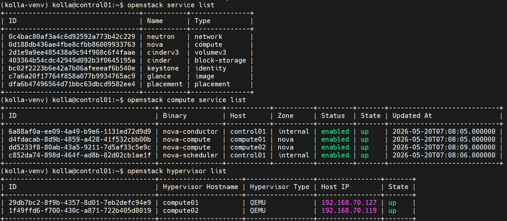

### 1.3. Kiểm tra /etc/hosts trên tất cả node

```bash
cat /etc/hosts
```

Phải có:

```
192.168.70.122  control01
192.168.70.127  compute01
192.168.70.119  compute02
```

Nếu thiếu, thêm vào cả 3 node:

```bash
sudo tee -a /etc/hosts <<EOF
192.168.70.122  control01
192.168.70.127  compute01
192.168.70.119  compute02
EOF
```

### 1.4. Test SSH giữa các compute nodes (cho live migration)

```bash
# Trên compute01
sudo docker exec nova_compute ssh -o StrictHostKeyChecking=no nova@compute02 'hostname'
# Output mong đợi: compute02

# Trên compute02
sudo docker exec nova_compute ssh -o StrictHostKeyChecking=no nova@compute01 'hostname'
# Output mong đợi: compute01
```

**Nếu fail (Permission denied)**, chạy reconfigure trên control01 (xem Bước 3.2 để tìm path inventory chính xác).

---

## PHẦN 2: CHUẨN BỊ TÀI NGUYÊN OPENSTACK

### 2.1. Kiểm tra network đã tồn tại TRƯỚC khi tạo mới

> ** Lỗi thường gặp:** `ConflictException: 409, Unable to create the flat network. Physical network physnet1 is in use.`
>
> Nguyên nhân: đã có external network dùng `physnet1` từ trước.

```bash
# Liệt kê external network
openstack network list --external

# Liệt kê tất cả subnet
openstack subnet list

# Liệt kê router
openstack router list
```

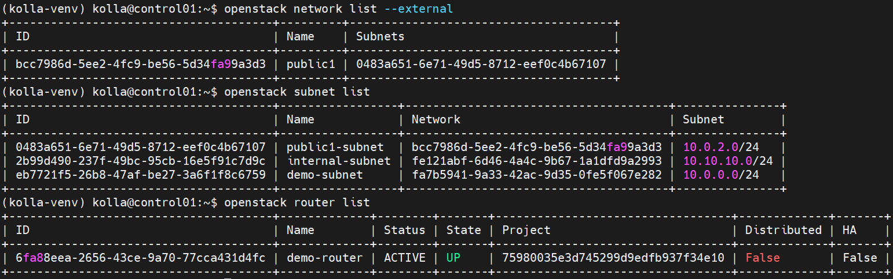

- Topology theo list trên là:
```bash
External network
public1 (10.0.2.0/24)
        |
        | gateway
        |
demo-router
        |
        +---- demo-subnet (10.0.0.0/24)
        |
        +---- internal-subnet (10.10.10.0/24)
```
- `public1` = mạng external (ra ngoài)
- `demo-router` = router Neutron nối mạng internal ↔ external
- `demo-subnet` và `internal-subnet` = mạng private cho VM

- Luồng tạo VM: 
```bash
Nova tạo VM
↓
Neutron cấp port/IP
↓
OVS bridge tạo interface
↓
libvirt attach NIC
↓
RabbitMQ truyền message
↓
Compute node chạy instance
```

- **Tái sử dụng `public1` và `demo-router`, không tạo external network mới.** Nếu môi trường sạch (không có VM/router lỗi), **bỏ qua phần reset bên dưới và đi thẳng đến mục 2.2**.

> **⚠️ Cảnh báo:** Các bước reset bên dưới sẽ **xóa hoàn toàn** topology hiện tại. Chỉ chạy khi muốn làm lại từ đầu. Nếu chỉ muốn giữ lại `public1` để tái sử dụng thì **dừng ở Bước 4** (xóa router), KHÔNG chạy Bước 5-6.

- **Bước 1: Xóa VM**: 
```bash
openstack server list
openstack server delete <vm-name>
openstack server list
```
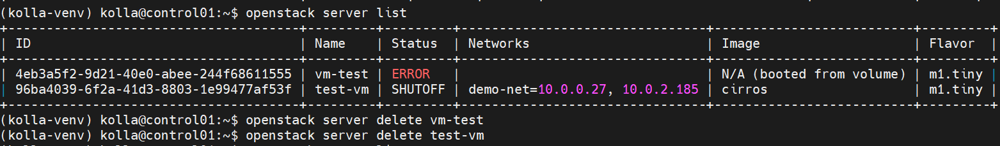

- **Bước 2: Xóa Floating IP (nếu có)**
```bash
openstack floating ip list
openstack floating ip delete <floating-ip>
```

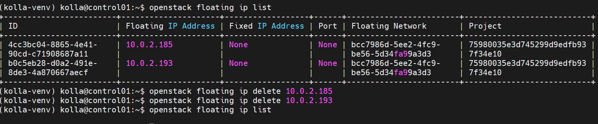

- **Bước 3: Xóa router interface**
  - Router không xóa được nếu còn subnet gắn vào.
```bash
# Check
openstack router show demo-router
# Gỡ subnet:
openstack router remove subnet demo-router demo-subnet

openstack router remove subnet demo-router internal-subnet
# Gỡ gateway:
openstack router unset --external-gateway demo-router
```
- **Bước 4: Xóa Router**
```bash
openstack router delete demo-router
```
- **Bước 5: Xóa subnet**
```bash
openstack subnet delete demo-subnet
openstack subnet delete internal-subnet
openstack subnet delete public1-subnet
```
- **Bước 6: Xóa network**
```bash
openstack network list
openstack network delete demo-net
openstack network delete internal-net
openstack network delete public1
```

### 2.2. Tạo internal network mới (tuỳ chọn)

> **Note:** Nếu bạn đã có sẵn `demo-net` ở Phần 2.1 thì có thể bỏ qua mục này và dùng `demo-net` ở Phần 5. Lab dưới đây giả định bạn dùng `demo-net`; nếu chọn `internal-net` thì thay tên tương ứng ở Phần 5.

Nếu muốn tách network riêng cho VM lab migration:

```bash
openstack network create internal-net

openstack subnet create --network internal-net \
  --subnet-range 10.10.10.0/24 \
  --dns-nameserver 8.8.8.8 \
  internal-subnet
```

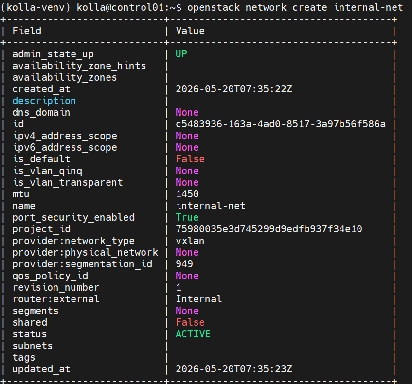

- `admin_state_up`: Trạng thái quản trị (admin bật/tắt mạng).
  - `UP` → mạng được phép hoạt động
  - `DOWN` → admin tắt mạng nếu: `openstack network set --disable internal-net`, VM vẫn tồn tại nhưng traffic có thể bị ngắt.
- `availability_zone_hints`: Gợi ý vùng khả dụng (Availability Zone) mong muốn. Thường dùng ở môi trường lớn nhiều datacenter. Không dùng bỏ trống.
- `availability_zones`: Các AZ thực tế network đang thuộc về. Khác với `hints`, `hints` = yêu cầu, `availability_zones` = thực tế
- `created_at`: Thời điểm tạo
- `description`: Mô tả do người dùng thêm. Ví dụ:
```bash
openstack network set \
--description "Network cho backend"
internal-net
```
- `dns_domain`: Domain DNS áp dụng cho network.
- `id`: UUID duy nhất của network.
- `ipv4_address_scope`: Address scope IPv4. Dùng để gom các subnet vào cùng phạm vi định tuyến.
- `ipv6_address_scope`: Tương tự nhưng cho IPv6
- `is_default`: Có phải mạng mặc định không. Nếu `True` thì tạo VM mà không chỉ định network có thể tự dùng mạng này.
- `is_vlan_qinq`: QinQ = VLAN lồng VLAN (802.1ad). Ví dụ: VLAN 100 chứa VLAN 200
- `is_vlan_transparent`: Cho phép VM nhìn thấy VLAN tag gốc. Nếu bật True VM có thể xử lý VLAN bên trong.
- `mtu`: Maximum Transmission Unit.
- `port_security_enabled`: Bật bảo vệ port: Security Group, Anti-spoofing, IP/MAC filtering. Nếu False, VM có thể tự đổi IP/MAC.
- `project_id`: Project/Tenant sở hữu network.
- `provider:network_type`: Cực kỳ quan trọng. Cho biết kiểu mạng backend. Có thể là: flat, vlan, vxlan, geneve, gre
- `provider:physical_network`: Tên mạng vật lý ánh xạ.
- `provider:segmentation_id`: ID phân đoạn.
- `qos_policy_id`: Chính sách QoS.
- `revision_number`: Số lần cập nhật. Sửa network `openstack network set ...` sẽ tăng lên.
- `router:external`: Có 2 kiểu: Internal và External, Internal là VM-only network
- `segments`: Dùng cho routed network.
- `shared`: Mạng có chia sẻ giữa project không. False → chỉ project này dùng, True → mọi project dùng
- `status`: Trạng thái hoạt động:
- `subnets`: Danh sách subnet gắn vào network.
- `tags`: Tag tùy ý. `openstack network set \ --tag production`

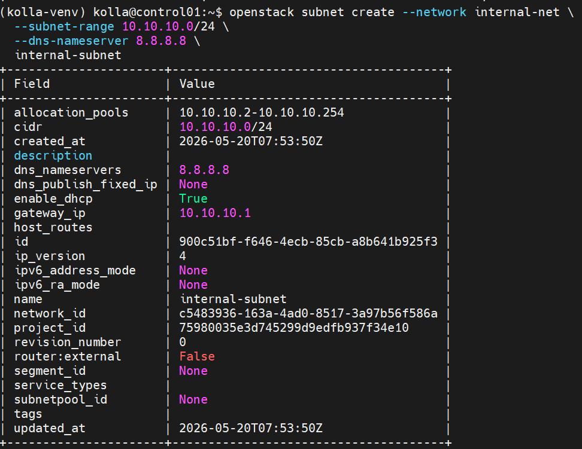

- `allocation_pools`: Dải IP được DHCP cấp phát cho VM.
  - Hiện:
    ```text
    10.10.10.2 - 10.10.10.254
    ```
  - VM tạo trong subnet này sẽ được cấp IP trong khoảng trên.
  - `10.10.10.1` không nằm trong pool vì đang dành cho gateway.
  - Có thể chỉ định:
    ```bash
    openstack subnet create \
    --allocation-pool start=10.10.10.100,end=10.10.10.200 \
    ...
    ```

- `cidr`: Dải mạng của subnet theo ký hiệu CIDR.
  - Hiện:
    ```text
    10.10.10.0/24
    ```
  - Nghĩa là:
    ```text
    Network: 10.10.10.0
    Host: 10.10.10.1 → 10.10.10.254
    Broadcast: 10.10.10.255
    ```
  - `/24` tương đương:
    ```text
    255.255.255.0
    ```

- `created_at`: Thời điểm tạo subnet.

- `description`: Mô tả do người dùng thêm.
  - Ví dụ:
    ```bash
    openstack subnet set \
    --description "Subnet backend service" \
    internal-subnet
    ```

- `dns_nameservers`: DNS server VM sẽ nhận được khi DHCP cấp IP.
  - Hiện:
    ```text
    8.8.8.8
    ```
  - VM sau khi boot có thể tự resolve:
    ```bash
    ping google.com
    ```
  - Có thể thêm:
    ```bash
    openstack subnet set \
    --dns-nameserver 1.1.1.1 \
    internal-subnet
    ```

- `dns_publish_fixed_ip`: Có publish fixed IP lên DNS hay không.
  - `None` → không cấu hình
  - Nếu bật, VM có thể tự tạo DNS record.

- `enable_dhcp`: Bật/tắt DHCP.
  - `True` → VM tự nhận IP
  - `False` → phải đặt IP thủ công trong VM
  - Ví dụ:
    ```bash
    openstack subnet set \
    --no-dhcp \
    internal-subnet
    ```

- `gateway_ip`: Địa chỉ gateway của subnet.
  - Hiện:
    ```text
    10.10.10.1
    ```
  - VM muốn đi ra ngoài subnet sẽ gửi traffic đến gateway này.
  - Gateway thường nằm trên router Neutron.

- `host_routes`: Route tĩnh bổ sung cho subnet.
  - Mặc định:
    ```text
    (trống)
    ```
  - Ví dụ:
    ```text
    192.168.100.0/24 → 10.10.10.50
    ```
  - Tức là:
    ```text
    Muốn tới 192.168.100.0/24
    ↓
    gửi qua 10.10.10.50
    ```

- `id`: UUID duy nhất của subnet.

- `ip_version`: Phiên bản IP.
  - Có thể:
    ```text
    4
    6
    ```
  - Hiện:
    ```text
    4
    ```
  - Tức là dùng IPv4.

- `ipv6_address_mode`: Cách cấp IPv6 cho VM.
  - Có thể:
    ```text
    slaac
    dhcpv6-stateful
    dhcpv6-stateless
    ```
  - `None` → không dùng IPv6

- `ipv6_ra_mode`: Chế độ Router Advertisement cho IPv6.
  - Có thể:
    ```text
    slaac
    dhcpv6-stateful
    dhcpv6-stateless
    ```
  - `None` → không dùng IPv6

- `name`: Tên subnet.
  - Hiện:
    ```text
    internal-subnet
    ```

- `network_id`: UUID network mà subnet thuộc về.
  - Hiện:
    ```text
    c5483936-163a-4ad0-8517-3a97b56f586a
    ```
  - Tương ứng:
    ```text
    internal-net
    ```

- `project_id`: Project/Tenant sở hữu subnet.

- `revision_number`: Số lần cập nhật subnet.
  - Hiện:
    ```text
    0
    ```
  - Sau khi sửa:
    ```bash
    openstack subnet set ...
    ```
  - sẽ tăng:
    ```text
    1
    2
    3
    ```

- `router:external`: Subnet có phải subnet external không.
  - `False`
    → subnet nội bộ
  - `True`
    → subnet public/external

- `segment_id`: ID của network segment.
  - Dùng cho routed network.
  - Lab thường:
    ```text
    None
    ```

- `service_types`: Chỉ định subnet dành riêng cho service nào.
  - Ví dụ:
    ```text
    compute
    network
    ```
  - Lab thường bỏ trống.

- `subnetpool_id`: Pool subnet được dùng để sinh subnet.
  - Nếu tạo:
    ```bash
    openstack subnet create \
    --subnet-pool mypool
    ```
  - thì sẽ có UUID ở đây.
  - `None` → subnet tạo trực tiếp bằng CIDR.

- `tags`: Tag tùy ý.
  - Ví dụ:
    ```bash
    openstack subnet set \
    --tag production
    internal-subnet
    ```

- `updated_at`: Thời điểm cập nhật cuối cùng.

### 2.3. Attach internal-subnet vào router có sẵn

#### 2.3.0 (Tuỳ chọn) Tạo lại `public1` và `demo-router` nếu đã lỡ xóa

> Skip mục này nếu `openstack network list --external` đã thấy `public1`. Chỉ chạy khi bạn đã xóa nhầm external network ở bước reset 2.1.

**Bước 1: Tạo lại external network `public1`** (flat trên `physnet1`)

```bash
openstack network create --share --external \
  --provider-physical-network physnet1 \
  --provider-network-type flat \
  public1
```

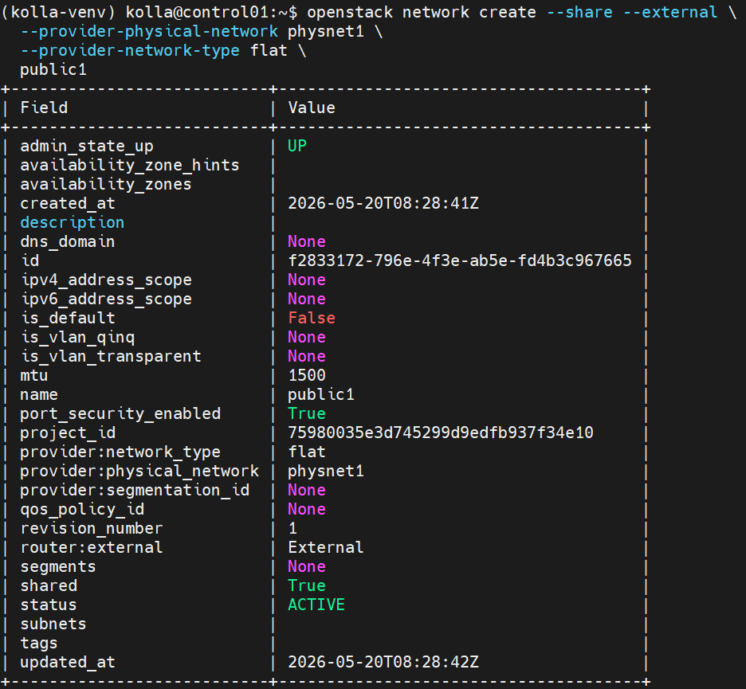

> Nếu báo `Physical network physnet1 is in use` → đã có external network khác chiếm `physnet1`. Liệt kê và quyết định: dùng lại (`openstack network list --external`) hoặc xóa cái cũ trước.

**Bước 2: Tạo subnet cho `public1`**

Thay `10.0.2.0/24` / pool / gateway theo dải IP external thực tế của lab bạn (mặc định Kolla lab dùng `10.0.2.0/24`).

```bash
openstack subnet create public1-subnet \
  --network public1 \
  --subnet-range 10.0.2.0/24 \
  --allocation-pool start=10.0.2.100,end=10.0.2.200 \
  --gateway 10.0.2.1 \
  --no-dhcp
```

> `--no-dhcp` vì gateway/DHCP của dải external do hạ tầng bên ngoài (hoặc giả lập) cấp, Neutron không cấp IP DHCP cho external network.

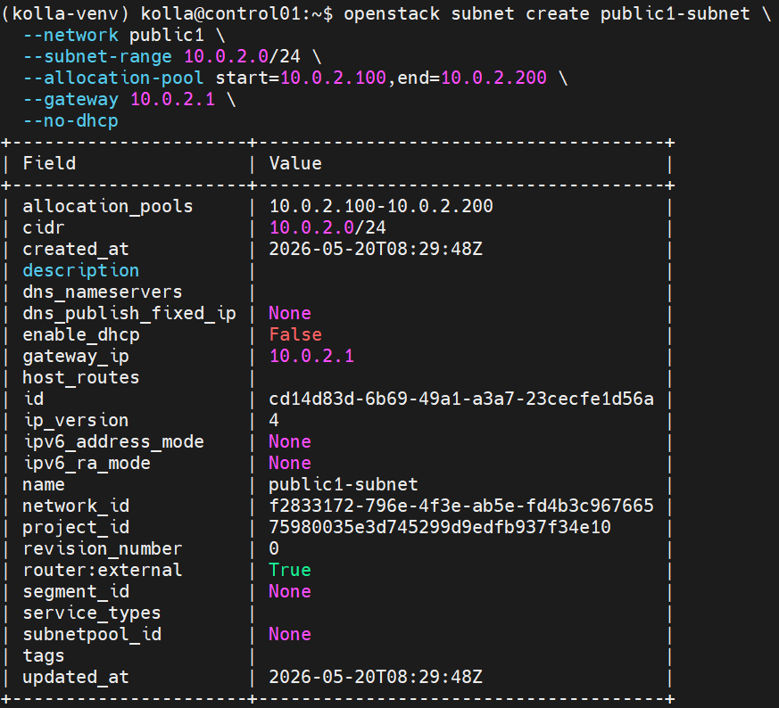

**Bước 3: Tạo lại `demo-router` (nếu cũng đã xóa) và set external gateway**

```bash
# Tạo router nếu chưa có
openstack router show demo-router >/dev/null 2>&1 || openstack router create demo-router

# Set external gateway = public1
openstack router set --external-gateway public1 demo-router

# Verify
openstack router show demo-router -c external_gateway_info
```

`external_gateway_info` phải có dạng:

```json
{"network_id": "<uuid-of-public1>", "external_fixed_ips": [{"subnet_id": "...", "ip_address": "10.0.2.x"}], ...}
```

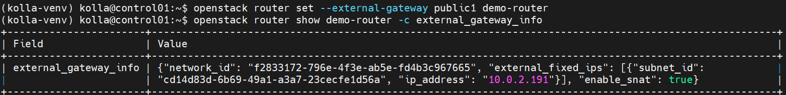

Xong, tiếp tục mục 2.3.1 bên dưới để gắn `internal-subnet` vào router.

#### 2.3.1 Attach `internal-subnet` vào `demo-router`

```bash
# Verify router đã có external gateway chưa
openstack router show demo-router -c external_gateway_info

# Tạo router mới nếu chưa có (skip nếu đã làm ở 2.3.0)
openstack router show demo-router >/dev/null 2>&1 || openstack router create demo-router

# Attach subnet mới vào router
openstack router add subnet demo-router internal-subnet

# Verify
openstack router show demo-router
```
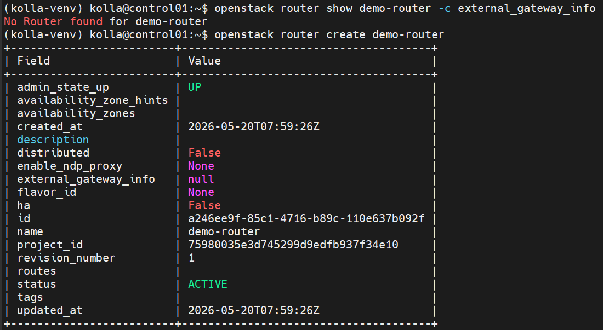

`interfaces_info` phải có IP gateway của internal-subnet (10.10.10.1).

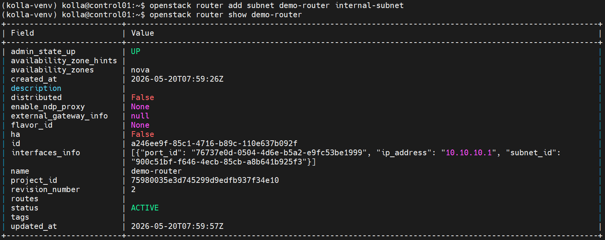

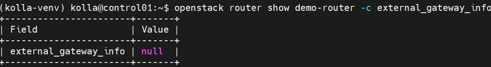

- `null` ở đây nghĩa là router đã tồn tại nhưng chưa có external gateway.
- Hiện trạng chỉ là:
```bash
demo-router
     |
     +---- internal-subnet
```
### 2.4. Security group rules

> **Lưu ý quan trọng:** Trong Kolla Ansible, mỗi project (admin, service, ...) đều có 1 security group tên `default` riêng. Nếu gọi lệnh chỉ bằng tên `default` sẽ bị lỗi:
> ```
> More than one SecurityGroup exists with the name 'default'.
> ```
> → Phải dùng **UUID** của `default` thuộc đúng project (ở đây là `admin`). KHÔNG xóa các `default` của project khác.

```bash
# Lấy UUID của 'default' thuộc project admin
(kolla-venv) kolla@control01:~$ ADMIN_PROJECT=$(openstack project show admin -f value -c id)
(kolla-venv) kolla@control01:~$ export SG_ID=$(openstack security group list --project $ADMIN_PROJECT -f value -c ID -c Name \
  | awk '$2=="default" {print $1}')
(kolla-venv) kolla@control01:~$ echo "Admin default SG: $SG_ID"
Admin default SG: d1fb4bbd-d17c-48d6-953f-3a89b040aebc


# Cho phép ICMP và SSH (idempotent — đã có thì echo)
(kolla-venv) kolla@control01:~$ openstack security group rule create --protocol icmp $SG_ID 2>/dev/null || echo "ICMP đã có"
ICMP đã có
(kolla-venv) kolla@control01:~$ openstack security group rule create --protocol tcp --dst-port 22 $SG_ID 2>/dev/null || echo "SSH đã có"
SSH đã có


# Verify
(kolla-venv) kolla@control01:~$ openstack security group rule list $SG_ID
+---------------------+-------------+-----------+-----------+------------+-----------+-----------------------+----------------------+
| ID                  | IP Protocol | Ethertype | IP Range  | Port Range | Direction | Remote Security Group | Remote Address Group |
+---------------------+-------------+-----------+-----------+------------+-----------+-----------------------+----------------------+
| 1b45907f-7ff1-4185- | None        | IPv4      | 0.0.0.0/0 |            | ingress   | d1fb4bbd-d17c-48d6-   | None                 |
| b755-c6d0f4d4d88a   |             |           |           |            |           | 953f-3a89b040aebc     |                      |
| 33b31526-59b1-4e53- | tcp         | IPv4      | 0.0.0.0/0 | 8000:8000  | ingress   | None                  | None                 |
| ab89-488cef0eca7d   |             |           |           |            |           |                       |                      |
| 998c4a45-bd0b-4427- | tcp         | IPv4      | 0.0.0.0/0 | 22:22      | ingress   | None                  | None                 |
| 8720-035576ef1431   |             |           |           |            |           |                       |                      |
| a868fb5b-f5f9-488b- | tcp         | IPv4      | 0.0.0.0/0 | 8080:8080  | ingress   | None                  | None                 |
| adbc-1b2da45351e1   |             |           |           |            |           |                       |                      |
| ad67eec8-16d4-4b1a- | None        | IPv4      | 0.0.0.0/0 |            | egress    | None                  | None                 |
| 84b0-eedc5dec0d33   |             |           |           |            |           |                       |                      |
| b0596ca8-1f74-4a79- | icmp        | IPv4      | 0.0.0.0/0 |            | ingress   | None                  | None                 |
| b0a9-813dc609a7f5   |             |           |           |            |           |                       |                      |
| b32ff9c9-792b-4e67- | None        | IPv6      | ::/0      |            | ingress   | d1fb4bbd-d17c-48d6-   | None                 |
| a81f-2234d5a0fb57   |             |           |           |            |           | 953f-3a89b040aebc     |                      |
| e3d545da-f7d3-4f87- | None        | IPv6      | ::/0      |            | egress    | None                  | None                 |
| b0e4-16ccb3de7c35   |             |           |           |            |           |                       |                      |
+---------------------+-------------+-----------+-----------+------------+-----------+-----------------------+----------------------+

```

Biến `$SG_ID` sẽ được tái sử dụng ở Phần 5 khi tạo VM.

### 2.5. SSH keypair

```bash
# Tạo SSH key nếu chưa có
[ ! -f ~/.ssh/lab_key ] && ssh-keygen -t rsa -N "" -f ~/.ssh/lab_key

# Kiểm tra keypair đã có chưa
openstack keypair list

# Nếu muốn làm sạch rồi tạo lại từ đầu:
openstack keypair delete lab-key

# Import nếu chưa có
openstack keypair create --public-key ~/.ssh/lab_key.pub lab-key
```

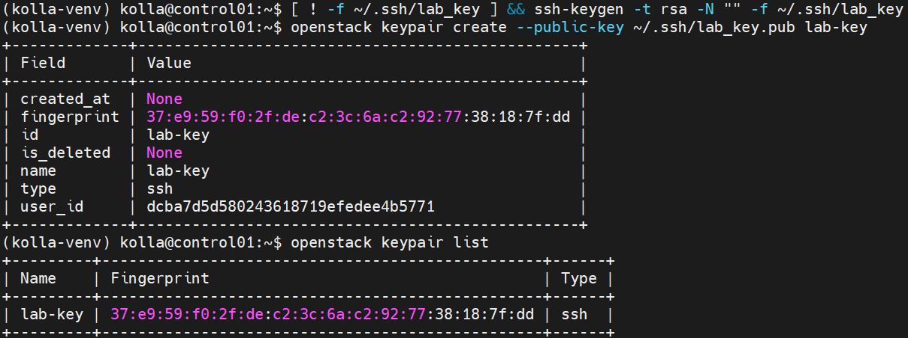

### 2.6. Image và flavor

```bash
# Kiểm tra image
openstack image list | grep -i cirros

# Nếu nghi ngờ
openstack image delete cirros

# Nếu chưa có:
wget https://download.cirros-cloud.net/0.6.2/cirros-0.6.2-x86_64-disk.img
openstack image create --disk-format qcow2 --container-format bare \
  --public --file cirros-0.6.2-x86_64-disk.img cirros

# Kiểm tra flavor (Kolla mặc định đã có sẵn m1.tiny → m1.xlarge)
openstack flavor list
```

### 2.7. Verify tổng thể tài nguyên trước khi tiếp tục

```bash
echo "=== External networks ==="
openstack network list --external

echo "=== All subnets ==="
openstack subnet list

echo "=== Router demo-router ==="
openstack router show demo-router -c name -c external_gateway_info -c interfaces_info

echo "=== Keypairs ==="
openstack keypair list

echo "=== Images ==="
openstack image list

echo "=== Flavors ==="
openstack flavor list
```

---

## PHẦN 3: CẤU HÌNH LIVE MIGRATION TRONG NOVA

### 3.1. Tạo file override `nova.conf`

```bash
sudo mkdir -p /etc/kolla/config
sudo nano /etc/kolla/config/nova.conf
```

Nội dung file:

```ini
[DEFAULT]
# Cho phép resize trên cùng host (tiện cho lab)
allow_resize_to_same_host = True

[libvirt]
# Scheme cho live migration
live_migration_scheme = tcp

# Auto-converge: làm chậm CPU guest khi memory copy không kịp tốc độ ghi
live_migration_permit_auto_converge = true

# Post-copy: activate VM ở dest trước khi copy xong memory
live_migration_permit_post_copy = true

# Timeout cho live migration (giây × GiB RAM)
live_migration_completion_timeout = 800

# Hành động khi timeout: abort hoặc force_complete
live_migration_timeout_action = force_complete

# Downtime cho phép cuối quá trình (ms)
live_migration_downtime = 500
live_migration_downtime_steps = 10
live_migration_downtime_delay = 75
```

Set quyền đọc:

```bash
sudo chmod 644 /etc/kolla/config/nova.conf
cat /etc/kolla/config/nova.conf  # Verify nội dung
```

### 3.2. TÌM ĐÚNG PATH INVENTORY

> ** Lỗi thường gặp:** `Kolla inventory multinode is invalid: Path does not exist`
>
> Nguyên nhân: file inventory không nằm ở `/etc/kolla/multinode` mà ở vị trí khác.

```bash
# Tìm file inventory
find / -name "multinode" -type f 2>/dev/null
find / -name "all-in-one" -type f 2>/dev/null

# Các vị trí thường gặp:
ls -la ~/
ls -la /etc/kolla/
ls -la ~/kolla-venv/share/kolla-ansible/ansible/inventory/
```

Inventory thường ở một trong các vị trí:
- `~/multinode`
- `/home/kolla/multinode`
- `~/kolla-venv/share/kolla-ansible/ansible/inventory/multinode`

### 3.3. Apply config với đúng path inventory

```bash
# Thay <PATH_TO_INVENTORY> bằng đường dẫn thực tế
kolla-ansible reconfigure -i <PATH_TO_INVENTORY> --tags nova

# Ví dụ:
kolla-ansible reconfigure -i ~/multinode --tags nova
```

Quá trình này mất 5-10 phút. Sẽ:
- Regenerate `nova.conf` trong các container
- Restart `nova_compute`, `nova_libvirt` trên cả 2 compute nodes

### 3.4. Verify config đã apply

```bash
# Từ compute01 (SSH vào hoặc dùng ansible)
ssh compute01 "sudo docker exec nova_compute grep -E 'live_migration|auto_converge|post_copy' /etc/nova/nova.conf"
```

Phải thấy đầy đủ các option vừa cấu hình.

---

## PHẦN 4: CHỌN PHƯƠNG ÁN STORAGE

Bạn có **2 lựa chọn** — chọn **MỘT**:

###  Phương án A: Volume-backed VM 

-  Đơn giản, không cần setup NFS
-  Live migration hoạt động tự nhiên vì disk nằm trên Cinder
-  Phù hợp lab nhỏ
-  **Bỏ qua Phương án B**, đi thẳng tới Phần 5

###  Phương án B: NFS shared storage (giả lập production)

Dùng control01 làm NFS server cho compute01 và compute02 mount chung `/var/lib/nova/instances`.

#### Bước 1: Setup NFS server trên control01

```bash
sudo apt install -y nfs-kernel-server
sudo mkdir -p /nova_instances

# UID/GID 42436 là user 'nova' trong Kolla container
sudo chown 42436:42436 /nova_instances
sudo chmod 755 /nova_instances

# Export
echo "/nova_instances 192.168.70.0/24(rw,sync,no_root_squash,no_subtree_check)" | sudo tee -a /etc/exports
sudo exportfs -arv
sudo systemctl restart nfs-kernel-server
sudo systemctl enable nfs-kernel-server

# Verify
showmount -e localhost
```

#### Bước 2: Mount NFS trên compute01 và compute02

 **Quan trọng:** Stop nova containers trước khi mount để tránh conflict.

```bash
# Trên CẢ compute01 và compute02 (làm lần lượt)
sudo apt install -y nfs-common

# Stop containers
sudo docker stop nova_compute nova_libvirt

# Backup folder cũ
sudo mv /var/lib/nova/instances /var/lib/nova/instances.bak
sudo mkdir -p /var/lib/nova/instances

# Mount NFS
echo "192.168.70.122:/nova_instances /var/lib/nova/instances nfs defaults,vers=4 0 0" | sudo tee -a /etc/fstab
sudo mount -a

# Verify
df -h /var/lib/nova/instances
ls -la /var/lib/nova/instances
# Ownership phải là 42436:42436

# Start lại containers
sudo docker start nova_libvirt nova_compute
```


#### Bước 3: Test cross-write

```bash
# Trên compute01
sudo docker exec nova_compute touch /var/lib/nova/instances/test_compute01

# Trên compute02 - phải thấy file
sudo docker exec nova_compute ls /var/lib/nova/instances/test_compute01

# Cleanup
sudo docker exec nova_compute rm /var/lib/nova/instances/test_compute01
```

---

## PHẦN 5: TẠO VM TEST

### 5.1. Lấy ID network

```bash
openstack network list
# copy ID của network muốn dùng
export NET_ID=<paste-id-vào-đây>
```

### 5.2. Tạo VM theo phương án storage đã chọn

**Phương án A (volume-backed):**

> **Tiền điều kiện:** Cinder phải được enable. Kiểm tra trước khi tạo volume:
>
> ```bash
> openstack endpoint list | grep volume
> # Phải thấy endpoint block-storage cho RegionOne
> ```
>
> Nếu lệnh ra rỗng hoặc khi `openstack volume create` báo lỗi:
> ```text
> internalURL endpoint for block-storage service in RegionOne region not found
> ```
> → Xem mục [Troubleshoot Cinder](#cinder-chưa-enable) bên dưới, fix xong rồi quay lại chạy tiếp.

```bash
# Tạo volume từ image
openstack volume create --image cirros --size 2 --bootable lab-vol

# Đợi volume available (Ctrl+C để thoát watch)
watch -n 2 'openstack volume list'

# Nếu bị thừa 
openstack volume list
openstack volume delete 23339973-9dec-4d34-8a48-f03494afb2f6

# Boot VM từ volume (dùng $SG_ID từ mục 2.4 — tránh ambiguous 'default')
openstack server create --flavor m1.tiny \
  --volume lab-vol \
  --network c5483936-163a-4ad0-8517-3a97b56f586a \
  --key-name lab-key \
  --security-group d1fb4bbd-d17c-48d6-953f-3a89b040aebc \
  vm-test
```

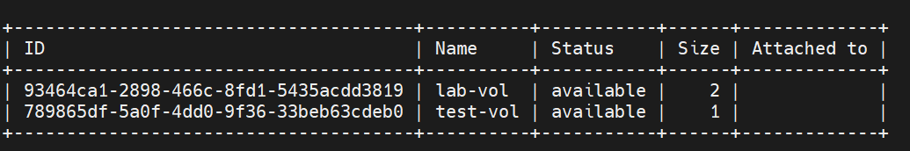

> Nếu bạn mở shell mới, nhớ export lại `$SG_ID` và `$NET_ID` (xem 2.4 và 5.1).
> error_deleting: Bạn yêu cầu xóa -> Cinder bắt đầu xóa -> Backend/storage hoặc service lỗi -> kẹt giữa chừng
```bash
# Reset state về error
openstack volume set \
--state error \
f14bc0bc-20b8-4cfb-b325-956def329d31

# Force delete
openstack volume delete --force \
f14bc0bc-20b8-4cfb-b325-956def329d31
```
> Nếu không được:
```bash
sudo grep '^database_password' /etc/kolla/passwords.yml
# Dùng password trên đăng nhập
docker exec -it mariadb mysql -u root -p
# paste password khi nó hỏi
```
> Sau đó:
```bash
USE cinder;

-- Kiểm tra trước
SELECT id, status, deleted FROM volumes WHERE id='f14bc0bc-20b8-4cfb-b325-956def329d31';

-- Xóa các bản ghi liên quan (theo thứ tự để tránh foreign key)
DELETE FROM volume_attachment WHERE volume_id='f14bc0bc-20b8-4cfb-b325-956def329d31';
DELETE FROM volume_admin_metadata WHERE volume_id='f14bc0bc-20b8-4cfb-b325-956def329d31';
DELETE FROM volume_metadata WHERE volume_id='f14bc0bc-20b8-4cfb-b325-956def329d31';
DELETE FROM volume_glance_metadata WHERE volume_id='f14bc0bc-20b8-4cfb-b325-956def329d31';
DELETE FROM volumes WHERE id='f14bc0bc-20b8-4cfb-b325-956def329d31';
```
- Lỗi 2: `cinder-volume` và `cinder-backup` đang `down`. Container thì Up (healthy) nhưng service trong Cinder báo down — nghĩa là service không gửi heartbeat về cinder-scheduler. Đây là lý do volume không xóa được: không có service nào "nhận" job xóa.
- **Kiểm tra**:
```bash
openstack volume service list
```
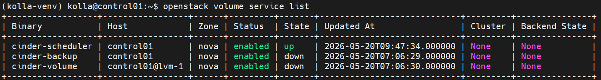

- **Check hệ thống**
```bash
(kolla-venv) kolla@control01:~$ df -h /
Filesystem      Size  Used Avail Use% Mounted on
/dev/vda2        99G   17G   79G  18% /
(kolla-venv) kolla@control01:~$ grep -E "cinder_volume_group|enable_cinder_backend_lvm" /etc/kolla/globals.yml | grep -v "^#"
enable_cinder_backend_lvm: "yes"
cinder_volume_group: "cinder-volumes"
```
- **Bước 1: Tạo file backing cho loop device**
```bash
sudo mkdir -p /var/lib/cinder
sudo truncate -s 50G /var/lib/cinder/cinder-volumes.img
```
Dùng `truncate` (sparse file) để không tốn dung lượng ngay, chỉ tốn khi có data thật. 


- **Bước 2: Setup loop device**
```bash
# Gắn file thành loop device
sudo losetup -f --show /var/lib/cinder/cinder-volumes.img
# Output: /dev/loop0 (hoặc loopN)
```
- **Bước 3: Tạo PV và VG**
```bash
sudo pvcreate /dev/loop0
sudo vgcreate cinder-volumes /dev/loop0

# Verify
sudo vgs
sudo pvs
```
Tên `cinder-volumes` là mặc định của Kolla. Nếu lệnh grep ở đầu ra giá trị khác thì dùng tên đó.

- **Bước 4: Persist qua reboot**

Loop device sẽ mất sau reboot. Tạo systemd service để tự động setup lại:
```bash
sudo tee /etc/systemd/system/cinder-loop.service > /dev/null << 'EOF'
[Unit]
Description=Cinder LVM loop device
DefaultDependencies=no
Before=local-fs.target
After=systemd-udev-settle.service
Requires=systemd-udev-settle.service

[Service]
Type=oneshot
RemainAfterExit=yes
ExecStart=/sbin/losetup -f /var/lib/cinder/cinder-volumes.img
ExecStart=/sbin/vgchange -ay cinder-volumes
ExecStop=/sbin/vgchange -an cinder-volumes
ExecStop=/bin/sh -c '/sbin/losetup -d $(/sbin/losetup -j /var/lib/cinder/cinder-volumes.img | cut -d: -f1)'

[Install]
WantedBy=local-fs.target
EOF

sudo systemctl daemon-reload
sudo systemctl enable cinder-loop.service
sudo systemctl start cinder-loop.service
sudo systemctl status cinder-loop.service
```
- **Bước 5: Restart cinder_volume**
```bash
docker restart cinder_volume

# Đợi ~20-30s rồi check
sleep 30
openstack volume service list
```
- Service `cinder-volume` phải chuyển sang `up`. Nếu vẫn down, xem log:
```bash
sudo tail -100 /var/log/kolla/cinder/cinder-volume.log
```

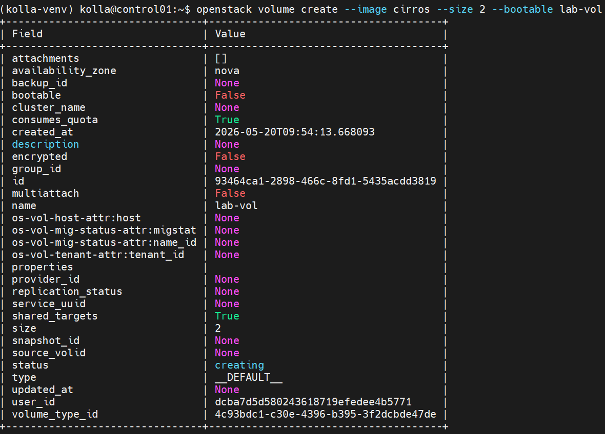

<a id="cinder-chưa-enable"></a>
**Troubleshoot: Cinder chưa enable**

```bash
# 1. Kiểm tra trạng thái
openstack endpoint list | grep volume
openstack catalog list
docker ps | grep cinder
grep enable_cinder /etc/kolla/globals.yml
# Mong đợi: enable_cinder: "yes"
```

```bash
# 2. Nếu enable_cinder chưa "yes" → sửa globals.yml rồi reconfigure
sudo sed -i 's/^#*enable_cinder:.*/enable_cinder: "yes"/' /etc/kolla/globals.yml
kolla-ansible reconfigure -i <PATH_TO_INVENTORY>     # ví dụ ~/multinode
```

```bash
# 3. Nếu container đã chạy nhưng endpoint vẫn lỗi → xem log
docker logs cinder_api --tail 100
```

Fix xong, **quay lại chạy lại từ lệnh `openstack volume create` ở trên**.


**Phương án B (NFS shared):**

```bash
openstack server create --flavor m1.tiny \
  --image cirros \
  --network $NET_ID \
  --key-name lab-key \
  --security-group $SG_ID \
  vm-test
```

### 5.3. Verify VM chạy

```bash
openstack server list

openstack server show vm-test -c name -c status -c OS-EXT-SRV-ATTR:host
```

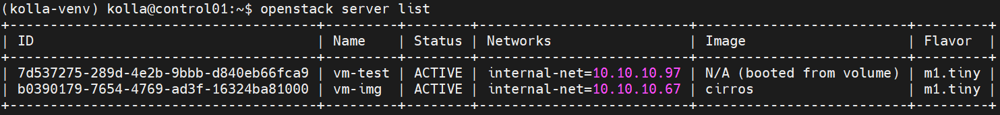

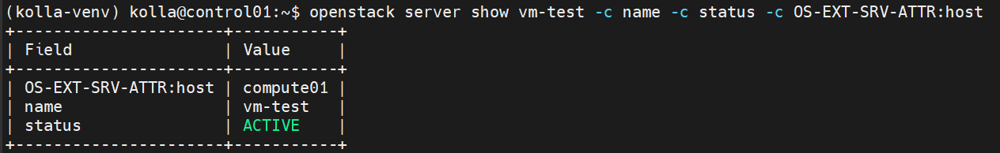

Ghi nhớ compute host hiện tại (cột `OS-EXT-SRV-ATTR:host`), ví dụ `compute01`.

Cái `N/A (booted from volume)` không phải là lỗi cần "fix" — đó là hành vi bình thường của OpenStack.

Khi một instance được tạo bằng cách **boot từ volume** (Cinder), thay vì boot trực tiếp từ image (Glance), thì OpenStack không gắn `image_id` trực tiếp vào instance đó. Vì vậy cột Image hiển thị `N/A (booted from volume)`. Đây là thiết kế đúng, không phải bug.

So sánh hai VM:
- `vm-img` boot trực tiếp từ image `cirros` → cột Image hiện tên image.
- `vm-test` boot từ volume → cột Image hiện `N/A`, vì image gốc nằm trong volume chứ không gắn vào instance.

Nếu muốn biết image gốc mà volume đó được tạo ra từ đâu, bạn cần truy ngược qua volume:

```bash
# Xem volume nào được attach vào vm-test
openstack server show vm-test -c volumes_attached -c name

# Lấy thông tin volume, chú ý field volume_image_metadata
openstack volume show <VOLUME_ID>
```

Trong output của `openstack volume show`, nếu volume được tạo từ image, bạn sẽ thấy field `volume_image_metadata` chứa tên/ID image gốc (ví dụ `image_name='cirros'`).

Đúng rồi, hoàn toàn bình thường. Mọi thứ đều đúng như mong đợi.

Nhìn vào output thì rõ:

Volume `lab-vol` (id `93464ca1...`) có `bootable = True` và `status = in-use` — tức là volume khởi động được và đang được gắn vào instance, đúng như một VM boot-from-volume.

Quan trọng nhất là field `volume_image_metadata`, nó cho biết volume này được tạo ra từ image `cirros`:
- `image_name': 'cirros'`
- `image_id': '99922c58-4387-4f97-b869-f0c0ffd28254'`
- `disk_format': 'qcow2'`

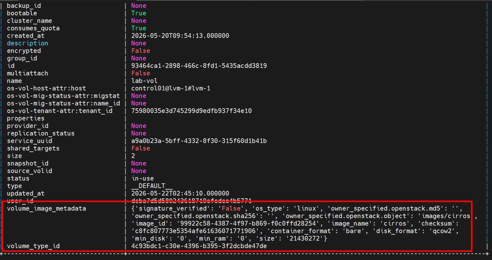

Nên image gốc của `vm-test` chính là **cirros** — giống y hệt VM `vm-img` của bạn. Chỉ khác là `vm-test` thì image được "đổ" vào volume Cinder rồi boot từ đó, còn `vm-img` boot thẳng từ image. Đó là lý do `openstack server list` hiển thị `N/A (booted from volume)` cho `vm-test`.

Vài chi tiết khác cũng đều ổn:
- `attachments` cho thấy volume gắn vào `server_id 7d537275...` (chính là vm-test) tại `/dev/vda` trên `compute01` — đúng device boot.
- Volume nằm trên backend `control01@lvm-1#lvm-1`, tức bạn đang dùng LVM làm Cinder backend (lab thường để vậy).
- `size = 2` (GB) — vừa đủ cho cirros.

Không có gì cần sửa cả. Nếu sau này muốn VM hiển thị tên image trong `server list`, chỉ cần boot thẳng từ image (`--image cirros`) thay vì boot từ volume là được, như mình đã nói ở trên.


### 5.4. Gán floating IP để test downtime sau này

```bash
FIP=$(openstack floating ip create public1 -f value -c floating_ip_address)
echo "Floating IP: $FIP"
openstack server add floating ip vm-test $FIP

# Test connectivity từ control01 (nếu network 10.0.2.0/24 accessible từ control01)
ping -c 3 $FIP
```

> **Lưu ý:** Vì external network `public1` dùng dải `10.0.2.0/24` (nội bộ Kolla), bạn chỉ ping được từ chính control01 hoặc node trong cùng L2. Đây là bình thường cho lab.

---

## PHẦN 6: LAB COLD MIGRATION

### 6.1. Khái niệm

**Cold migration:**
- VM bị **shutdown** trước khi migrate
- Disk được copy qua SSH giữa compute nodes
- VM **reboot** ở compute mới
- Downtime: vài phút
- **Không cần shared storage**

### 6.2. Thực hiện cold migration

**Bước 1: Xác định host hiện tại**

```bash
openstack server show vm-test -c OS-EXT-SRV-ATTR:host
```

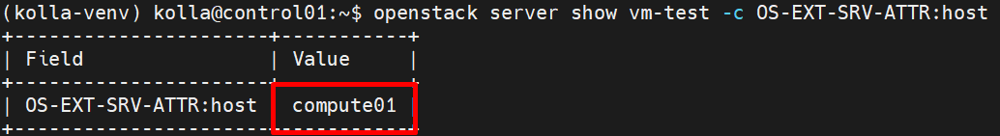

**Bước 2: Cold migrate (Nova tự chọn dest)**

```bash
openstack server migrate vm-test
```

**Bước 3: Theo dõi trạng thái**

Mở terminal khác:

```bash
watch -n 1 'openstack server show vm-test -c status -c OS-EXT-STS:task_state -c OS-EXT-SRV-ATTR:host'
```

Trạng thái sẽ chuyển: `ACTIVE` → `MIGRATING` → `RESIZE` → `VERIFY_RESIZE`

**Bước 4: Confirm hoặc revert**

Khi status là `VERIFY_RESIZE`:

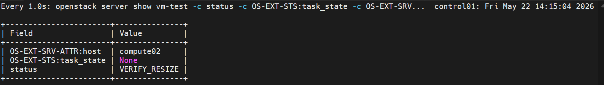

```bash
# Chấp nhận migration
openstack server migrate confirm vm-test

# Hoặc rollback về compute cũ
# openstack server migrate revert vm-test
```

**Bước 5: Verify host mới**

```bash
openstack server show vm-test -c name -c status -c OS-EXT-SRV-ATTR:host
# host phải đã đổi, status = ACTIVE
```

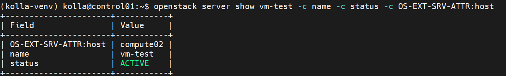

### 6.3. Cold migrate có chỉ định host

```bash
# Migrate ngược về compute01
openstack server migrate --host compute01 --wait vm-test

openstack server show vm-test -c OS-EXT-SRV-ATTR:host
```

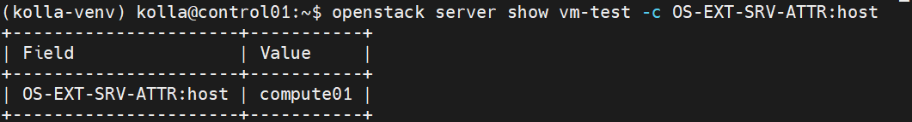

---

## PHẦN 7: LAB LIVE MIGRATION

### 7.1. Khái niệm

**Live migration:**
- VM tiếp tục chạy trong khi memory được copy
- Downtime cuối: < 1 giây
- 3 kiểu:
  - **Shared storage**: NFS/Ceph mount sẵn, chỉ copy memory
  - **Block migration**: copy cả disk + memory (`--block-migration`)
  - **Volume-backed**: VM boot từ Cinder volume, native support

### 7.2. Chuẩn bị test downtime

Mở **terminal thứ 2** và bắt đầu ping liên tục:

```bash
ping $FIP
# Để chạy nền, không tắt
```

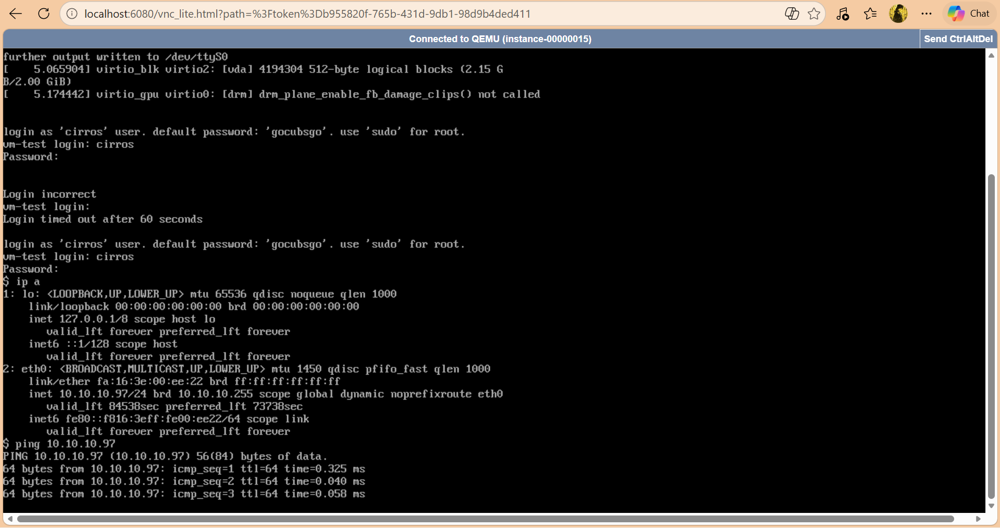

### 7.3. Live migration — Nova tự chọn host

Quay lại terminal chính:

**Nếu phương án A (volume-backed) hoặc B (NFS shared):**

```bash
openstack server migrate --live-migration --wait vm-test
```

**Nếu KHÔNG có shared storage (block migration):**

```bash
openstack server migrate --live-migration --block-migration --wait vm-test
```

### 7.4. Live migration có chỉ định host

```bash
openstack server migrate --live-migration --host compute02 --wait vm-test
```

### 7.5. Theo dõi tiến trình

Mở **terminal thứ 3**:

```bash
# Lấy migration ID
openstack server migration list --server vm-test

# Chi tiết tiến độ (memory copied %, throughput...) — lấy migration đang chạy
MIG_ID=$(openstack server migration list --server vm-test --status running -f value -c "Id")
openstack server migration show vm-test $MIG_ID
```

Bạn sẽ thấy các thông số real-time:
- `memory_processed_bytes`
- `memory_remaining_bytes`
- `disk_processed_bytes`

### 7.6. Verify sau migration

```bash
openstack server show vm-test -c name -c status -c OS-EXT-SRV-ATTR:host
# host = compute02, status = ACTIVE
```

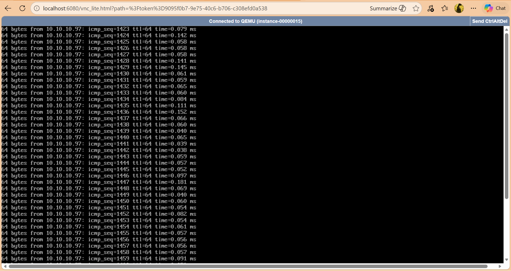

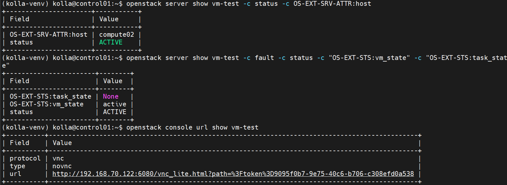

Quay lại terminal ping — chỉ mất **1-2 packet** trong quá trình migration.

### 7.7. Force complete / Abort migration

```bash
MIG_ID=$(openstack server migration list --server vm-test --status running -f value -c "Id")

# Force complete (pause VM để complete ngay)
openstack server migration force complete vm-test $MIG_ID

# Hoặc abort
openstack server migration abort vm-test $MIG_ID
```

---

## PHẦN 8: TROUBLESHOOTING (Các lỗi đã gặp)

### 8.1.  Lỗi: `Physical network physnet1 is in use`

**Khi nào gặp:**
```bash
openstack network create --share --external \
  --provider-physical-network physnet1 \
  --provider-network-type flat ext-net
# Error: ConflictException: 409, Unable to create the flat network.
```

**Nguyên nhân:** Đã có external network khác đang chiếm `physnet1`.

**Cách xử lý:**

```bash
# 1. Xem network đã tồn tại
openstack network list --external

# 2. HƯỚNG A: Tái sử dụng network đã có (khuyến nghị)
EXT_NET=$(openstack network list --external -f value -c Name | head -1)
echo "Using: $EXT_NET"

# 3. HƯỚNG B: Xóa network cũ (chỉ nếu chắc không ai dùng)
# Xem có port nào đang dùng không
openstack port list --network <old_net>
# Nếu chỉ có router gateway, gỡ ra:
# openstack router unset --external-gateway <router_name>
# openstack subnet delete <subnet>
# openstack network delete <old_net>
```

### 8.2.  Lỗi: `Kolla inventory multinode is invalid: Path does not exist`

**Khi nào gặp:**
```bash
cd /etc/kolla
kolla-ansible reconfigure -i multinode --tags nova
# Error: Path does not exist
```

**Nguyên nhân:** File inventory không nằm ở `/etc/kolla/multinode`.

**Cách xử lý:**

```bash
# Tìm file
find / -name "multinode" -type f 2>/dev/null

# Vị trí thường gặp:
ls ~/multinode
ls /home/kolla/multinode
ls ~/kolla-venv/share/kolla-ansible/ansible/inventory/multinode

# Dùng đúng path
kolla-ansible reconfigure -i ~/multinode --tags nova
```

### 8.3.  Lỗi: `Live migration is not supported by this hypervisor`

**Nguyên nhân thường gặp:**
- VM có vTPM (Flamingo chưa hỗ trợ live migrate vTPM)
- Virt config không tương thích

**Cách xử lý:**
- Disable vTPM trong flavor metadata
- Hoặc fallback dùng cold migration

### 8.4.  Lỗi: `Permission denied (publickey)` khi migrate

**Nguyên nhân:** SSH key giữa nova_compute containers bị lỗi.

**Cách xử lý:** (thay `~/multinode` bằng path inventory thực tế của bạn — xem 3.2)

```bash
kolla-ansible reconfigure -i ~/multinode --tags nova
```

### 8.5.  Lỗi: `Unable to connect to qemu+tcp://...:16509`

**Nguyên nhân:** Firewall chặn port libvirt hoặc libvirt chưa listen.

**Cách xử lý:**

```bash
# Kiểm tra libvirt đang listen (chạy trên host compute, container thường không có ss)
sudo ss -tlnp | grep 16509

# Test connectivity tới compute còn lại
nc -zv compute02 16509

# Nếu fail, check log
sudo docker logs nova_libvirt --tail 100
```

Port cần mở:
- TCP 16509 (libvirt API)
- TCP 49152-49261 (QEMU migration range)

### 8.6.  Migration timeout với VM memory-intensive

**Nguyên nhân:** Memory writes nhanh hơn copy.

**Cách xử lý:** Đã có trong config Phần 3 với `live_migration_permit_post_copy = true`. Verify:

```bash
sudo docker exec nova_compute grep post_copy /etc/nova/nova.conf
```

### 8.7.  Lỗi: `Cannot block migrate instance with shared storage`

**Nguyên nhân:** VM đã có shared storage mà còn dùng flag `--block-migration`.

**Cách xử lý:** Bỏ flag `--block-migration`:

```bash
openstack server migrate --live-migration --wait vm-test
```

### 8.8.  CPU model mismatch giữa 2 compute

**Nguyên nhân:** CPU 2 host khác model.

**Cách xử lý:** Sửa `/etc/kolla/globals.yml`:

```yaml
nova_libvirt_cpu_mode: "custom"
nova_libvirt_cpu_model: "kvm64"
```

Rồi reconfigure:

```bash
kolla-ansible reconfigure -i ~/multinode --tags nova
```

### 8.9.  Vị trí log quan trọng

```bash
# Trên compute (source/dest)
sudo docker logs nova_compute --tail 100 | grep -i migrat
sudo docker logs nova_libvirt --tail 100

# File log trên host
sudo tail -f /var/log/kolla/nova/nova-compute.log
sudo tail -f /var/log/kolla/libvirt/libvirtd.log

# Trên control01 - conductor handle migration RPC
sudo docker logs nova_conductor --tail 100 | grep -i migrat
sudo tail -f /var/log/kolla/nova/nova-conductor.log
```

---

## PHẦN 9: TỔNG KẾT

### 9.1. Bảng so sánh Cold vs Live Migration

| Tiêu chí | Cold Migration | Live Migration |
|----------|----------------|----------------|
| **Downtime** | Vài phút (VM reboot) | < 1 giây |
| **Shared storage** | Không cần | Khuyến nghị (NFS/Ceph) hoặc volume-backed |
| **Lệnh** | `openstack server migrate <vm>` | `openstack server migrate --live-migration <vm>` |
| **Cần confirm?** | Có (`migrate confirm/revert`) | Không (tự động) |
| **Block migration** | N/A | `--block-migration` (no shared storage) |
| **Use case** | Resize VM, maintenance có downtime | Maintenance không downtime |
| **Hỗ trợ ephemeral disk** | Có | Cần shared storage hoặc `--block-migration` |

### 9.2. Lệnh nhanh cheatsheet

```bash
# Activate môi trường
source ~/kolla-venv/bin/activate
export OS_CLOUD=kolla-admin

# Tổng quan
openstack hypervisor list
openstack server list --long

# Cold migration
openstack server migrate <vm>
openstack server migrate confirm <vm>
openstack server migrate --host <dest> --wait <vm>

# Live migration
openstack server migrate --live-migration --wait <vm>
openstack server migrate --live-migration --host <dest> --wait <vm>
openstack server migrate --live-migration --block-migration --wait <vm>

# Theo dõi migration
openstack server migration list --server <vm>
openstack server migration show <vm> <migration_id>

# Force complete / abort
openstack server migration force complete <vm> <migration_id>
openstack server migration abort <vm> <migration_id>

# Reconfigure Nova sau khi sửa config
kolla-ansible reconfigure -i ~/multinode --tags nova
```

### 9.3. Bài tập nâng cao

1. **Memory stress test**: Tạo VM `m1.medium` (4GB RAM), chạy `stress --vm 2 --vm-bytes 1G` bên trong, sau đó live migrate. Quan sát post-copy có kích hoạt không.

2. **Evacuate khi host down**: Stop docker trên compute02 → `openstack server evacuate <vm>` để force migrate sang compute01.

3. **Disable compute node**: 
   ```bash
   openstack compute service set --disable compute01 nova-compute
   ```
   Sau đó migrate tất cả VM khỏi compute01 trước khi maintenance.

4. **CPU pinning test**: Tạo flavor với `hw:cpu_policy=dedicated`, test xem migration có hoạt động không.

5. **Setup Masakari**: Auto-evacuate VM khi compute host fail. Set `enable_masakari: yes` trong globals.yml.

---

##  Tài liệu tham khảo

- [Kolla Ansible 2025.2 Release Notes](https://docs.openstack.org/releasenotes/kolla-ansible/2025.2.html)
- [Nova 2025.2 Release Notes](https://docs.openstack.org/releasenotes/nova/2025.2.html)
- [Configure live migrations](https://docs.openstack.org/nova/2025.2/admin/configuring-migrations.html)
- [Live-migrate instances](https://docs.openstack.org/nova/2025.2/admin/live-migration-usage.html)
- [Libvirt driver Kolla guide](https://docs.openstack.org/kolla-ansible/latest/reference/compute/libvirt-guide.html)

---

**Lab info:**
- Author: OpenStack Lab Documentation
- Version: 1.0
- Date: 2026-05-20
- Environment: OpenStack 2025.2 Flamingo + Kolla Ansible 21.0.0
- Topology: 1 controller + 2 compute (control01/compute01/compute02)

