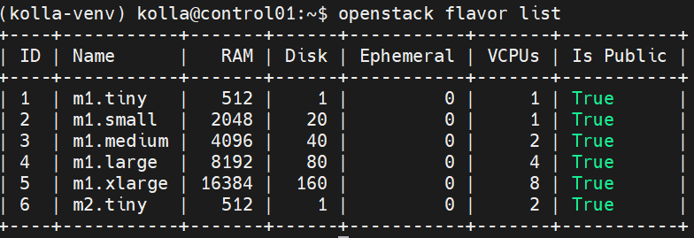
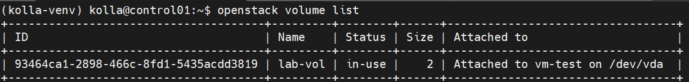
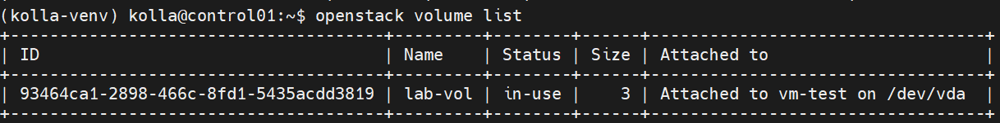

# Hướng dẫn Thay đổi Cấu hình (Resize) Instance trên OpenStack

Ta có thể thay đổi cấu hình phần cứng (vCPU, RAM, Disk) của một máy ảo (Instance) bằng cách thay đổi **Flavor** của nó.

## Cú pháp lệnh chung:

```bash
openstack server resize --flavor <FLAVOR> <SERVER>
```

---

## 1. Quy trình Resize máy ảo Boot từ Volume (Cinder Volume)

### Bước 1: Liệt kê danh sách VM để lấy thông tin

```bash
openstack server list
```

### Bước 2: Kiểm tra các cấu hình (Flavor) có sẵn

```bash
openstack flavor list
```



### Bước 3: Thay đổi dung lượng Volume (Nếu cần)

Kiểm tra danh sách volume đang gắn vào VM:

```bash
openstack volume list
```



Tiến hành mở rộng Volume lên 20GB (Hệ thống OpenStack hiện đại hỗ trợ *Online Volume Extend*, bạn không cần phải tắt máy ảo):

```bash
openstack --os-volume-api-version 3.42 volume set 93464ca1-2898-466c-8fd1-5435acdd3819 --size 3
```
Mặc định, OpenStack CLI sử dụng phiên bản API thấp hơn, trong khi tính năng mở rộng Volume khi đang chạy (Online Extend) yêu cầu phiên bản Cinder API từ 3.42 trở lên.

- Kiểm tra lại:
```bash
openstack volume list
```


### Bước 4: Thực hiện lệnh Resize Flavor

Tiến hành nâng cấp máy ảo sang flavor mới:

```bash
openstack server resize --flavor <flavor_moi> <ten_vm_hoac_id>
```

Kiểm tra trạng thái máy ảo, status sẽ chuyển sang RESIZE:
- Lưu ý nếu máy boot LVM Cinder nó là persistence volume, không thể resize nếu resize sẽ bị lỗi.

```bash
openstack server list
```

### Bước 5: Xác nhận kết quả (Confirm) hoặc Hủy bỏ (Revert)
Đợi vài giây/phút cho đến khi trạng thái máy ảo chuyển hẳn sang VERIFY_RESIZE. Lúc này bạn có 2 lựa chọn:

* **Lựa chọn A: Xác nhận thay đổi** (Áp dụng cấu hình mới vĩnh viễn):
```bash
openstack server resize confirm <ten_vm_hoac_id>
```
* **Lựa chọn B: Hủy bỏ thay đổi** (Quay về cấu hình cũ ban đầu):
```bash
openstack server resize revert <ten_vm_hoac_id>
```

### Bước 6: Kiểm tra lại thông số bên trong máy ảo (OS)

Sau khi confirm, trạng thái VM sẽ trở lại ACTIVE. Truy cập vào máy ảo để kiểm tra tài nguyên thực tế:

```bash
# Kiểm tra CPU
lscpu | grep 'CPU(s):'

# Kiểm tra RAM
free -m

# Kiểm tra dung lượng ổ đĩa
lsblk
```

---

## 2. Quy trình Resize máy ảo Boot từ Local (Ổ cứng cục bộ trên Compute Node)

Đối với máy ảo sử dụng ổ cứng local tích hợp sẵn của Flavor, quy trình yêu cầu kiểm tra kỹ hơn về dung lượng đĩa cứng.

### Bước 1: Thực hiện lệnh đổi cấu hình

```bash
openstack server resize --flavor <flavor-name> <vm-name>
```

### Bước 2: Theo dõi trạng thái của VM

Sử dụng lệnh show hoặc list liên tục cho đến khi cột Status chuyển thành VERIFY_RESIZE:

```bash
openstack server show <vm-name>
```

### Bước 3: Hoàn tất quy trình áp dụng cấu hình

* **Chấp nhận cấu hình mới:**
```bash
openstack server resize confirm <vm-name>
```
*   **Hủy bỏ và quay lại cấu hình cũ:**
```bash
    openstack server resize revert <vm-name>
```

---