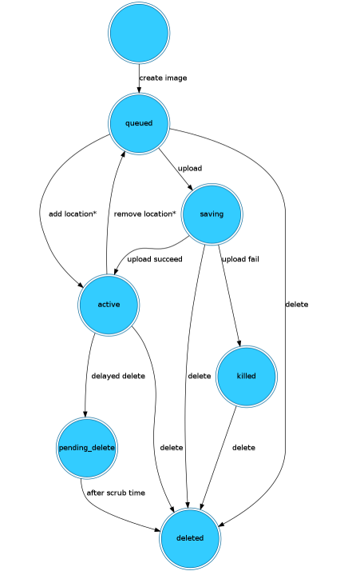

# Các trạng thái và luồng hoạt động của Glance
## 1. Các trạng thái của Image (Image Statuses)
Trong cơ sở dữ liệu của Glance, mỗi Image luôn gắn liền với một trạng thái. Việc nắm rõ các trạng thái này giúp bạn biết được hệ thống đang gặp lỗi ở bước nào.

- `Queued`: Image ID đã được khởi tạo trong Database, các metadata đã sẵn sàng, nhưng chưa có dữ liệu thực tế nào được tải lên.
- `Saving`: Quá trình tải dữ liệu thô (binary) của Image lên Storage Backend đang diễn ra.
- `Active`: Image đã được tải lên hoàn tất và sẵn sàng để Nova sử dụng khởi tạo máy ảo. Đây là trạng thái "khỏe mạnh" nhất.
- `Killed`: Đã xảy ra lỗi trong quá trình tải dữ liệu (ví dụ: đứt kết nối mạng, backend hết dung lượng). Image này không thể sử dụng.
- `Deactivated`: Image vẫn tồn tại nhưng bị quản trị viên tạm khóa (không cho phép người dùng bình thường sử dụng để boot máy ảo).
- `Pending_delete`: Glance đã nhận lệnh xóa, nhưng chưa thực hiện xóa dữ liệu vật lý (thường gặp khi dùng cơ chế xóa chậm - delayed delete).
- `Deleted`: Image đã bị xóa hoàn toàn khỏi Database và Backend.

## 2. Luồng hoạt động (Workflow) của Glance

**Kịch bản A**: Đăng ký và Tải lên Image mới

Đây là quy trình khi bạn chạy lệnh `openstack image create`.
- **Xác thực (Authentication)**: Người dùng gửi yêu cầu kèm theo Token xác thực. `glance-api` sẽ gửi Token này sang Keystone để kiểm tra xem bạn là ai và có quyền upload hay không.
- **Khởi tạo Metadata (Reserve)**: `glance-api` gửi thông tin (tên, định dạng, dung lượng dự kiến) đến **Database**. Database tạo một dòng mới và đặt trạng thái là `queued`.
- **Đẩy dữ liệu(Data Upload)**: Dữ liệu thực tế của file image bắt đầu được truyền qua `glance-api`. Lúc này trạng thái chuyển sang `saving`.
- **Lưu trữ vật lý**: `glance-api` đẩy luồng dữ liệu đó vào Storage Backend (như Ceph, Swift hoặc File System).

**Kịch bản B**: Khi Nova yêu cầu Image để tạo máy ảo

Đây là lúc Glance đóng vai trò phục vụ dịch vụ Compute (Nova).
- **Yêu cầu**: Người dùng ra lệnh cho Nova: "Hãy tạo cho tôi máy ảo từ Image Ubuntu".
- **Truy vấn**: Nova gửi yêu cầu đến glance-api để hỏi: "Image Ubuntu có tồn tại không và nó nằm ở đâu?".
- **Kiểm tra**: glance-api tra cứu trong Database. Nếu Image ở trạng thái active, nó sẽ trả về metadata và Location (địa chỉ lưu trữ).
- **Truy xuất dữ liệu**: Cách thông thường: glance-api sẽ đọc dữ liệu từ Backend và stream (đẩy luồng) dữ liệu đó về phía Nova Compute Node.
- **Cách tối ưu (Copy-on-Write)**: Nếu bạn dùng chung một Backend lưu trữ (như Ceph) cho cả Glance và Nova, Nova có thể "clone" trực tiếp Image đó trong Backend mà không cần truyền tải dữ liệu qua mạng, giúp máy ảo khởi động chỉ trong vài giây.
- **Hoàn tất**: Nova nhận đủ dữ liệu, ghi vào ổ đĩa ảo của nó và bắt đầu quá trình boot máy ảo.

**Ghi chú**:

Để dễ nhớ, bạn có thể hình dung sự tương tác giữa các thành phần như sau:
- **Người dùng / CLI**: Người ra lệnh.
- **Glance-API**: "Lễ tân" tiếp nhận và điều phối.
- **Keystone**: "Bảo vệ" kiểm tra thẻ nhân viên.
- **Database**: "Sổ quản lý" ghi chép thông tin Image.
- **Store Adapter**: "Công nhân" bốc xếp dữ liệu vào kho (Backend).
- **Storage Backend**: "Nhà kho" chứa hàng hóa thực sự.