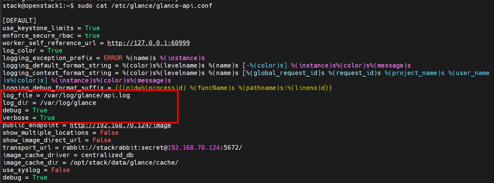

# File log của Glance
Tiếp nối phần cấu hình, hệ thống Log (Nhật ký) là monitoring giúp bạn biết Glance đang làm gì, nó có đang "khỏe" không hay đang gặp lỗi ở đâu.

Vị trí mặc định của Log: `/var/log/glance/`:
- Trong thư mục này có các file chính sau:
  - `glance-api.log`: File quan trọng nhất. Nó ghi lại mọi yêu cầu từ người dùng, quá trình xác thực với keystone, và việc giao tiếp với Storage Backend
  - `glance-registry.log`: (Nếu bạn dùng bản cũ) Ghi lại các truy vấn liên quan đến Metadata trong Database.
  - `glance-scrubber.log`: Ghi lại lịch sử các tiến trình dọn dẹp dữ liệu (xóa file vật lý sau khi Image bị xóa trong DB).

**Lưu ý**: 
- Trong DevStack phiên bản mới (2025-2026), Glance được chạy bằng uwsgi và được quản lý bởi systemd (`devstack@g-api.service`), chứ không chạy theo kiểu screen truyền thống như các service cũ.
- Không có file /opt/stack/logs/glance-api.log riêng biệt.
- Log không được ghi ra file ở `/opt/stack/logs/` nữa (hoặc ghi rất ít).
- Log chính được ghi vào **journalctl** (systemd journal).
- Ghi log ra file
```bash
sudo mkdir -p /var/log/glance
sudo chown stack:stack /var/log/glance

# Chỉnh file config
sudo tee -a /etc/glance/glance-api.conf <<EOF

[DEFAULT]
log_file = /var/log/glance/api.log
log_dir = /var/log/glance
debug = True
verbose = True
EOF
```
Restart service:
```bash
sudo systemctl restart devstack@g-api.service
tail -f /var/log/glance/api.log
```

## 2. Cách cấu hình Log (Trong `glance-api.conf`)
Để điều chỉnh cách Glance ghi log, bạn tìm đến block `[DEFAULT]` trong file cấu hình chính:
- Thay đổi mức độ chi tiết (Log Level):
  - `debug = True`: (Khuyên dùng khi đang sửa lỗi) Nó sẽ ghi lại cực kỳ chi tiết mọi thứ. Đừng bật cái này mãi mãi vì file log sẽ phình to rất nhanh.
  - `verbose = True`: Cung cấp thông tin ở mức độ vừa phải (thông tin các request HTTP).
- Thay đổi đường dẫn log:
```ini,TOML
[DEFAULT]
log_file = /path/to/your/custom/glance-api.log
log_dir = /path/to/your/custom/log_directory
```



## 3. Cấu trúc của một dòng Log
- Khi tạo 1 image:
```bash
2020-07-20 08:51:45.170 2041 INFO eventlet.wsgi.server [req-7d876b1c-b2bd-4370-a5e0-d30233e37d9d 294c5c6181d442c68a13d5b615c4f031 5b4c1d2155004acf849cd3aac03b8f36 - default default] 10.10.31.166 - - [20/Jul/2020 08:51:45] "GET /v2/schemas/image HTTP/1.1" 200 6283 0.515541
```
- Các thông tin trong file log:
```bash
[req-7d876b1c-b2bd-4370-a5e0-d30233e37d9d 294c5c6181d442c68a13d5b615c4f031 5b4c1d2155004acf849cd3aac03b8f36 - default default]
```
- `req-7d876b1c-b2bd-4370-a5e0-d30233e37d9d` : mã request
- `294c5c6181d442c68a13d5b615c4f031` : ID user
- `5b4c1d2155004acf849cd3aac03b8f36` : ID project
- `default default` : domain

Địa chỉ IP
```bash
10.10.31.166
```
Thông tin method và Status code của request
```bash
"GET /v2/schemas/image HTTP/1.1" 200 6283 0.515541
```