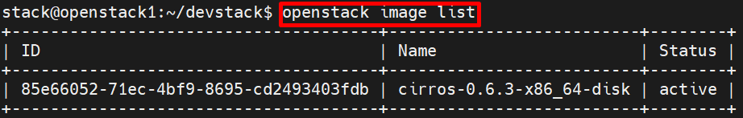
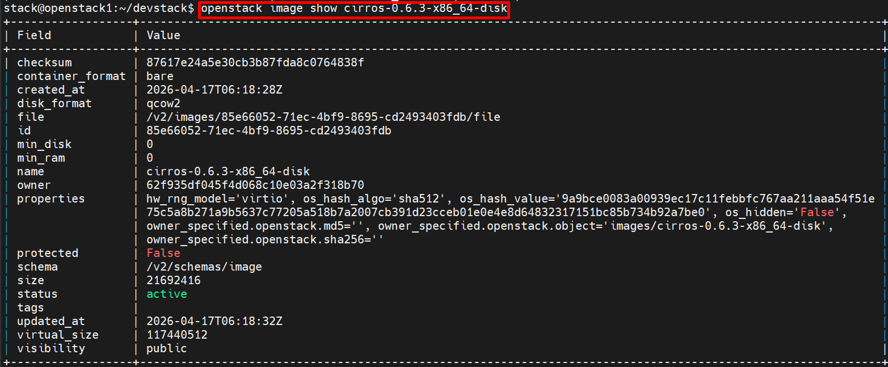
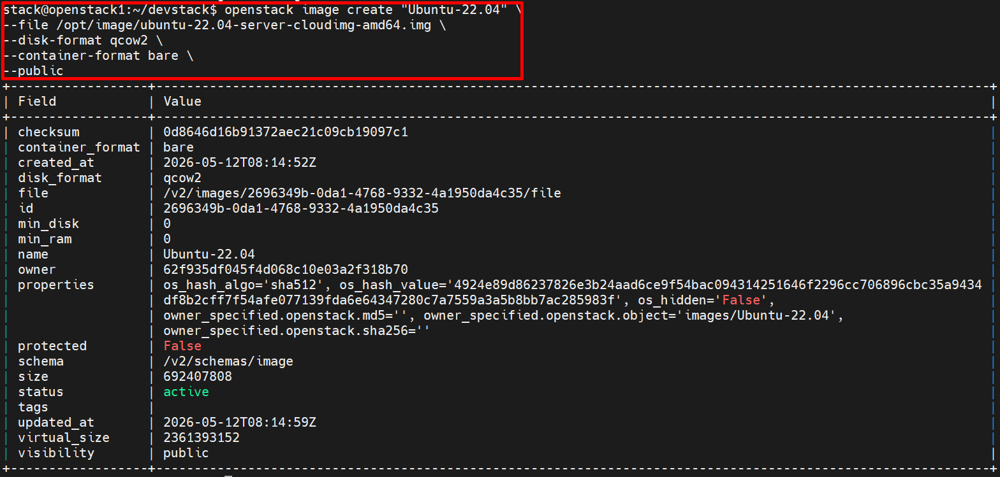
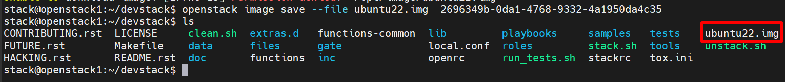
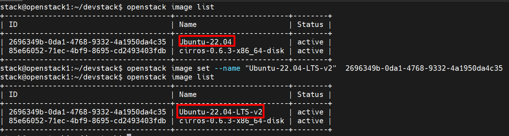
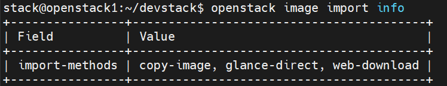
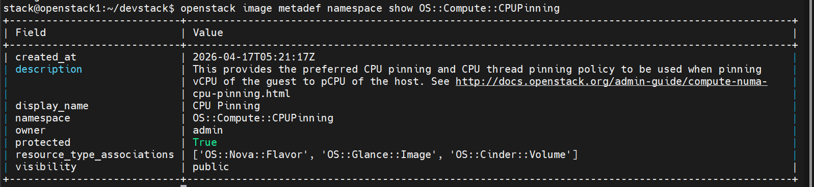
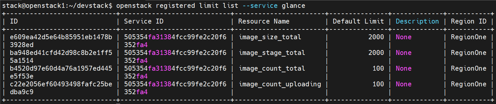

# Các lệnh thường sử dụng với Glance

Có 2 cách thao tác với Glance:

| CLI | Package | Trạng thái |
|-----|---------|-----------|
| `openstack image ...` | python-openstackclient | **Khuyến nghị** — unified CLI cho toàn bộ OpenStack |
| `glance ...` | python-glanceclient | **Legacy** — vẫn hoạt động nhưng không được phát triển thêm |

> Ưu tiên dùng `openstack` CLI cho mọi tác vụ mới.

---

## 1. OpenStack CLI (Khuyến nghị)

### 1.1 List Image

```bash
openstack image list
```


Filter nâng cao:

```bash
# Lọc theo tên
openstack image list --name cirros

# Lọc theo trạng thái
openstack image list --status active

# Chỉ hiển thị image public
openstack image list --public

# Chỉ hiển thị image private
openstack image list --private

# Chỉ hiển thị image shared
openstack image list --shared

# Hiển thị thêm thông tin (disk format, size, owner...)
openstack image list --long

# Kết hợp grep
openstack image list | grep cirros
```

### 1.2 Show Image

```bash
openstack image show <IMAGE_ID | image_name>
```



### 1.3 Tạo và Upload Image

```bash
# Upload file image từ local (cách phổ biến nhất)
openstack image create "Ubuntu-22.04" \
--file /opt/image/ubuntu-22.04-server-cloudimg-amd64.img \
--disk-format qcow2 \
--container-format bare \
--public

# Tạo image và download từ URL (web-download)
openstack image create "cirros-0.6.2" \
--container-format bare \
--disk-format qcow2 \
--public \
--import-method web-download \
--uri http://download.cirros-cloud.net/0.6.2/cirros-0.6.2-x86_64-disk.img \


# Tạo image với đầy đủ tùy chọn
openstack image create "Ubuntu-22.04-LTS" \
--file /opt/images/ubuntu-22.04-server.qcow2 \
--disk-format qcow2 \
--container-format bare \
--min-disk 10 \
--min-ram 1024 \
--public \
--property os_distro=ubuntu \
--property os_version=22.04 \
--tag ubuntu \
--tag lts \    
```

Các option visibility:

| Tham số              | Ý nghĩa                            | Ví dụ                         |
|----------------------|------------------------------------|-------------------------------|
| `--file`             | Đường dẫn file local               | `--file /opt/ubuntu.qcow2`    |
| `--disk-format`      | Định dạng đĩa                      | `qcow2`, `raw`, `vmdk`, `iso` |
| `--container-format` | Định dạng container                | `bare` (phổ biến nhất)        |
| `--public` | Mọi project đều thấy và dùng được |  |
| `--private` | Chỉ project sở hữu mới thấy |   |
| `--shared` | Chỉ định tay project nào được dùng |  |
| `--community` | Mọi người thấy được nhưng không xuất hiện mặc định |
| `--min-disk`         | Dung lượng đĩa tối thiểu (GB)      | `--min-disk 20`               |
| `--min-ram`          | RAM tối thiểu (MB)                 | `--min-ram 2048`              |
| `--property`         | Thêm metadata tùy chỉnh            | `--property key=value`        |
| `--tag`              | Gắn tag cho image                  | `--tag production`            |
| `--protected`        | Không cho phép xóa                 | _(không có giá trị)_          |



### 1.4 Download Image

```bash
openstack image save --file <output_file> <IMAGE_ID | image_name>
```



### 1.5 Update thông tin Image

```bash
openstack image set [options] <IMAGE_ID | image_name>
```

Các option phổ biến:

```bash
# Đổi tên image
openstack image set --name "Ubuntu-22.04-LTS-v2" <image-id>

# Thay đổi visibility
openstack image set --public <image-id | image-name>
openstack image set --private <image-id>
openstack image set --shared <image-id>
openstack image set --community <image-id>

# Bảo vệ image khỏi bị xóa
openstack image set --protected <image-id>

# Bỏ bảo vệ
openstack image set --unprotected <image-id>

# Cập nhật min-disk và min-ram
openstack image set --min-disk 20 --min-ram 2048 <image-id>

# Thêm hoặc cập nhật property
openstack image set --property os_distro=ubuntu --property hw_disk_bus=virtio <image-id>

# Xóa một property
openstack image unset --property os_distro <image-id>

# Thêm tag
openstack image set --tag production --tag ubuntu <image-id>

# Xóa tag
openstack image unset --tag ubuntu <image-id>
```



### 1.6 Xóa Property hoặc Tag

```bash
# Xóa property
openstack image unset --property os_type <IMAGE_ID | image_name>

# Xóa tag
openstack image unset --tag production <IMAGE_ID | image_name>
```

### 1.7 Xóa Image

```bash
openstack image delete <IMAGE_ID | image_name>

# Xóa nhiều image cùng lúc
openstack image delete <IMAGE_ID_1> <IMAGE_ID_2>
```

> Image đang ở trạng thái `protected` sẽ không thể xóa. Cần `--unprotected` trước.

---

## 2. Image Sharing (Chia sẻ Image giữa các Project)

### 2.1 Tạo image dạng shared

```bash
openstack image create "cirros-shared" \
  --file cirros-0.6.2-x86_64-disk.img \
  --disk-format qcow2 \
  --container-format bare \
  --shared
```

### 2.2 Thêm project vào image

```bash
openstack image add project <IMAGE_ID | image_name> <PROJECT_ID | project_name>
```

Ví dụ:

```bash
openstack image add project cirros-shared demo
```

### 2.3 List project được gán với image

```bash
openstack image member list <IMAGE_ID | image_name>
```

### 2.4 Accept / Reject image được share (phía project nhận)

```bash
# Chấp nhận image share — image mới hiện ra khi list
openstack image set --accept <IMAGE_ID>

# Từ chối image share
openstack image set --reject <IMAGE_ID>

# Đặt lại về trạng thái chờ
openstack image set --pending <IMAGE_ID>
```

### 2.5 Gỡ project khỏi image

```bash
openstack image remove project <IMAGE_ID | image_name> <PROJECT_ID | project_name>
```

---

## 3. Glance CLI (Legacy)

> `glance` CLI vẫn hoạt động nhưng là **legacy**. Dùng trong trường hợp cần debug hoặc môi trường cũ không có `openstack` CLI.

### 3.1 List Image

```bash
glance image-list
```

### 3.2 Tạo và Upload Image

```bash
# Tạo và upload 1 bước
glance image-create \
  --name cirros-test \
  --disk-format qcow2 \
  --container-format bare \
  --visibility public \
  --file cirros-0.6.2-x86_64-disk.img \
  --progress
```

Hoặc 2 bước (tạo rỗng rồi upload riêng):

```bash
# Bước 1: Tạo image rỗng
glance image-create \
  --name cirros-upload \
  --container-format bare \
  --disk-format qcow2

# Bước 2: Upload dữ liệu vào image vừa tạo
glance image-upload --file cirros-0.6.2-x86_64-disk.img --progress <IMAGE_ID>
```

### 3.3 Show Image

```bash
glance image-show <IMAGE_ID>
```

### 3.4 Thay đổi trạng thái Image

```bash
# Deactivate
glance image-deactivate <IMAGE_ID>

# Reactivate
glance image-reactivate <IMAGE_ID>

# Xóa (có thể xóa nhiều cùng lúc)
glance image-delete <IMAGE_ID> [<IMAGE_ID> ...]
```

---

## 4. Quick Reference

| Tác vụ | Lệnh |
|--------|------|
| List image | `openstack image list` |
| List image + filter status | `openstack image list --status active` |
| Show chi tiết image | `openstack image show <name/id>` |
| Upload image mới | `openstack image create "name" --file img.img --disk-format qcow2 --container-format bare --public` |
| Download image | `openstack image save --file out.img <name/id>` |
| Đổi tên | `openstack image set --name "new-name" <name/id>` |
| Đổi visibility | `openstack image set --public/--private/--shared <name/id>` |
| Deactivate | `openstack image set --deactivate <name/id>` |
| Reactivate | `openstack image set --activate <name/id>` |
| Protect (chống xóa) | `openstack image set --protected <name/id>` |
| Xóa image | `openstack image delete <name/id>` |
| Xóa property | `openstack image unset --property <key> <name/id>` |
| Share image | `openstack image add project <image> <project>` |
| List project của image | `openstack image member list <name/id>` |

---

## 5. Image Import
Import là cơ chế nâng cao hơn so với upload thông thường, cho phép xử lý image trước khi lưu. Không khuyến khích dùng phương pháp này
### 5.1 Các phương thức Import được hỗ trợ
```bash
openstack image import-info
```


### 5.2. glance-direct (Upload thủ công qua staging)

```bash
# Bước 1: Tạo image record
openstack image create "my-image" \
--disk-format qcow2 \
--container-format bare

# Lưu lại image-id từ output
IMAGE_ID=$(openstack image show "my-image" -f value -c id)

# Bước 2: Upload file lên staging area
openstack image stage --file /path/to/image.qcow2 $IMAGE_ID

# Bước 3: Trigger import
openstack image import --method glance-direct $IMAGE_ID
```

### 5.3. web-download (Glance tự tải từ URL)

```bash
openstack image create \
    --disk-format qcow2 \
    --container-format bare \
    --import-method web-download \
    --uri "http://cloud.centos.org/centos/9-stream/x86_64/images/CentOS-Stream-GenericCloud-9-latest.x86_64.qcow2" \
    "CentOS-Stream-9"
```

### 5.4. copy-image (Sao chép sang store khác)

```bash
# Sao chép image sang một backend store khác
openstack image import \
    --import-method copy-image \
    --stores ceph_store \
    <image-id>
```

---

## 6. Quản lý Image Cache

Cache cho phép Glance lưu bản sao image tại local để tăng tốc download.

### 6.1. Xem trạng thái cache

```bash
# Xem danh sách image đang trong cache
openstack image cache list

# Kết quả gồm: image_id, hits, last_access, size
```

### 6.2. Xóa cache

```bash
# Xóa một image khỏi cache
openstack image cache delete <image-id>

# Xóa toàn bộ cache (dùng glance CLI)
glance cache-clear
```

### 6.3. Thêm image vào hàng đợi cache (prefetch)

```bash
# Yêu cầu Glance cache trước một image (cache-prefetcher sẽ xử lý)
openstack image cache queue <image-id>
```

---

## 7. Metadef (Metadata Definitions - Định nghĩa Metadata)

Metadef cho phép admin định nghĩa các namespace và property chuẩn để áp dụng lên image.

### 7.1. Quản lý Namespace

```bash
# Liệt kê tất cả namespace
openstack image metadef namespace list

# Xem chi tiết namespace
openstack image metadef namespace show <namespace>

# Tạo namespace mới
openstack image metadef namespace create \
    --public \
    --display-name "My Custom Namespace" \
    "org.example.custom"

# Xóa namespace
openstack image metadef namespace delete <namespace>
```

Ví dụ:
```bash
stack@openstack1:~/devstack$ openstack image metadef namespace list
+------------------------------------------+
| namespace                                |
+------------------------------------------+
| OS::Compute::CPUPinning                  |
| OS::OperatingSystem                      |
| OS::Compute::LibvirtImage                |
| OS::Compute::VTPM                        |
| CIM::VirtualSystemSettingData            |
| OS::Compute::GuestMemoryBacking          |
| CIM::ProcessorAllocationSettingData      |
| OS::Compute::RandomNumberGenerator       |
| OS::Compute::CPUMode                     |
| OS::Compute::Hypervisor                  |
| OS::Compute::VirtCPUTopology             |
| OS::Compute::Libvirt                     |
| OS::Compute::HostCapabilities            |
| CIM::StorageAllocationSettingData        |
| OS::Compute::AggregateNumInstancesFilter |
| OS::Compute::Watchdog                    |
| OS::Compute::InstanceData                |
| OS::Glance::CommonImageProperties        |
| OS::Compute::XenAPI                      |
| OS::Compute::GuestShutdownBehavior       |
| OS::Glance::Signatures                   |
| OS::Compute::VMware                      |
| CIM::ResourceAllocationSettingData       |
| OS::Compute::VMwareQuotaFlavor           |
| OS::Software::DBMS                       |
| OS::Compute::Quota                       |
| OS::Software::Runtimes                   |
| OS::Compute::AggregateIoOpsFilter        |
| OS::Software::WebServers                 |
| OS::Compute::AggregateDiskFilter         |
| OS::Compute::VMwareFlavor                |
| OS::Cinder::Volumetype                   |
| OS::Compute::TPM                         |
+------------------------------------------+
```



### 7.2. Quản lý Object (bên trong namespace)

```bash
# Liệt kê objects trong namespace
openstack image metadef object list <namespace>

# Xem chi tiết object
openstack image metadef object show <namespace> <object-name>
```

### 7.3. Quản lý Resource Type

```bash
# Liệt kê resource types
openstack image metadef resource type list

# Gán namespace vào resource type
openstack image metadef namespace resource type create \
    <namespace> \
    --name OS::Glance::Image
```

---

## 8. Quản lý dịch vụ Glance (Admin)

### 8.1. Kiểm tra health check

```bash
# Kiểm tra trạng thái dịch vụ Glance
curl http://controller:9292/healthcheck

# Dùng openstack để liệt kê endpoints của Glance
openstack endpoint list --service image
```
Do DevStack hiện đại thường chạy Glance qua: `uwsgi + Apache` chứ không bind trực tiếp: `0.0.0.0:9292`
- Check
```bash
sudo systemctl status devstack@g-api
```

```bash
stack@openstack1:~/devstack$ curl http://192.168.70.124/image
{"versions": [{"id": "v2.16", "status": "SUPPORTED", "links": [{"rel": "self", "href": "http://192.168.70.124/image/v2/"}]}, {"id": "v2.15", "status": "SUPPORTED", "links": [{"rel": "self", "href": "http://192.168.70.124/image/v2/"}]}, {"id": "v2.14", "status": "SUPPORTED", "links": [{"rel": "self", "href": "http://192.168.70.124/image/v2/"}]}, {"id": "v2.9", "status": "SUPPORTED", "links": [{"rel": "self", "href": "http://192.168.70.124/image/v2/"}]}, {"id": "v2.17", "status": "CURRENT", "links": [{"rel": "self", "href": "http://192.168.70.124/image/v2/"}]}, {"id": "v2.7", "status": "SUPPORTED", "links": [{"rel": "self", "href": "http://192.168.70.124/image/v2/"}]}, {"id": "v2.6", "status": "SUPPORTED", "links": [{"rel": "self", "href": "http://192.168.70.124/image/v2/"}]}, {"id": "v2.5", "status": "SUPPORTED", "links": [{"rel": "self", "href": "http://192.168.70.124/image/v2/"}]}, {"id": "v2.4", "status": "SUPPORTED", "links": [{"rel": "self", "href": "http://192.168.70.124/image/v2/"}]}, {"id": "v2.3", "status": "SUPPORTED", "links": [{"rel": "self", "href": "http://192.168.70.124/image/v2/"}]}, {"id": "v2.2", "status": "SUPPORTED", "links": [{"rel": "self", "href": "http://192.168.70.124/image/v2/"}]}, {"id": "v2.1", "status": "SUPPORTED", "links": [{"rel": "self", "href": "http://192.168.70.124/image/v2/"}]}, {"id": "v2.0", "status": "SUPPORTED", "links": [{"rel": "self", "href": "http://192.168.70.124/image/v2/"}]}]}
```

### 8.2. Quản lý quota (dùng Keystone limits)

```bash
# Xem registered limits của Glance (khi use_keystone_limits = true)
openstack registered limit list --service glance

# Đặt limit cho một project cụ thể
openstack limit create \
    --project <project-id> \
    --service glance \
    --resource-limit 100 \
    image_count_total

# Xem limits hiện tại của project
openstack limit list --project <project-id>
```



### 8.3. DB migration (Admin)

```bash
# Chạy migration database lên phiên bản mới nhất
# (thường chạy sau khi upgrade Glance)
glance-manage db_sync

# Kiểm tra phiên bản schema hiện tại
glance-manage db_version

# Tạo database schema từ đầu (chỉ khi cài mới)
glance-manage db_load_metadefs
```

---

## 9. Các lệnh hay dùng khi Deploy OpenStack

Dưới đây là tập hợp các lệnh thường xuyên sử dụng trong thực tế triển khai OpenStack thủ công.

### 9.1. Kiểm tra Glance hoạt động sau cài đặt

```bash
# Xác thực kết nối Glance hoạt động
openstack image list

# Xem endpoint Glance đã đăng ký
openstack endpoint list --service image
openstack endpoint show <endpoint-id>
```

### 9.2. Upload image CirrOS (test nhẹ)

```bash
# Download image test CirrOS
wget http://download.cirros-cloud.net/0.6.2/cirros-0.6.2-x86_64-disk.img

# Upload lên Glance
openstack image create \
    --file cirros-0.6.2-x86_64-disk.img \
    --disk-format qcow2 \
    --container-format bare \
    --public \
    cirros-0.6.2-x86_64-disk

# Xác nhận
openstack image list
openstack image show cirros-0.6.2-x86_64-disk
```

### 9.3. Upload image Ubuntu/CentOS cho production

```bash
# Ubuntu 22.04
openstack image create \
    --file ubuntu-22.04-server-cloudimg-amd64.img \
    --disk-format qcow2 \
    --container-format bare \
    --min-disk 10 \
    --min-ram 512 \
    --public \
    --property os_distro=ubuntu \
    --property os_version=22.04 \
    --property hw_disk_bus=virtio \
    --property hw_vif_model=virtio \
    "Ubuntu-22.04-LTS"

# Rocky Linux 9
openstack image create \
    --file Rocky-9-GenericCloud.latest.x86_64.qcow2 \
    --disk-format qcow2 \
    --container-format bare \
    --min-disk 10 \
    --min-ram 512 \
    --public \
    --property os_distro=rocky \
    --property os_version=9 \
    "Rocky-Linux-9"
```

### 9.4. Script kiểm tra toàn bộ vòng đời image

```bash
#!/bin/bash
# Script kiểm tra Glance hoạt động đúng

echo "=== Tạo image test ==="
openstack image create \
    --file /opt/cirros.img \
    --disk-format qcow2 \
    --container-format bare \
    --private \
    test-image-$(date +%s)

IMAGE_ID=$(openstack image create \
    --file /opt/cirros.img \
    --disk-format qcow2 \
    --container-format bare \
    --private \
    test-image-$(date +%s) \
    -f value -c id)
echo "Image ID: $IMAGE_ID"

echo "=== Xem trạng thái image ==="
openstack image show $IMAGE_ID -f value -c status

echo "=== Download image ==="
openstack image save --file /tmp/test-download.img $IMAGE_ID
ls -lh /tmp/test-download.img

echo "=== Xóa image test ==="
openstack image delete $IMAGE_ID

echo "=== Hoàn thành ==="
```

### 9.5. Các lệnh xử lý nhanh thường dùng

```bash
# Lấy ID image theo tên
openstack image show "Ubuntu-22.04" -f value -c id

# Liệt kê image với format bảng gọn
openstack image list -f table -c ID -c Name -c Status -c Size

# Đếm tổng số image
openstack image list -f value -c ID | wc -l

# Xóa tất cả image ở trạng thái killed (bị lỗi)
for id in $(openstack image list --status killed -f value -c ID); do
    openstack image delete $id
done

# Copy ID tất cả image active ra file
openstack image list --status active -f value -c ID > /tmp/image-ids.txt

# Chuyển tất cả image của project sang shared
for id in $(openstack image list --private -f value -c ID); do
    openstack image set --shared $id
done

# Bảo vệ tất cả image public khỏi bị xóa
for id in $(openstack image list --public -f value -c ID); do
    openstack image set --protected $id
done
```
