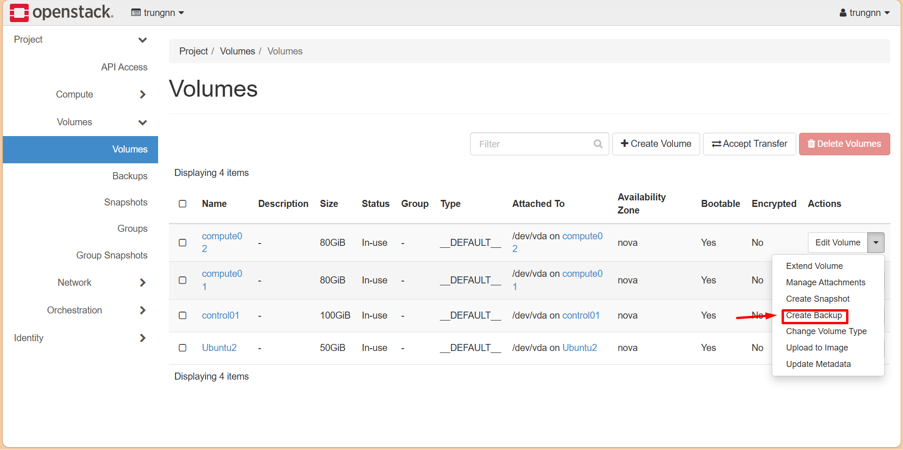
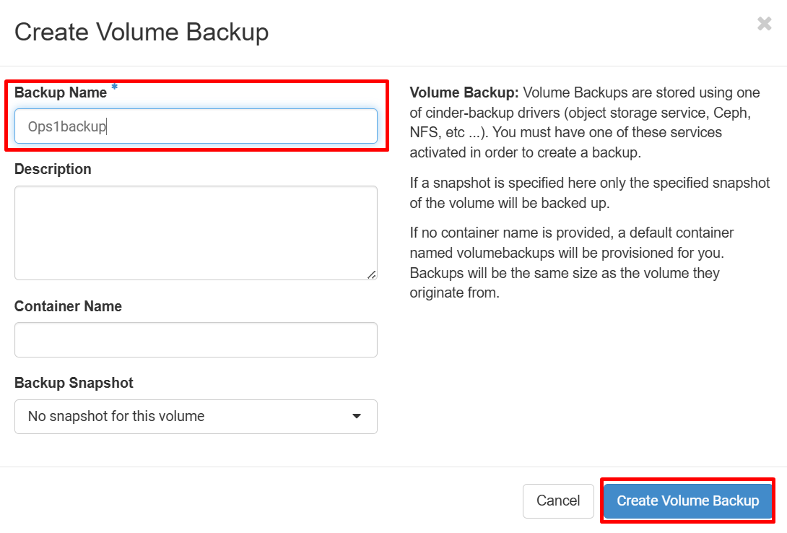
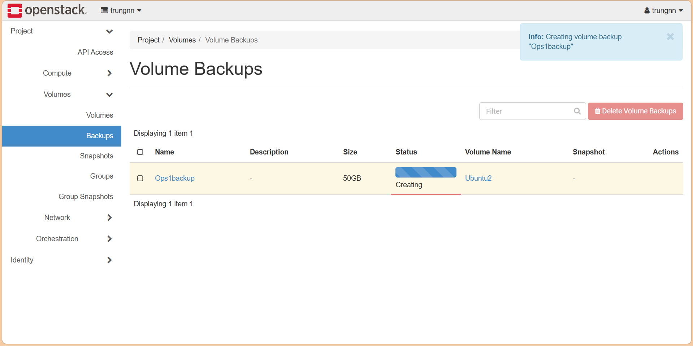

# Cấu hình Cinder backup
## Cấu hình trên Node Controller
```bash
sudo nano /etc/kolla/cinder-backup/cinder.conf
```

Đây là `cinder.conf` trong Kolla-Ansible, tức file cấu hình của dịch vụ block storage (Cinder). Mình sẽ đi theo từng section và giải thích vai trò thực tế trong hệ thống của bạn.

---

## `[DEFAULT]`

Phần cấu hình chung của Cinder.

```ini
debug = False
```

* Bật/tắt log debug.
* `False` → log bình thường.
* `True` → ghi cực nhiều log, thường chỉ bật khi debug lỗi.

```ini
log_dir = /var/log/kolla/cinder
```

* Thư mục lưu log của Cinder trong container Kolla.

```ini
use_forwarded_for = true
```

* Tin tưởng header `X-Forwarded-For`.
* Dùng khi có HAProxy hoặc reverse proxy phía trước.

```ini
use_stderr = false
```

* Không ghi log ra stderr.

```ini
my_ip = 192.168.70.122
```

* IP của node chạy Cinder.
* Dùng cho giao tiếp giữa dịch vụ.

---

### Volume

```ini
volume_name_template = volume-%s
```

* Template đặt tên volume.

Ví dụ:

```text
volume-a12bc345
```

---

### Kết nối Glance

```ini
glance_api_servers = http://192.168.70.122:9292
```

* Địa chỉ Glance.
* Khi tạo volume từ image:

```bash
openstack volume create --image cirros myvol
```

Cinder sẽ gọi API này.

```ini
glance_num_retries = 1
```

* Số lần thử lại nếu Glance lỗi.

---

### Backup qua Ceph

```ini
backup_driver = cinder.backup.drivers.ceph.CephBackupDriver
```

* Driver backup dùng Ceph.

```ini
backup_ceph_conf = /etc/ceph/ceph.conf
```

* File cấu hình Ceph.

```ini
backup_ceph_user = cinder-backup
```

* User Ceph dùng cho backup.

```ini
backup_ceph_pool = backups
```

* Pool lưu backup.

```ini
backup_ceph_chunk_size = 134217728
```

* Chia backup thành block:

```text
134217728 byte = 128MB
```

---

### Authentication

```ini
auth_strategy = keystone
```

* Xác thực bằng Keystone.

---

### RabbitMQ

```ini
transport_url = rabbit://...
```

* Cinder giao tiếp với Nova/Glance/... thông qua RabbitMQ.

Ví dụ:

```text
Nova -> RabbitMQ -> Cinder
```

Khi tạo volume:

```text
API → Queue → Cinder-volume
```

---

## `[oslo_messaging_notifications]`

```ini
driver = noop
```

* Không gửi notification.

Nếu bật:

```text
Cinder → RabbitMQ → monitoring
```

---

## `[oslo_messaging_rabbit]`

Cấu hình RabbitMQ nâng cao:

```ini
rabbit_quorum_queue = true
```

* Queue dạng quorum.
* Chống mất dữ liệu khi node Rabbit chết.

```ini
rabbit_qos_prefetch_count = 1
```

* Worker lấy 1 job/lần.

```ini
rabbit_stream_fanout = true
```

* Dùng stream queue.

---

## `[oslo_middleware]`

```ini
enable_proxy_headers_parsing = true
```

* Cho phép parse header từ HAProxy/nginx.

---

## `[nova]`

Thông tin Cinder dùng để nói chuyện với Nova.

```ini
auth_url = http://192.168.70.122:5000
```

* Keystone URL.

```ini
project_name = service
username = nova
password = ...
```

Thông tin account service của Nova.

Cinder dùng phần này để:

* attach volume
* detach volume
* migration
* resize

---

## `[database]`

Kết nối MariaDB.

```ini
connection = mysql+pymysql://...
```

Ý nghĩa:

```text
mysql+pymysql://
user:password
@IP:port
/database
```

Ví dụ:

```text
cinder:password@192.168.70.122:3306/cinder
```

---

```ini
connection_recycle_time = 10
```

* Sau 10s kết nối DB được tạo mới.

---

```ini
max_pool_size = 1
```

* Tối đa 1 connection trong pool.

---

```ini
max_retries = -1
```

* Thử vô hạn nếu DB mất kết nối.

---

## `[keystone_authtoken]`

Thông tin để Cinder xác thực token.

```ini
www_authenticate_uri = http://192.168.70.122:5000
auth_url = http://192.168.70.122:5000
```

* Keystone endpoint.

```ini
project_name = service
username = cinder
password = ...
```

Tài khoản service riêng của Cinder.

Khi user gọi:

```bash
openstack volume create test
```

luồng sẽ là:

```text
User token
 ↓
Cinder API
 ↓
Keystone kiểm tra
 ↓
Cho phép hoặc từ chối
```

---

## `[oslo_concurrency]`

```ini
lock_path = /var/lib/cinder/tmp
```

* Nơi lưu file lock.

Ví dụ:

Nếu hai tiến trình cùng tạo volume:

```text
Process A -> lock
Process B -> chờ
```

Tránh ghi đè dữ liệu.

---

## `[lvm-1]`

Đây là backend volume của bạn.

```ini
volume_group = cinder-volumes
```

* Volume group LVM dùng để tạo volume.

Kiểm tra:

```bash
vgs
```

Ví dụ:

```text
VG              Size
cinder-volumes  500G
```

---

```ini
volume_driver = cinder.volume.drivers.lvm.LVMVolumeDriver
```

* Dùng driver LVM.

---

```ini
volume_backend_name = lvm-1
```

Tên backend.

Có thể có:

```text
lvm-1
ceph-1
nfs-1
```

---

```ini
target_helper = lioadm
```

* Dùng Linux LIO tạo iSCSI target.

---

```ini
target_protocol = iscsi
```

Volume được export bằng iSCSI.

Luồng attach:

```text
VM
 ↓
Nova
 ↓
Cinder
 ↓
LIO target
 ↓
iSCSI
 ↓
Disk xuất hiện trong VM
```

---

## `[privsep_entrypoint]`

```ini
helper_command = sudo cinder-rootwrap ...
```

* Cho phép Cinder chạy một số lệnh root an toàn.

Ví dụ:

```text
lvcreate
iscsiadm
targetcli
```

---

## `[coordination]`

Hiện đang trống:

```ini
[coordination]
```

Thường dùng cho HA:

```text
tooz://etcd
tooz://redis
```

Mục đích:

* khóa phân tán giữa nhiều node Cinder
* tránh hai node xử lý cùng volume

---

Tóm tắt kiến trúc file của bạn:

```text
User
 ↓
Keystone
 ↓
Cinder API
 ↓
RabbitMQ
 ↓
Cinder-volume
 ↓
LVM(cinder-volumes)
 ↓
LIO
 ↓
iSCSI
 ↓
Compute node
 ↓
VM
```

## Câu lệnh backup volumes
```bash
openstack volume backup create --name <backup_name> [--incremental] [--force] <id_volume>
```
- `--incremental` : tùy chọn này sử dụng khi muốn backup incremental. Yêu cầu: Đã có 1 bản backup full của volume.
- `--force` : sử dụng khi muốn backup volume ở cả trạng thái available và in-use.
- `id_volume`: id của volume cần thực hiện backup.

## Thực hiện backup volume GUI





## Xem lịch sử backup
```bash
openstack volume backup list
docker logs cinder_backup | tail -100
```