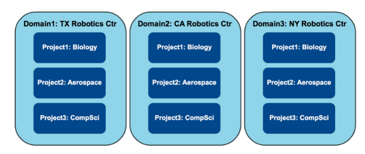
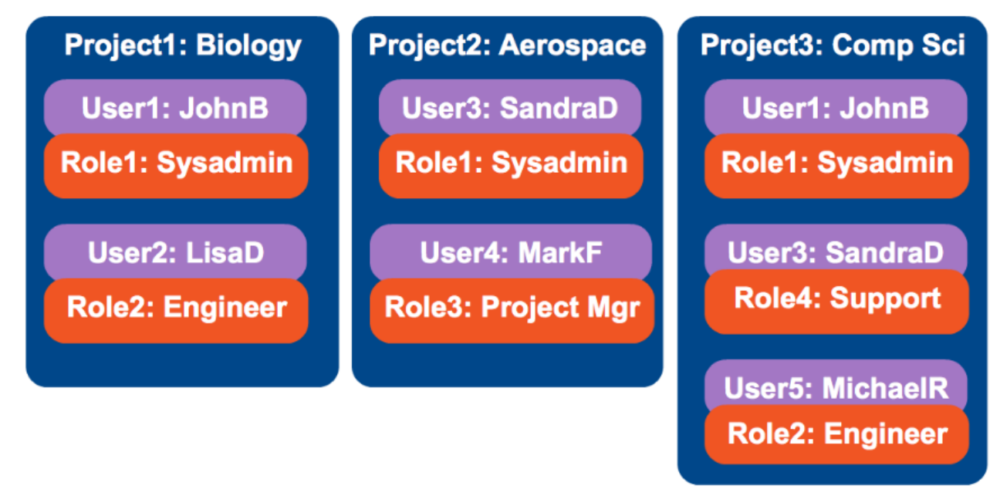
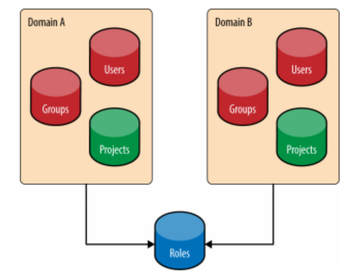

# Tổng quan về Keystone

Môi trường cloud theo mô hình IaaS (Infrastructure-as-a-Service) cung cấp cho người dùng khả năng truy cập vào các tài nguyên quan trọng như máy ảo, kho lưu trữ và kết nối mạng. Bảo mật luôn là vấn đề quan trọng, và trong OpenStack thì **Keystone** chính là dịch vụ đảm nhiệm công việc đó — chịu trách nhiệm cung cấp các kết nối mang tính bảo mật cao tới các nguồn tài nguyên cloud.

> Xem thêm:
> - [Luồng xác thực end-to-end](./workflow.md)
> - [Các loại Token (Fernet, JWS, Scope)](./Token.md)

---

## 1. Keystone làm gì?

**Keystone** là thành phần quản lý xác thực và ủy quyền (Identity & Access Management) của OpenStack. Keystone có thể tự lưu user hoặc đứng giữa đóng vai trò như một cổng trung gian (Shim) trước các hệ thống có sẵn như LDAP.

**Keystone làm 3 việc chính:**

| Việc | Câu hỏi trả lời | Cơ chế |
|------|-----------------|--------|
| **Xác thực** (Authentication) | "Bạn là ai?" | Kiểm tra username + password qua Identity Service (SQL hoặc LDAP) |
| **Cấp Token** | "Đây là giấy phép của bạn" | Token Service tạo token trả về → dùng cho mọi API call sau này |
| **Phân quyền** (Authorization) | "Bạn được làm gì?" | Xác định user có role gì trên project nào |

**Ví dụ so sánh:**
- **LDAP** (database thật): Chỉ biết user này đúng password hay không.
- **Keystone**: Biết user này là ai, thuộc project nào, có role gì, được gọi API nào, và cấp token để dùng tiếp.

---

## 2. Các khái niệm cốt lõi

### 2.1 Thực thể (Actors) — *Ai là ai trong hệ thống?*

#### 2.1.1 Users
- Đại diện cho một người (hoặc ứng dụng) dùng API trong OpenStack.
- Mỗi User **phải thuộc về 1 Domain**.
- Tên User không cần unique toàn hệ thống, nhưng **bắt buộc unique trong domain** của nó.

#### 2.1.2 Groups
- Là một nhóm chứa nhiều Users.
- Cũng phải thuộc về 1 Domain.
- Tên Group chỉ unique trong domain của nó.
- Users và Groups được gọi chung là **Actor**.

---

### 2.2 Không gian tổ chức (Resources) — *Ở đâu?*

#### 2.2.1 Domains



- Là **container cấp cao nhất** trong Keystone.
- Chứa Users, Groups và Projects.
- Mỗi Domain có **tên toàn cục unique** (không domain nào được trùng tên).
- Keystone luôn có sẵn một domain mặc định tên là `"Default"`.
- Người dùng ở domain này vẫn có thể truy cập resource ở domain khác nếu được cấp quyền.

#### 2.2.2 Projects



- Là **đơn vị sở hữu cơ bản nhất** trong OpenStack.
- Mọi thứ người dùng tạo ra (VM, volume, network, image,...) đều thuộc về một project.
- Project là nơi nhóm và cô lập các nguồn tài nguyên — chỉ một số user mới có thể truy cập.
- Bản thân Project **không sở hữu Users hay Groups** — Users/Groups được cấp quyền truy cập qua cơ chế gán Role.
- Project phải thuộc về một Domain. Nếu không chỉ định → thuộc `Default` domain.
- Tên Project chỉ unique trong domain của nó.

---

### 2.3 Phân quyền (Assignment) — *Được làm gì?*

#### 2.3.1 Roles
- Quy định bạn được làm gì.
- Role có thể gán ở mức **Domain** hoặc **Project**.
- Role có thể gán cho **User** hoặc **Group**.
- Tên Role chỉ unique trong domain của nó.



#### 2.3.2 Role Assignments
- Gồm bộ 3 **(3-tuple)**:
  - **Role**: vai trò gì?
  - **Resource**: gán trên Project hay Domain nào?
  - **Identity**: gán cho User hay Group nào?
- Role assignment có thể được cấp phát, thu hồi, và **kế thừa** giữa users, groups, projects và domains.

---

### Bảng tóm tắt tính Unique (Identity v3 API)

| Đối tượng | Phạm vi unique |
|-----------|---------------|
| Domain Name | **Toàn cục** (globally unique) |
| Role Name | Trong domain sở hữu |
| User Name | Trong domain sở hữu |
| Project Name | Trong domain sở hữu |
| Group Name | Trong domain sở hữu |

---

## 3. Các dịch vụ của Keystone

### 3.1 Identity Service — *Tôi là ai?*
- Cung cấp chức năng xác thực thông tin đăng nhập và quản lý dữ liệu về Users và Groups.
- Hỗ trợ nhiều backend: **SQL** (tự quản lý), **LDAP** (đồng bộ từ hệ thống ngoài), **Federated Identity Providers**.
- Trong cấu hình cơ bản: dữ liệu được quản lý trực tiếp bởi Keystone (full CRUD).
- Trong cấu hình phức tạp hơn: Keystone đóng vai trò **frontend** chuyển tiếp tới LDAP (nguồn dữ liệu gốc — source of truth).

#### Backend LDAP
- Keystone có tùy chọn lưu trữ actors trong LDAP (Lightweight Directory Access Protocol).
- Keystone truy cập LDAP như các ứng dụng khác (System Login, Email, Web Application...).
- Cài đặt kết nối được lưu trong file config của Keystone, bao gồm tùy chọn cho phép ghi hoặc chỉ đọc.
- **Thông thường LDAP chỉ cho phép đọc** (tìm kiếm user, group và xác thực).
- Nếu dùng LDAP làm read-only Identity Backend → Keystone cần có quyền sử dụng LDAP.

---

### 3.2 Resource Service — *Ở đâu?*
- Quản lý 2 thứ chính: **Projects** và **Domains**.
- Chi tiết xem mục [2.2 Không gian tổ chức](#22-không-gian-tổ-chức-resources--ở-đâu).

---

### 3.3 Assignment Service — *Được làm gì?*
- Quản lý **Roles** và **Role Assignments**.
- Xác định actor nào có quyền gì trên resource nào.
- Chi tiết xem mục [2.3 Phân quyền](#23-phân-quyền-assignment--được-làm-gì).

---

### 3.4 Token Service — *Giấy phép tạm thời*
- Sau khi Identity xác thực thành công, Token Service tạo ra một **token** và trả về cho client.
- Token chứa thông tin ủy quyền (user, project, roles) — dùng để xác thực mọi API request sau này, không cần gửi password lại.
- Token có cả phần **ID** (đảm bảo unique) và **payload** (chứa thông tin user).
- Token Service cũng chịu trách nhiệm **kiểm tra token có hợp lệ không**.

> Xem chi tiết các loại token (Fernet, JWS) và scope: [Token.md](./Token.md)

---

### 3.5 Catalog Service — *Danh bạ dịch vụ*
- Giống như "danh bạ" của toàn bộ OpenStack.
- Lưu trữ URLs và endpoint (địa chỉ API) của tất cả các dịch vụ (Nova, Neutron, Glance...).
- Khi có token, client hỏi Catalog để biết "muốn tạo máy ảo thì gọi địa chỉ nào".
- Mỗi endpoint chứa: `admin URL`, `internal URL`, `public URL`.

---

### Tips dễ nhớ

| Dịch vụ | Câu ví von |
|---------|-----------|
| **Identity** | Kiểm tra CMND — xác thực bạn là ai |
| **Resource** | Quản lý "căn hộ" (Project) và "tòa nhà" (Domain) |
| **Assignment** | Phát "thẻ ra vào" (Role) cho từng người hoặc nhóm |
| **Token** | In ra "thẻ từ" (token) sau khi kiểm tra xong |
| **Catalog** | Cho bạn biết "cửa vào các phòng" (endpoint) ở đâu |

---

## 4. Kiến trúc kỹ thuật (nâng cao)

> Phần này dành cho người cần hiểu sâu về cách Keystone hoạt động bên trong. Người mới học có thể đọc sau.

### 4.1 Tổng quan kiến trúc

Keystone là HTTP front-end cho nhiều dịch vụ xác thực và phân quyền. Từ phiên bản Rocky, Keystone sử dụng **Flask-RESTful** làm framework để cung cấp REST API.

Luồng xử lý request: `Client → API → Manager → Driver`

```
┌────────────────────────────────────────┐
│ 1. API Layer (Flask-RESTful)           │
│    - Định nghĩa route, xử lý HTTP      │
│    - Không chứa logic nghiệp vụ        │
└────────────────────────────────────────┘
                   ↓
┌────────────────────────────────────────┐
│ 2. Manager Layer (Thin Wrapper)        │
│    - Điều phối gọi driver              │
│    - Xử lý cache, validation cơ bản    │
└────────────────────────────────────────┘
                   ↓
┌────────────────────────────────────────┐
│ 3. Driver Layer (Pluggable Backend)    │
│    - Implement thực tế: SQL, LDAP...   │
│    - Có thể không hỗ trợ CRUD          │
└────────────────────────────────────────┘
                   ↓
┌────────────────────────────────────────┐
│ 4. Policy & Auth Plugins               │
│    - Kiểm soát "ai được làm gì"        │
│    - Hỗ trợ nhiều phương thức login    │
└────────────────────────────────────────┘
```

**Vai trò của từng lớp:**
- **API**: Router — nhìn vào URL + HTTP method để quyết định gọi Resource nào xử lý.
  - `/v3/users` → `UserResource`
  - `/v3/projects` → `ProjectResource`
- **Resource**: Controller — xử lý logic cho từng endpoint (GET, POST, DELETE...).
- **Manager**: Lớp bọc mỏng ở giữa — tách logic API khỏi logic lưu trữ, gọi xuống Driver.
- **Driver**: Lấy dữ liệu thực tế từ DB hoặc LDAP.

**Ví dụ dễ hình dung:**
```
API      = Nhân viên phục vụ (nghe yêu cầu, biết gọi bếp nào)
Resource = Đầu bếp (trực tiếp nấu món)
Manager  = Quản lý bếp (điều phối, không nấu trực tiếp)
Driver   = Nguyên liệu thực tế (SQL, LDAP)
```

**Tính module hóa:** Mỗi dịch vụ (Identity, Catalog, Resource...) là một module riêng biệt. Bạn có thể thay đổi backend của dịch vụ này mà không làm hỏng dịch vụ kia.

---

### 4.2 Service Groups

| Nhóm dịch vụ | Chức năng chính | Ví dụ module |
|--------------|-----------------|-------------|
| **Assignment** | Quản lý phân quyền (role) | `keystone.api.roles`, `keystone.api.role_assignments` |
| **Authentication** | Xác thực người dùng | `keystone.api.auth`, `keystone.api.ec2tokens` |
| **Catalog** | Quản lý endpoint dịch vụ | `keystone.api.endpoints`, `keystone.api.services` |
| **Credentials** | Quản lý thông tin xác thực bổ sung | `keystone.api.credentials` |
| **Federation** | Liên kết identity bên ngoài (SSO, LDAP) | `keystone.api.os_federation` |
| **Identity** | Quản lý user và group | `keystone.api.users`, `keystone.api.groups` |
| **Limits** | Quản lý giới hạn tài nguyên (quota) | `keystone.api.limits`, `keystone.api.registered_limits` |
| **OAuth1** | Hỗ trợ OAuth 1.0 | `keystone.api.os_oauth1` |
| **Policy** | Quản lý chính sách phân quyền | `keystone.api.policy` |
| **Resource** | Quản lý domain và project | `keystone.api.domains`, `keystone.api.projects` |
| **Revoke** | Thu hồi token | `keystone.api.os_revoke` |
| **Trust** | Ủy quyền (delegation) user A → user B | `keystone.api.trusts` |

---

### 4.3 Service Backends & Drivers

Keystone cho phép cấu hình backend khác nhau cho từng dịch vụ (SQL, LDAP, NoSQL, hệ thống identity bên ngoài).

**Cấu hình trong `keystone.conf`:**
```ini
[assignment]
driver = sql

[identity]
driver = ldap

[catalog]
driver = templated
```

Mỗi backend có một **abstract base class** để định nghĩa những gì một implementation phải có (nằm trong file `base.py` của từng service):
```
keystone.assignment.backends.base.AssignmentDriverBase
keystone.assignment.role_backends.base.RoleDriverBase
keystone.auth.plugins.base.AuthMethodHandler
keystone.catalog.backends.base.CatalogDriverBase
keystone.credential.backends.base.CredentialDriverBase
```

Khi viết driver mới, người dùng **bắt buộc kế thừa** từ lớp base tương ứng và implement đầy đủ các method được yêu cầu.

---

### 4.4 Templated Backend

- Backend đặc biệt, chủ yếu dùng cho **service catalog**.
- Không lưu trữ dữ liệu — chỉ mở rộng (expand) các template đã cấu hình sẵn để sinh ra dữ liệu catalog.

---

### 4.5 Data Model

Keystone được thiết kế để hỗ trợ nhiều kiểu backend. Các kiểu dữ liệu chính:

| Kiểu | Mô tả |
|------|-------|
| `User` | Có thông tin xác thực, liên kết với một hoặc nhiều project/domain |
| `Group` | Tập hợp users, liên kết với một hoặc nhiều project/domain |
| `Project` | Đơn vị sở hữu trong OpenStack, chứa một hoặc nhiều user |
| `Domain` | Đơn vị sở hữu cấp cao, chứa users, groups và projects |
| `Role` | Metadata cấp cao, liên kết với nhiều cặp user-project |
| `Token` | Credential dùng để xác định user hoặc cặp user-project |
| `Extras` | Bucket chứa metadata key-value, liên kết với cặp user-project |
| `Rule` | Mô tả tập hợp các yêu cầu để thực hiện một hành động |

Mô hình dữ liệu cho phép mối quan hệ many-to-many giữa users/groups với projects/domains. Tuy nhiên các backend thực tế có thể hỗ trợ ở mức độ khác nhau (ví dụ: LDAP backend có thể chỉ hỗ trợ User-Project, không hỗ trợ Group).

---

### 4.6 Approach to CRUD

- Keystone cung cấp các thao tác CRUD (Create, Read, Update, Delete) để phục vụ phát triển và testing.
- CRUD được coi là **tính năng bổ sung**, không phải cốt lõi — một backend không bắt buộc phải hỗ trợ CRUD.
- Nếu backend không hỗ trợ CRUD → raise exception: `keystone.exception.NotImplemented`.

**Lý do thiết kế này:**
- Doanh nghiệp lớn thường quản lý user qua hệ thống bên ngoài (Active Directory, LDAP...).
- Keystone không nên "ép" backend phải hỗ trợ ghi/xóa nếu hệ thống gốc không cho phép.
- Backend chỉ cần hỗ trợ **read** là có thể dùng được trong nhiều trường hợp.

---

### 4.7 Approach to Authorization (Cơ chế phân quyền)

Kiểm soát xem ai được làm gì, dựa trên thông tin xác thực của người dùng.

**Hai cấp độ kiểm tra cơ bản:**
- **Admin check**: Người dùng có phải admin không?
- **Owner check**: Người dùng có phải là chủ thể của tài nguyên không?

Mặc định, Keystone sử dụng cơ chế policy enforcement từ thư viện **oslo.policy**.

**Ví dụ quy tắc:**
```python
credentials = {'user_id': 'foo', 'is_admin': 1, 'roles': ['nova:netadmin']}

# Admin only call:
policy_api.enforce(('is_admin:1',), credentials)

# Admin or owner call:
policy_api.enforce(('is_admin:1', 'user_id:foo'), credentials)

# Netadmin call:
policy_api.enforce(('roles:nova:netadmin',), credentials)
```

- Credentials được xây dựng từ metadata của user trong phần `extras` của Identity API.
- Thêm role cho user chỉ đơn giản là thêm role vào metadata của user.

---

### 4.8 Authentication Plugins

Keystone cung cấp nhiều authentication plugins, kế thừa từ `keystone.auth.plugins.base`:

| Plugin | Phương thức | Use case |
|--------|-------------|----------|
| `password` | Username + password | Đăng nhập cơ bản |
| `token` | Dùng token có sẵn | Service-to-service auth |
| `oauth1` | OAuth 1.0 | Ứng dụng bên thứ 3 |
| `totp` | Time-based OTP | 2FA |
| `mapped` | Ánh xạ từ external IDP | Federation (SAML, OIDC) |
| `external` | Auth qua web server (`REMOTE_USER`) | Reverse proxy auth |

**Scope (Phạm vi) trong authentication:**
- **Project-scoped token**: Chỉ dùng được trên project đã được grant.
- **Domain-scoped token**: Dùng để thực hiện các chức năng liên quan đến domain.
- **System-scoped token**: Chỉ dùng để tương tác với các API ảnh hưởng đến toàn bộ deployment.

> Xem chi tiết về scope và token providers: [Token.md](./Token.md)

---

*Tham khảo thêm: https://docs.openstack.org//keystone/2026.1/doc-keystone.pdf*
