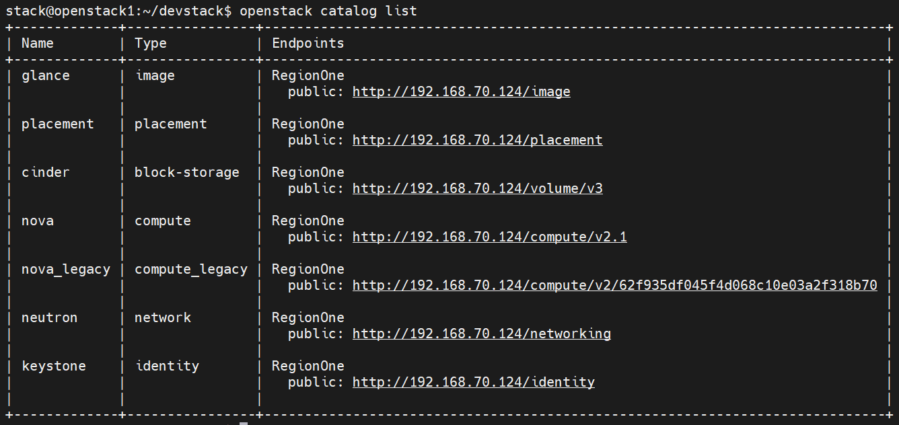

# Khái niệm Endpoint và Catalog
- Endpoint trong Keystone là một URL có thể được sử dụng để truy cập dịch vụ trong Openstack
- 1 Endpoint giống như một điểm liên lạc để người dùng sử dụng dịch vụ của Openstack.

## 3 loại Endpoint
- `adminurl`: Dùng cho người dùng quản trị
- `internalurl`: Là những gì các dịch vụ khác sử dụng để giao tiếp với nhau.
- `publicurl`: Là những gì mà người khác truy cập vào endpoint sử dụng dịch vụ.

## Show list endpoint
- Source file môi trường admin
```bash
source openrc admin admin
```
- Hoặc source file môi trường demo
```bash
source openrc demo demo | source openrc 
```
```bash
openstack endpoint list
```


- Hiển thị chi tiết một endpoint
```bash
openstack endpoint show <endpoint>
```
 Ví dụ:
```bash
openstack endpoint show 01db1e80d3b540639861c1ee9d0a451f
```

## Catalog
Catalog trong OpenStack là tập hợp các danh mục sẵn sàng sử dụng mà khách hàng có thể sử dụng trong OPS

Service catalog cung cấp cho người dùng về các dịch vụ có sẵn trong OPS, cùng với thông tin bổ sung về các vùng, phiên bản API và các project có sẵn.

Catalog làm cho việc tìm kiếm dịch vụ hiệu quả, chẳng hạn như cách định cấu hình liên lạc giữa các dịch vụ.

### List Catalog
```bash
openstack catalog list
```


### Show thông tin một mục trong catalog
```bash
openstack catalog show <service>
```
Ví dụ
```bash
openstack catalog show keystone
```