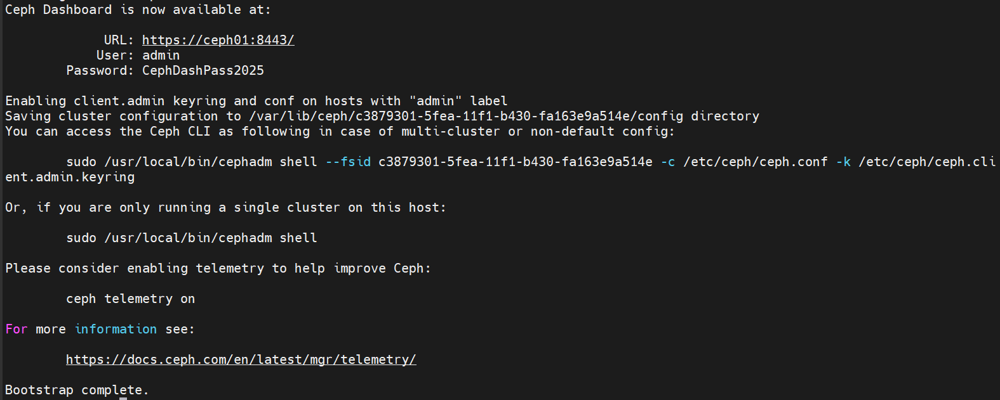

# GIAI ĐOẠN 4.5 — CEPH CLUSTER (Squid 19.x bằng cephadm)

> **Tiền đề:** Giai đoạn 0→4 xanh. VIP 192.168.70.120 + Keystone HA chạy ổn. `/etc/hosts` 11 node
> đã có ceph01/02/03, chrony đồng bộ với controller01.
> **Phạm vi:** dựng cụm Ceph 3 node `ceph01/02/03` chạy đủ `mon + mgr + osd`. Mỗi node 1 OSD
> trên `/dev/vdb` 40G.
> **Mục tiêu:** `ceph -s` → `HEALTH_OK`, 3 mon, 3 osd up+in. Tạo sẵn 3 pool `images`, `volumes`,
> `vms` chờ Glance/Cinder/Nova ở các giai đoạn sau. **Giai đoạn này KHÔNG đụng OpenStack** —
> chỉ build storage layer độc lập.

---

## 0. CEPH LÀ GÌ (đọc 3 phút trước khi gõ)

**Ceph = "ổ cứng phân tán" tự copy dữ liệu nhiều nơi, mất 1 node không mất data.** Ba dịch vụ
cốt lõi cần biết:

- **MON (Monitor)** — "phòng quản trị". Giữ bản đồ cụm (ai là OSD, ai chết, dữ liệu nằm đâu).
  Quorum lẻ → cần 3 mon (chịu mất 1).
- **MGR (Manager)** — "bảng điều khiển". Cung cấp dashboard, metrics, orchestrator (cephadm).
  1 active + 1 standby là đủ.
- **OSD (Object Storage Daemon)** — "thợ kho". Mỗi OSD canh 1 đĩa thô. Dữ liệu chia thành
  object, replica 3 mặc định → mất 1 OSD vẫn còn 2 bản.

**RBD (RADOS Block Device)** = chế độ "tạo file dạng block" trên cụm, đem mount thành disk ảo.
OpenStack dùng RBD: Glance lưu image, Cinder cấp volume, Nova mount ephemeral disk — tất cả là
RBD image trong các pool tương ứng.

**Cephadm = công cụ deploy chính thống từ Quincy.** Bootstrap 1 node, sau đó add các node khác
qua SSH key. Mỗi daemon (mon/mgr/osd) chạy trong **container podman** trên node đó. Đây là
ngoại lệ duy nhất với nguyên tắc "manual thuần" — bù lại, lifecycle Ceph (upgrade, replace OSD,
add host) tự động hoá tốt, đáng đánh đổi.

**Đặc thù lab này:**
- RAM ceph node 8GB < khuyến nghị 16GB → phải hạ `osd_memory_target` xuống 2GB.
- 1 OSD/node × 40GB × 3 node = 120GB raw → ~40GB usable (replica 3). Sẽ kêu near-full sớm.
- Public network = cluster network = `192.168.70.0/24` (không tách).

---

## 1. CHUẨN BỊ NỀN 3 CEPH NODE

### 1.1. Verify từ deployer (chạy 1 lần, đọc kỹ output)

```bash
for h in ceph01 ceph02 ceph03; do
  echo "========== $h =========="
  ssh $h "
    echo '--- hostname / hosts ---'
    hostname
    grep -E 'ceph0[123]|controller01' /etc/hosts
    echo '--- block devices ---'
    lsblk
    echo '--- vdb signature (mong đợi: trống) ---'
    sudo blkid /dev/vdb 2>&1 || echo '(no signature — good)'
    sudo wipefs -n /dev/vdb 2>&1
    echo '--- chrony ---'
    chronyc tracking | grep -E 'Reference|System time|Leap'
    echo '--- RAM ---'
    free -h | head -2
    echo '--- ceph/podman pre-existing? ---'
    dpkg -l | grep -E 'ceph|podman' || echo '(clean slate)'
  "
done
```

Cần:
- `vdb` size 40G, **không có partition con** (vdb1, vdb2...).
- `blkid /dev/vdb` không trả ra TYPE (hoặc trả `(no signature)`).
- Chrony `Leap status: Normal`, lệch < 50ms.

### 1.2. Nếu vdb có dấu vết cũ (LVM, ext4, ceph cũ từ thử nghiệm trước)

```bash
# trên TỪNG ceph node, CẨN THẬN — xoá sạch vdb
sudo wipefs -af /dev/vdb
sudo sgdisk --zap-all /dev/vdb
sudo dd if=/dev/zero of=/dev/vdb bs=1M count=100 oflag=direct
# verify lại
sudo blkid /dev/vdb       # phải trống
```

> ⚠️ Lệnh trên xoá vĩnh viễn `vdb`. Chắc chắn là vdb (40G), KHÔNG phải vda (OS).

### 1.3. Cài podman + lvm2 + chrony trên cả 3 ceph node

Cephadm cần podman để chạy daemon container, lvm2 để OSD BlueStore quản đĩa.

```bash
for h in ceph01 ceph02 ceph03; do
  ssh $h "sudo apt update && sudo apt -y install podman lvm2 chrony"
done
```

> Ubuntu 24.04 có sẵn podman repo chính. `docker` cũng được nhưng cephadm mặc định ưu tiên podman.

---

## 2. SSH ROOT GIỮA CÁC CEPH NODE (cephadm yêu cầu)

Cephadm dùng SSH root từ node bootstrap (ceph01) sang ceph02/03 để deploy daemon. Không tự setup
được từ user thường.

### 2.1. Bật root SSH key-only trên cả 3 ceph node

```bash
for h in ceph01 ceph02 ceph03; do
  ssh $h "
    sudo sed -i 's/^#*PermitRootLogin.*/PermitRootLogin prohibit-password/' /etc/ssh/sshd_config
    sudo systemctl restart ssh
  "
done
```

> `prohibit-password` = chỉ cho login root bằng key, KHÔNG cho password. An toàn vì password
> root chưa set.

### 2.2. Tạm thời copy authorized_keys của user thường sang root để ssh-copy-id sau

Chưa làm gì ở đây — `cephadm bootstrap` ở bước 3 tự sinh `/etc/ceph/ceph.pub`, copy sang
ceph02/03 ở bước 4.

---

## 3. BOOTSTRAP CỤM CEPH TRÊN CEPH01

### 3.1. Cài cephadm binary trên ceph01

```bash
# trên ceph01
CEPH_RELEASE=19.2.1   # Squid stable hiện tại
curl --silent --remote-name --location \
  https://download.ceph.com/rpm-${CEPH_RELEASE}/el9/noarch/cephadm
chmod +x cephadm
sudo mv cephadm /usr/local/bin/
cephadm version       # in ra version
```

> Script `cephadm` này là một file Python self-contained — KHÔNG cần cài qua apt. Sau khi
> bootstrap, nó tự pull image container Ceph (vài trăm MB, mất ~5 phút lần đầu).

### 3.2. Bootstrap

```bash
# trên ceph01
sudo cephadm bootstrap \
  --mon-ip 192.168.70.126 \
  --cluster-network 192.168.70.0/24 \
  --initial-dashboard-user admin \
  --initial-dashboard-password CephDashPass2025 \
  --dashboard-password-noupdate \
  --allow-fqdn-hostname
```

Quá trình bootstrap (5-10 phút):
1. Pull image `quay.io/ceph/ceph:v19`.
2. Sinh keyring + config: `/etc/ceph/ceph.conf`, `/etc/ceph/ceph.client.admin.keyring`,
   `/etc/ceph/ceph.pub` (public key để add host).
3. Start mon + mgr container đầu tiên trên ceph01.
4. Cuối cùng in ra URL dashboard + cảnh báo "Bootstrap complete".

**Output mong đợi (đoạn cuối):**
```
Ceph Dashboard is now available at:
        URL: https://ceph01:8443/
       User: admin
   Password: CephDashPass2025

Bootstrap complete.
```



### 3.3. Cài CLI Ceph trên host ceph01 (để gõ `ceph -s` không cần `cephadm shell`)

```bash
sudo cephadm add-repo --release squid
sudo cephadm install ceph-common
ceph -s
```

Mong đợi `ceph -s` ra:
- `health: HEALTH_WARN` (vì chưa đủ OSD — bình thường lúc này).
- `mon: 1 daemons, quorum ceph01`.
- `mgr: ceph01.xxxx(active)`.
- `osd: 0 osds: 0 up, 0 in`.

---

## 4. ADD CEPH02 + CEPH03 VÀO CỤM

### 4.1. Đẩy `ceph.pub` của cephadm vào `authorized_keys` của root trên ceph02/03

**Bối cảnh:** lab này login root trực tiếp ở mọi node, không có user thường. Cầu nối SSH duy
nhất là **từ deployer → root@ceph0X** (đã setup từ Giai đoạn 0). Tận dụng deployer làm trung
gian để bơm `ceph.pub` từ ceph01 sang ceph02/03.

> ⚠️ **`ceph.pub` là PUBLIC key**, không phải private. Cephadm giữ private key trong
> config-key store nội bộ của cụm — không nằm dưới dạng file. Vì vậy ta KHÔNG bao giờ dùng
> `ssh -i /etc/ceph/ceph.pub` để test — sai logic và SSH sẽ từ chối (đòi private).
> Verify đúng bằng `ceph cephadm check-host` (cephadm tự load private key của nó).

```bash
# Tất cả chạy từ deployer, SAU KHI bootstrap ceph01 xong

# 1. Bơm pub key qua deployer làm trung gian
ssh ceph01 'sudo cat /etc/ceph/ceph.pub' | ssh ceph02 'cat >> /root/.ssh/authorized_keys'
ssh ceph01 'sudo cat /etc/ceph/ceph.pub' | ssh ceph03 'cat >> /root/.ssh/authorized_keys'

# 2. Confirm dòng mới đã vào authorized_keys
ssh ceph02 'wc -l /root/.ssh/authorized_keys && tail -1 /root/.ssh/authorized_keys'
ssh ceph03 'wc -l /root/.ssh/authorized_keys && tail -1 /root/.ssh/authorized_keys'
# mong đợi: dòng cuối có dạng 'ssh-ed25519 AAAA... ceph-<fsid>'

# 3. Verify đúng cách bằng cephadm check-host
ssh ceph01 'sudo cephadm shell -- ceph cephadm check-host ceph02 192.168.70.125'
ssh ceph01 'sudo cephadm shell -- ceph cephadm check-host ceph03 192.168.70.116'
```

Mong đợi mỗi check-host in ra:
```
ceph0X (192.168.70.xxx) ok
podman (/usr/bin/podman) version 4.x.x is present
systemctl is present
lvcreate is present
Unit chrony.service is enabled and running
Hostname "ceph0X" matches what is expected.
Host looks OK
```

Xanh tất cả → SSH thông, đi tiếp 4.2. Nếu chỗ nào đỏ:
- `Permission denied` → bơm key bước 1 fail. Chạy lại bước 1 (chạy nhiều lần vô hại, chỉ
  thêm dòng trùng vào `authorized_keys`).
- `podman not found` / `chrony not running` → quay lại mục 1.3 cài đủ podman + chrony.
- `Hostname mismatch` → `/etc/hosts` sai hoặc `hostnamectl` chưa đúng, sửa rồi check lại.

### 4.2. Add host

```bash
# trên ceph01
sudo ceph orch host add ceph02 192.168.70.125
sudo ceph orch host add ceph03 192.168.70.116
sudo ceph orch host ls
```

Mong đợi:
```
HOST    ADDR             LABELS  STATUS
ceph01  192.168.70.126   _admin
ceph02  192.168.70.125
ceph03  192.168.70.116
```

### 4.3. Đặt label mon cho cả 3, để mgr cluster tự rải mon ra đúng 3 node

```bash
sudo ceph orch host label add ceph01 mon
sudo ceph orch host label add ceph02 mon
sudo ceph orch host label add ceph03 mon
sudo ceph orch apply mon --placement="label:mon"
sudo ceph orch apply mgr --placement="count:2"
```

Đợi 1-2 phút rồi check:
```bash
sudo ceph -s
# mon: 3 daemons, quorum ceph01,ceph02,ceph03
# mgr: ceph01.xxx(active), standbys: ceph02.yyy
```

Nếu mon chưa lên đủ 3, theo dõi tiến độ:
```bash
sudo ceph orch ps --daemon-type mon
sudo ceph orch ps --daemon-type mgr
# STATUS = running nghĩa là OK
```

---

## 5. ADD OSD (DÙNG /dev/vdb TRÊN MỖI NODE)

### 5.1. Cephadm scan disk có thể dùng

```bash
sudo ceph orch device ls
```

Mong đợi 3 dòng (1 dòng/node) với `PATH=/dev/vdb`, `AVAILABLE=Yes`, `SIZE=40G`. Nếu cột
`AVAILABLE=No` → đĩa còn dấu vết, quay về mục 1.2 wipe lại.

### 5.2. Auto-create OSD trên mọi đĩa available

```bash
sudo ceph orch apply osd --all-available-devices
```

> Lệnh này tạo "spec" tự động: mọi đĩa trống ở mọi host sẽ thành OSD. Thuận tiện nhưng nếu lát
> nữa thêm đĩa mới sẽ tự bị ăn — chấp nhận trong lab.

Thay vì auto, có thể chỉ định rõ:
```bash
sudo ceph orch daemon add osd ceph01:/dev/vdb
sudo ceph orch daemon add osd ceph02:/dev/vdb
sudo ceph orch daemon add osd ceph03:/dev/vdb
```

Đợi 2-3 phút (cephadm format đĩa BlueStore + start OSD container):
```bash
watch -n 2 sudo ceph -s
```

### 5.3. Verify OSD up+in

```bash
sudo ceph osd tree
```
Mong đợi:
```
ID  CLASS  WEIGHT   TYPE NAME       STATUS  REWEIGHT
-1         0.11691  root default
-3         0.03897      host ceph01
 0    hdd  0.03897          osd.0       up   1.00000
-5         0.03897      host ceph02
 1    hdd  0.03897          osd.1       up   1.00000
-7         0.03897      host ceph03
 2    hdd  0.03897          osd.2       up   1.00000
```

```bash
sudo ceph -s
# health: HEALTH_OK
# osd: 3 osds: 3 up (since ...), 3 in (since ...)
```

---

## 6. TUNE CHO RAM 8GB

Mặc định mỗi OSD nắm `osd_memory_target = 4GB`. Ceph node có 8GB, cộng mon (~1GB) + mgr trên
ceph01 (~500MB) + system (~1GB) → dễ OOM. Hạ xuống 2GB:

```bash
sudo ceph config set osd osd_memory_target 2147483648
# verify
sudo ceph config get osd osd_memory_target
```

> Không cần restart — OSD tự áp dụng. Giá trị thấp = cache nhỏ hơn, IO chậm hơn — chấp nhận
> trong lab. Theo dõi:
```bash
for h in ceph01 ceph02 ceph03; do ssh $h "free -h | grep Mem"; done
```

---

## 7. TẠO 3 POOL: images, volumes, vms

Pool tách biệt để sau này phân quyền + quota riêng cho Glance/Cinder/Nova.

```bash
# tạo pool, replica mặc định = 3 (đúng cho 3 OSD ở 3 host)
sudo ceph osd pool create images 32 32
sudo ceph osd pool create volumes 32 32
sudo ceph osd pool create vms 32 32

# gắn application tag = rbd (Ceph yêu cầu để biết pool dùng cho gì)
sudo ceph osd pool application enable images rbd
sudo ceph osd pool application enable volumes rbd
sudo ceph osd pool application enable vms rbd

# init RBD metadata trong pool
sudo rbd pool init images
sudo rbd pool init volumes
sudo rbd pool init vms
```

> **PG count 32:** với 3 OSD, target ~100 PG/OSD → tổng 300 PG. 3 pool × 32 PG × replica 3 =
> 288 PG. Vừa khít. Nếu Ceph cảnh báo `TOO_FEW_PGS` hoặc `TOO_MANY_PGS` ở bước verify, autoscaler
> sẽ điều chỉnh — kệ nó vài phút rồi check lại.

Verify pool:
```bash
sudo ceph osd pool ls detail
sudo ceph df
```
Mong đợi 3 pool với `application rbd`, `size 3` (replica), `min_size 2`.

---

## 8. VERIFY TỔNG GIAI ĐOẠN 4.5

### 8.1. Health + cluster status

```bash
sudo ceph -s
```
Phải có:
- `health: HEALTH_OK` (hoặc `HEALTH_WARN` chỉ về `mons are allowing insecure global_id reclaim`
  → cảnh báo cosmetic, tắt bằng `sudo ceph config set mon auth_allow_insecure_global_id_reclaim false`).
- `mon: 3 daemons, quorum ceph01,ceph02,ceph03`
- `mgr: <one>.xxx(active), standbys: <another>.yyy`
- `osd: 3 osds: 3 up, 3 in`
- `data: pools: 4 pools` (3 pool ta tạo + 1 pool `.mgr` mặc định)

### 8.2. Test tạo/xoá RBD image

```bash
# tạo image 100MB trong pool images
sudo rbd create --size 100 images/test-image

# list image
sudo rbd ls images
sudo rbd info images/test-image
# mong đợi thấy size, object_size, format 2, features

# map thành block device (chỉ test nhanh, không bắt buộc)
sudo rbd map images/test-image          # ra /dev/rbd0
lsblk | grep rbd
sudo rbd unmap /dev/rbd0

# xoá
sudo rbd rm images/test-image
sudo rbd ls images                       # rỗng
```

### 8.3. Test HA — tắt 1 ceph node, cụm vẫn sống

```bash
# từ deployer
ssh ceph02 'sudo shutdown -h now'
sleep 30
ssh ceph01 'sudo ceph -s'
# mong đợi:
#   health: HEALTH_WARN (1 host down, undersized PG)
#   mon: 2 daemons, quorum ceph01,ceph03 (vẫn quorum vì còn 2/3)
#   osd: 3 osds: 2 up, 2 in
# RBD vẫn read/write được vì replica 3, min_size 2 — còn 2 bản là đủ
ssh ceph01 'sudo rbd create --size 50 images/ha-test && sudo rbd ls images && sudo rbd rm images/ha-test'

# bật lại ceph02, đợi ~2 phút
# ssh ceph01 'sudo ceph -s' → HEALTH_OK trở lại, osd 3/3 up+in
```

> ⚠️ **KHÔNG tắt 2 ceph node cùng lúc** — mất quorum mon, mất min_size 2, cụm đứng. Cẩn thận
> giống "tắt cả 3 controller" ở Giai đoạn 1 — bài học cũ áp dụng cho mọi cụm 3 node.

### 8.4. Sao chép keyring sang deployer (chuẩn bị Giai đoạn 5)

Để các giai đoạn sau (Glance/Cinder/Nova trên controller/compute) dùng được cụm Ceph, cần
copy `ceph.conf` + keyring tới các node tương ứng. Bây giờ chỉ copy lên deployer để có chỗ
trung gian:

```bash
# trên ceph01
sudo cp /etc/ceph/ceph.conf /tmp/
sudo cp /etc/ceph/ceph.client.admin.keyring /tmp/
sudo chmod 644 /tmp/ceph.conf /tmp/ceph.client.admin.keyring

# trên deployer
scp ceph01:/tmp/ceph.conf ~/
scp ceph01:/tmp/ceph.client.admin.keyring ~/
ls -l ~/ceph.*

# trên ceph01 — xoá file tạm
sudo rm /tmp/ceph.conf /tmp/ceph.client.admin.keyring
```

> Keyring `client.admin` quyền god-mode trên cụm Ceph. Đừng để file này lung tung. Giai đoạn 5
> sẽ tạo keyring riêng hẹp quyền (`client.glance`, `client.cinder`, `client.nova`) — admin chỉ
> giữ ở deployer làm reference.

---

## 9. SỰ CỐ HAY GẶP (cập nhật khi gặp thật)

### a. `cephadm bootstrap` treo ở "Pulling container image"
Mạng chậm hoặc proxy chặn `quay.io`. Test: `sudo podman pull quay.io/ceph/ceph:v19`. Nếu fail,
config proxy cho podman tại `/etc/containers/registries.conf` hoặc dùng mirror nội bộ.

### b. `ceph orch host add` báo `Failed to connect`
SSH root từ ceph01 → ceph02/03 chưa work. Kiểm tra:
```bash
sudo ssh -i /etc/ceph/ceph.pub root@ceph02 hostname
```
Nếu fail, quay lại mục 4.1.

### c. OSD không lên (`ceph orch device ls` báo AVAILABLE=No)
Đĩa có signature LVM/filesystem cũ. Wipe theo mục 1.2.

### d. `HEALTH_WARN: 1 mons down, quorum X,Y`
1 mon container chết. Xem:
```bash
sudo ceph orch ps --daemon-type mon
sudo journalctl -u ceph-<fsid>@mon.<host>.service -n 50
```

### e. `clock skew detected on mon.xxx`
Chrony lệch giữa các ceph node. Verify lại `chronyc tracking`, đảm bảo cả 3 trỏ controller01.

---

## 10. NGUỒN THAM KHẢO

- Cephadm install (Squid):
  https://docs.ceph.com/en/squid/cephadm/install/
- Cephadm host management:
  https://docs.ceph.com/en/squid/cephadm/host-management/
- RBD pool init:
  https://docs.ceph.com/en/squid/rbd/rados-rbd-cmds/
- OSD memory tuning:
  https://docs.ceph.com/en/squid/rados/configuration/bluestore-config-ref/#automatic-cache-sizing

---

## 11. CHUYỂN TIẾP GIAI ĐOẠN 5

Sau khi mục 8 xanh, Giai đoạn 5 (Glance) sẽ:
1. Tạo Ceph user `client.glance` quyền hẹp chỉ trên pool `images`.
2. Copy `ceph.conf` + keyring `client.glance` sang controller01/02/03.
3. Cài `glance-api`, cấu hình backend RBD trỏ pool `images`.
4. Đăng ký Glance service + endpoint với Keystone qua VIP.
5. Upload image cirros test → đọc/ghi qua Ceph.

**Trước khi sang Giai đoạn 5: nhớ quay lại Test B của Giai đoạn 4** (`shutdown -h now`
controller01 + `openstack token issue` từ deployer) — chưa làm. Glance đăng ký endpoint phụ
thuộc Keystone HA thật sự work.