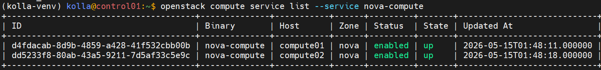
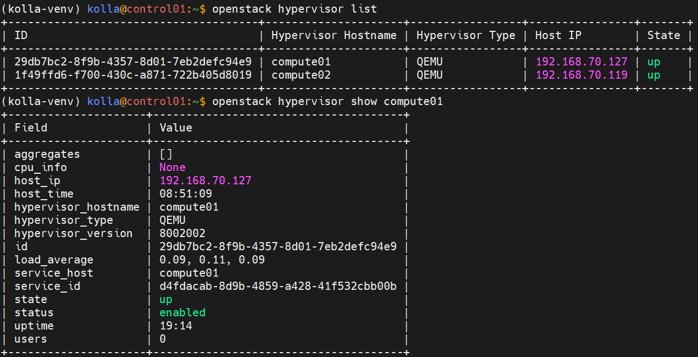

# Lab OPS Kolla Ansible
## 1. Verify 2 compute node đang hoạt động
- Lệnh source chỉ làm 1 lần duy nhất trong 1 phiên làm việc nếu đã làm rồi skip
```bash
source /etc/kolla/admin-openrc.sh

# Xem compute01 và compute02 đã register chưa
openstack compute service list --service nova-compute
```


- Xem hypervisor stats từng node
```bash
openstack hypervisor list
openstack hypervisor show compute01
```


## 2. Force VM lên từng node cụ thể
```bash
# Tạo VM trên compute01
openstack server create \
  --image cirros --flavor m1.tiny \
  --network demo-net \
  --availability-zone nova:compute01 \
  vm-on-compute01

# Tạo VM trên compute02
openstack server create \
  --image cirros --flavor m1.tiny \
  --network demo-net \
  --availability-zone nova:compute02 \
  vm-on-compute02

# Verify VM đang chạy ở đúng node
openstack server list --long | grep -E "vm-on|Host"
```
Confirm bằng SSH vào từng compute node:
```bash
ssh kolla@compute01 'sudo docker exec nova_compute virsh list'
ssh kolla@compute02 'sudo docker exec nova_compute virsh list'
```