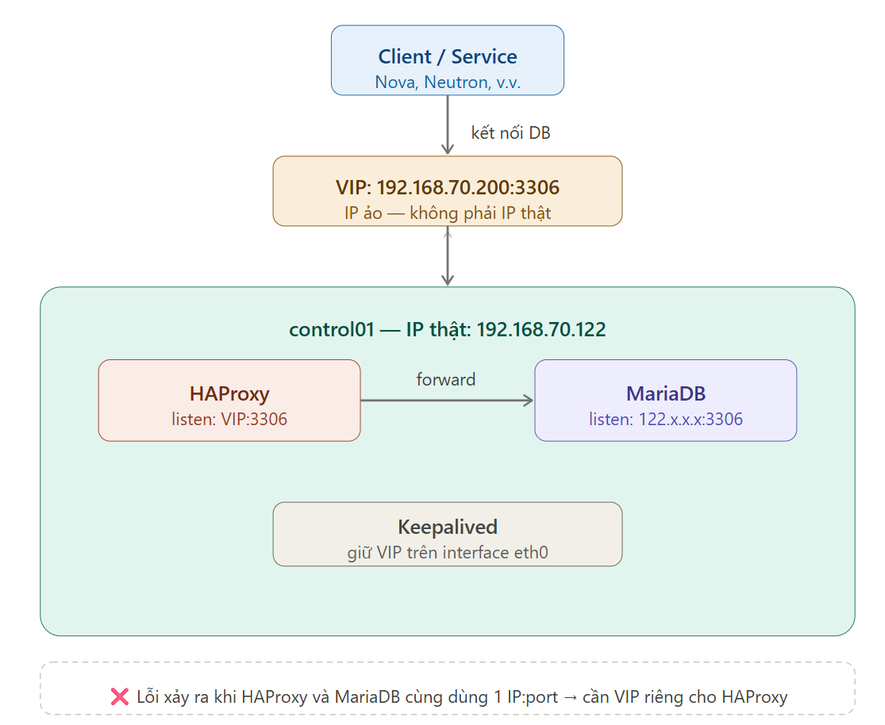
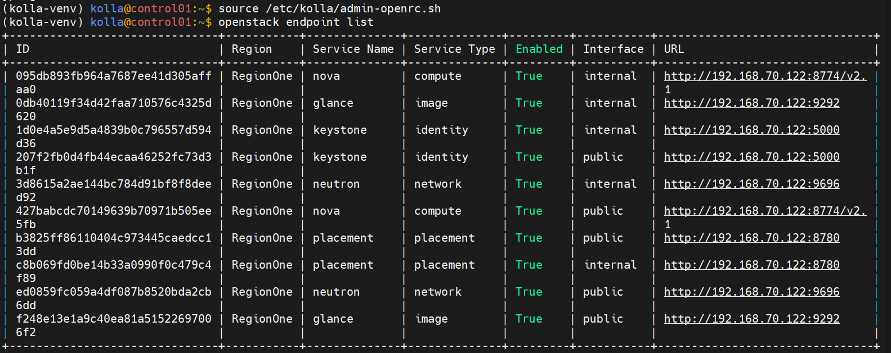
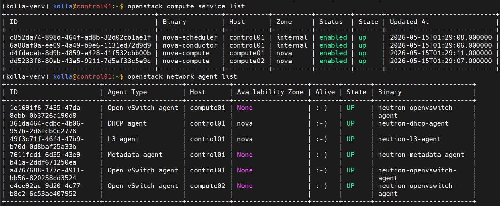
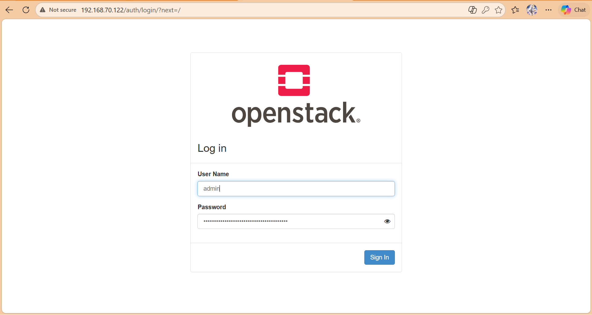
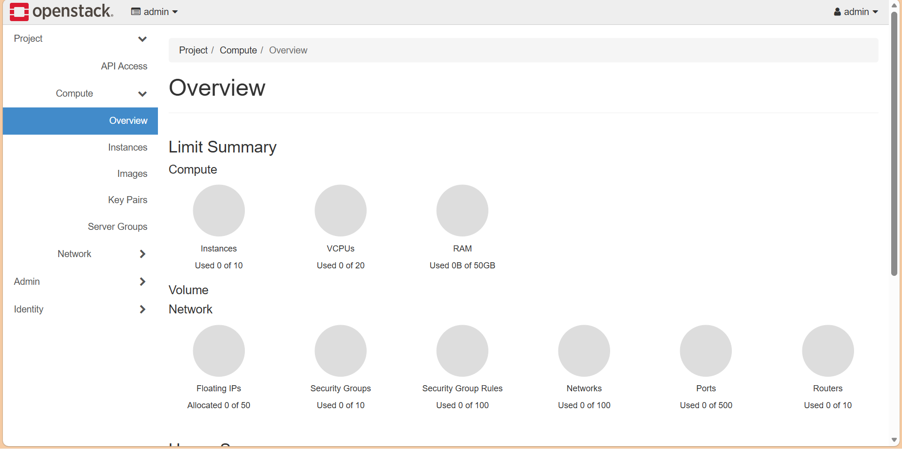
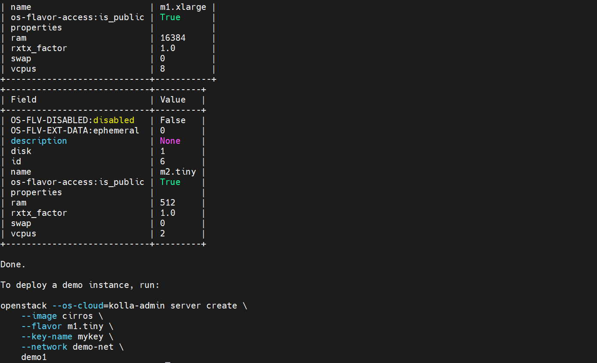
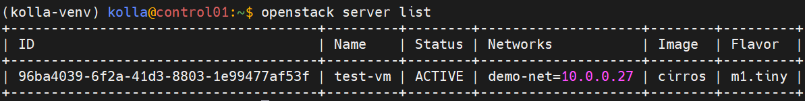
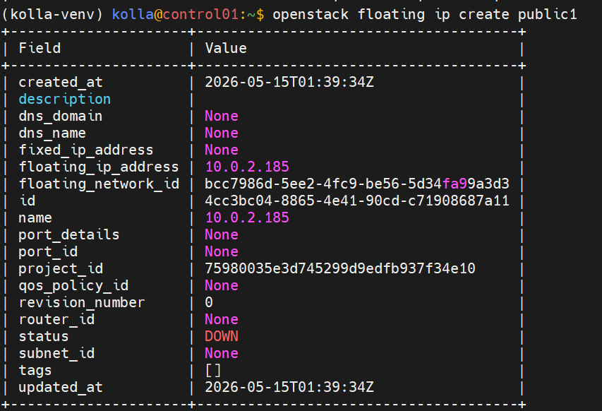
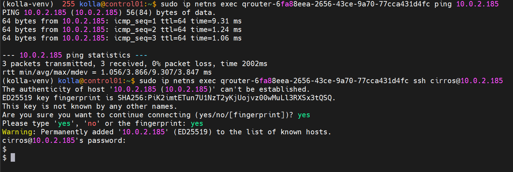

# Hướng dẫn deploy OpenStack Kolla-Ansible (Multinode Lab)

> **Môi trường target:** 3 VM nested trên OpenStack 
> - control01, compute01, compute02 — cùng subnet `192.168.70.0/24`
> - Mỗi node: 16GB RAM, 1 NIC (`eth0` DHCP)
> - OS: Ubuntu 24.04 LTS


> **Kiến trúc:**
> - `control01` = controller + network + storage + monitoring + deployment host
> - `compute01`, `compute02` = compute node
> - Provider NIC `eth1` = dummy interface (floating IP chỉ test trong cụm)
> - VIP = IP của control01 (Keepalived disabled)

- control01 = `192.168.70.122`
- compute01 = `192.168.70.127`
- compute02 = `192.168.70.119`

---

## Mục lục

1. [Chuẩn bị các node](#1-chuẩn-bị-các-node)
2. [Tạo dummy eth1 trên cả 3 node](#2-tạo-dummy-eth1-trên-cả-3-node)
3. [Cài Kolla-Ansible trên control01](#3-cài-kolla-ansible-trên-control01)
4. [Cấu hình inventory và globals.yml](#4-cấu-hình-inventory-và-globalsyml)
5. [Deploy cụm](#5-deploy-cụm)
6. [Verify và setup ban đầu](#6-verify-và-setup-ban-đầu)
7. [Vận hành và troubleshoot](#7-vận-hành-và-troubleshoot)

---

## 1. Chuẩn bị các node

> Chạy trên **TẤT CẢ 3 node** (control01, compute01, compute02)

### 1.1. Cập nhật và đặt hostname

Trên từng node:

```bash
sudo apt update && sudo apt upgrade -y
```

Đặt hostname cho từng node tương ứng:

```bash
# Trên control01
sudo hostnamectl set-hostname control01

# Trên compute01
sudo hostnamectl set-hostname compute01

# Trên compute02
sudo hostnamectl set-hostname compute02
```

### 1.2. Xác định IP của từng node

Trên mỗi node:

```bash
ip a
ip -br addr show eth0 # Đổi nếu khác NIC
```


### 1.3. Sửa `/etc/hosts` trên cả 3 node

```bash
sudo tee -a /etc/hosts <<EOF
192.168.70.122  control01
192.168.70.127  compute01
192.168.70.119  compute02
EOF
```

### 1.4. Tắt swap và UFW

```bash
sudo swapoff -a
sudo sed -i '/ swap / s/^/#/' /etc/fstab

sudo systemctl disable --now ufw || true
```

### 1.5. Cài và bật chrony (NTP)

```bash
sudo apt install -y chrony
sudo systemctl enable --now chrony
```

Verify clock đồng bộ:

```bash
chronyc tracking
```

`System time` offset phải < 100ms.

### 1.6. Tạo user `kolla`

```bash
sudo useradd -m -s /bin/bash kolla
sudo passwd kolla
echo "kolla ALL=(ALL) NOPASSWD: ALL" | sudo tee /etc/sudoers.d/kolla
sudo chmod 440 /etc/sudoers.d/kolla
```

---

## 2. Tạo dummy eth1 trên cả 3 node

Vì VM chỉ có 1 NIC và không được đụng eth0 (mất SSH), ta tạo dummy interface cho Neutron.

Trên **cả 3 node**:

```bash
sudo modprobe dummy
sudo ip link add eth1 type dummy
sudo ip link set eth1 up
```

Verify:

```bash
ip -br link show eth1
```

Phải thấy `eth1 UP` không IP.

### 2.1. Persist qua reboot

Trên **cả 3 node**:

```bash
# Load module dummy khi boot
echo "dummy" | sudo tee /etc/modules-load.d/dummy.conf

# Khai báo NIC
sudo tee /etc/systemd/network/10-eth1.netdev > /dev/null <<EOF
[NetDev]
Name=eth1
Kind=dummy
EOF

# Cấu hình (không gán IP, chỉ bật link)
sudo tee /etc/systemd/network/10-eth1.network > /dev/null <<EOF
[Match]
Name=eth1

[Network]
ConfigureWithoutCarrier=yes
LinkLocalAddressing=no
IPv6AcceptRA=no
EOF

# Bật systemd-networkd (chỉ enable, KHÔNG restart để tránh đụng eth0)
sudo systemctl enable systemd-networkd
```

> **Lưu ý:** Không chạy `systemctl restart systemd-networkd` ngay bây giờ — eth0 đang được netplan/cloud-init quản, restart có thể gây mất SSH.

---

## 3. Cài Kolla-Ansible trên control01

> **mọi lệnh chạy trên `control01`**.

### 3.1. Switch sang user kolla

```bash
sudo su - kolla
```

### 3.2. Tạo SSH key và phân phối

```bash
ssh-keygen -t rsa -b 4096 -N "" -f ~/.ssh/id_rsa

ssh-copy-id kolla@control01
ssh-copy-id kolla@compute01
ssh-copy-id kolla@compute02
```

Test SSH không cần password:

```bash
ssh compute01 hostname
ssh compute02 hostname
```

### 3.3. Cài dependencies

```bash
sudo apt install -y python3-dev libffi-dev gcc libssl-dev python3-venv git
```

### 3.4. Tạo Python virtualenv

```bash
python3 -m venv ~/kolla-venv
source ~/kolla-venv/bin/activate
pip install kolla-ansible
pip install -U pip
```

> Lần sau mở terminal mới, nhớ chạy lại `source ~/kolla-venv/bin/activate`.

### 3.5. Cài Ansible và Kolla-Ansible (release 2025.1 Epoxy)

```bash
pip install 'ansible-core>=2.16,<2.18'
pip install git+https://opendev.org/openstack/kolla-ansible@stable/2025.1
```

### 3.6. Tạo cấu trúc thư mục

```bash
sudo mkdir -p /etc/kolla
sudo chown $USER:$USER /etc/kolla

cp -r ~/kolla-venv/share/kolla-ansible/etc_examples/kolla/* /etc/kolla/
cp ~/kolla-venv/share/kolla-ansible/ansible/inventory/multinode ~/multinode
```

### 3.7. Cài Ansible Galaxy collections

```bash
kolla-ansible install-deps
```

---

## 4. Cấu hình inventory và globals.yml

### 4.1. Sửa file inventory `~/multinode`

Mở `~/multinode`, xoá nội dung mặc định và thay bằng:

```ini
[control]
control01 ansible_user=kolla ansible_become=true

[network]
control01 ansible_user=kolla ansible_become=true

[compute]
compute01 ansible_user=kolla ansible_become=true
compute02 ansible_user=kolla ansible_become=true

[monitoring]
control01 ansible_user=kolla ansible_become=true

[storage]
control01 ansible_user=kolla ansible_become=true

[deployment]
localhost       ansible_connection=local become=true

# === Các group dưới đây giữ NGUYÊN từ file mẫu ===
# (Đừng xoá phần dưới — chúng định nghĩa quan hệ kế thừa giữa các service)
```

Sau dòng cuối, **giữ nguyên** toàn bộ phần các group con như `[loadbalancer:children]`, `[mariadb:children]`, `[rabbitmq:children]`, v.v. từ file mẫu gốc.

> Nếu lỡ xoá rồi, copy lại từ:
> ```bash
> cp ~/kolla-venv/share/kolla-ansible/ansible/inventory/multinode ~/multinode
> ```
> rồi sửa lại phần đầu.

### 4.2. Test kết nối Ansible

```bash
cd ~
ansible -i multinode all -m ping
```

Cả 3 node phải trả về `"ping": "pong"`.

### 4.3. Sinh password tự động

```bash
kolla-genpwd
```

**Backup file `/etc/kolla/passwords.yml`** — nó chứa toàn bộ password của cụm:

```bash
cp /etc/kolla/passwords.yml ~/passwords.yml.backup
```

### 4.4. Cấu hình `/etc/kolla/globals.yml`

Mở file và sửa các tham số sau:

```bash
nano /etc/kolla/globals.yml
```

Nội dung cần có (uncomment hoặc thêm vào):

```yaml
# === Cơ bản ===
kolla_base_distro: "ubuntu"
openstack_release: "2025.1"

# === VIP và mạng ===
# và TẮT Keepalived (không HA failover, chấp nhận được cho lab)
kolla_internal_vip_address: "192.168.70.122"
enable_keepalived: "no"

network_interface: "eth0"
neutron_external_interface: "eth1"

# === TLS (lab thì tắt) ===
kolla_enable_tls_internal: "no"
kolla_enable_tls_external: "no"

# === Neutron ===
neutron_plugin_agent: "openvswitch"

# === Service cơ bản ===
enable_haproxy: "no"
enable_horizon: "yes"
enable_proxysql: "no"
enable_neutron_provider_networks: "yes"

# === Cinder tắt để tiết kiệm RAM ===
# Nếu sau này muốn bật, set "yes" và tạo VG cinder-volumes
enable_cinder: "no"

# === Các service nâng cao (mặc định no, bật sau khi quen) ===
enable_heat: "no"
enable_magnum: "no"
enable_octavia: "no"
```

- Nếu bạn đặt `kolla_internal_vip_address: "192.168.70.122"`
- Tắt HAproxy vì là lab đơn giản nếu bật nó bị xung đột port 3306 với Mariadb.



VIP = Virtual IP — IP ảo.
- IP thật là IP gắn liền với card mạng vật lý, máy tắt thì mất
- VIP là IP ảo được Keepalived tạo ra và "gắn thêm" lên card mạng, có thể di chuyển giữa các máy

Tại sao cần VIP?

Trong trường hợp của bạn chỉ có 1 node thì VIP có vẻ vô nghĩa, nhưng khi có 3 control nodes thì:
```bash
control01 (IP thật: .121)  ← đang giữ VIP .200 (master)
control02 (IP thật: .122)  ← standby
control03 (IP thật: .123)  ← standby
```
Nếu control01 chết → Keepalived tự động chuyển VIP .200 sang control02. Client không cần biết, cứ kết nối vào .200 như cũ.

### 4.5. Tối ưu cho RAM 12GB

Với 12GB RAM trên control01, MariaDB và RabbitMQ mặc định có thể ngốn nhiều. Tạo file override:

```bash
sudo mkdir -p /etc/kolla/config
sudo tee /etc/kolla/config/global.conf > /dev/null <<EOF
[DEFAULT]
debug = False
EOF
```

Mặc định Kolla đã cấu hình hợp lý cho 12GB, không cần can thiệp sâu hơn.

---

## 5. Deploy cụm

> Mọi lệnh chạy từ `~`, trong venv đã activate (`source ~/kolla-venv/bin/activate`).

### 5.1. Bootstrap servers
- Chạy lệnh này trên control01, 
- Vì control01 là:
  - deployment host
  - nơi cài Kolla-Ansible
  - nơi chạy Ansible
- Sau đó Ansible sẽ tự:
  - SSH sang compute01, compute02
  - dùng sudo
  - cài Docker
  - cấu hình kernel/modules
  - cài dependencies

trên các node compute.

```bash
cd ~
kolla-ansible bootstrap-servers -i multinode
```
### 5.2. Pre-deploy checks
```bash
kolla-ansible prechecks -i multinode
```
Bước này kiểm tra:
- Hostname resolve được
- NIC `eth0`, `eth1` tồn tại trên đúng node
- VIP chưa bị ai dùng (vì ta đặt VIP = IP control01 nên check này sẽ pass)
- RAM, disk, kernel modules đủ

**Nếu fail:** đọc kỹ message, sửa, chạy lại. Đừng chạy `deploy` khi prechecks chưa pass.

### 5.3. Pull Docker images

```bash
kolla-ansible pull -i multinode
```

Thời gian: ~15-30 phút tuỳ network. Bước này không bắt buộc nhưng giúp deploy sau đó nhanh hơn và phát hiện lỗi DNS/network sớm.

### 5.4. Deploy

```bash
kolla-ansible deploy -i multinode
```

Thời gian: ~30-60 phút. Bước này:

1. Cấu hình HAProxy bind VIP lên control01
2. Cài MariaDB + RabbitMQ + Memcached + etcd
3. Bootstrap Keystone → Glance → Nova → Neutron → Horizon
4. Cấu hình compute service trên compute01/02

**Theo dõi tiến trình:** Ansible sẽ in từng task. Nếu treo lâu (>5 phút) ở 1 task, mở terminal khác kiểm tra:

```bash
ssh control01 'sudo docker ps -a | head -20'
```
- Nếu bị lỗi, chỉ cần fix lỗi đó rồi:
```bash
kolla-ansible deploy -i multinode
```
lại là thành công, nếu tiếp tục bị lỗi hoặc lỗi quá nhiều, chuyển xuống bước cuối cùng fix lại
### 5.5. Post-deploy

```bash
kolla-ansible post-deploy -i multinode
```

File credentials được tạo tại `/etc/kolla/admin-openrc.sh`.

---

## 6. Verify và setup ban đầu

### 6.1. Cài OpenStack CLI

```bash
pip install python-openstackclient python-heatclient python-octaviaclient
```

### 6.2. Load credentials và test

```bash
source /etc/kolla/admin-openrc.sh

openstack endpoint list
openstack compute service list
openstack network agent list
```

- Endpoint list: phải có ~20 dòng
- Compute service: `nova-conductor`, `nova-scheduler`, `nova-compute@compute01`, `nova-compute@compute02` đều `up`/`enabled`
- Network agent: `Open vSwitch agent`, `DHCP agent`, `L3 agent`, `Metadata agent` đều `:-)` (alive)





### 6.3. Truy cập Horizon

Từ máy của bạn (cần có route tới `192.168.70.122`):

```
http://192.168.70.122
```

Login:
- **Username:** `admin`
- **Password:** lấy bằng `grep keystone_admin_password /etc/kolla/passwords.yml`
- **Domain:** `default`




### 6.4. Tạo môi trường demo bằng init-runonce

```bash
cp ~/kolla-venv/share/kolla-ansible/init-runonce ~/init-runonce
nano ~/init-runonce
```

Sửa phần network để khớp với mạng giả lập của bạn:

```bash
EXT_NET_CIDR='10.99.0.0/24'
EXT_NET_RANGE='start=10.99.0.100,end=10.99.0.200'
EXT_NET_GATEWAY='10.99.0.1'
```

Trong mặc định:
```bash
EXT_NET_CIDR=${EXT_NET_CIDR:-'10.0.2.0/24'}
EXT_NET_RANGE=${EXT_NET_RANGE:-'start=10.0.2.150,end=10.0.2.199'}
EXT_NET_GATEWAY=${EXT_NET_GATEWAY:-'10.0.2.1'}
```
- Nếu biến `EXT_NET_CIDR` đã tồn tại → dùng giá trị hiện tại của nó.(Để mặc định cx được)

> Vì `eth1` là dummy, "external network" này là ảo, không ra Internet thật được. Chọn subnet bất kỳ không trùng với subnet thật của công ty (`192.168.70.0/24`).

Chạy:

```bash
bash ~/init-runonce
```

Script tạo: image Cirros, flavor m1.tiny → m1.large, demo project, demo network + router, keypair, security group.



### 6.5. Tạo VM test

```bash
source /etc/kolla/admin-openrc.sh

openstack server create \
  --image cirros \
  --flavor m1.tiny \
  --network demo-net \
  --key-name mykey \
  --security-group default \
  test-vm

openstack server list
```

Kết quả:
```bash
+-------------------------------------+------------------------------------------------------------------------------------------+
| Field                               | Value                                                                                    |
+-------------------------------------+------------------------------------------------------------------------------------------+
| OS-DCF:diskConfig                   | MANUAL                                                                                   |
| OS-EXT-AZ:availability_zone         | None                                                                                     |
| OS-EXT-SRV-ATTR:host                | None                                                                                     |
| OS-EXT-SRV-ATTR:hostname            | test-vm                                                                                  |
| OS-EXT-SRV-ATTR:hypervisor_hostname | None                                                                                     |
| OS-EXT-SRV-ATTR:instance_name       | None                                                                                     |
| OS-EXT-SRV-ATTR:kernel_id           | None                                                                                     |
| OS-EXT-SRV-ATTR:launch_index        | None                                                                                     |
| OS-EXT-SRV-ATTR:ramdisk_id          | None                                                                                     |
| OS-EXT-SRV-ATTR:reservation_id      | r-s2vnghj7                                                                               |
| OS-EXT-SRV-ATTR:root_device_name    | None                                                                                     |
| OS-EXT-SRV-ATTR:user_data           | None                                                                                     |
| OS-EXT-STS:power_state              | N/A                                                                                      |
| OS-EXT-STS:task_state               | scheduling                                                                               |
| OS-EXT-STS:vm_state                 | building                                                                                 |
| OS-SRV-USG:launched_at              | None                                                                                     |
| OS-SRV-USG:terminated_at            | None                                                                                     |
| accessIPv4                          | None                                                                                     |
| accessIPv6                          | None                                                                                     |
| addresses                           | N/A                                                                                      |
| adminPass                           | tcimFFPkCE5V                                                                             |
| config_drive                        | None                                                                                     |
| created                             | 2026-05-15T01:37:52Z                                                                     |
| description                         | None                                                                                     |
| flavor                              | description=, disk='1', ephemeral='0', , id='m1.tiny', is_disabled=, is_public='True',   |
|                                     | location=, name='m1.tiny', original_name='m1.tiny', ram='512', rxtx_factor=, swap='0',   |
|                                     | vcpus='1'                                                                                |
| hostId                              | None                                                                                     |
| host_status                         | None                                                                                     |
| id                                  | 96ba4039-6f2a-41d3-8803-1e99477af53f                                                     |
| image                               | cirros (99922c58-4387-4f97-b869-f0c0ffd28254)                                            |
| key_name                            | mykey                                                                                    |
| locked                              | None                                                                                     |
| locked_reason                       | None                                                                                     |
| name                                | test-vm                                                                                  |
| pinned_availability_zone            | None                                                                                     |
| progress                            | None                                                                                     |
| project_id                          | 75980035e3d745299d9edfb937f34e10                                                         |
| properties                          | None                                                                                     |
| scheduler_hints                     |                                                                                          |
| security_groups                     | name='d1fb4bbd-d17c-48d6-953f-3a89b040aebc'                                              |
| server_groups                       | None                                                                                     |
| status                              | BUILD                                                                                    |
| tags                                |                                                                                          |
| trusted_image_certificates          | None                                                                                     |
| updated                             | 2026-05-15T01:37:53Z                                                                     |
| user_id                             | dcba7d5d580243618719efedee4b5771                                                         |
| volumes_attached                    |                                                                                          |
+-------------------------------------+------------------------------------------------------------------------------------------+
```



Đợi VM `ACTIVE`, sau đó:

```bash
# Tạo floating IP
openstack floating ip create public1

# Gán vào VM (thay <FIP> bằng IP vừa tạo)
openstack server add floating ip test-vm <FIP>
```

Test SSH từ control01:

- Lưu ý: IP `10.0.2.185` là floating IP từ external network `10.0.2.0/24` — mạng này là ảo hoàn toàn vì eth1 là **dummy interface**, không có route thật ra ngoài.

```bash
control01 (eth0: 192.168.70.122)
    └─ ping 10.0.2.185  ← không biết đi đâu
                           vì 10.0.2.0/24 chỉ tồn tại trong Neutron
                           không có route từ host ra mạng đó
```
- Phải SSH từ bên trong namespace của Neutron router, không phải từ host:
```bash
# Xem router namespace
sudo ip netns list
# Output kiểu: qrouter-xxxxxx-xxxx-xxxx-xxxx-xxxxxxxxxxxx

# Ping từ trong namespace
sudo ip netns exec qrouter-<id> ping 10.0.2.185

# SSH từ trong namespace
sudo ip netns exec qrouter-<id> ssh -i ~/.ssh/id_rsa cirros@10.0.2.185
```

```bash
sudo ip netns exec qrouter-6fa88eea-2656-43ce-9a70-77cca431d4fc ping 10.0.2.185
sudo ip netns exec qrouter-6fa88eea-2656-43ce-9a70-77cca431d4fc ssh cirros@10.0.2.185
# Password Cirros mặc định: gocubsgo
```






---

## 7. Vận hành và troubleshoot

### 7.1. Lệnh hữu ích hằng ngày

| Việc | Lệnh |
|------|------|
| Xem container 1 service | `sudo docker ps \| grep neutron` |
| Xem log container | `sudo docker logs -f nova_compute` |
| Restart 1 service | `sudo docker restart neutron_server` |
| Reconfig sau khi sửa globals.yml | `kolla-ansible reconfigure -i multinode` |
| Reconfig 1 service cụ thể | `kolla-ansible reconfigure -i multinode -t nova` |
| Backup DB MariaDB | `kolla-ansible mariadb_backup -i multinode` |
| Stop toàn cụm | `kolla-ansible stop -i multinode --yes-i-really-really-mean-it` |
| Destroy cụm | `kolla-ansible destroy -i multinode --yes-i-really-really-mean-it` |

### 7.2. Thêm compute node mới sau này

```bash
# Sửa inventory thêm compute03
# Rồi chạy:
kolla-ansible bootstrap-servers -i multinode --limit compute03
kolla-ansible deploy -i multinode --limit compute03
```

### 7.3. Lỗi thường gặp

**`prechecks` báo VIP đang dùng:**
- Bình thường vì ta đặt VIP = IP control01. Kolla-Ansible nhận diện được trường hợp này, prechecks vẫn pass.

**MariaDB restart liên tục:**
- Check clock skew: `ansible -i multinode all -m shell -a "chronyc tracking | grep offset"`
- Offset > 100ms → cluster bootstrap fail. Cài lại chrony, đợi sync xong mới deploy lại.

**`deploy` treat ở task `ks-register`:**
- Keystone chưa sẵn sàng. Check: `sudo docker logs keystone` trên control01
- Thường do MariaDB chưa lên kịp. Đợi 5 phút rồi rerun: `kolla-ansible deploy -i multinode`

**VM tạo được nhưng không có IP:**
- Kiểm tra DHCP agent: `openstack network agent list | grep DHCP`
- Check log: `sudo docker logs neutron_dhcp_agent`

**SSH vào VM bằng floating IP không được:**
- Security group chặn. Thêm rule:
  ```bash
  openstack security group rule create --proto icmp default
  openstack security group rule create --proto tcp --dst-port 22 default
  ```

**Compute node không đăng ký vào cụm:**
- Check libvirt và nova_compute:
  ```bash
  ssh compute01 'sudo docker logs nova_compute | tail -50'
  ```
- Thường do thiếu KVM nested. Verify trên compute:
  ```bash
  ssh compute01 'cat /sys/module/kvm_intel/parameters/nested'
  ```
  Nếu không có `Y` → OpenStack công ty không cho nested KVM. Workaround: trong `globals.yml` thêm `nova_compute_virt_type: "qemu"` rồi `kolla-ansible reconfigure -i multinode -t nova`.

### 7.4. Bật Cinder sau khi đã quen (tuỳ chọn)
1. Trên control01, tạo loopback device làm storage:
   ```bash
   sudo dd if=/dev/zero of=/var/lib/cinder-volumes.img bs=1M count=10240
   sudo losetup /dev/loop0 /var/lib/cinder-volumes.img
   sudo pvcreate /dev/loop0
   sudo vgcreate cinder-volumes /dev/loop0
   ```

2. Sửa `globals.yml`:
   ```yaml
   enable_cinder: "yes"
   enable_cinder_backend_lvm: "yes"
   cinder_volume_group: "cinder-volumes"
   ```

3. Reconfigure:
   ```bash
   kolla-ansible deploy -i multinode -t cinder
   ```

---

## 8. Tài liệu tham khảo

- Kolla-Ansible official docs: https://docs.openstack.org/kolla-ansible/latest/
- Quickstart: https://docs.openstack.org/kolla-ansible/latest/user/quickstart.html
- Globals reference: https://docs.openstack.org/kolla-ansible/latest/admin/deployment-philosophy.html


## 9. Nếu bị lỗi không thể fix được
- Trường hợp nhẹ
```bash
# Xóa hết container cũ
sudo docker stop $(sudo docker ps -aq)
sudo docker rm $(sudo docker ps -aq)

# Kiểm tra sạch chưa
sudo ss -tlnp | grep -E "3306|5672|15672"

# Deploy lại
kolla-ansible deploy -i ~/multinode
```

```bash
sudo su -
```
- Xóa sạch tất cả:
```bash
# Xóa hết docker containers, volumes, images
sudo docker stop $(sudo docker ps -aq)
sudo docker rm $(sudo docker ps -aq)
docker volume prune -f
docker image prune -af
docker network prune -f

# Xóa config kolla
rm -rf /etc/kolla

# Xóa home kolla
rm -rf /home/kolla/kolla-venv

# Xóa user kolla luôn
userdel -r kolla 2>/dev/null

# Xóa kolla-ansible system-wide nếu có
pip3 uninstall kolla-ansible -y 2>/dev/null
```

- Tạo lại User kolla:
```bash
useradd -m -s /bin/bash kolla
echo "kolla ALL=(ALL) NOPASSWD:ALL" >> /etc/sudoers.d/kolla
usermod -aG docker kolla
```
- Làm lại y hệt như trên