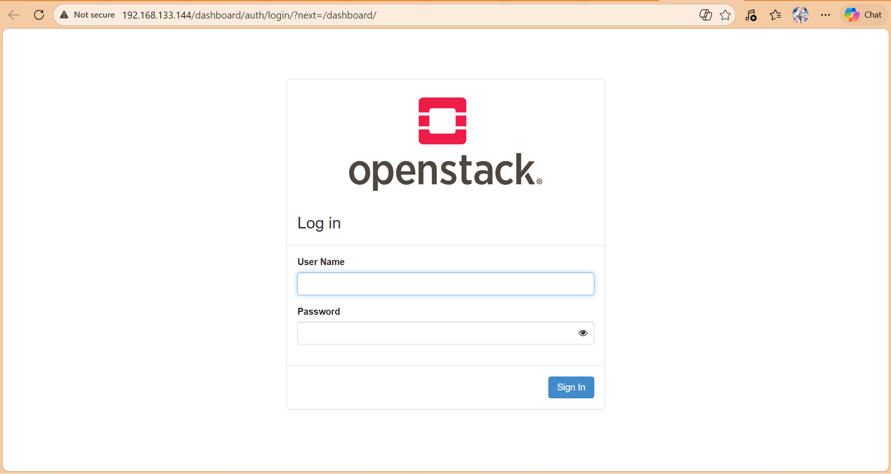
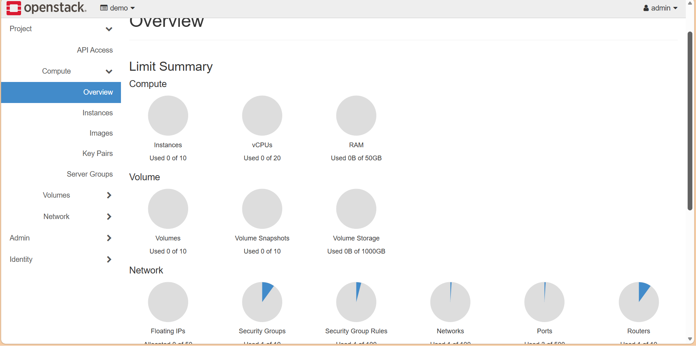
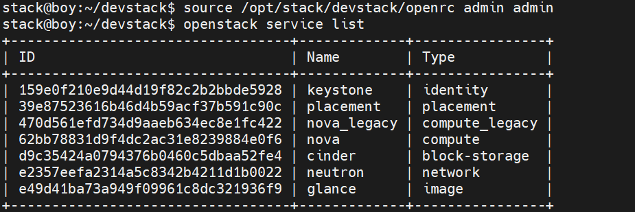
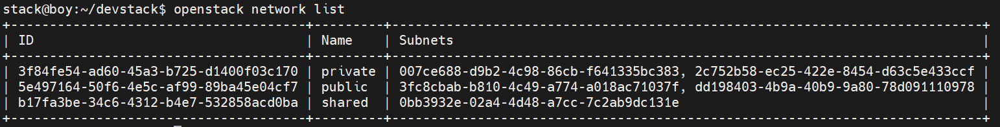

# Install OpenStack DevStack
Dưới đây là hướng dẫn đầy đủ để cài đặt OpenStack All-in-One bằng DevStack trên Ubuntu 24.04.---

## Yêu cầu hệ thống

Trước khi bắt đầu, máy chủ cần đáp ứng:

- **OS**: Ubuntu 24.04 LTS (fresh install)
- **RAM**: tối thiểu 8GB (khuyến nghị 16GB)
- **CPU**: 4 nhân trở lên (hỗ trợ ảo hóa)
- **Disk**: tối thiểu 60GB
- **Network**: có kết nối internet

---

## Bước 1 — Cập nhật hệ thống

```bash
sudo apt update && sudo apt upgrade -y
sudo apt install -y git curl
```

---

## Bước 2 — Tạo user `stack`

DevStack **không chạy được với root**. Cần tạo một user riêng:

```bash
sudo useradd -s /bin/bash -d /opt/stack -m stack
sudo passwd stack

# Cấp quyền sudo không cần mật khẩu
echo "stack ALL=(ALL) NOPASSWD: ALL" | sudo tee /etc/sudoers.d/stack
sudo chmod +x /opt/stack

# Chuyển sang user stack
sudo su - stack
```

### Nếu bị lỗi ở bước 2
```bash
stack@openstack1:~$ sudo su - stack 
: command not found -bash: /opt/stack/.profile: line 10: syntax error: unexpected end of file
```
- Check: `cat /opt/stack/.profile`
```bash
# ~/.profile: executed by Bourne-compatible login shells.^M$
^M$
if [ "$BASH" ]; then^M$
  if [ -f ~/.bashrc ]; then^M$
    . ~/.bashrc^M$
  fi^M$
fi^M$
^M$
```
- File .profile của bạn đang ở `Windows format (CRLF)` thay vì `Linux (LF)`.
- Sửa:
```bash
for f in /opt/stack/.*; do
  [ -f "$f" ] && sed -i 's/\r$//' "$f"
done
```
Comment luôn dòng: `# mesg n || true`
---

## Bước 3 — Clone DevStack

```bash
git clone https://opendev.org/openstack/devstack /opt/stack/devstack
cd /opt/stack/devstack
git branch -r
git checkout stable/2025.2
```

> Lưu ý bản 2026 chưa được test cho Ubuntu 22 đổ xuống.

---

## Bước 4 — Tạo file `local.conf`

Đây là bước quan trọng nhất. Tạo file cấu hình tối thiểu: (Tạo mẫu xem trước)
```bash
cp samples/local.conf local.conf
```
```bash
cat > /opt/stack/devstack/local.conf << 'EOF'
[[local|localrc]]

HOST_IP=192.168.133.144     # IP management của node DevStack

ADMIN_PASSWORD=secret      # Password đăng nhập Horizon
DATABASE_PASSWORD=secret  # Password MariaDB
RABBIT_PASSWORD=secret     # Password RabbitMQ
SERVICE_PASSWORD=secet      # password các service OpenStack

LOGFILE=$DEST/logs/stack.sh.log # Direct cho file log
LOGDAYS=2

ENABLED_SERVICES+=,key,n-api,n-crt,n-obj,n-cpu,n-cond,n-sch,n-cauth,placement-api,placement-client  # Add Service

enable_plugin senlin https://opendev.org/openstack/senlin
enable_plugin senlin-dashboard https://opendev.org/openstack/senlin-dashboard
enable_service sl-api
enable_service sl-eng       # Add senlin

enable_service horizon      # Enable dashboard Horizon
EOF
```

---

## Bước 4.1 Bổ sung trước để tránh bị 1 vài lỗi
- Option - Chỉ làm theo bước này nếu lần đầu tiên cài bị lỗi
- Bình thường khi điền `.\stack.sh` là nó tự chạy cho nhưng 1 vài trường hợp database ban authentication by password - nên check trước khi đề phòng lỗi.
- Tương tự với RabbitMQ
- Nếu không phải máy Openstack trên cty thì skip bước này vì máy tạo mới và Database thường không ban password khi vừa tải về.
```bash
sudo apt install mysql-server -y
sudo mysql
```
```mysql
ALTER USER 'root'@'localhost' IDENTIFIED BY 'secret';
FLUSH PRIVILEGES;
EXIT;
```
```bash
sudo systemctl restart mysql
```
- Test : `mysql -u root -p` -> Vào được bằng mật khẩu là oke (tránh bị tình trạng Mysql ban Password)
```bash
sudo apt install rabbitmq-server -y
sudo systemctl enable rabbitmq-server
sudo systemctl start rabbitmq-server
```
```bash
sudo rabbitmqctl add_user openstack secret
```
```bash
sudo rabbitmqctl set_permissions openstack ".*" ".*" ".*"
sudo rabbitmqctl delete_user guest
sudo rabbitmqctl list_users
```

## Bước 5 — Chạy DevStack

```bash
cd /opt/stack/devstack
./stack.sh
```

Quá trình này mất **30–90 phút** tùy tốc độ mạng và phần cứng. DevStack sẽ tự động tải và cài đặt toàn bộ các thành phần OpenStack.

Khi thành công, bạn sẽ thấy thông báo:
```bash
This is your host IP address: 192.168.133.144
This is your host IPv6 address: ::1
Horizon is now available at http://192.168.133.144/dashboard
Keystone is serving at http://192.168.133.144/identity/
The default users are: admin and demo
The password: secret

Services are running under systemd unit files.
For more information see:
https://docs.openstack.org/devstack/latest/systemd.html

DevStack Version: 2025.2
Change: acb00279457e658c31664b7fea140d3b8a64d65f Drop openstack-*-node-bionic nodeset definitions 2026-02-18 09:07:01 +0100
OS Version: Ubuntu 22.04 jammy
```


---


## Bước 6 — Truy cập Horizon Dashboard

Mở trình duyệt và vào: `http://<HOST_IP>/dashboard`



- **Domain**: `Default`
- **Username**: `admin`
- **Password**: `secret` (hoặc giá trị `ADMIN_PASSWORD` bạn đặt)



---

## Sử dụng OpenStack CLI

```bash
# Load biến môi trường
source /opt/stack/devstack/openrc admin admin

# Kiểm tra các service đang chạy
openstack service list

# Kiểm tra compute
openstack compute service list



# Kiểm tra network
openstack network list
```


---

## Xử lý lỗi thường gặp

**Lỗi "stack.sh failed"** — xem log chi tiết:
```bash
tail -100 /opt/stack/logs/stack.sh.log
```

- Ví dụ cách đọc:
```bash
stack@op1:~$ tail -n 50 /opt/stack/logs/stack.sh.log
2026-04-15 02:24:28.236 | +./stack.sh:echo_summary:468               [[ True != \T\r\u\e ]]
2026-04-15 02:24:28.254 | +./stack.sh:echo_summary:474               echo -e Configuring placement
2026-04-15 02:24:28.274 | +./stack.sh:main:1246                      async_runfunc init_placement
2026-04-15 02:24:28.295 | +inc/async:async_runfunc:116               async_run init_placement init_placement
2026-04-15 02:24:28.529 | +inc/async:async_inner:63                  init_placement
2026-04-15 02:24:28.620 | [32436 Async init_placement:100603]: running: init_placement
2026-04-15 02:24:28.644 | +./stack.sh:main:1250                      async_wait init_neutron
2026-04-15 02:24:28.846 | [32436 Async init_neutron:100063]: Waiting for completion of init_neutron running on PID 100063 (5 other jobs running)
2026-04-15 02:24:28.917 | [32436 Async init_neutron:100063]: Signaling child to exit
2026-04-15 02:33:37.239 | +inc/async:async_inner:64                  rc=0
2026-04-15 02:33:37.314 | [93589 Async init_glance:93589]: finished successfully
2026-04-15 02:34:16.959 | +inc/async:async_inner:64                  rc=0
2026-04-15 02:34:17.002 | [100410 Async init_cinder:100410]: finished successfully
```
- BỊ TREO 100% (không còn chạy nữa)
- Log dừng hẳn tại dòng cuối
- Không có log mới, không có bước tiếp theo.
- Kẹt ở đoạn init_placement
- Gặp lỗi này phải chạy lại từ đầu 

**Chạy lại sau khi lỗi** — dọn dẹp trước:
```bash
cd /opt/stack/devstack
./unstack.sh
./stack.sh
./clean.sh
```

**Lỗi thiếu RAM** — kiểm tra và tắt service không cần thiết, hoặc thêm swap:
```bash
sudo fallocate -l 8G /swapfile
sudo chmod 600 /swapfile
sudo mkswap /swapfile
sudo swapon /swapfile
```

**Sau khi reboot** — DevStack không tự khởi động lại, cần chạy lại:
```bash
cd /opt/stack/devstack
./rejoin-stack.sh
```


