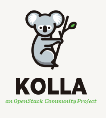

# Tìm hiểu về Kolla-Ansible



## I. Kolla-Ansible là gì?

Trước khi hiểu Kolla-Ansible, cần hiểu vấn đề nó giải quyết.

### Vấn đề khi cài OpenStack thủ công

OpenStack không phải 1 phần mềm — nó là **tập hợp 15+ service** (Nova, Neutron, Keystone, Glance, Cinder...), mỗi service lại có nhiều process con. Để cài thủ công bạn phải:

- Cài đúng version từng package trên từng node
- Cấu hình hàng trăm file config (nova.conf, neutron.conf, keystone.conf...)
- Đảm bảo các service "nói chuyện" được với nhau qua đúng địa chỉ
- Làm lại toàn bộ nếu có node mới

Với 3 node làm thủ công mất vài ngày và dễ lỗi. Với 100 node trong production → gần như không thể.

### Kolla-Ansible giải quyết bằng cách nào?

Kolla-Ansible = **Kolla** + **Ansible**

```
Kolla      = đóng gói từng OpenStack service thành Docker container
Ansible    = tự động hóa việc deploy các container đó lên nhiều node
```

Nói đơn giản:
- **Kolla** lo phần "cái gì" — chuẩn bị sẵn Docker image cho từng service
- **Ansible** lo phần "làm thế nào và ở đâu" — SSH vào từng node, kéo image về, chạy container, cấu hình

Kết quả: bạn chỉ cần sửa 2 file config (`globals.yml` và `inventory`), rồi chạy 1 lệnh → Ansible tự làm tất cả.

---

## II. Tại sao dùng Docker Container?

Đây là điểm khác biệt lớn nhất của Kolla-Ansible so với cài thủ công.

### Mỗi service = 1 container độc lập

```
┌─────────────────────────────────────────┐
│              control01 (host)           │
│                                         │
│  ┌──────────┐  ┌──────────┐  ┌───────┐  │
│  │ keystone │  │  nova_   │  │neutron│  │
│  │          │  │   api    │  │_server│  │
│  └──────────┘  └──────────┘  └───────┘  │
│                                         │
│  ┌──────────┐  ┌──────────┐  ┌───────┐  │
│  │ mariadb  │  │rabbitmq  │  │glance │  │
│  │          │  │          │  │  _api │  │
│  └──────────┘  └──────────┘  └───────┘  │
└─────────────────────────────────────────┘
```

Lợi ích:
- **Cô lập**: service này crash không kéo service khác theo
- **Đồng nhất**: image được build sẵn, chạy ở đâu cũng giống nhau
- **Dễ restart**: `docker restart nova_api` — xong, không cần quan tâm process
- **Dễ upgrade**: pull image mới → restart container → xong
- **Dễ debug**: `docker logs nova_compute` thay vì đi tìm log file

---

## III. Kiến trúc tổng thể Kolla-Ansible

### 3.1 Các thành phần chính

```
┌─────────────────────────────────────────────────────┐
│                   Kolla-Ansible                     │
│                                                     │
│  ┌─────────────┐    ┌──────────────┐                │
│  │  globals.yml│    │  inventory   │                │
│  │  (cấu hình) │    │  (node nào   │                │
│  │             │    │   làm gì)    │                │
│  └──────┬──────┘    └──────┬───────┘                │
│         │                  │                        │
│         └────────┬─────────┘                        │
│                  ▼                                  │
│          ┌───────────────┐                          │
│          │  Ansible      │                          │
│          │  Playbooks    │  ← "kịch bản" deploy     │
│          └───────┬───────┘                          │
│                  │ SSH                              │
└──────────────────┼──────────────────────────────────┘
                   │
        ┌──────────┼──────────┐
        ▼          ▼          ▼
   control01   compute01  compute02
   (kéo image, (kéo image, (kéo image,
   chạy        chạy        chạy
   container)  container)  container)
```

### 3.2 File cấu hình quan trọng

| File | Vai trò | Ví dụ |
|------|---------|-------|
| `globals.yml` | Cấu hình toàn cụm | VIP, NIC, service nào bật |
| `inventory` (multinode) | Node nào làm vai trò gì | control01 = controller |
| `passwords.yml` | Toàn bộ password | Tự sinh bằng `kolla-genpwd` |
| `/etc/kolla/config/` | Override config từng service | Tùy chỉnh nova.conf, neutron.conf |

---

## IV. Inventory — "Ai làm gì?"

Inventory là file khai báo **node nào đảm nhận vai trò nào** trong cụm OpenStack.

### 4.1 Các role trong Kolla-Ansible

| Role | Chạy service gì | Trong lab  |
|------|----------------|-------------------|
| `control` | Keystone, Nova API, Neutron server, Glance, Horizon, MariaDB, RabbitMQ | control01 |
| `network` | Neutron L3 agent, DHCP agent, Metadata agent | control01 |
| `compute` | Nova compute, Libvirt, OVS agent | compute01, compute02 |
| `storage` | Cinder volume (nếu bật) | control01 |
| `monitoring` | Prometheus, Grafana (nếu bật) | control01 |
| `deployment` | Node chạy Ansible | localhost (control01) |

### 4.2 File inventory cấu hình trong lab

```ini
[control]
control01 ansible_user=kolla ansible_become=true

[network]
control01 ansible_user=kolla ansible_become=true

[compute]
compute01 ansible_user=kolla ansible_become=true
compute02 ansible_user=kolla ansible_become=true

[monitoring]
control01 ansible_user=kolla ansible_become=true

[storage]
control01 ansible_user=kolla ansible_become=true

[deployment]
localhost ansible_connection=local become=true
```

**Giải thích:**
- `ansible_user=kolla` → Ansible SSH vào bằng user kolla
- `ansible_become=true` → dùng sudo khi cần
- `ansible_connection=local` → không SSH, chạy trực tiếp tại chỗ

---

## V. globals.yml — "Cấu hình toàn cụm"

`globals.yml` là file quan trọng nhất, quyết định cụm OpenStack của bạn trông như thế nào.

### 5.1 Các tham số cốt lõi

#### Network interfaces

```yaml
network_interface: "eth0"
neutron_external_interface: "eth1"
```

```
eth0  → Internal network: các service nói chuyện với nhau
        API endpoints, MariaDB, RabbitMQ, Management traffic
        
eth1  → External network: Neutron dùng để làm provider network
        Floating IP traffic
        (Trong lab = dummy interface: Interface rỗng ảo không ra ngoài Internet được)
```

#### VIP (Virtual IP)

```yaml
kolla_internal_vip_address: "192.168.70.122"
enable_keepalived: "no"
```

VIP là địa chỉ IP mà tất cả client kết nối vào. Trong production với nhiều controller node, VIP sẽ di chuyển tự động khi 1 node chết (do Keepalived). Trong lab 1 controller thì VIP = IP thật của control01.

```
Production (3 controllers):
  Client → VIP (192.168.70.200) ←── Keepalived tự chuyển nếu node chết
                ↓
    control01 / control02 / control03

Lab (1 controller):
  Client → VIP (192.168.70.122) = IP thật của control01
  enable_keepalived: "no"  ← không cần HA
```

#### Bật/tắt service

```yaml
enable_haproxy: "no"        # Load balancer — tắt vì lab 1 controller
enable_horizon: "yes"       # Web dashboard
enable_neutron_provider_networks: "yes"  # Floating IP
enable_cinder: "no"         # Block storage — tắt để tiết kiệm RAM
enable_heat: "no"           # Orchestration
enable_octavia: "no"        # Load Balancer as a Service
```

---

## VI. Luồng deploy — Kolla-Ansible làm gì khi bạn gõ lệnh?

### 6.1 Tổng quan các bước

```
bootstrap-servers → prechecks → pull → deploy → post-deploy
```

### 6.2 Chi tiết từng bước

#### `kolla-ansible bootstrap-servers`

Ansible SSH vào **tất cả node**, cài:
- Docker Engine
- Python dependencies
- Kernel modules cần thiết (br_netfilter, ip_vs...)
- Cấu hình Docker để dùng được với Kolla

```
control01  ← cài Docker, kernel modules
compute01  ← cài Docker, kernel modules
compute02  ← cài Docker, kernel modules
```

#### `kolla-ansible prechecks`

Kiểm tra điều kiện trước khi deploy:
- Hostname có resolve được không
- `eth0`, `eth1` có tồn tại trên đúng node không
- VIP có bị ai dùng chưa
- RAM, disk có đủ không
- Docker đã cài chưa
- NTP clock có đồng bộ không (offset < 100ms)

**Không pass prechecks → không deploy.**

#### `kolla-ansible pull`

Kéo Docker image từ Docker Hub về từng node. Mỗi service = 1 image riêng:

```
control01 kéo về:
  kolla/ubuntu-source-keystone:2025.1
  kolla/ubuntu-source-nova-api:2025.1
  kolla/ubuntu-source-neutron-server:2025.1
  kolla/ubuntu-source-mariadb:2025.1
  kolla/ubuntu-source-rabbitmq:2025.1
  ... (20+ images)

compute01, compute02 kéo về:
  kolla/ubuntu-source-nova-compute:2025.1
  kolla/ubuntu-source-neutron-openvswitch-agent:2025.1
  kolla/ubuntu-source-libvirtd:2025.1
```

#### `kolla-ansible deploy`

Đây là bước chính. Ansible làm theo thứ tự:

```
Bước 1: Infrastructure services
  → MariaDB cluster (database cho tất cả service)
  → RabbitMQ cluster (message queue)
  → Memcached (caching)

Bước 2: Identity
  → Keystone (xác thực)
  → Tạo service accounts, endpoints trong Keystone

Bước 3: Image
  → Glance API + Registry

Bước 4: Compute
  → Nova API, Scheduler, Conductor (trên control01)
  → Nova Compute + Libvirt (trên compute01, compute02)

Bước 5: Network
  → Neutron Server (trên control01)
  → OVS Agent (trên tất cả node)
  → L3 Agent, DHCP Agent, Metadata Agent (trên control01)

Bước 6: Dashboard
  → Horizon

Bước 7: Cấu hình kết nối giữa các service
  → Register endpoints vào Keystone
  → Cấu hình nova để dùng neutron
  → Cấu hình glance để nova lấy image
```

#### `kolla-ansible post-deploy`

Tạo file `/etc/kolla/admin-openrc.sh` chứa credentials để dùng OpenStack CLI.

---

## VII. Kiến trúc network trong Kolla-Ansible
### 7.1 Hai loại network

```
┌─────────────────────────────────────────────────────────┐
│                      eth0 (Management Network)          │
│                      192.168.70.0/24                    │
│                                                         │
│   control01 ←────────────────→ compute01, compute02    │
│   (.122)         API calls,        (.127)  (.119)       │
│                  DB queries,                            │
│                  RabbitMQ msgs,                         │
│                  VXLAN tunnels                          │
└─────────────────────────────────────────────────────────┘

┌─────────────────────────────────────────────────────────┐
│                      eth1 (Provider/External Network)   │
│                      (dummy interface — lab)            │
│                                                         │
│   Neutron dùng để tạo Floating IP, External network    │
│   Trong lab: eth1 là dummy, không có traffic thật       │
│   Chỉ reachable từ trong Neutron namespace              │
└─────────────────────────────────────────────────────────┘
```

### 7.2 Neutron tạo mạng ảo như thế nào?

```
VM (cirros)
  │
  │ tap device (virtual NIC của VM)
  │
  ▼
br-int compute (Integration Bridge — OVS)
  │
  │ VXLAN tunnel qua eth0
  │
  ▼
br-int trên network node (control01)
  │
  ▼
qrouter namespace (Neutron router)
  │ NAT / Floating IP
  │
  ▼
br-ex (External Bridge — OVS)
  │
  ▼
eth1 (provider interface)
```

- Mô tả: Gói tin đi từ VM trên 1 Compute01, Nó đi qua tap interface (card mạng ảo của VM) tới Switch ảo OVS br-int (hiểu đơn giản như VM trong KVM khi đi ra host cũng cần phải đi qua switch vật lý), tại đây là bước truyền VXLAN tunnel giữa Compute tới Control node, Tại control node switch vật lý chuyển gói tin lên qrouter, tại đây NAT hoặc Floating IP rồi đưa gói tin lên OVS ra Internet (br-ex) và ra card mạng thật eth1 provider interface.

Đây là lý do SSH phải đi qua namespace:
```bash
# Không được (host không biết 10.0.2.x ở đâu)
ping 10.0.2.185

# Phải vào namespace — nơi "biết" đường đi của floating IP
sudo ip netns exec qrouter-xxxx ping 10.0.2.185
```

#### Tap Interface
- Virtual ethernet cable: `VM NIC <----cáp mạng ảo----> Host Linux`

#### br-int
- Integration Bridge: là switch ảo của Open vSwitch, nó hoạt động giống Switch thật.
- `tap-vm1`,`tap-vm2`, `vxlan123`, `qr-xxx` đều cắm vào `br-int` 


### 7.3 VXLAN tunnel giữa các compute node

Đây là thứ cho phép VM trên compute01 ping được VM trên compute02:

```
VM-A (compute01)                    VM-B (compute02)
     │                                    │
     │ tap                                │ tap
     ▼                                    ▼
  br-int                              br-int
     │                                    │
     │ VXLAN tunnel qua eth0              │ VXLAN tunnel qua eth0
     │ (192.168.70.127 → 192.168.70.119)  │
     └────────────────────────────────────┘
           eth0 (management network)
```

VM không biết điều này — với VM, nó chỉ thấy mình đang trong mạng `demo-net` 10.0.0.0/24.
- Mô tả: Truyền giữa compute với compute chỉ cần VXLAN tunnel không cần sự can thiệp của Controller, gói tin vẫn đi từ VM ra switch trung gian giữa host và VM rồi VXLAN qua Compute khác.
---

## VIII. Container nào chạy ở đâu?

### 8.1 Trên control01

```
Infrastructure:
  mariadb              ← Database cho tất cả service
  rabbitmq             ← Message queue
  memcached            ← Cache (token, etc.)

Identity:
  keystone             ← Xác thực

Image:
  glance_api           ← Image service

Compute (control plane):
  nova_api             ← Nhận API request tạo VM
  nova_scheduler       ← Chọn node nào chạy VM
  nova_conductor       ← Trung gian giữa compute và DB
  nova_consoleauth     ← VNC console auth
  nova_novncproxy      ← VNC proxy

Network (control + network node):
  neutron_server       ← Neutron API
  neutron_l3_agent     ← Router, NAT, Floating IP
  neutron_dhcp_agent   ← Cấp IP cho VM
  neutron_metadata_agent ← 169.254.169.254 metadata
  openvswitch_db       ← OVS database
  openvswitch_vswitchd ← OVS switch daemon

Dashboard:
  horizon              ← Web UI
```

### 8.2 Trên compute01 và compute02

```
Compute (data plane):
  nova_compute         ← Tạo/quản lý VM thật sự
  nova_libvirt         ← Giao tiếp với KVM/QEMU

Network (data plane):
  neutron_openvswitch_agent ← OVS agent, quản lý br-int
  openvswitch_db
  openvswitch_vswitchd
```

---

## IX. Luồng tạo 1 VM — từ lệnh đến VM chạy

Khi bạn chạy `openstack server create`, đây là điều xảy ra:

```
User
  │ openstack server create --image cirros --flavor m1.tiny
  ▼
nova_api (control01)
  │ Verify token với Keystone
  │ Lưu VM record vào MariaDB (status: BUILD)
  │ Gửi message vào RabbitMQ
  ▼
nova_scheduler (control01)
  │ Đọc message từ RabbitMQ
  │ Query hypervisor stats: compute01 có X RAM, compute02 có Y RAM
  │ Chọn node phù hợp (ví dụ: compute01)
  │ Gửi message vào RabbitMQ
  ▼
nova_compute (compute01)
  │ Đọc message từ RabbitMQ
  │ Lấy image từ Glance
  │ Yêu cầu Neutron tạo port (IP cho VM)
  │ Gọi libvirt → KVM/QEMU tạo VM
  │ Update status vào MariaDB qua nova_conductor: ACTIVE
  ▼
VM cirros đang chạy trên compute01
```

**Key insight:** Nova không tự chạy VM — nó điều phối thông qua message queue (RabbitMQ), libvirt mới là thứ thực sự gọi KVM.

---

## X. Kolla-Ansible vs cài thủ công — bảng so sánh

| | Cài thủ công | Kolla-Ansible |
|---|---|---|
| Thời gian (3 node) | 2-5 ngày | 2-4 giờ |
| Độ phức tạp | Rất cao | Trung bình |
| Upgrade | Nguy hiểm, dễ lỗi | `kolla-ansible upgrade` |
| Thêm node | Cài lại từ đầu | `--limit compute03` |
| Rollback | Gần như không thể | Destroy + deploy lại |
| Debug | Tìm log file khắp nơi | `docker logs <container>` |
| Tái lập | Không ổn định | Idempotent (chạy lại = kết quả giống nhau) |

---

## XI. Các lệnh Kolla-Ansible và ý nghĩa

```bash
# Chuẩn bị node (cài Docker, kernel modules)
kolla-ansible bootstrap-servers -i multinode

# Kiểm tra điều kiện
kolla-ansible prechecks -i multinode

# Kéo Docker image
kolla-ansible pull -i multinode

# Deploy toàn bộ
kolla-ansible deploy -i multinode

# Tạo admin-openrc.sh
kolla-ansible post-deploy -i multinode

# Áp dụng thay đổi config (không deploy lại từ đầu)
kolla-ansible reconfigure -i multinode

# Reconfigure chỉ 1 service
kolla-ansible reconfigure -i multinode -t nova

# Upgrade lên version mới
kolla-ansible upgrade -i multinode

# Dừng toàn bộ container
kolla-ansible stop -i multinode --yes-i-really-really-mean-it

# Xóa sạch (container + config)
kolla-ansible destroy -i multinode --yes-i-really-really-mean-it
```

**`-i multinode`** = dùng file inventory `multinode`

**`-t nova`** = chỉ chạy tasks có tag `nova` (tương đương chỉ deploy nova)

---

## XII. Debugging trong Kolla-Ansible

### 12.1 Nguyên tắc

Khi có lỗi, đọc theo thứ tự:

```
1. Ansible output (lỗi task nào?)
      ↓
2. docker logs <container> (container đó báo gì?)
      ↓
3. docker exec -it <container> bash (vào trong xem config)
```

### 12.2 Lệnh debug thường dùng

```bash
# Xem tất cả container và trạng thái
sudo docker ps -a

# Xem log 1 container
sudo docker logs -f nova_compute

# Vào trong container
sudo docker exec -it keystone bash

# Xem file config bên trong container
sudo docker exec keystone cat /etc/keystone/keystone.conf

# Restart 1 service
sudo docker restart neutron_server

# Xem resource usage
sudo docker stats
```

### 12.3 Lỗi hay gặp và nguyên nhân

| Lỗi | Nguyên nhân | Fix |
|-----|-------------|-----|
| MariaDB không start | Clock skew > 100ms | Sync NTP, chạy lại deploy |
| prechecks fail VIP | VIP bị dùng | Bình thường nếu VIP = IP control01 |
| nova_compute không register | Không có KVM nested | Thêm `nova_compute_virt_type: "qemu"` |
| VM không có IP | DHCP agent lỗi | `docker logs neutron_dhcp_agent` |
| SSH floating IP không được | Phải dùng namespace | `sudo ip netns exec qrouter-xxx ssh ...` |
| Deploy treo ở keystone | MariaDB chưa sẵn sàng | Đợi 5 phút, chạy lại deploy |

---

## XIII. Tóm tắt — Mental model để nhớ

```
Kolla-Ansible = "Chef tự động nấu OpenStack"

globals.yml  = công thức (dùng nguyên liệu gì, nấu kiểu nào)
inventory    = phân công (ai làm gì)
Ansible      = đầu bếp (thực hiện theo công thức)
Docker image = nguyên liệu đã sơ chế sẵn (không cần cài từ đầu)
Container    = từng món ăn (mỗi service = 1 container)
```

```
OpenStack sau khi deploy = tập hợp các container đang chạy
  + cấu hình được inject vào container qua volume mount
  + giao tiếp nhau qua RabbitMQ và direct API call
  + tất cả xác thực qua Keystone
```

**Khi có lỗi:** đừng nghĩ "OpenStack lỗi" — nghĩ "container nào đang unhealthy?" rồi `docker logs` container đó.

## XIII Giải thích Docker
### 1. Tại sao không cần Docker Compose?

Docker Compose là tool để bạn **tự viết** file `docker-compose.yml` rồi chạy. Bạn phải tự định nghĩa từng container, network, volume...

Kolla-Ansible **không dùng Compose** vì nó có thứ mạnh hơn — **Ansible Playbooks**.

```
Docker Compose:
  Bạn viết docker-compose.yml
  → docker compose up
  → container chạy

Kolla-Ansible:
  Kolla team đã viết sẵn toàn bộ Ansible playbooks
  → bạn chỉ sửa globals.yml + inventory
  → kolla-ansible deploy
  → Ansible tự gọi docker run với đúng tham số cho từng container
```

Ansible làm được nhiều hơn Compose:
- SSH vào **nhiều node** cùng lúc
- Chạy theo **thứ tự phụ thuộc** (MariaDB phải lên trước Keystone)
- **Idempotent** — chạy lại không bị lỗi
- Inject config vào container theo từng môi trường

---

### 2. Chạy 1 lệnh deploy autogen containers

Khi bạn gõ:
```bash
kolla-ansible deploy -i multinode
```

Bên dưới nó chạy **Ansible playbook** — cụ thể là file `site.yml` trong source code Kolla-Ansible. File đó gọi lần lượt các role:

```
site.yml
  → role: mariadb      → ansible chạy task: docker run mariadb container
  → role: rabbitmq     → ansible chạy task: docker run rabbitmq container
  → role: keystone     → ansible chạy task: docker run keystone container
  → role: glance       → ansible chạy task: docker run glance_api container
  → role: nova         → ansible chạy task: docker run nova_api container
                                             docker run nova_scheduler container
                                             docker run nova_conductor container
                                             docker run nova_compute container (compute node)
  → role: neutron      → ansible chạy task: docker run neutron_server container
                                             docker run neutron_l3_agent container
                                             ...
  → role: horizon      → ansible chạy task: docker run horizon container
```

Mỗi "task" trong Ansible thực chất là gọi lệnh `docker run` với đúng tham số — image nào, volume nào, network nào, env variable nào.

---

### Hình dung đơn giản nhất

```
kolla-ansible deploy
        │
        │ chạy
        ▼
    site.yml  (playbook tổng)
        │
        ├── gọi role mariadb
        │       └── task: docker run kolla/mariadb ... trên control01
        │
        ├── gọi role keystone
        │       └── task: docker run kolla/keystone ... trên control01
        │
        ├── gọi role nova
        │       ├── task: docker run kolla/nova-api ... trên control01
        │       ├── task: docker run kolla/nova-scheduler ... trên control01
        │       └── task: docker run kolla/nova-compute ... trên compute01, compute02
        │
        └── ... (15+ role khác)
```

Bạn không cần viết gì cả — toàn bộ playbook + role đó Kolla team đã viết sẵn, bạn chỉ **cung cấp biến** qua `globals.yml` để Ansible điền vào đúng chỗ.

---

### Tóm gọn

| | Docker Compose | Kolla-Ansible |
|---|---|---|
| Ai viết config? | Bạn tự viết | Kolla team viết sẵn |
| Chạy nhiều node? | Không | Có, SSH song song |
| Thứ tự phụ thuộc? | Cơ bản | Phức tạp, đúng thứ tự |
| Bạn cần làm gì? | Viết docker-compose.yml | Sửa globals.yml + inventory |
| Kết quả | Container chạy trên 1 máy | Container chạy đúng node, đúng cấu hình |

Nói cách khác: **Kolla-Ansible = Docker Compose siêu cấp, chạy trên nhiều máy, đã được viết sẵn cho OpenStack.**