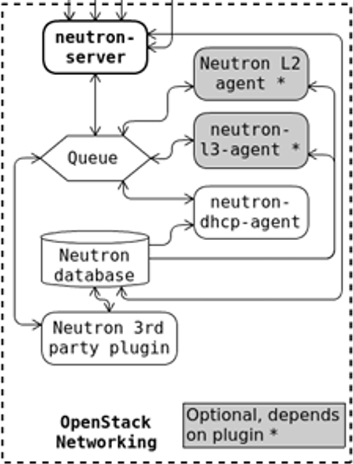

# Tổng quan về Neutron - OpenStack Networking

## 1. Khái niệm

OpenStack Neutron là một dự án cung cấp dịch vụ "Networking as a Service" (NaaS) trong hệ sinh thái OpenStack. Nó cho phép người dùng tự định nghĩa và quản lý hệ thống mạng ảo (SDN - Software Defined Networking) một cách linh hoạt mà không cần can thiệp trực tiếp vào thiết bị phần cứng.

OpenStack Networking cho phép bạn tạo và quản lý các network objects ví dụ như **networks, subnets, và ports** cho các services khác của OpenStack sử dụng. Với kiến trúc **pluggable**, các plug-in có thể được sử dụng để triển khai các thiết bị và phần mềm khác nhau, nó khiến OpenStack có tính linh hoạt trong kiến trúc và triển khai.

Dịch vụ Networking trong OpenStack (Neutron) cung cấp API cho phép bạn định nghĩa các kết nối mạng và gán địa chỉ ở trong môi trường cloud. Nó cũng cho phép các nhà khai thác vận hành các công nghệ networking khác nhau cho phù hợp với mô hình điện toán đám mây của riêng họ. Neutron cũng cung cấp API cho việc cấu hình và quản lý các dịch vụ networking khác nhau từ L3 forwarding, NAT cho tới load balancing, perimeter firewalls, và virtual private networks.

OpenStack là mô hình **multitenancy** — mỗi tenant có thể tạo riêng nhiều private network, router, firewall, loadbalancer… Neutron có khả năng tách biệt các tài nguyên mạng giữa các tenant bằng giải pháp **Linux namespace**. Mỗi network namespace riêng cho phép tạo các route, firewall rule, interface device riêng. Mỗi network hay router do tenant tạo ra đều hiện hữu dưới dạng một network namespace, từ đó các tenant có thể tạo các network trùng nhau (overlapping) nhưng vẫn độc lập mà không bị xung đột (isolated).

## 2. Các thành phần của Neutron




## 2.1 Neutron Server

Neutron Server là thành phần trung tâm của dịch vụ OpenStack Networking (Neutron), chịu trách nhiệm cung cấp các RESTful API cho người dùng và các dịch vụ OpenStack khác (Nova, Horizon, CLI) để quản lý tài nguyên mạng.

Neutron Server đóng vai trò là điểm vào (entry point) của mọi yêu cầu liên quan đến mạng và là thành phần duy nhất được phép truy cập cơ sở dữ liệu Neutron. Mọi thao tác tạo, sửa đổi hoặc xóa tài nguyên mạng đều phải thông qua Neutron Server.

Thông thường, Neutron Server được triển khai trên các Controller Node.

### Các chức năng chính

**Layer 2 Networking (L2)**

* Tạo và quản lý Network.
* Hỗ trợ nhiều công nghệ mạng như VLAN, VXLAN, Geneve, GRE và Flat Network.
* Quản lý Port để kết nối máy ảo vào mạng.

**IP Address Management (IPAM)**

* Tự động cấp phát địa chỉ IP cho các Port.
* Quản lý Subnet và dải địa chỉ IP.
* Tránh trùng lặp địa chỉ IP trong toàn hệ thống.
* Hỗ trợ DHCP thông qua DHCP Agent hoặc OVN Native DHCP.

**Layer 3 Networking (L3)**

* Tạo và quản lý Virtual Router.
* Định tuyến giữa các mạng Layer 2.
* Kết nối mạng nội bộ với External Network.
* Hỗ trợ SNAT, DNAT và Floating IP.

**Security và Network Extensions**

* Security Group (Firewall Layer 4).
* QoS (Quality of Service).
* Trunk Port.
* Port Binding.
* Các Extension mở rộng tính năng mạng.

Ngoài việc cung cấp API, Neutron Server còn thực hiện xác thực dữ liệu đầu vào, kiểm tra quota, kiểm tra tính hợp lệ của cấu hình mạng và đồng bộ trạng thái tài nguyên trong cơ sở dữ liệu.

---

## 2.2 ML2 Plugin và Mechanism Drivers

Neutron được thiết kế theo kiến trúc plugin để có thể hỗ trợ nhiều công nghệ mạng khác nhau.

Hiện nay, thành phần cốt lõi được sử dụng phổ biến nhất là **ML2 (Modular Layer 2) Plugin**.

ML2 đóng vai trò như một framework cho phép nhiều công nghệ mạng và nhiều backend mạng cùng tồn tại trong một hệ thống OpenStack.

### Type Drivers

Type Driver chịu trách nhiệm quản lý loại mạng được sử dụng:

* VLAN
* VXLAN
* Geneve
* GRE
* Flat Network

Type Driver quyết định cách Network được biểu diễn ở tầng truyền dẫn.

### Mechanism Drivers

Mechanism Driver chịu trách nhiệm ánh xạ các tài nguyên mạng trong Neutron thành cấu hình thực tế trên backend networking.

Một số Mechanism Driver phổ biến:

* Open vSwitch (OVS)
* OVN (Open Virtual Network)
* Linux Bridge
* Cisco Drivers
* VMware NSX Drivers
* Arista Drivers
* Juniper Drivers

Khi người dùng tạo một Network hoặc Port, Neutron Server sẽ gọi ML2 Plugin, sau đó ML2 Plugin sẽ sử dụng Mechanism Driver phù hợp để xác định cách triển khai tài nguyên mạng trên hạ tầng thực tế.

### Các backend phổ biến

**Open vSwitch (OVS)**

* Switch ảo phổ biến trong môi trường KVM.
* Hoạt động cùng OVS Agent.
* Sử dụng RabbitMQ để nhận các thay đổi cấu hình từ Neutron Server.

**OVN (Open Virtual Network)**

* Là kiến trúc mạng hiện đại được xây dựng trên Open vSwitch.
* Cung cấp khả năng điều khiển tập trung thông qua OVN Northbound và Southbound Database.
* Giảm sự phụ thuộc vào các Agent truyền thống.
* Được xem là giải pháp mặc định cho nhiều triển khai OpenStack hiện nay.

**Linux Bridge**

* Sử dụng Linux Bridge có sẵn trong nhân Linux.
* Triển khai đơn giản nhưng khả năng mở rộng hạn chế.
* Hiện ít được sử dụng trong các hệ thống OpenStack quy mô lớn.

---

## 2.3 Message Queue (RabbitMQ)

RabbitMQ là hệ thống truyền thông bất đồng bộ được sử dụng rộng rãi trong OpenStack.

Trong Neutron, RabbitMQ đóng vai trò trung gian truyền tải các thông điệp RPC giữa Neutron Server và các Agent chạy trên Compute Node hoặc Network Node.

### Cơ chế hoạt động

Neutron Server không trực tiếp cấu hình các thiết bị mạng trên từng Node.

Thay vào đó:

1. Người dùng gửi yêu cầu tới Neutron API.
2. Neutron Server cập nhật trạng thái vào Database.
3. Neutron Server gửi thông điệp RPC thông qua RabbitMQ.
4. Các Agent nhận thông điệp và thực hiện cấu hình thực tế trên Node.

Ví dụ:

```text
User
 ↓
Neutron Server
 ↓
RabbitMQ
 ↓
OVS Agent
 ↓
Open vSwitch
```

RabbitMQ hỗ trợ:

* Message Queue.
* RPC (Remote Procedure Call).
* Cơ chế xác nhận (Acknowledgement).
* Đảm bảo thông điệp không bị mất khi Agent tạm thời mất kết nối.

Lưu ý rằng trong kiến trúc OVN hiện đại, việc phân phối trạng thái mạng chủ yếu được thực hiện thông qua OVN Northbound/Southbound Database thay vì RabbitMQ như mô hình OVS Agent truyền thống.

---

## 2.4 Neutron Agents và Các Thành Phần Phụ Trợ

Trong kiến trúc Neutron truyền thống, các Agent chịu trách nhiệm áp dụng cấu hình mạng xuống hạ tầng thực tế.

### OVS Agent

* Chạy trên Compute Node.
* Quản lý Open vSwitch.
* Tạo Bridge, Port và Flow.
* Kết nối máy ảo vào các mạng VXLAN, VLAN hoặc Geneve.

### DHCP Agent

* Quản lý dịch vụ DHCP.
* Thường sử dụng dnsmasq để cấp phát IP động cho máy ảo.
* Tự động cập nhật cấu hình DHCP khi Network hoặc Subnet thay đổi.

### L3 Agent

* Quản lý Virtual Router.
* Thực hiện định tuyến giữa các Network.
* Cung cấp SNAT và Floating IP.
* Quản lý các Linux Network Namespace.

Trong kiến trúc OVN, phần lớn chức năng của L3 Agent được thay thế bởi OVN Logical Router.

### Metadata Agent

Metadata Agent là cầu nối giữa máy ảo và Nova Metadata Service.

Khi máy ảo gửi yêu cầu tới địa chỉ:

```text
169.254.169.254
```

Metadata Agent sẽ:

1. Xác định VM đang gửi yêu cầu.
2. Chuyển tiếp yêu cầu tới nova-api-metadata.
3. Nhận kết quả và trả lại cho máy ảo.

Thông qua Metadata Service, máy ảo có thể nhận:

* Hostname.
* Instance ID.
* SSH Public Key.
* User Data.
* Cloud-init Configuration.

Nếu Metadata Service không hoạt động, máy ảo vẫn có thể khởi động nhưng thường không nhận được SSH Key hoặc các cấu hình cloud-init ban đầu.

---

## 2.5 Service Plugins

Ngoài các chức năng mạng cơ bản, Neutron còn hỗ trợ Service Plugin để cung cấp các dịch vụ mạng nâng cao.

Một số Service Plugin phổ biến:

* Octavia (Load Balancer as a Service - LBaaS).
* FWaaS (Firewall as a Service).
* VPNaaS (VPN as a Service).

Các Service Plugin mở rộng khả năng của Neutron mà không làm thay đổi kiến trúc lõi của hệ thống.

---

### Tổng kết

Neutron là dịch vụ Networking của OpenStack, cung cấp mô hình Network as a Service (NaaS). Neutron Server đóng vai trò điều khiển trung tâm, ML2 Plugin và Mechanism Driver chịu trách nhiệm ánh xạ tài nguyên mạng xuống backend thực tế, trong khi các Agent hoặc OVN thực hiện cấu hình mạng trên Compute Node và Network Node. Kiến trúc hiện đại đang dần chuyển từ mô hình nhiều Agent truyền thống sang OVN nhằm tăng khả năng mở rộng, hiệu năng và tính ổn định của hạ tầng đám mây.


## 3. Phân loại Network

Trong hệ sinh thái OpenStack, Neutron cung cấp khả năng kết nối mạng ảo hóa. OpenStack Compute (Nova) là "khách hàng" chính của Neutron, sử dụng các cổng (ports) để gắn kết các máy ảo (VM/Instances) vào hạ tầng mạng. Neutron hỗ trợ đa dự án (Multi-tenancy), cho phép mỗi Project sở hữu các dải IP riêng biệt mà không lo bị xung đột với Project khác nhờ công nghệ cách ly mạng (Network Isolation).

### 3.1 Provider Networks (Mạng nhà cung cấp)


- **Bản chất**: Là các mạng ảo Layer 2 được ánh xạ trực tiếp (1:1) tới các phân đoạn mạng vật lý của trung tâm dữ liệu.
- **Đặc điểm**: Thường sử dụng VLAN (802.1q) để tách biệt lưu lượng. Quản trị viên (Admin) là người duy nhất có quyền cấu hình loại mạng này vì nó liên quan trực tiếp đến switch vật lý.
- **Ưu điểm**: Hiệu năng cao do giảm bớt các lớp đóng gói (encapsulation), độ trễ thấp.
- **Hạn chế**: Thiếu tính linh hoạt cho người dùng cuối (User không tự tạo được), phụ thuộc vào cấu hình hạ tầng cứng.
- **Xu hướng 2026**: Hỗ trợ mạnh mẽ cho các workload cần hiệu năng cực cao như AI/Machine Learning thông qua SR-IOV và Hardware Offloading.

### 3.2 Routed Provider Networks

- Routed provider networks cung cấp kết nối ở layer 3 cho các máy ảo. Các phân đoạn L2 của mạng này được gắn với các gateway định tuyến sẵn có ở tầng vật lý.
- Cụ thể hơn, các layer-2 segments của provider network sẽ được gán các router gateway giúp chúng có thể được định tuyến ra bên ngoài — thực chất Networking service không cung cấp khả năng định tuyến.
- Routed provider networks tất nhiên sẽ có hiệu suất thấp hơn so với provider networks.
- **Điểm mới**: Giúp mở rộng quy mô mạng vượt qua giới hạn của một broadcast domain đơn lẻ, phù hợp cho các hạ tầng Data Center lớn (Edge Computing).

### 3.3 Self-Service Networks (Mạng tự phục vụ / Project Network)


- **Bản chất**: Là các mạng ảo hoàn toàn (Overlay Networks) do người dùng (Tenant/Project) tự tạo ra và quản lý.
- **Công nghệ đóng gói**: Sử dụng VXLAN, GRE, hoặc tiêu chuẩn mới nhất là **Geneve** (được dùng mặc định trong OVN). Các giao thức này cho phép tạo ra hàng triệu mạng ảo trên nền hạ tầng IP vật lý mà không bị giới hạn 4096 VLAN.
- **Kết nối**: Sử dụng các Virtual Router để thực hiện NAT (với IPv4) hoặc định tuyến trực tiếp (với IPv6) để đi ra mạng ngoài (Public Internet).
- Với IPv4, self-service networks thường sử dụng dải mạng riêng và tương tác với provider networks thông qua cơ chế NAT trên router ảo. Floating IP sẽ cho phép kết nối tới máy ảo thông qua địa chỉ NAT trên router ảo. Trong khi đó, IPv6 self-service networks lại sử dụng dải IP public và tương tác với provider networks bằng giao thức định tuyến tĩnh qua router ảo.
- Trái ngược lại với provider networks, self-service networks buộc phải đi qua layer-3 agent. Vì thế việc gặp sự cố ở một node có thể ảnh hưởng tới rất nhiều các máy ảo sử dụng chúng.

### 3.4 Các công nghệ Layer 2 thường dùng

Các user có thể tạo các project networks cho các kết nối bên trong project. Mặc định thì các kết nối này là riêng biệt và không được chia sẻ giữa các project. OpenStack Networking hỗ trợ các công nghệ dưới đây cho project network:

**FLAT**

Tất cả các instances nằm trong cùng một mạng, và có thể chia sẻ với hosts. Không hề sử dụng VLAN tagging hay hình thức tách biệt về network khác.

**VLAN**

Kiểu này cho phép các user tạo nhiều provider hoặc project network sử dụng VLAN IDs (chuẩn 802.1Q tagged) tương ứng với VLANs trong mạng vật lý. Điều này cho phép các instances giao tiếp với nhau trong môi trường cloud. Chúng có thể giao tiếp với servers, firewalls, load balancers vật lý và các hạ tầng network khác trên cùng một VLAN layer 2. Giới hạn 4096 VLAN.

**GRE và VXLAN**

VXLAN và GRE là các giao thức đóng gói tạo nên overlay networks để kích hoạt và kiểm soát việc truyền thông giữa các máy ảo (instances). Một router được yêu cầu để cho phép lưu lượng đi ra luồng bên ngoài tenant network GRE hoặc VXLAN. Router cũng có thể yêu cầu để kết nối một tenant network với mạng bên ngoài (ví dụ Internet). Router cung cấp khả năng kết nối tới instances trực tiếp từ mạng bên ngoài sử dụng các địa chỉ floating IP.

**Geneve (Generic Network Virtualization Encapsulation)**

Tiêu chuẩn mới nhất, mặc định trong OVN. Linh hoạt hơn VXLAN: header dài hơn, hỗ trợ TLV options → mang được metadata của OVN (ACL info, port info) giữa các node. Khuyến nghị dùng cho mọi deployment mới từ 2024+.


| Công nghệ | VLAN tag | Overlay | Scale (số network) | Khi dùng |
|---|---|---|---|---|
| FLAT | ❌ | ❌ | 1 | Lab |
| VLAN | ✅ (802.1Q) | ❌ | 4096 | Hardware-aware |
| VXLAN | ❌ | ✅ (UDP/4789) | 16M (VNI 24-bit) | Overlay phổ thông |
| GRE | ❌ | ✅ (IP proto 47) | 32-bit key | Overlay cũ |
| Geneve | ❌ | ✅ (UDP/6081) | 16M + TLV options | OVN modern |

## 4. Các đối tượng (Resource) cốt lõi của Neutron

### 4.1 Network

Một **network** là một mạng L2 ảo (broadcast domain). Mỗi network có thể có một hoặc nhiều subnet gán vào.

### 4.2 Subnet

Là một khối tập hợp các địa chỉ IP đã được cấu hình. Quản lý các địa chỉ IP của subnet do IPAM driver thực hiện. Subnet được dùng để cấp phát các địa chỉ IP khi ports mới được tạo trên network. Mỗi subnet có:
- CIDR (ví dụ `192.168.10.0/24`)
- Gateway
- Allocation pool (range IP cấp cho VM)
- DNS nameservers, host routes

### 4.3 Subnet Pools

Người dùng cuối thông thường có thể tạo các subnet với bất kì địa chỉ IP hợp lệ nào mà không bị hạn chế. Tuy nhiên, trong một vài trường hợp, sẽ là ổn hơn nếu admin hoặc tenant định nghĩa trước một pool các địa chỉ để từ đó tạo ra các subnets được cấp phát tự động. Sử dụng subnet pools sẽ ràng buộc những địa chỉ nào có thể được sử dụng bằng cách định nghĩa rằng mỗi subnet phải nằm trong một pool được định nghĩa trước. Điều đó ngăn chặn việc tái sử dụng địa chỉ hoặc bị chồng lấn hai subnets trong cùng một pool.

### 4.4 Ports

Là điểm kết nối để attach một thiết bị như card mạng của máy ảo (vNIC) tới mạng ảo. Port cũng được cấu hình các thông tin như địa chỉ MAC, địa chỉ IP để sử dụng port đó.

Mỗi port có:
- ID, MAC address
- Fixed IPs (gán từ subnet)
- Security groups
- Device owner (`compute:nova`, `network:router_interface`, `network:dhcp`, `network:floatingip`...)

### 4.5 Router

Cung cấp các dịch vụ layer 3 ví dụ như định tuyến, NAT giữa các self-service và provider network hoặc giữa các self-service với nhau trong cùng một project.

Router có 2 loại interface:
- **Internal interface** (`router-interface`): nối với subnet trong tenant.
- **Gateway interface** (`router-gateway`): nối ra external network để SNAT/Floating IP.

### 4.6 Floating IP

Là một IP "public" được cấp phát từ external network, dùng để DNAT đến IP private của VM. Cho phép truy cập VM từ Internet mà VM vẫn giữ IP private.

### 4.7 Security Group

Một security group được coi như một firewall ảo cho các máy ảo để kiểm soát lưu lượng bên trong và bên ngoài. Do đó, mỗi port trên một subnet có thể gán được với một tập hợp các security group riêng.

Nếu không chỉ định group cụ thể nào khi vận hành, máy ảo sẽ được gán tự động với default security group của project. Mặc định, group này sẽ hủy tất cả các lưu lượng vào và cho phép lưu lượng ra ngoài. Các rule có thể được bổ sung để thay đổi các hành vi đó. Security group và các security group rule cho phép người quản trị và các tenant chỉ định loại traffic và hướng (ingress/egress) được phép đi qua port. Một security group là một container của các security group rules.

Mặc định, mọi security groups chứa các rules thực hiện một số hành động sau:

- Cho phép traffic ra bên ngoài chỉ khi nó sử dụng địa chỉ MAC và IP của port máy ảo, cả hai địa chỉ này được kết hợp tại `allowed-address-pairs`.
- Cho phép tín hiệu tìm kiếm DHCP và gửi message request sử dụng MAC của port cho máy ảo và địa chỉ IP chưa xác định.
- Cho phép trả lời các tín hiệu DHCP và DHCPv6 từ DHCP server để các máy ảo có thể lấy IP.
- Từ chối việc trả lời các tín hiệu DHCP request từ bên ngoài để tránh việc máy ảo trở thành DHCP server.
- Cho phép các tín hiệu inbound/outbound ICMPv6 MLD, tìm kiếm neighbors, các máy ảo nhờ vậy có thể tìm kiếm và gia nhập các multicast group.
- Từ chối các tín hiệu outbound ICMPv6 để ngăn việc máy ảo trở thành IPv6 router và forward các tín hiệu cho máy ảo khác.
- Cho phép tín hiệu outbound non-IP từ địa chỉ MAC của các port trên máy ảo.

Mặc dù cho phép non-IP traffic nhưng security groups không cho phép các ARP traffic. Có một số rules để lọc các tín hiệu ARP nhằm ngăn chặn việc sử dụng nó để chặn tín hiệu tới máy ảo khác. Bạn không thể xóa hoặc vô hiệu hóa những rule này. Bạn có thể tắt security groups bằng cách set `port_security_enabled = False` trên port.

| Thuật ngữ | Ý nghĩa |
|---|---|
| **Ingress** | Lưu lượng đi vào VM |
| **Egress** | Lưu lượng đi ra từ VM |

Security Group trong OpenStack là **Stateful firewall** (ghi nhớ trạng thái) — nếu bạn cho phép ingress SSH (22) thì response từ VM tự động được cho phép. Bạn không cần mở egress cho response.

## 5. Các Agent của Neutron

### 5.1 DHCP Agent

Dịch vụ tùy chọn quản lý địa chỉ IP trên provider và self-service networks. Trong kiến trúc cũ, nó sử dụng **dnsmasq**. Trong kiến trúc **ML2/OVN** mới, DHCP được xử lý trực tiếp bởi các luồng dữ liệu (Native OVN DHCP) giúp giảm tải CPU cho các node.

### 5.2 Metadata Agent

Dịch vụ tùy chọn cung cấp API cho máy ảo để lấy metadata, ví dụ cung cấp dữ liệu cấu hình (SSH Keys, Hostname) cho VM lúc khởi tạo. VM truy cập địa chỉ `169.254.169.254` để lấy thông tin này.

### 5.3 L3 Agent

L3 Agent là một phần của package `openstack-neutron`. Nó được xem như router layer 3 chuyển hướng lưu lượng và cung cấp dịch vụ gateway cho network lớp 2. Các node chạy L3 Agent không được cấu hình IP trực tiếp trên một card mạng kết nối với mạng ngoài. Thay vào đó, sẽ có một dải địa chỉ IP từ mạng ngoài được sử dụng cho OpenStack Networking. Các địa chỉ này được gán cho các router cung cấp liên kết giữa mạng trong và mạng ngoài. Miền địa chỉ được lựa chọn phải đủ lớn để cung cấp địa chỉ IP duy nhất cho mỗi router khi triển khai cũng như mỗi floating IP gán cho các máy ảo.

L3 Agent hỗ trợ các chế độ:
- **Legacy (Centralized)**: Tất cả router chạy trên 1 Network node duy nhất → single point of failure.
- **HA (VRRP)**: Router chạy active-passive trên ≥2 node, dùng VRRP để failover.
- **DVR (Distributed Virtual Router)**: Router phân tán xuống tận compute node → giảm tải Network node.

### 5.4 Open vSwitch (OVS) & OVN

**OVS**: OpenvSwitch là công nghệ switch ảo hỗ trợ SDN (Software-Defined Network), thay thế Linux bridge. Là switch ảo truyền thống cực kỳ ổn định, hỗ trợ OpenFlow.

**OVN (Tiêu chuẩn 2026)**: Là bản nâng cấp quan trọng của OVS. OVN tích hợp sẵn khả năng quản lý L3, DHCP và Metadata vào trong chính luồng xử lý của Switch, loại bỏ nhu cầu chạy quá nhiều Agent rời rạc như trước đây. Điều này giúp hệ thống phản hồi nhanh hơn và dễ debug hơn.

> Xem chi tiết kiến trúc OVN trong file [05.OVN-architecture.md](./05.OVN-architecture.md).

## 6. Extensions

OpenStack Networking service có khả năng mở rộng. Có hai mục đích chính cho việc này: cho phép thực thi các tính năng mới trên API mà không cần phải đợi đến khi ra bản tiếp theo, và cho phép các nhà phân phối bổ sung những chức năng phù hợp.

Neutron cho phép tích hợp thêm các dịch vụ nâng cao (Advanced Services) thông qua API Extension:
- **LBaaS (Octavia)**: Cung cấp bộ cân bằng tải chuyên nghiệp.
- **FWaaS**: Tường lửa mức mạng (thường áp dụng trên Router).
- **VPNaaS**: Kết nối an toàn giữa các đám mây hoặc từ văn phòng tới đám mây.
- **QoS Policy**: Giới hạn bandwidth, DSCP marking — xem [08.QoS-Trunk.md](./08.QoS-Trunk.md).
- **Trunk port**: Hỗ trợ K8s/VNF cần nhiều VLAN trên cùng 1 vNIC.

## 7. Tóm tắt

| Khái niệm | Vai trò |
|---|---|
| **Network** | Broadcast domain L2 ảo |
| **Subnet** | Dải IP gán cho network, kèm gateway/DNS |
| **Port** | Điểm gắn vNIC, MAC, IP, security groups |
| **Router** | Định tuyến L3, NAT, gateway ra external |
| **Floating IP** | Public IP DNAT về VM private |
| **Security Group** | Stateful firewall L4 trên port |
| **ML2** | Framework plugin (Type + Mechanism driver) |
| **OVN** | SDN stack hiện đại, thay thế OVS + L3/DHCP/Metadata agent |
| **Geneve** | Overlay encap chuẩn 2024+ (thay VXLAN) |

**Tài liệu**:
- Neutron: https://docs.openstack.org/neutron/latest/
- OVN: https://docs.ovn.org/en/latest/
- Networking Guide: https://docs.openstack.org/neutron/latest/admin/intro-os-networking.html
