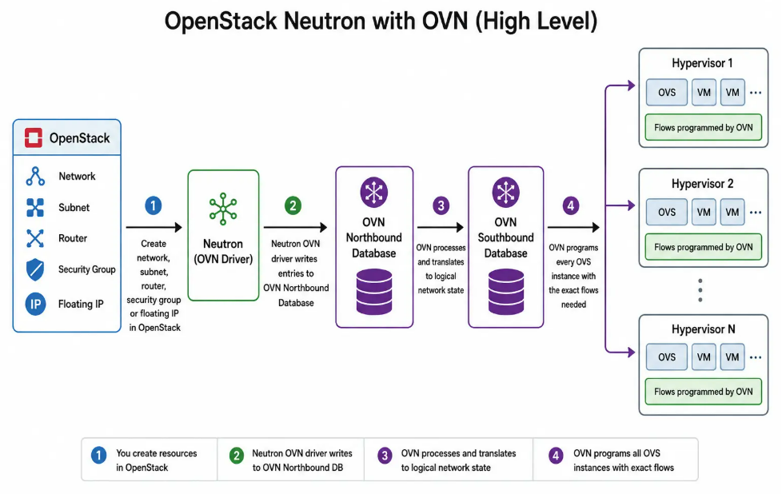
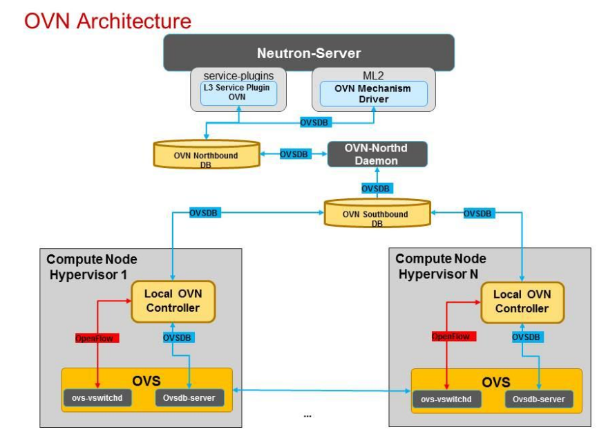
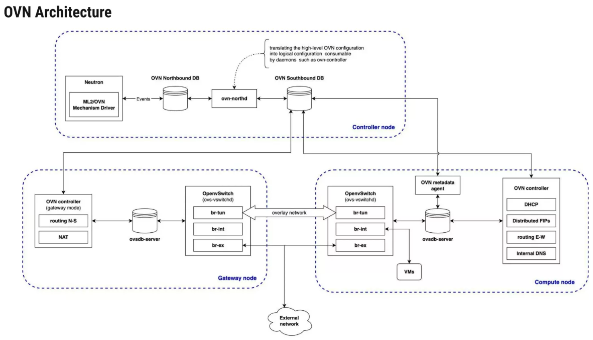

#  OVN

> Thay vì chạy một đống agent rời rạc nói chuyện qua message queue, ta gom **toàn bộ logic mạng** (chuyển mạch L2, định tuyến L3, DHCP, NAT, firewall) thành **các "luật dòng chảy" (flow rules)** rồi nhét thẳng vào Open vSwitch trên từng node.

Hãy tưởng tượng thế này:

- **Mô hình cũ** giống như một văn phòng mà mỗi việc (gửi thư, định tuyến, cấp số nhà) do một nhân viên khác nhau làm, và họ phải gọi điện thoại nội bộ (RabbitMQ) cho nhau liên tục để phối hợp. Đông người, dễ nhầm, dễ kẹt tổng đài.

- **OVN** giống như bạn viết sẵn một **cuốn sổ tay quy trình cực kỳ chi tiết** ("nếu gói tin thế này thì làm thế kia"), photo ra phát cho từng nhân viên ở từng chi nhánh. Giờ ai cũng tự xử lý theo sổ, không cần gọi điện hỏi nhau nữa. Cuốn sổ đó chính là **flow rules trong OVS**.

Kết quả: nhanh hơn, ít tiến trình hơn, và không còn một điểm chết duy nhất.

---

## 1. SDN (Software-Defined Networking)
- Traditional networking works like this: each switch and router has its own control plane deciding where packets go and data plane forwarding packets.
- To change how traffic flows, you reconfigure each device individually – often by using protocols like NETCONF or RESTCONF. This approach works until you need to scale. In a cloud environment with hundreds of hypervisors and thousands of VMs, manual per-device configuration becomes impossible.
- Software-Defined Networking (SDN) changes the game by separating the control plane from the data plane. A central SDN controller decides where traffic should go, and the underlying switches and routers simply follow those instructions.

This separation brings three major benefits to cloud environments:
- **Benefit**:	Why it matters in cloud environments
- **Centralized control**:	You manage network policy centrally, not per-switch 
- **Programmability**:	Networks adapt dynamically as VMs are created, migrated, or deleted
- **Automation**:	No manual switch configuration

Think of it this way:
- OVS = the worker who moves packets
- OVN = the manager who decides where packets should go and remembers the network topology



## 2. Kiến trúc OVN

At a high level, OVN separates responsibilities into two distinct layers:
- Control plane
- Data plane





### OVN Northbound DB: "Bản vẽ thiết kế"

Represents the desired state of the network. It answers the question: “What should the virtual network look like?”

When OpenStack users create networking resources, the ML2/OVN driver converts those resources into OVN logical objects and stores them in the Northbound Database.

Examples include:
- Logical Switch 
- Logical routers
- ACLs
- NAT policies
- Load balancers
- Logical ports

Lưu ý: ở tầng này **chưa có gì là thật cả**. Nó giống bản vẽ kiến trúc — ngôi nhà chưa được xây, mới chỉ là ý tưởng trên giấy. NB DB không quan tâm compute node nào, card mạng ra sao.

### `ovn-northd`: "Kiến trúc sư dịch bản vẽ"

The `ovn-northd` is the central control daemon of OVN. It acts as a translator between the Northbound and Southbound databases.

Its responsibility is to:
- Read logical network definitions from the Northbound Database.
- Convert them into implementation details.
- Populate the Southbound Database.

###  Southbound DB (SB): "Bản vẽ thi công + sổ địa chỉ công trường"

The Southbound Database (SBDB) acts as the communication layer between OVN’s control plane and the individual hosts running workloads. It answers the question: “How should each node implement the desired network state?”

It contains implementation-specific information such as:
- Chassis registrations
- Tunnel endpoints
- Datapath bindings
- Port bindings
- Flow information

### `ovn-controller`

Trên **mỗi** compute/network node có một con `ovn-controller`. Nó **subscribe** (đăng ký theo dõi) Southbound DB. Hễ SB DB có flow mới liên quan đến node của nó, nó lập tức **dịch flow logic thành OpenFlow thật** và nhét vào con Open vSwitch (`br-int`) ngay tại node đó.

### East-West vs North-South Traffic in OVN
- East-West traffic refers to communication between workloads **inside the same data center or cloud environment**. 
  - VM to VM within the same tenant network
  - VM-to-VM across different tenant networks (routed via a virtual router)
  - Traffic between VMs and container workloads

East-West traffic typically stays inside the OVN overlay network. It is encapsulated in tunnels (Geneve/VXLAN) and never touches the physical gateway unless routed over L3 provider networks.

- North-South traffic refers to communication between workloads and the **outside world**.

## OVN Trace Tool – Debugging Traffic End-to-End

When you run ovn-trace, the packet’s path through the pipeline depends entirely on its destination. OVN applies different logical pipeline stages based on where the traffic is headed:
- **Destination inside the same logical switch** (same Neutron network)
- **Destination in a different logical switch but within the same tenant** (requires a logical router)
- **Destination outside the cloud entirely**

### Bước 1 — Soi tầng "ý muốn" (NB): Neutron có ghi đúng không?

Dùng `ovn-nbctl` để xem topology logic. Nếu ở đây đã sai (thiếu router, thiếu port) thì lỗi nằm ở Neutron, chưa phải OVN.

```bash
sudo ovn-nbctl show          # Toàn cảnh topology logic — lệnh nên gõ ĐẦU TIÊN
sudo ovn-nbctl lr-nat-list <router>   # Floating IP / SNAT có đúng không?
sudo ovn-nbctl list ACL               # Luật firewall có chặn nhầm không?
```

### Bước 2 — Soi tầng "hiện thực" (SB): VM có được gắn đúng node không?

Đây là chỗ hay sai nhất. Nếu `Port_Binding` của VM bị rỗng chassis, nghĩa là `ovn-controller` ở node đó chưa nhận ra VM → kiểm tra xem tap có được gắn nhãn iface-id chưa.

```bash
sudo ovn-sbctl show                   # Các chassis (node) có online đủ không?
sudo ovn-sbctl list Port_Binding      # Port của VM đã bound vào chassis nào?
```

### Bước 3 — Dùng `ovn-trace`: vũ khí mạnh nhất, mô phỏng gói tin trên giấy

Đây là công cụ "thần thánh" của OVN. Thay vì ngồi đoán, bạn **mô tả một gói tin giả định** rồi bảo OVN: "giả sử gói này đi vào, nó sẽ chạy qua những luật nào, bị drop ở đâu, NAT thế nào?". OVN trả lời mà **không cần gửi gói thật**.

```bash
sudo ovn-trace --detailed neutron-<uuid-mạng> \
  'inport=="<port-vm-nguồn>" \
   && eth.src==<mac-nguồn> && eth.dst==<mac-đích> \
   && ip4.src==192.168.10.10 && ip4.dst==192.168.10.20 \
   && ip.ttl==64 && icmp4.type==8'
```

Output sẽ kể lại hành trình: gói đi qua flow nào, có dính ACL (firewall) nào, action cuối cùng là forward hay drop. Nếu nó báo drop ở một ACL, bạn biết ngay Security Group đang chặn.

### Bước 4 — Soi OVS thật trên node: flow đã thực sự xuống chưa?

Nếu 3 tầng trên đều ổn mà vẫn mất mạng, xuống tận datapath xem flow đã được cài vào OVS chưa.

```bash
sudo ovs-vsctl show                          # OVS có những bridge nào
sudo ovs-ofctl dump-flows br-int             # Flow thật đang nằm trên node
sudo ovs-ofctl dump-flows br-int 'tcp,tp_dst=22'  # Lọc theo cổng SSH chẳng hạn
```

**Triết lý debug:** đi từ NB (ý muốn) → SB (hiện thực) → ovn-trace (mô phỏng) → OVS (datapath). Cứ hỏi "đến tầng này còn đúng không", lỗi nằm ở đoạn đứt gãy giữa hai tầng.

---

## Phần 5: OVN giải quyết single-point-of-failure thế nào?

Nhớ nỗi đau Network Node ở Phần 0 chứ? OVN xử lý theo hai hướng.

### 5.1 Định tuyến phân tán (đây là điểm ăn tiền)

Trong mô hình cũ, mọi gói tin định tuyến L3 phải lặn lội về Network Node. OVN **không cần** vậy: logic router được nhúng thành flow **trên mọi node**. Hai VM khác mạng nói chuyện với nhau thì việc định tuyến diễn ra **ngay tại compute node**, gói tin đi thẳng qua đường hầm Geneve tới node đích, không vòng qua đâu cả.

```
ML2/OVS cũ (tập trung):
vm-a → ... → CHUI QUA NETWORK NODE để định tuyến → ... → vm-b   (nghẽn cổ chai)

OVN (phân tán):
vm-a → định tuyến NGAY TẠI node của nó → đường hầm Geneve → node đích → vm-b
```

### 5.2 Database thì dùng cụm RAFT

Bản thân hai cái DB (NB + SB) cũng phải HA, nếu không DB chết là cả cụm tê liệt. OVN dùng **RAFT clustering** (thường 3 node) — kiểu bầu cử leader, còn sống quá nửa số node là hệ thống vẫn chạy. Không cần Pacemaker cồng kềnh như xưa.

```bash
sudo ovn-appctl -t /var/run/ovn/ovnnb_db.ctl cluster/status OVN_Northbound
```

### 5.3 Gateway Chassis — ngoại lệ "vẫn hơi tập trung"

Có một thứ OVN **chưa** phân tán hoàn toàn theo mặc định: traffic ra/vào external network (ví dụ SNAT cho cả mạng private đi ra Internet). Cái này được giao cho một (hoặc vài) node đóng vai **gateway chassis**. Bạn có thể khai báo nhiều gateway với mức ưu tiên khác nhau để dự phòng:

```bash
sudo ovn-nbctl lrp-set-gateway-chassis <router-port> chassis1 100  # chính
sudo ovn-nbctl lrp-set-gateway-chassis <router-port> chassis2 90   # dự phòng
```

---

## Phần 6: Vậy có khi nào KHÔNG nên dùng OVN?

OVN tốt cho đa số trường hợp, nhưng đừng coi nó là chân lý tuyệt đối. Cân nhắc ở lại với ML2/OVS khi:

- Bạn cần **SR-IOV** mạnh (OVS có driver chuyên hơn cho việc này).
- Bạn cần **hardware offload / HW VTEP** trên switch vật lý — OVN làm được nhưng setup phức tạp.
- Bạn lỡ phụ thuộc **driver vendor cũ** chỉ hỗ trợ cơ chế ML2/OVS.
- Hệ thống đang chạy ML2/OVS ổn định và **chưa có nhu cầu migrate** (migrate không phải chuyện một nút bấm).

---

## Phần 7: Bộ não tối giản cần thuộc

Nếu phải mang theo 10 dòng lệnh duy nhất khi đi trực hệ thống OVN, thì là đây — và nhớ chúng soi tầng nào:

```bash
# === TẦNG Ý MUỐN (NB) ===
sudo ovn-nbctl show           # Toàn cảnh topology logic
sudo ovn-nbctl ls-list        # Liệt kê network (switch logic)
sudo ovn-nbctl lr-list        # Liệt kê router logic

# === TẦNG HIỆN THỰC (SB) ===
sudo ovn-sbctl show           # Các node (chassis) đang online
sudo ovn-sbctl list Chassis   # Chi tiết từng node
sudo ovn-sbctl list Port_Binding   # VM/port đang nằm ở node nào

# === MÔ PHỎNG & DATAPATH ===
sudo ovn-trace --detailed <dp> '<microflow>'  # Mô phỏng gói tin
sudo ovs-ofctl dump-flows br-int               # Flow thật trên node
sudo ovs-vsctl show                            # Bridge OVS local
sudo ovn-appctl -t ovn-controller recompute    # Ép tính lại flow khi nghi treo
```

---

## Phần 8: Một câu tóm tắt cho cả tài liệu

> OVN gom mọi thứ mạng thành **flow rules**, đi qua **3 tầng**: bạn ghi ý muốn vào **Northbound**, `ovn-northd` dịch xuống **Southbound**, rồi `ovn-controller` ở mỗi node áp nó vào **Open vSwitch**. Định tuyến diễn ra phân tán ngay tại từng node nên không còn nghẽn cổ chai. Khi debug, cứ đi từ tầng ý muốn xuống tầng thực tế và hỏi "đến đây còn đúng không".

Nắm được mạch này rồi thì mọi bảng biểu, mọi lệnh `ovn-*ctl` chỉ còn là tra cứu, không phải học thuộc nữa.

---

## Tài liệu tham khảo

- OVN docs chính thức: https://docs.ovn.org/en/latest/
- `man ovn-architecture` (đọc trang man này là hiểu sâu nhất)
- ovn-trace manual: https://man7.org/linux/man-pages/man8/ovn-trace.8.html