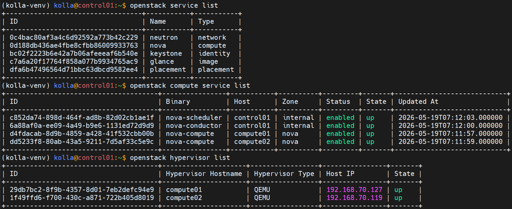
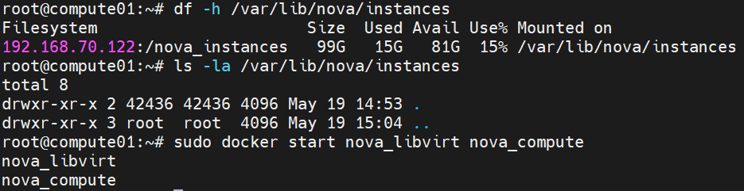

# LAB: Cold & Live Migration trên OpenStack Kolla Ansible 2025.2 (Flamingo)

> **Tài liệu này dành cho môi trường lab đã có sẵn OpenStack 2025.2 Flamingo được deploy bởi Kolla Ansible 21.0.0.**
> Bài lab tập trung vào thực hành Cold Migration và Live Migration, bao gồm xử lý các lỗi phổ biến gặp phải trong thực tế.

---

## Thông tin môi trường lab

| Node | IP | Role | Spec gợi ý |
|------|-----|------|------------|
| **control01** | 192.168.70.122 | Controller + Deploy node | 8 vCPU / 16GB RAM |
| **compute01** | 192.168.70.127 | Compute node 1 | 8 vCPU / 16GB RAM |
| **compute02** | 192.168.70.119 | Compute node 2 | 8 vCPU / 16GB RAM |

**OS:** Ubuntu 24.04 LTS
**OpenStack:** 2025.2 Flamingo
**Kolla Ansible:** 21.0.0

---

## Mục lục

1. [Kiểm tra môi trường ban đầu](#phần-1-kiểm-tra-môi-trường-ban-đầu)
2. [Chuẩn bị tài nguyên OpenStack](#phần-2-chuẩn-bị-tài-nguyên-openstack)
3. [Cấu hình Live Migration trong Nova](#phần-3-cấu-hình-live-migration-trong-nova)
4. [Storage option cho Live Migration](#phần-4-chọn-phương-án-storage)
5. [Tạo VM test](#phần-5-tạo-vm-test)
6. [LAB Cold Migration](#phần-6-lab-cold-migration)
7. [LAB Live Migration](#phần-7-lab-live-migration)
8. [Troubleshooting](#phần-8-troubleshooting-các-lỗi-đã-gặp)
9. [Tổng kết](#phần-9-tổng-kết)

---

## PHẦN 1: KIỂM TRA MÔI TRƯỜNG BAN ĐẦU

### 1.1. Activate venv và load credentials

Trên **control01**:

```bash
source ~/kolla-venv/bin/activate
source /etc/kolla/admin-openrc.sh
export OS_CLIENT_CONFIG_FILE=/etc/kolla/clouds.yaml
export OS_CLOUD=kolla-admin
```

Để tự động load mỗi khi login:

```bash
cat <<EOF >> ~/.bashrc
source ~/kolla-venv/bin/activate
export OS_CLIENT_CONFIG_FILE=/etc/kolla/clouds.yaml
export OS_CLOUD=kolla-admin
EOF
```

### 1.2. Verify cluster hoạt động

```bash
# Liệt kê service
openstack service list

# Liệt kê compute service
openstack compute service list

# Liệt kê hypervisor - phải thấy 2 compute đều "up"
openstack hypervisor list
```



### 1.3. Kiểm tra /etc/hosts trên tất cả node

```bash
cat /etc/hosts
```

Phải có:

```
192.168.70.122  control01
192.168.70.127  compute01
192.168.70.119  compute02
```

Nếu thiếu, thêm vào cả 3 node:

```bash
sudo tee -a /etc/hosts <<EOF
192.168.70.122  control01
192.168.70.127  compute01
192.168.70.119  compute02
EOF
```

### 1.4. Test SSH giữa các compute nodes (cho live migration)

```bash
# Trên compute01
sudo docker exec -it nova_compute ssh -o StrictHostKeyChecking=no nova@compute02 'hostname'
# Output mong đợi: compute02

# Trên compute02
sudo docker exec -it nova_compute ssh -o StrictHostKeyChecking=no nova@compute01 'hostname'
# Output mong đợi: compute01
```

**Nếu fail (Permission denied)**, chạy reconfigure trên control01 (xem Bước 3.2 để tìm path inventory chính xác).

---

## PHẦN 2: CHUẨN BỊ TÀI NGUYÊN OPENSTACK

### 2.1. Kiểm tra network đã tồn tại TRƯỚC khi tạo mới

> **❗ Lỗi thường gặp:** `ConflictException: 409, Unable to create the flat network. Physical network physnet1 is in use.`
>
> Nguyên nhân: đã có external network dùng `physnet1` từ trước.

```bash
# Liệt kê external network
openstack network list --external

# Liệt kê tất cả subnet
openstack subnet list

# Liệt kê router
openstack router list
```

**Trong môi trường lab này, đã có sẵn:**

| Resource | Tên | Subnet/Info |
|----------|-----|-------------|
| External network | `public1` | 10.0.2.0/24 |
| Router | `demo-router` | Đã set gateway public1 |
| Internal subnet (có sẵn) | `demo-subnet` | 10.0.0.0/24 |

→ **Tái sử dụng `public1` và `demo-router`, không tạo external network mới.**

### 2.2. Tạo internal network mới (tuỳ chọn)

Nếu muốn tách network riêng cho VM lab migration:

```bash
openstack network create internal-net

openstack subnet create --network internal-net \
  --subnet-range 10.10.10.0/24 \
  --dns-nameserver 8.8.8.8 \
  internal-subnet
```

### 2.3. Attach internal-subnet vào router có sẵn

```bash
# Verify router đã có external gateway chưa
openstack router show demo-router -c external_gateway_info

# Attach subnet mới vào router
openstack router add subnet demo-router internal-subnet

# Verify
openstack router show demo-router
```

`interfaces_info` phải có IP gateway của internal-subnet (10.10.10.1).

### 2.4. Security group rules

```bash
# Cho phép ICMP và SSH
openstack security group rule create --protocol icmp default 2>/dev/null || echo "ICMP đã có"
openstack security group rule create --protocol tcp --dst-port 22 default 2>/dev/null || echo "SSH đã có"

# Verify
openstack security group rule list default
```

### 2.5. SSH keypair

```bash
# Tạo SSH key nếu chưa có
[ ! -f ~/.ssh/lab_key ] && ssh-keygen -t rsa -N "" -f ~/.ssh/lab_key

# Kiểm tra keypair đã có chưa
openstack keypair list

# Import nếu chưa có
openstack keypair create --public-key ~/.ssh/lab_key.pub lab-key
```

### 2.6. Image và flavor

```bash
# Kiểm tra image
openstack image list | grep -i cirros

# Nếu chưa có:
wget https://download.cirros-cloud.net/0.6.2/cirros-0.6.2-x86_64-disk.img
openstack image create --disk-format qcow2 --container-format bare \
  --public --file cirros-0.6.2-x86_64-disk.img cirros

# Kiểm tra flavor (Kolla mặc định đã có sẵn m1.tiny → m1.xlarge)
openstack flavor list
```

### 2.7. Verify tổng thể tài nguyên trước khi tiếp tục

```bash
echo "=== External networks ==="
openstack network list --external

echo "=== All subnets ==="
openstack subnet list

echo "=== Router demo-router ==="
openstack router show demo-router -c name -c external_gateway_info -c interfaces_info

echo "=== Keypairs ==="
openstack keypair list

echo "=== Images ==="
openstack image list

echo "=== Flavors ==="
openstack flavor list
```

---

## PHẦN 3: CẤU HÌNH LIVE MIGRATION TRONG NOVA

### 3.1. Tạo file override `nova.conf`

```bash
sudo mkdir -p /etc/kolla/config
sudo nano /etc/kolla/config/nova.conf
```

Nội dung file:

```ini
[DEFAULT]
# Cho phép resize trên cùng host (tiện cho lab)
allow_resize_to_same_host = True

[libvirt]
# Scheme cho live migration
live_migration_scheme = tcp

# Auto-converge: làm chậm CPU guest khi memory copy không kịp tốc độ ghi
live_migration_permit_auto_converge = true

# Post-copy: activate VM ở dest trước khi copy xong memory
live_migration_permit_post_copy = true

# Timeout cho live migration (giây × GiB RAM)
live_migration_completion_timeout = 800

# Hành động khi timeout: abort hoặc force_complete
live_migration_timeout_action = force_complete

# Downtime cho phép cuối quá trình (ms)
live_migration_downtime = 500
live_migration_downtime_steps = 10
live_migration_downtime_delay = 75
```

Set quyền đọc:

```bash
sudo chmod 644 /etc/kolla/config/nova.conf
cat /etc/kolla/config/nova.conf  # Verify nội dung
```

### 3.2. TÌM ĐÚNG PATH INVENTORY

> ** Lỗi thường gặp:** `Kolla inventory multinode is invalid: Path does not exist`
>
> Nguyên nhân: file inventory không nằm ở `/etc/kolla/multinode` mà ở vị trí khác.

```bash
# Tìm file inventory
find / -name "multinode" -type f 2>/dev/null
find / -name "all-in-one" -type f 2>/dev/null

# Các vị trí thường gặp:
ls -la ~/
ls -la /etc/kolla/
ls -la ~/kolla-venv/share/kolla-ansible/ansible/inventory/
```

Inventory thường ở một trong các vị trí:
- `~/multinode`
- `/home/kolla/multinode`
- `~/kolla-venv/share/kolla-ansible/ansible/inventory/multinode`

### 3.3. Apply config với đúng path inventory

```bash
# Thay <PATH_TO_INVENTORY> bằng đường dẫn thực tế
kolla-ansible reconfigure -i <PATH_TO_INVENTORY> --tags nova

# Ví dụ:
kolla-ansible reconfigure -i ~/multinode --tags nova
```

Quá trình này mất 5-10 phút. Sẽ:
- Regenerate `nova.conf` trong các container
- Restart `nova_compute`, `nova_libvirt` trên cả 2 compute nodes

### 3.4. Verify config đã apply

```bash
# Từ compute01 (SSH vào hoặc dùng ansible)
ssh compute01 "sudo docker exec nova_compute grep -E 'live_migration|auto_converge|post_copy' /etc/nova/nova.conf"
```

Phải thấy đầy đủ các option vừa cấu hình.

---

## PHẦN 4: CHỌN PHƯƠNG ÁN STORAGE

Bạn có **2 lựa chọn** — chọn **MỘT**:

###  Phương án A: Volume-backed VM (KHUYẾN NGHỊ CHO LAB)

-  Đơn giản, không cần setup NFS
-  Live migration hoạt động tự nhiên vì disk nằm trên Cinder
-  Phù hợp lab nhỏ
-  **Bỏ qua phần 4.B**, đi thẳng tới Phần 5

###  Phương án B: NFS shared storage (giả lập production)

Dùng control01 làm NFS server cho compute01 và compute02 mount chung `/var/lib/nova/instances`.

#### Bước 1: Setup NFS server trên control01

```bash
sudo apt install -y nfs-kernel-server
sudo mkdir -p /nova_instances

# UID/GID 42436 là user 'nova' trong Kolla container
sudo chown 42436:42436 /nova_instances
sudo chmod 755 /nova_instances

# Export
echo "/nova_instances 192.168.70.0/24(rw,sync,no_root_squash,no_subtree_check)" | sudo tee -a /etc/exports
sudo exportfs -arv
sudo systemctl restart nfs-kernel-server
sudo systemctl enable nfs-kernel-server

# Verify
showmount -e localhost
```

#### Bước 2: Mount NFS trên compute01 và compute02

 **Quan trọng:** Stop nova containers trước khi mount để tránh conflict.

```bash
# Trên CẢ compute01 và compute02 (làm lần lượt)
sudo apt install -y nfs-common

# Stop containers
sudo docker stop nova_compute nova_libvirt

# Backup folder cũ
sudo mv /var/lib/nova/instances /var/lib/nova/instances.bak
sudo mkdir -p /var/lib/nova/instances

# Mount NFS
echo "192.168.70.122:/nova_instances /var/lib/nova/instances nfs defaults,vers=4 0 0" | sudo tee -a /etc/fstab
sudo mount -a

# Verify
df -h /var/lib/nova/instances
ls -la /var/lib/nova/instances
# Ownership phải là 42436:42436

# Start lại containers
sudo docker start nova_libvirt nova_compute
```


#### Bước 3: Test cross-write

```bash
# Trên compute01
sudo docker exec nova_compute touch /var/lib/nova/instances/test_compute01

# Trên compute02 - phải thấy file
sudo docker exec nova_compute ls /var/lib/nova/instances/test_compute01

# Cleanup
sudo docker exec nova_compute rm /var/lib/nova/instances/test_compute01
```

---

## PHẦN 5: TẠO VM TEST

### 5.1. Lấy ID network

```bash
openstack network list
# copy ID của network muốn dùng
export NET_ID=<paste-id-vào-đây>
```

### 5.2. Tạo VM theo phương án storage đã chọn

**Phương án A (volume-backed):**

```bash
# Tạo volume từ image
openstack volume create --image cirros --size 2 --bootable lab-vol

# Đợi volume available
watch -n 2 'openstack volume list'

# Boot VM từ volume (Ctrl+C để thoát watch)
openstack server create --flavor m1.tiny \
  --volume lab-vol \
  --network demo-net \
  --key-name lab-key \
  --security-group d1fb4bbd-d17c-48d6-953f-3a89b040aebc \
  vm-test
```

- Lệnh đầu tiên sẽ lỗi do Cinder chưa được khởi động:
```bash
(kolla-venv) kolla@control01:~$ openstack volume create --image cirros --size 2 --bootable lab-vol
internalURL endpoint for block-storage service in RegionOne region not found
```
- Chạy các lệnh sau để kiểm tra:
```bash
openstack endpoint list | grep volume
openstack catalog list
docker ps | grep cinder
grep enable_cinder /etc/kolla/globals.yml
# phải ra enable_cinder: "yes"
```
- Nếu không chỉnh lại trong `etc/kolla/globals.yml`
```bash
enable_cinder: "yes"
kolla-ansible reconfigure -i multinode
```
- Nếu container đang chạy nhưng endpoint chưa đăng ký:
```bash
docker logs cinder_api
```


**Phương án B (NFS shared):**

```bash
openstack server create --flavor m1.tiny \
  --image cirros \
  --network $NET_ID \
  --key-name lab-key \
  --security-group default \
  vm-test
```

### 5.3. Verify VM chạy

```bash
openstack server list

openstack server show vm-test -c name -c status -c OS-EXT-SRV-ATTR:host
```

Ghi nhớ compute host hiện tại (cột `OS-EXT-SRV-ATTR:host`), ví dụ `compute01`.

### 5.4. Gán floating IP để test downtime sau này

```bash
FIP=$(openstack floating ip create public1 -f value -c floating_ip_address)
echo "Floating IP: $FIP"
openstack server add floating ip vm-test $FIP

# Test connectivity từ control01 (nếu network 10.0.2.0/24 accessible từ control01)
ping -c 3 $FIP
```

> **Lưu ý:** Vì external network `public1` dùng dải `10.0.2.0/24` (nội bộ Kolla), bạn chỉ ping được từ chính control01 hoặc node trong cùng L2. Đây là bình thường cho lab.

---

## PHẦN 6: LAB COLD MIGRATION

### 6.1. Khái niệm

**Cold migration:**
- VM bị **shutdown** trước khi migrate
- Disk được copy qua SSH giữa compute nodes
- VM **reboot** ở compute mới
- Downtime: vài phút
- **Không cần shared storage**

### 6.2. Thực hiện cold migration

**Bước 1: Xác định host hiện tại**

```bash
openstack server show vm-test -c OS-EXT-SRV-ATTR:host
# Giả sử: compute01
```

**Bước 2: Cold migrate (Nova tự chọn dest)**

```bash
openstack server migrate vm-test
```

**Bước 3: Theo dõi trạng thái**

Mở terminal khác:

```bash
watch -n 1 'openstack server show vm-test -c status -c OS-EXT-STS:task_state -c OS-EXT-SRV-ATTR:host'
```

Trạng thái sẽ chuyển: `ACTIVE` → `MIGRATING` → `RESIZE` → `VERIFY_RESIZE`

**Bước 4: Confirm hoặc revert**

Khi status là `VERIFY_RESIZE`:

```bash
# Chấp nhận migration
openstack server migrate confirm vm-test

# Hoặc rollback về compute cũ
# openstack server migrate revert vm-test
```

**Bước 5: Verify host mới**

```bash
openstack server show vm-test -c name -c status -c OS-EXT-SRV-ATTR:host
# host phải đã đổi, status = ACTIVE
```

### 6.3. Cold migrate có chỉ định host

```bash
# Migrate ngược về compute01
openstack server migrate --host compute01 --wait vm-test
openstack server migrate confirm vm-test

openstack server show vm-test -c OS-EXT-SRV-ATTR:host
```

---

## PHẦN 7: LAB LIVE MIGRATION

### 7.1. Khái niệm

**Live migration:**
- VM tiếp tục chạy trong khi memory được copy
- Downtime cuối: < 1 giây
- 3 kiểu:
  - **Shared storage**: NFS/Ceph mount sẵn, chỉ copy memory
  - **Block migration**: copy cả disk + memory (`--block-migration`)
  - **Volume-backed**: VM boot từ Cinder volume, native support

### 7.2. Chuẩn bị test downtime

Mở **terminal thứ 2** và bắt đầu ping liên tục:

```bash
ping $FIP
# Để chạy nền, không tắt
```

### 7.3. Live migration — Nova tự chọn host

Quay lại terminal chính:

**Nếu phương án A (volume-backed) hoặc B (NFS shared):**

```bash
openstack server migrate --live-migration --wait vm-test
```

**Nếu KHÔNG có shared storage (block migration):**

```bash
openstack server migrate --live-migration --block-migration --wait vm-test
```

### 7.4. Live migration có chỉ định host

```bash
openstack server migrate --live-migration --host compute02 --wait vm-test
```

### 7.5. Theo dõi tiến trình

Mở **terminal thứ 3**:

```bash
# Lấy migration ID
openstack server migration list --server vm-test

# Chi tiết tiến độ (memory copied %, throughput...)
MIG_ID=$(openstack server migration list --server vm-test -f value -c "Id" | tail -1)
openstack server migration show vm-test $MIG_ID
```

Bạn sẽ thấy các thông số real-time:
- `memory_processed_bytes`
- `memory_remaining_bytes`
- `disk_processed_bytes`

### 7.6. Verify sau migration

```bash
openstack server show vm-test -c name -c status -c OS-EXT-SRV-ATTR:host
# host = compute02, status = ACTIVE
```

Quay lại terminal ping — chỉ mất **1-2 packet** trong quá trình migration.

### 7.7. Force complete / Abort migration

```bash
MIG_ID=$(openstack server migration list --server vm-test --status running -f value -c "Id")

# Force complete (pause VM để complete ngay)
openstack server migration force complete vm-test $MIG_ID

# Hoặc abort
openstack server migration abort vm-test $MIG_ID
```

---

## PHẦN 8: TROUBLESHOOTING (Các lỗi đã gặp)

### 8.1.  Lỗi: `Physical network physnet1 is in use`

**Khi nào gặp:**
```bash
openstack network create --share --external \
  --provider-physical-network physnet1 \
  --provider-network-type flat ext-net
# Error: ConflictException: 409, Unable to create the flat network.
```

**Nguyên nhân:** Đã có external network khác đang chiếm `physnet1`.

**Cách xử lý:**

```bash
# 1. Xem network đã tồn tại
openstack network list --external

# 2. HƯỚNG A: Tái sử dụng network đã có (khuyến nghị)
EXT_NET=$(openstack network list --external -f value -c Name | head -1)
echo "Using: $EXT_NET"

# 3. HƯỚNG B: Xóa network cũ (chỉ nếu chắc không ai dùng)
# Xem có port nào đang dùng không
openstack port list --network <old_net>
# Nếu chỉ có router gateway, gỡ ra:
# openstack router unset --external-gateway <router_name>
# openstack subnet delete <subnet>
# openstack network delete <old_net>
```

### 8.2.  Lỗi: `Kolla inventory multinode is invalid: Path does not exist`

**Khi nào gặp:**
```bash
cd /etc/kolla
kolla-ansible reconfigure -i multinode --tags nova
# Error: Path does not exist
```

**Nguyên nhân:** File inventory không nằm ở `/etc/kolla/multinode`.

**Cách xử lý:**

```bash
# Tìm file
find / -name "multinode" -type f 2>/dev/null

# Vị trí thường gặp:
ls ~/multinode
ls /home/kolla/multinode
ls ~/kolla-venv/share/kolla-ansible/ansible/inventory/multinode

# Dùng đúng path
kolla-ansible reconfigure -i ~/multinode --tags nova
```

### 8.3.  Lỗi: `Live migration is not supported by this hypervisor`

**Nguyên nhân thường gặp:**
- VM có vTPM (Flamingo chưa hỗ trợ live migrate vTPM)
- Virt config không tương thích

**Cách xử lý:**
- Disable vTPM trong flavor metadata
- Hoặc fallback dùng cold migration

### 8.4.  Lỗi: `Permission denied (publickey)` khi migrate

**Nguyên nhân:** SSH key giữa nova_compute containers bị lỗi.

**Cách xử lý:**

```bash
kolla-ansible reconfigure -i ~/multinode --tags nova
```

### 8.5.  Lỗi: `Unable to connect to qemu+tcp://...:16509`

**Nguyên nhân:** Firewall chặn port libvirt hoặc libvirt chưa listen.

**Cách xử lý:**

```bash
# Kiểm tra libvirt đang listen
sudo docker exec nova_libvirt ss -tlnp | grep 16509

# Test connectivity giữa compute
sudo docker exec nova_libvirt nc -zv compute02 16509

# Nếu fail, check log
sudo docker logs nova_libvirt --tail 100
```

Port cần mở:
- TCP 16509 (libvirt API)
- TCP 49152-49261 (QEMU migration range)

### 8.6.  Migration timeout với VM memory-intensive

**Nguyên nhân:** Memory writes nhanh hơn copy.

**Cách xử lý:** Đã có trong config Phần 3 với `live_migration_permit_post_copy = true`. Verify:

```bash
sudo docker exec nova_compute grep post_copy /etc/nova/nova.conf
```

### 8.7.  Lỗi: `Cannot block migrate instance with shared storage`

**Nguyên nhân:** VM đã có shared storage mà còn dùng flag `--block-migration`.

**Cách xử lý:** Bỏ flag `--block-migration`:

```bash
openstack server migrate --live-migration --wait vm-test
```

### 8.8.  CPU model mismatch giữa 2 compute

**Nguyên nhân:** CPU 2 host khác model.

**Cách xử lý:** Sửa `/etc/kolla/globals.yml`:

```yaml
nova_libvirt_cpu_mode: "custom"
nova_libvirt_cpu_model: "kvm64"
```

Rồi reconfigure:

```bash
kolla-ansible reconfigure -i ~/multinode --tags nova
```

### 8.9.  Vị trí log quan trọng

```bash
# Trên compute (source/dest)
sudo docker logs nova_compute --tail 100 | grep -i migrat
sudo docker logs nova_libvirt --tail 100

# File log trên host
sudo tail -f /var/log/kolla/nova/nova-compute.log
sudo tail -f /var/log/kolla/libvirt/libvirtd.log

# Trên control01 - conductor handle migration RPC
sudo docker logs nova_conductor --tail 100 | grep -i migrat
sudo tail -f /var/log/kolla/nova/nova-conductor.log
```

---

## PHẦN 9: TỔNG KẾT

### 9.1. Bảng so sánh Cold vs Live Migration

| Tiêu chí | Cold Migration | Live Migration |
|----------|----------------|----------------|
| **Downtime** | Vài phút (VM reboot) | < 1 giây |
| **Shared storage** | Không cần | Khuyến nghị (NFS/Ceph) hoặc volume-backed |
| **Lệnh** | `openstack server migrate <vm>` | `openstack server migrate --live-migration <vm>` |
| **Cần confirm?** | Có (`migrate confirm/revert`) | Không (tự động) |
| **Block migration** | N/A | `--block-migration` (no shared storage) |
| **Use case** | Resize VM, maintenance có downtime | Maintenance không downtime |
| **Hỗ trợ ephemeral disk** | Có | Cần shared storage hoặc `--block-migration` |

### 9.2. Lệnh nhanh cheatsheet

```bash
# Activate môi trường
source ~/kolla-venv/bin/activate
export OS_CLOUD=kolla-admin

# Tổng quan
openstack hypervisor list
openstack server list --long

# Cold migration
openstack server migrate <vm>
openstack server migrate confirm <vm>
openstack server migrate --host <dest> --wait <vm>

# Live migration
openstack server migrate --live-migration --wait <vm>
openstack server migrate --live-migration --host <dest> --wait <vm>
openstack server migrate --live-migration --block-migration --wait <vm>

# Theo dõi migration
openstack server migration list --server <vm>
openstack server migration show <vm> <migration_id>

# Force complete / abort
openstack server migration force complete <vm> <migration_id>
openstack server migration abort <vm> <migration_id>

# Reconfigure Nova sau khi sửa config
kolla-ansible reconfigure -i ~/multinode --tags nova
```

### 9.3. Bài tập nâng cao

1. **Memory stress test**: Tạo VM `m1.medium` (4GB RAM), chạy `stress --vm 2 --vm-bytes 1G` bên trong, sau đó live migrate. Quan sát post-copy có kích hoạt không.

2. **Evacuate khi host down**: Stop docker trên compute02 → `openstack server evacuate <vm>` để force migrate sang compute01.

3. **Disable compute node**: 
   ```bash
   openstack compute service set --disable compute01 nova-compute
   ```
   Sau đó migrate tất cả VM khỏi compute01 trước khi maintenance.

4. **CPU pinning test**: Tạo flavor với `hw:cpu_policy=dedicated`, test xem migration có hoạt động không.

5. **Setup Masakari**: Auto-evacuate VM khi compute host fail. Set `enable_masakari: yes` trong globals.yml.

---

##  Tài liệu tham khảo

- [Kolla Ansible 2025.2 Release Notes](https://docs.openstack.org/releasenotes/kolla-ansible/2025.2.html)
- [Nova 2025.2 Release Notes](https://docs.openstack.org/releasenotes/nova/2025.2.html)
- [Configure live migrations](https://docs.openstack.org/nova/2025.2/admin/configuring-migrations.html)
- [Live-migrate instances](https://docs.openstack.org/nova/2025.2/admin/live-migration-usage.html)
- [Libvirt driver Kolla guide](https://docs.openstack.org/kolla-ansible/latest/reference/compute/libvirt-guide.html)

---

**Lab info:**
- Author: OpenStack Lab Documentation
- Version: 1.0
- Date: 2026-05-19
- Environment: OpenStack 2025.2 Flamingo + Kolla Ansible 21.0.0
- Topology: 1 controller + 2 compute (control01/compute01/compute02)