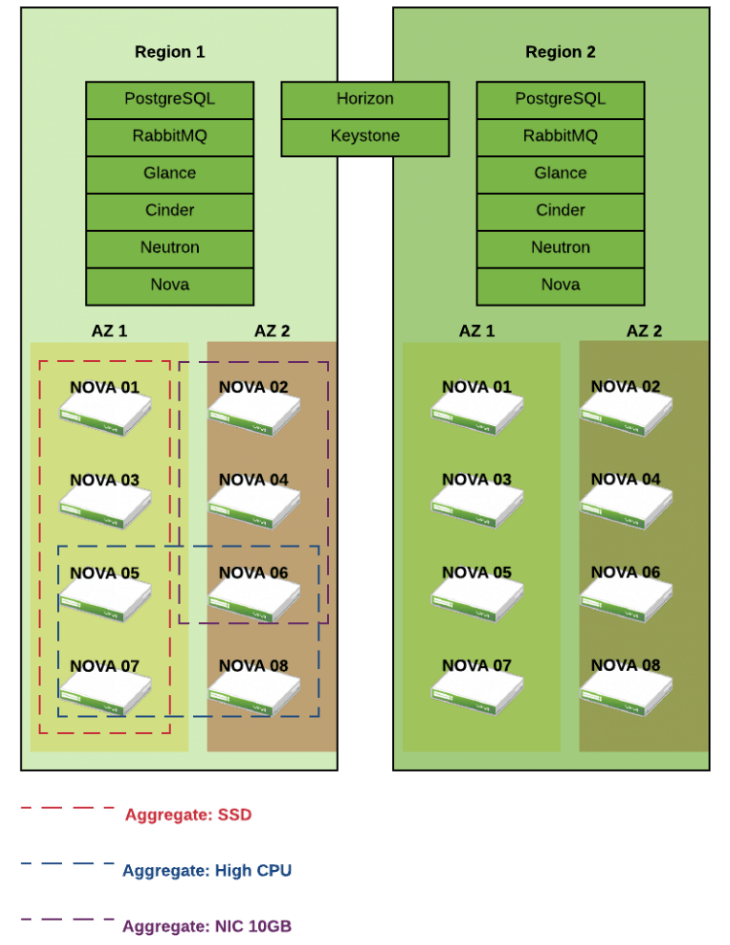
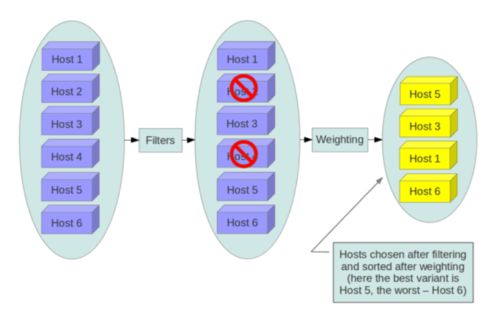
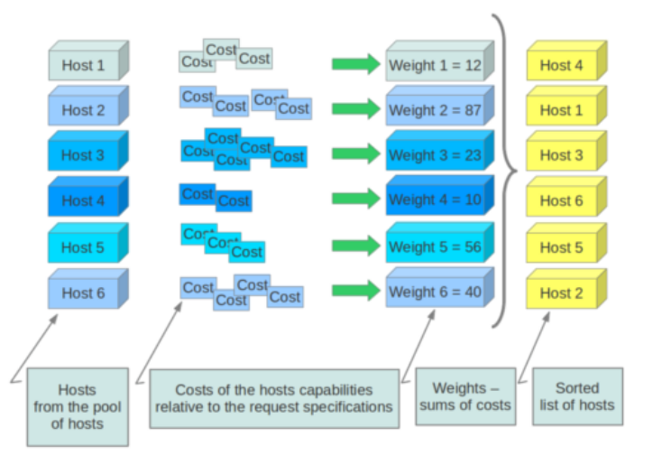
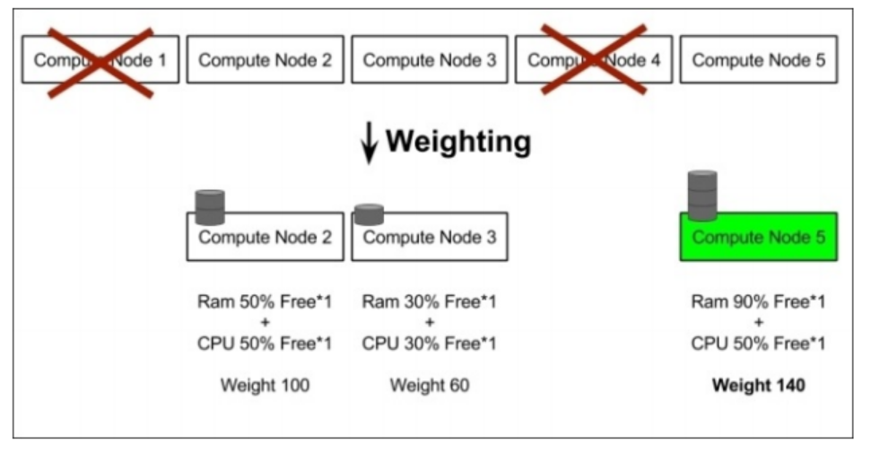

# Nova-Scheduler
## 1. Host aggreate & Availability Zone


### 1.1 Giới thiệu  
Host Aggregate và Availability Zone (AZ) là hai tính năng cốt lõi của Nova Scheduler, giúp **admin** kiểm soát placement instance một cách chính xác theo đặc tính phần cứng, vị trí vật lý hoặc yêu cầu cô lập.  

Một host có thể thuộc nhiều Host Aggregates, nhưng chỉ thuộc một Availability Zone.

- **Host Aggregate**: Nhóm logic **chỉ admin thấy**, dùng để gom host theo đặc điểm (SSD, GPU, CPU type, rack, DC…).  
- **Availability Zone**: Nhóm logic **user thấy**, thực chất là một metadata đặc biệt (`availability_zone=xxx`) gắn vào Host Aggregate.  

**Mục tiêu chính**:  
- Tối ưu scheduling theo workload (GPU, high-I/O, Windows license…).  
- Cô lập failure domain (multi-DC, multi-rack).  
- Hỗ trợ multi-tenancy isolation.  
- Tăng tốc scheduling qua Placement service.

### 2. Host Aggregate (Nova)

#### 2.1 Định nghĩa & Mục đích  
Host Aggregate là một cơ chế nhóm các Compute Node (các máy chủ vật lý chạy dịch vụ `nova-compute`) lại với nhau thành các thực thể logic do **admin** tạo để:  
- Nó là một khái niệm chỉ dành cho Quản trị viên (Admin). Người dùng thông thường (Tenant/User) không nhìn thấy tên của các Host Aggregate.
- Một Compute Node có thể thuộc về nhiều Host Aggregate khác nhau cùng một lúc.
- Nó sử dụng Metadata (các cặp Key-Value) để gắn thuộc tính cho nhóm máy chủ đó.

**Mục đích sử dụng của Host Aggregate**
- **Phân nhóm theo đặc tính phần cứng**: Bạn có một số server có card đồ họa (GPU), một số khác có ổ cứng SSD siêu tốc, và số còn lại là CPU đời cũ. Aggregate giúp bạn gom chúng lại để cấp phát đúng yêu cầu.
- **Cô lập tài nguyên (Isolation)**: Bạn muốn dành riêng một cụm server cực mạnh cho khách hàng VIP hoặc cho các dự án quan trọng, không muốn máy ảo của khách hàng thường "xài chung" máy chủ đó.
- **Quản lý Zone (Availability Zones)**: Thực tế, Availability Zone (AZ) trong OpenStack được triển khai dựa trên chính Host Aggregate. AZ là một Host Aggregate đặc biệt được công khai cho người dùng cuối để họ chọn nơi đặt máy ảo.

**Cách thức hoạt động**:
- **Gán nhãn (Tagging)**: Admin tạo một Aggregate và gán metadata cho nó.
  - Ví dụ: Tạo aggregate `High_Memory` và gán metadata `ram_type=high_performance`. Sau đó thêm `compute-01` và `compute-02` vào đây.
- **Yêu cầu từ Flavor**: Admin cấu hình các thuộc tính đặc biệt trong Flavor (gọi là Extra Specs).
  - Ví dụ: Tạo flavor `m1.extra_ram` và thêm thuộc tính `aggregate_instance_extra_specs:ram_type=high_performance`.
- **Lọc(Filtering)- Trái tim của hệ thống**: Khi người dùng ấn "Launch Instance" với flavor trên, Nova Scheduler sẽ kích hoạt bộ lọc mang tên `AggregateInstanceExtraSpecsFilter`.
  - Nó sẽ quét qua tất cả các host có trong hệ thống.
  - Nó kiểm tra xem Flavor yêu cầu gì (`ram_type=high_performance`).
  - Nó đối chiếu với Metadata của các Host Aggregate. Nếu Host nào nằm trong Aggregate có nhãn khớp, nó sẽ giữ lại. Host nào không có nhãn này sẽ bị loại bỏ khỏi danh sách ứng viên.
- **khởi tạo**: Sau khi lọc xong, máy ảo sẽ được chỉ định chạy trên một trong các host thuộc Aggregate đã chọn.

**Ví dụ dễ nhớ**:

Giả sử bạn là Admin của một hệ thống Cloud cho một trường đại học:
- Thiết lập: Bạn gom 5 server có chip Xeon mạnh nhất vào một Aggregate tên là Lab_Nghien_Cuu.
- Gán nhãn: Bạn đặt metadata cho Aggregate này là priority=research.
- Phân quyền: Bạn tạo một Flavor riêng chỉ dành cho các giáo sư, trong Flavor đó có yêu cầu priority=research.
- Kết quả: Khi sinh viên tạo máy ảo (dùng flavor thường), máy của họ sẽ không bao giờ "nhảy" vào 5 server mạnh kia. Ngược lại, khi giáo sư tạo máy với flavor đặc biệt, Nova Scheduler sẽ luôn ưu tiên đưa họ vào đúng cụm server dành riêng cho nghiên cứu.
#### 2.2 Metadata – Điểm mạnh nhất  
Metadata là các cặp khóa-giá trị (key-value pairs) được gán cho một Host Aggregate. Nova (dịch vụ tính toán của OpenStack) sử dụng các cặp khóa-giá trị này kết hợp với Flavor Extra Specs để quyết định máy ảo (Instance) sẽ được đặt trên host nào. 

Metadata đóng vai trò là "nhãn" (label) được gán vào các nhóm này để điều phối việc khởi tạo máy ảo.  
Ví dụ:  
```bash
ssd=true
gpu=true
cpu_type=intel
os=windows
```

- `availability_zone`: Đây là metadata phổ biến nhất. Nó xác định phân vùng vật lý mà người dùng có thể nhìn thấy (ví dụ: `us-west-1`).

- `cpu_allocation_ratio` / `ram_allocation_ratio`: Cho phép ghi đè tỉ lệ phân bổ tài nguyên (overcommit) cho riêng nhóm host đó, thay vì dùng cấu hình chung trong `nova.conf`.

- `pinned`: Thường dùng trong cấu hình CPU Pinning để cô lập các CPU core cho các máy ảo hiệu năng cao.

**Ví dụ dễ nhớ**

| Kịch bản| Metadata Key-Value| Mục đích|
|---------|-------------------|---------|
| Phân loại phần cứng| hardware=gpu hoặc cpu=skylake| Đưa các máy ảo xử lý đồ họa hoặc cần tập lệnh CPU đặc biệt vào đúng host.|
| Phụ thuộc bản quyền| license=windows| Gom các host đã mua license Windows vào một nhóm để tiết kiệm chi phí.|
| Tối ưu hóa lưu trữ| storage=nvme| Đảm bảo máy ảo cần I/O cao được chạy trên các node có ổ cứng NVMe.|
| Tuân thủ (Compliance)| security=high_trust| Cô lập các máy ảo nhạy cảm trên các server vật lý có bảo mật lớp cứng (TPM).|

**Cấu hình cơ bản cli**
- Tạo Host Aggregate:
```bash
openstack aggregate create production_group
```
- Thêm Metadata cho Aggregate:
```bash
openstack aggregate set --property usage=production production_group
```

- Thêm Host vào Aggregate:
```bash
openstack aggregate add host production_group compute-node-01
```

- Liên kết với Flavor:
```bash
openstack flavor set --property aggregate_instance_extra_specs:usage=production m1.small
```
#### 2.3 Scheduler Filters liên quan đến Aggregate  
Các filter quan trọng (phải bật trong `nova.conf`):

| Filter                              | Chức năng                                      | Dùng với                  |
|-------------------------------------|------------------------------------------------|---------------------------|
| **AggregateInstanceExtraSpecsFilter** | Match flavor extra_specs ↔ aggregate metadata | Hardware-specific (SSD/GPU) |
| **AggregateImagePropertiesIsolation** | Match image properties ↔ aggregate metadata   | License, OS-specific      |
| **AggregateMultiTenancyIsolation**  | Cô lập tenant theo aggregate                   | Multi-tenancy             |
| **AvailabilityZoneFilter**          | Lọc theo AZ                                    | User chọn AZ              |

**Cấu hình scheduler (bắt buộc)**:  
```ini
# /etc/nova/nova.conf trên nova-scheduler
[filter_scheduler]
enabled_filters = ... ,AggregateInstanceExtraSpecsFilter,AvailabilityZoneFilter,ComputeFilter,...
```

### 3. Availability Zone (AZ)

#### 3.1 Định nghĩa  

Availability Zone (AZ) là một phân vùng logic trong OpenStack đại diện cho một cụm tài nguyên có tính chất vật lý chung (như cùng một nguồn điện, cùng một hệ thống làm mát, hoặc cùng một tủ rack).
  - Thực chất, một AZ là một Host Aggregate nhưng được gắn thêm một thuộc tính đặc biệt để nó hiển thị cho người dùng cuối.
  - Khi bạn tạo một Host Aggregate và gán cho nó một cái tên vùng (Zone name), nó chính thức trở thành một AZ.

**Mục đích của Availability Zone**
- Mục đích lớn nhất của AZ không phải là để chọn "máy mạnh hay yếu" mà là để tránh lỗi đơn điểm (Single Point of Failure - SPoF).
  - **Chống thảm họa vật lý**: Nếu bạn có 2 tủ rack (Rack A và Rack B) với nguồn điện riêng biệt, bạn nên chia chúng thành `AZ-01` và `AZ-02`.
  - **Đảm bảo tính sẵn sàng cao (High Availability)**: Người dùng sẽ chạy máy ảo Web-01 ở `AZ-01` và `Web-02` ở `AZ-02`. Nếu nguyên một tủ rack AZ-01 bị cháy nguồn, máy ảo ở `AZ-02` vẫn hoạt động bình thường để phục vụ khách hàng.
  - **Tăng tính minh bạch**: Cho phép khách hàng biết (ở mức độ nhất định) máy ảo của họ đang nằm ở khu vực nào trong trung tâm dữ liệu.

**Cách thức hoạt động**

AZ hoạt động dựa trên cơ chế "địa chỉ hóa" trong quá trình lập lịch của Nova:
- **Phía Admin**: Tạo Host Aggregate -> Gán Metadata `availability_zone=Zone-A` -> Thêm các compute node vào.
- **Phía User**: Khi tạo máy ảo qua Dashboard (Horizon) hoặc Cli, người dùng sẽ thấy một menu lựa chọn: "Availability Zone"
- **Quá trình lập lịch (Scheduling)**:
  - Nếu User chọn `Zone-A`, Nova Scheduler sẽ chỉ nhìn vào các Host thuộc Aggregate có tên là `Zone-A`.
  - Nó sẽ bỏ qua tất cả các host khác, bất kể các host đó có rảnh rỗi hay mạnh đến đâu.
  - Nếu `Zone A` hết tài nguyên, việc tạo máy ảo sẽ thất bại (thay vì tự động nhảy sang Zone khác) để đảm bảo đúng ý chí của người dùng.

**Ví dụ dễ học Host Aggregate và Availability Zone**

Hãy tưởng tượng bạn quản lý một khách sạn:

- **Host Aggregate (Nội bộ)**: Là cách bạn phân loại phòng (Phòng có bồn tắm, phòng có view biển, phòng dành cho nhân viên quét dọn). Khách thuê không cần biết mã số quản lý nội bộ này, họ chỉ cần chọn loại phòng.

- **Availability Zone (Công khai)**: Là việc bạn chia khách sạn thành "Tòa tháp Đông" và "Tòa tháp Tây". Khách hàng chủ động chọn "Tôi muốn ở Tháp Đông" vì họ muốn gần hồ bơi hoặc đề phòng nếu Tháp Tây đang sửa chữa điện.

| Đặc điểm| Host Aggregate| Availability Zone (AZ)|
|---------|---------------|-----------------------|
| Hiển thị| Ẩn với người dùng.| Công khai cho người dùng.|
| Ghép cặp| Một Host có thể thuộc nhiều Aggregate.| Một Host thường chỉ thuộc một AZ duy nhất (để tránh xung đột logic vật lý).|
| Metadata| "Dùng nhãn tự định nghĩa (ssd=true, gpu=nvidia)."| Dùng nhãn mặc định availability_zone.|
| Mặc định| Không có mặc định.| "Nếu không chỉ định, máy ảo rơi vào zone nova."|

### 4. Quản lý qua OpenStack CLI (phiên bản mới nhất)

#### 4.1 Host Aggregate
```bash
# Tạo aggregate
openstack aggregate create fast-io --zone nova

# Gán metadata (quan trọng nhất)
openstack aggregate set --property ssd=true fast-io

# Thêm host
openstack aggregate add host fast-io compute01
openstack aggregate add host fast-io compute02

# Xem danh sách & chi tiết
openstack aggregate list --long
openstack aggregate show fast-io

# Xóa host / xóa aggregate
openstack aggregate remove host fast-io compute01
openstack aggregate delete fast-io
```

#### 4.2 Availability Zone
```bash
# Tạo AZ (cách 1 - khuyến nghị)
openstack aggregate create --zone zone1 dc1-aggregate

# Hoặc tạo aggregate rồi set AZ (cách 2)
openstack aggregate set --property availability_zone=zone1 my-aggregate

# User tạo VM với AZ
openstack server create --availability-zone zone1 ...
```

#### 4.3 Flavor + Extra Specs (kết nối user với aggregate)
```bash
# Tạo flavor
openstack flavor create --ram 8192 --disk 80 --vcpus 4 ssd.large

# Gán yêu cầu SSD
openstack flavor set \
  --property aggregate_instance_extra_specs:ssd=true ssd.large
```

Khi user launch VM dùng flavor `ssd.large` → Scheduler chỉ chọn host trong aggregate có `ssd=true`.

### 5. Tích hợp với Placement Service (từ Nova 18+)
- Nova tự động **sync** Host Aggregate → Placement Aggregate (resource provider).  
- Tăng tốc scheduling đáng kể (filter ở Placement level nhanh hơn Nova filter).  
- Tenant isolation: dùng `filter_tenant_id=<tenant_id>` + config  
  ```ini
  scheduler.limit_tenants_to_placement_aggregate = True
  ```

### 6. Flow Scheduler khi tạo VM 
1. User chỉ định `--availability-zone` (hoặc dùng default).  
2. **AvailabilityZoneFilter** → lọc aggregate có AZ tương ứng.  
3. **AggregateInstanceExtraSpecsFilter** → match flavor extra specs.  
4. Các filter khác (ComputeFilter, ImagePropertiesFilter…).  
5. Weighting → chọn host phù hợp nhất.  
6. Placement API xác nhận resource (từ Nova 28+ là bắt buộc cho AZ).

## 2. Nova-Scheduler

Nếu Nova-Compute được coi là worker thực hiện việc chạy máy ảo, thì Nova-Scheduler chính là "bộ não" điều khiển. Nhiệm vụ duy nhất nhưng cực kỳ quan trọng của nó là: Quyết định xem một Instance (máy ảo) nên được khởi tạo trên Compute Node (máy chủ vật lý) nào.

- Khi người dùng gửi yêu cầu tạo máy ảo, Nova-Scheduler sẽ thực hiện một cuộc "tuyển chọn" gắt gao qua 3 giai đoạn:

### Bước 1: Lấy danh sách hosts (Get all hosts)
Nó liên lạc với cơ sở dữ liệu để lấy danh sách tất cả các Compute Node đang hoạt động trong hệ thống. Lúc này, danh sách có thể lên tới hàng trăm hoặc hàng nghìn host.



Trong quá trính làm việc, Filter Scheduler lặp đi lặp lại trên nodes Compute được tìm thấy, mỗi lần lặp sẽ đánh giá lại các host, tìm ra danh sách kết quả các node đủ điều kiện, sau đó sẽ được sắp xếp theo thứ tự bởi weighting. Scheduler sẽ dựa vào đó đê chọn một host có weight cao nhất để lauch instance.

Nếu Scheduler không thể tìm thấy host phù hợp cho instance, nó có nghĩa là không có hosts thích hợp cho việc tạo instance.

Filter scheduler khá linh hoạt, hỗ trợ nhiều cách filtering và weighting cần thiết. Nếu bạn vẫn chưa thấy linh hoạt thì bạn có thể tự định nghĩa một giải thuật filtering cho chính mình.

### Bước 2: Lọc (Filtering)
Đây là bước loại bỏ các host không đủ điều kiện. Nova-Scheduler chạy qua một danh sách các "bộ lọc" (Filters) được cấu hình sẵn. Nếu một host thất bại ở bất kỳ bộ lọc nào, nó bị loại ngay lập tức.
- **RamFilter**: Loại bỏ các host không đủ RAM trống.
- **DiskFilter**: Loại bỏ các host không đủ dung lượng ổ cứng
- **ComputeFilter**: Chỉ giữ lại các host đang ở trạng thái "UP"( hoạt động)
- **AggregateInstanceExtraSpecsFilter**: Kiểm tra xem Metadata của Host Aggregate có khớp với yêu cầu của Flavor không.
- **ImagePropertiesFilter**: Kiểm tra xem host có hỗ trợ kiến trúc cảu Image không (ví dụ: Image x86_64 không thể chạy trên host ARM).

### Bước 3: Trọng số (Weighting)
Là cách chọn máy chủ phù hợp nhất từ một nhóm các máy chủ hợp lệ bằng cách tính toán và đưa ra trọng số (weights) cho tất cả các máy chủ trong danh sách.

Sau bước lọc, bạn có thể còn lại 5-10 host "đủ tiêu chuẩn". Nova-Scheduler sẽ không chọn đại một cái, mà nó sẽ chấm điểm chúng bằng các bộ tính trọng số (Weighers).

Để ưu tiên 1 weigher so với với weigher khác, tất cả các weigher cần phải xác định multiplier sẽ được áp dụng trước khi tính toán weight cho node. Tất cả weights được chuẩn hóa trước khi multiplier có thể được áp dụng. Do đó, weight cuối dùng của object sẽ là:

```Ini
weight = (Weight_1 * Multiplier_1) + (Weight_2 * Multiplier_2) + ...
```
Host nào có tổng điểm cao nhất sẽ được chọn để cài đặt máy ảo.



- **RAM Weigher**: Ưu tiên chọn host có nhiều RAM trống nhất để dàn đều
- **CPU Weigher**: Ưu tiên host có CPU ít bận rộn hơn
- **IO Ops Weigher**: Ưu tiên host có ít máy ảo đang chạy để tránh nghẽn I/O. 

